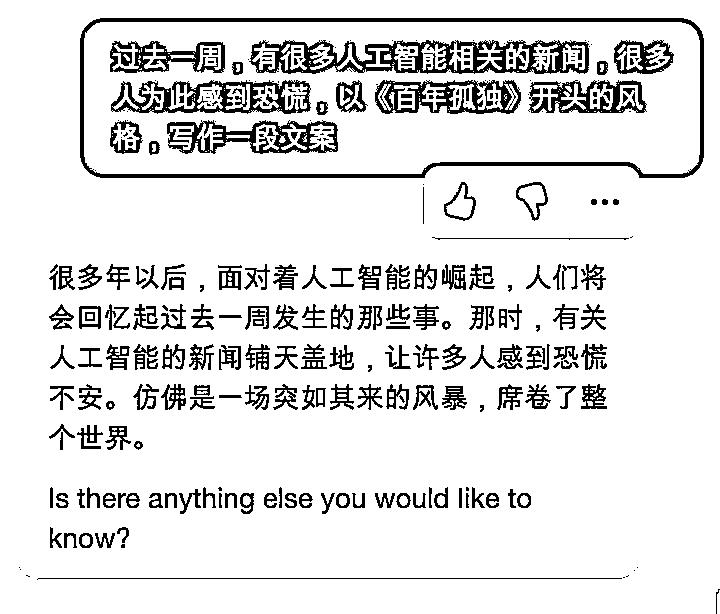
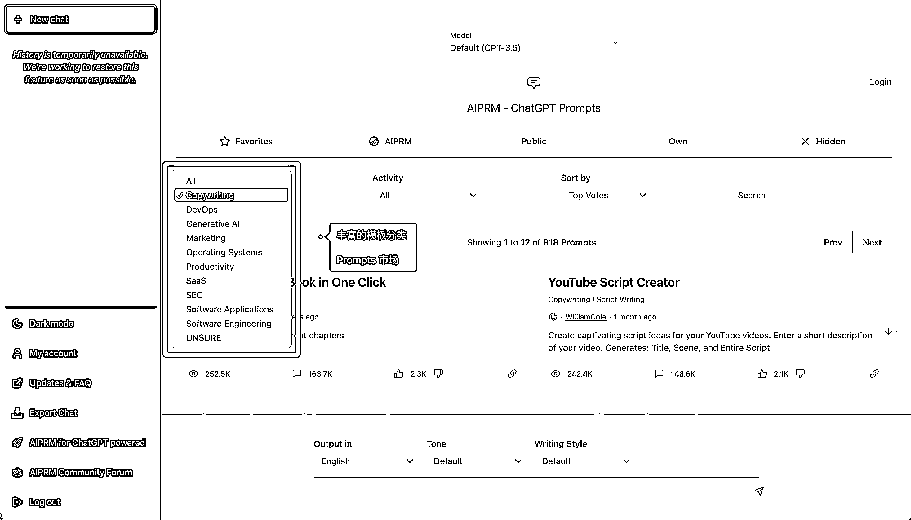
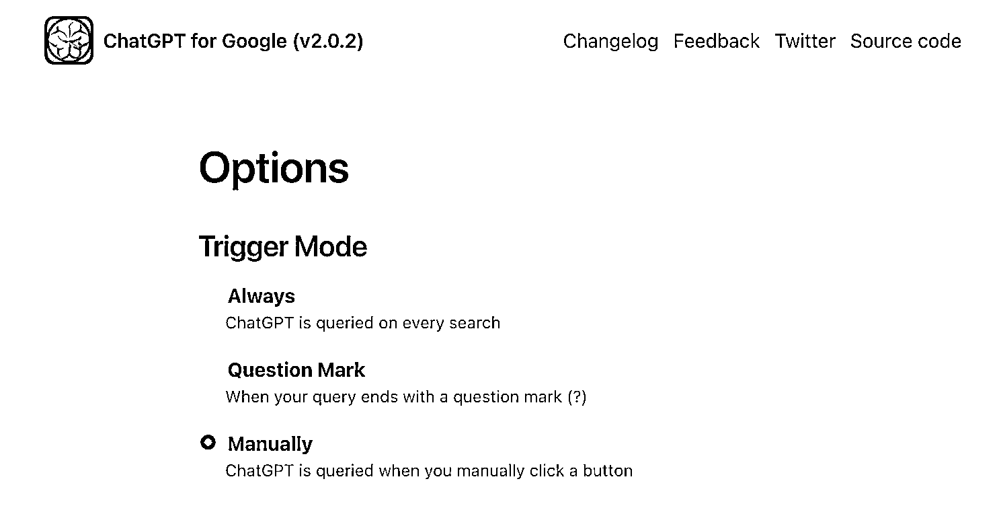
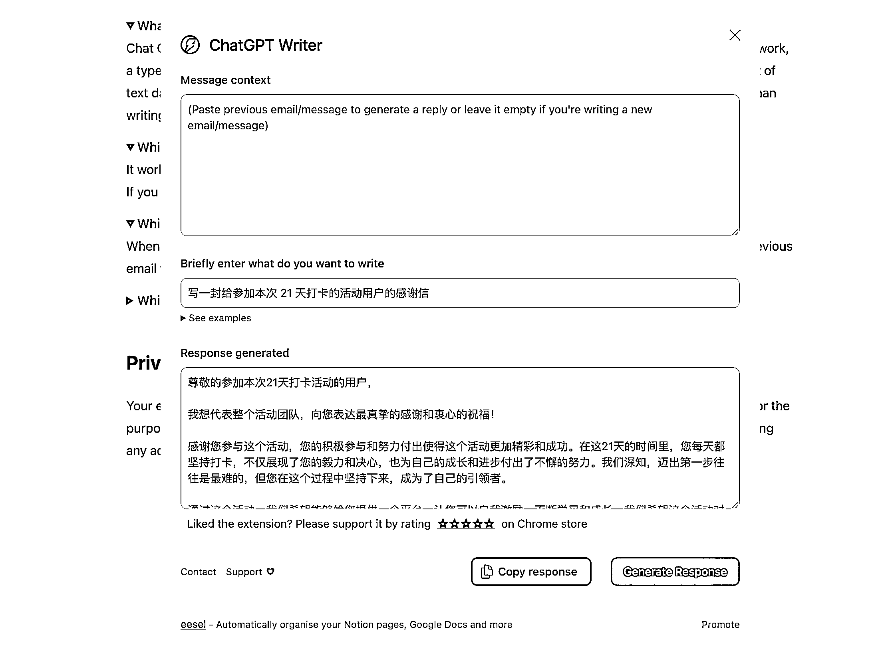
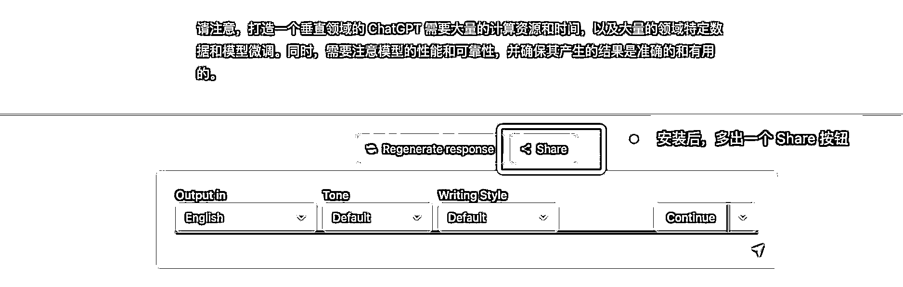
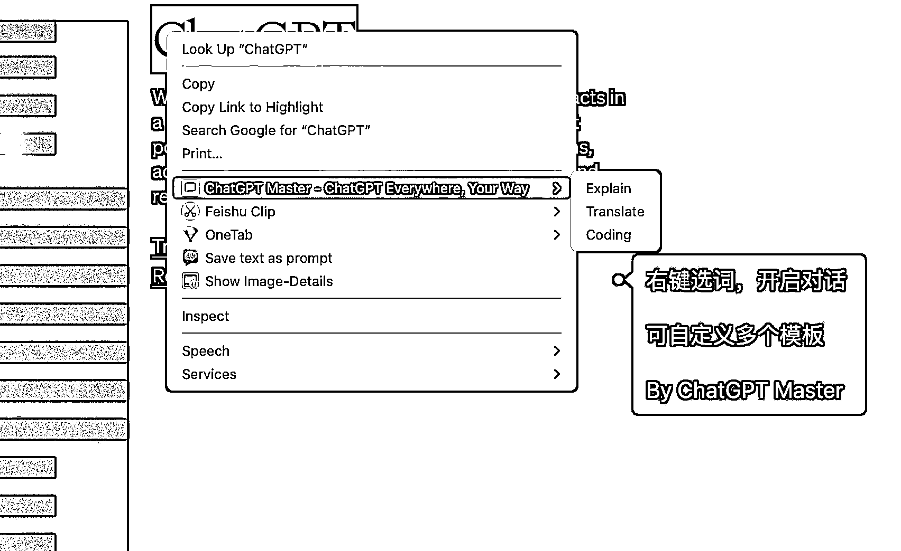
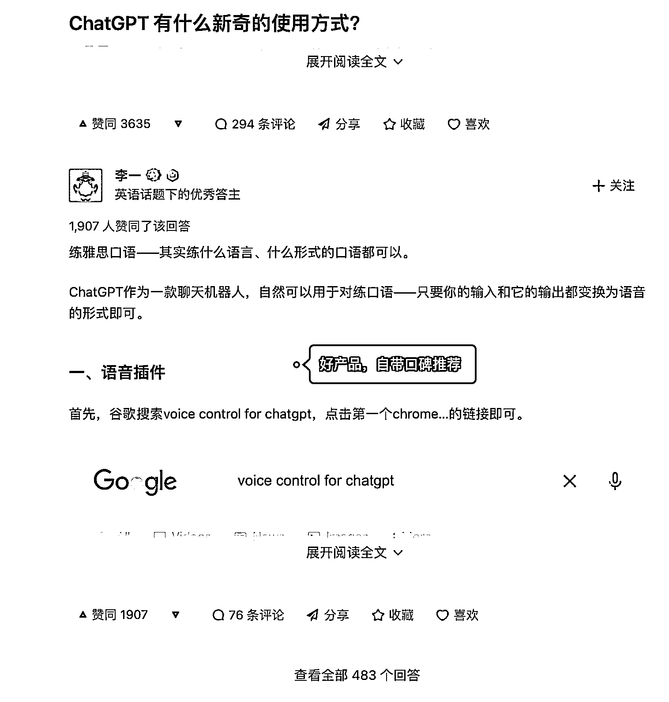

# 3.10 重点关注： ChatGPT 相关工具站需求挖掘 @三林 🔥

AIGC 发展太快了，ChatGPT 4.0，Midjourney 5，谷歌的 LLM 新模型，微软的 Copilot ，百度文心一言， AI 一周，什么一年？web3 出来挨打（txtx）。具体可以看看极客公园写的这篇 [`mp.weixin.qq.com/s/5fhzpYmLKQhx9FEIT0wssA`](https://mp.weixin.qq.com/s/5fhzpYmLKQhx9FEIT0wssA)

回到 ChatGPT。有着充分的理由相信，ChatGPT 的 API 开放的当下，会有大量围绕 ChatGPT 的应用产品涌现，形成一个蓬勃发展的应用生态。而在 API 开放之前，彼时有一些应用率先跑出来了，比如国人开发者 Lencx 做的客户端工具 [ChatGPT](https://github.com/lencx/ChatGPT) [Mac/Win 客户端](https://github.com/lencx/ChatGPT)，火出圈的浏览器插件 ChatGPT for Google，其安装用户量达百万。

这里来分享一些围绕 ChatGPT 而做的第三方浏览器插件产品，他们是如何做的产品定位和一些体验思考。

首先，产品发现来自谷歌应用商店的搜索「ChatGPT」

[`chrome.google.com/webstore/search/`](https://chrome.google.com/webstore/search/ChatGPT)[ChatGPT](https://chrome.google.com/webstore/search/ChatGPT)

1、从 AIPRM 说起，可能是最佳 ChatGPT 插件

让 ChatGPT 提供更好的结果的关键在于输入质量，也就是提问的方式。如何提出高质量的问题是一个核心命题。有几款做得非常好的工具，它们专注于增强在使用 ChatGPT 时的提示语输入，使得高质量的提问变得更加简单，而 AIPRM 就是其中的佼佼者。

AIPRM 自带了一个 Prompt 模板市场，直接加强在 ChatGPT 的界面。对用户而言，让提问变简单，输出更高质量的结果；此外，我喜欢 TA 可以设定输出语言和语言风格。例如，我直接输入中文，但设定了以英文输出，则 ChatGPT 默认就返回英文的内容。

营销层面，鉴于开发者是 SEO 专家，AIPRM 这个产品率先在海外 SEO 届打开了名声。比如[这条推特](https://twitter.com/aleyda/status/1612071976654225408)。现已超过 60 万的安装量，Chrome 应用商店里有着来自世界各地网友的好评。

最新消息是 [AIPRM 开启了商业化](https://app1.aiprm.com/pricing)，免费版受限比较多，精选的 Prompts 只限付费版（最低 20 美金/月）使用。平替版，可以试试 ChatGPT Prompt Genius。

2、ChatGPT for Google ，搜索场景下的代表

来自国内开发者的产品，率先响应围绕 ChatGPT 而开发的浏览器插件。产品效果即是在搜索 Google 的同时，该插件同步给到 ChatGPT 的答案。

产品在即刻社区流传开来，增长速度很快。目前是第三方工具里用户量最多的，超过了 100 万安装量。这是一款开源产品，支持二次开发（划重点）。

我看一个工具有什么能力？两个快速办法：一看工具的设置项 Setting，二看价格页 Pricing

ChatGPT for Google 的设置项里有这个设定：Trigger Mode（触发模式）

•Always：每次谷歌搜索都查询响应

•Question Mark：当带上问号 ？时，才响应

•Manually：默认不响应，需要的时候再点击一下。

窥斑见豹，这款插件的核心交互方式。我单独聊这一点，因为这是 ChatGPT for Google 早期为人诟病的核心体验：如果每次搜索谷歌都查询响应，那岂不是会增加太多无效的对话查询。 触发模式，这个设置，把选择权交给了用户。

3、[ChatGPT](https://chrome.google.com/webstore/detail/chatgpt-writer-write-mail/pdnenlnelpdomajfejgapbdpmjkfpjkp) [Writer](https://chrome.google.com/webstore/detail/chatgpt-writer-write-mail/pdnenlnelpdomajfejgapbdpmjkfpjkp) 狠抓核心场景，起量快

作为一个大规模语言模型，「文本处理」是 ChatGPT 的强项。如果说你要做一个 ChatGPT 赋能的产品， 考虑到核心能力，效果最好的也应该是文本处理。

ChatGPT Writer 这个辅助写作插件，定位抓的准，除了随时可以发起创作，还切入了一些应景的场景：比如贴合在 Gmail 邮件书写框里。ChatGPT Writer 目前增长到 30 万安装用户了，难道是名字取的好？

同类型的产品：

[YouTube summary with](https://chrome.google.com/webstore/detail/youtube-summary-with-chat/nmmicjeknamkfloonkhhcjmomieiodli) [ChatGPT](https://chrome.google.com/webstore/detail/youtube-summary-with-chat/nmmicjeknamkfloonkhhcjmomieiodli) 一键总结 YouTube 的视频内容，这个产品实现超级简单：提取 YouTube 的字幕，跳转到 ChatGPT 做总结。我认为这个插件只使用了一个提问相关的 Prompt，一个 Prompt 等于一个迷你工具。

[而 后起之秀 Monica - Your](https://chrome.google.com/webstore/detail/monica-%E2%80%94-your-chatgpt-cop/ofpnmcalabcbjgholdjcjblkibolbppb) [ChatGPT](https://chrome.google.com/webstore/detail/monica-%E2%80%94-your-chatgpt-cop/ofpnmcalabcbjgholdjcjblkibolbppb) [Copilot in Chrome](https://chrome.google.com/webstore/detail/monica-%E2%80%94-your-chatgpt-cop/ofpnmcalabcbjgholdjcjblkibolbppb) ，国人开发团队的出海之作，产品设计挺精美的，交互类似 New Bing 唤起侧边对话栏，可内容生成的质量不太给力，我总觉得用的是 GPT-3 而不是 3.5 或 4 ；

4、弥补官方功能不足，以 ShareGPT 举例

这是我高频使用的插件，一键分享 ChatGPT 对话变成对外分享的链接，这比长截图更友好。

同样切入官方功能不足的产品，还有：

•生财圈友 @码叔编程 的 [AI 会话存档插件](https://sle.xet.tech/s/rzeIG)：导出 ChatGPT 会话为 PDF 等多格式到本地；

•生财圈友 @啊洛 开发的  [ChatGPT](https://chrome.google.com/webstore/detail/chatgpt-to-notion/bknieejaaomeegoflpgcckagimnbbgdp) [to Notion](https://chrome.google.com/webstore/detail/chatgpt-to-notion/bknieejaaomeegoflpgcckagimnbbgdp)：一键保存会话到 Notion；

再比如 [ChatGPT](https://chrome.google.com/webstore/detail/chatgpt-master-chatgpt-ev/cplgddddgbofhhffggfagngknmakifkg) [Master](https://chrome.google.com/webstore/detail/chatgpt-master-chatgpt-ev/cplgddddgbofhhffggfagngknmakifkg) ，其主打划词快捷键提问，自定义鼠标右键：支持多个模板配置。 类似 Notion AI 的交互，选择文本，让 ChatGPT 进一步干活：优化文案、翻译、缩写、扩写…… 都可以配置。

还有结合浏览器语音播报能力的 Voice Control for ChatGPT 、Speak to ChatGPT，适合跟 ChatGPT 语音对话，场景能干嘛？ 练口语、练听力。

[5、](https://chrome.google.com/webstore/detail/chatgptgpt4-for-amazon-sh/fchbhcjlkcdchcaklpkdofllfoimelgb)[ChatGPT](https://chrome.google.com/webstore/detail/chatgptgpt4-for-amazon-sh/fchbhcjlkcdchcaklpkdofllfoimelgb) [for Amzon](https://chrome.google.com/webstore/detail/chatgptgpt4-for-amazon-sh/fchbhcjlkcdchcaklpkdofllfoimelgb) 赋能原有业务升级

这是来自国内创业公司 Shulex VOC 的产品，一款面向亚马逊商家的评论分析 SAAS，通过数据挖掘和垂直行业分析，洞察消费者和市场。在 ChatGPT 出现以前，虽然对主要大类目很深入，但比较难覆盖全品类。而 ChatGPT 横空出世后，NLP 不存在了…，可以面向更多商家服务了。

Shulex VOC 原本已经足够深入电商评论分析，但还能通过 ChatGPT 来提升：高效产出多维度评论分析（产品优缺点、消费者期望），秒出 Listing 优化结果，产品体验大幅提升。而在营销方面，Shulex VOC 利用 ChatGPT 热点和跨境圈的红人视频营销，增长势头非常不错。

这个技术底层的转变，让我想起生财圈友强哥说的：研究 NLP 家破人亡，用好 NLP 鱼翅拌饭。

殊途同归， 产品「Glowe 阁楼」，其用 ChatGPT 底层技术赋能心理咨询，刚拿到新一笔千万级融资。

对生财有术而言，AI 教练、AI 鱼丸，甚至 AI 亦仁，正在开发中。 说不定，下一期航海，让 AI 教练陪伴你航行。

这都是我身边的案例。

——

上述提到了这些插件产品：

•提示词集成类：AIPRM，ChatGPT Prompt Genius 等

•突出文本处理类：ChatGPT Writer，YouTube summery with ChatGPT，Monica

•效率工具类： ChatGPT for Google，ShareGPT，ChatGPT Master，ChatGPT to Notion

•原有业务赋能类：ChatGPT for Amazon 等

小结下提到了一堆浏览器插件，其实现在插件生态还是有一些玩家的，毕竟从去年 12 月初开始，到现在 4 个月的时间，足够这些手速快的选手做出好产品了。但我相信，目前还远没有到爆发的阶段。

回到开始的提问，为什么是浏览器插件呢？

因为 ChatGPT 官方正版是一个网页版，浏览器插件的对网页的 Enhance 能力，在用户熟悉的场景下做的体验升级，贴合用户习惯，乐于使用。这弥补了原生产品的不足，相当于站在巨人肩膀上做事。

以上，还仅仅是我看到的部分产品服务，相信接下来会涌现太多更有意思的产品。

总结：

总结一下，从这些产品里我学到的认知：

1）从面向 Google 编程，到面向 ChatGPT 编程；相信开发者圈友们感受很深。

2）ChatGPT 是魔法百宝箱，密码就是 Prompts，这是流量密码，也是财富密码。

3）浏览器插件只是一种产品形态，开放了 API ，可能性就太多了。一句 Prompt 等于一个 Mini tool，一套 Prompts 等于一个 Mini SAAS；

4）思考符合自己业务需求的场景，大胆用 ChatGPT 为自己和业务赋能；

5）最后也是最重要：鉴于原生体验、内容安全，建议创业者们出海，这也是我们做英文工具站的意义。

内容来源：《ChatGPT 应用生态之浏览器插件观察》

目前 ChatGPT Plus 版已经逐渐支持联网、并且接入了 70 多个第三方插件，涉及教育、电商购物、娱乐、新闻、投资等等领域。圈友 @黄小刀 整理分享了这些插件的功能，除了刚刚以上提到的几个工具外，这些插件的功能描述也许可以帮你提供一些 idea ：[《ChatGPT Plugins 清单 @黄小刀》](https://shengcaiyoushu01.feishu.cn/sheets/shtcnbZVcicTbk6DKuspfcIWfqg)

另外在生财有术，和 ChatGPT 有关的风向标里，也隐藏了很多可以挖掘的需求机会。

我们为大家整理了 73 条技术应用相关的中标风向标，大家可以参考下列内容，寻找属于自己的工具站机会点：

生财有术 ChatGPT 中标风向标合集（技术应用类）

