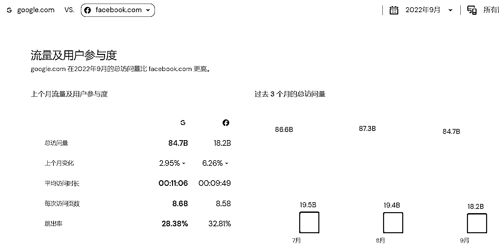
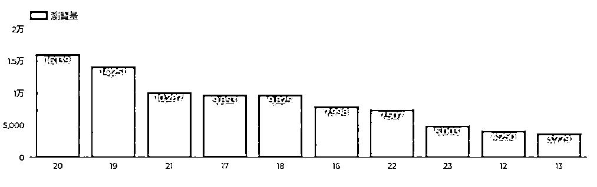

# 4.1.1 流量

流量一般分为 PV（页面访问量）和 UV（独立访客量）。如果一个用户在多个页面间产生浏览行为，这样的数据就会被记录成多个 PV 和一个 UV ，任何时候 PV 都是大于等于 UV 的。我们看到的 similar web 里的页面平均访问量（每次访问页数）就是 PV/UV ，这个数值和平均页面访问时长一样，是衡量用户粘性的一个可选指标，越大越好。

Similar Web 对于 Google 的分析，可以看到用户浏览谷歌通常带着很强的目的性，与一般认知相悖的是，作为社交媒体的 Facebook ，无论从访问量、平均访问时长、每次访问页数和跳出率，比起 Google 都有差异。在做竞品分析的时候同样可以对比这些维度，如果类似的维度可以做得比竞品好，流量就只和推广投放有关系了。

如果要做精细化运营分析，我们还可以看每个时间段的流量数据统计，不过因为时差的存在，通常要对流量统计的时间做对应的时区转换，结果才能符合我们做出海网站的目标用户对应时区的浏览趋势。流量数据也可以看页面的详细情况，有的页面被同一个用户多次浏览（ PV 高），这样就可以了解到用户更喜欢这个页面了。

某网站用户浏览量，这里取的是美国时间，X 轴是开始浏览~ 1 小时以内的时间点，20 表示晚上 8 点~ 9 点。在这里可以看到，用户比较活跃的时间是在美国时间下午 5 点之后到晚上 10 点之间。如果是做内容站，在这段时间里面做引流和推广显然效果会比早上好。