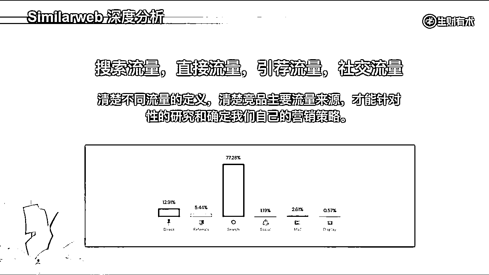

# 4.1.2 流量来源 @阿彪

来源的分类维度和需求相关，这个维度需要我们开发和运营网站的管理者积极监控和复盘数据，只要发现异常值就分析异常原因，如果异常值让我们流量增加了，我们就可以利用导致异常的这个特性加大相关的投入，大概率会可以让流量爆发。

首先，大家要清楚四个主要流量的概念：搜索流量、直接流量、引荐流量和社交流量。清楚不同流量的定义，清楚竞品主要的流量来源，才能针对性地研究和确定我们自己的营销策略。

