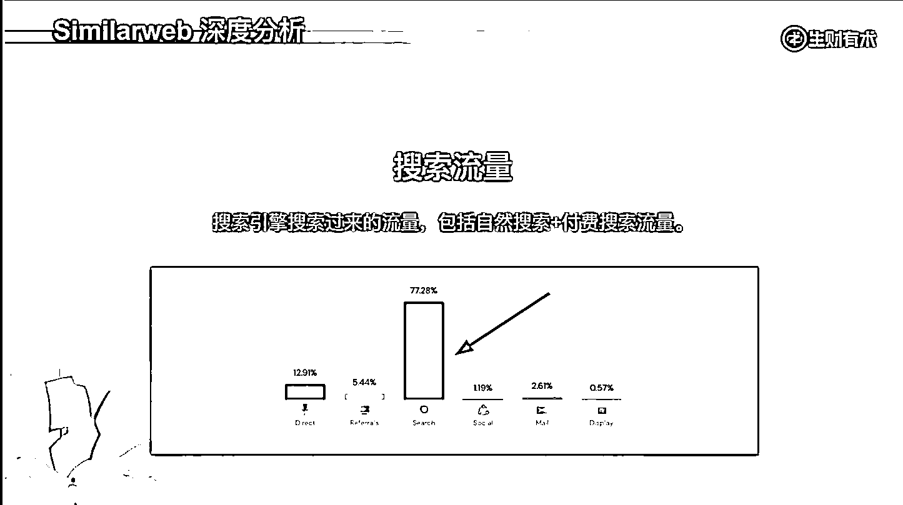
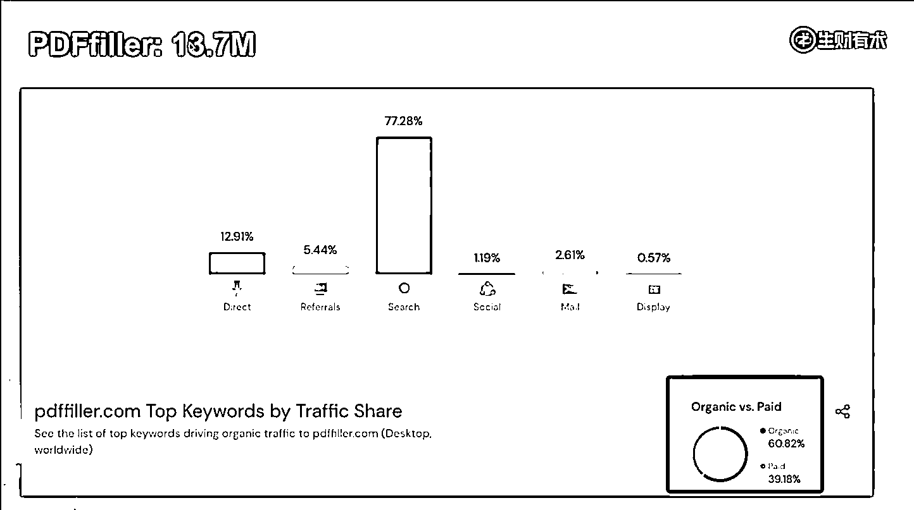
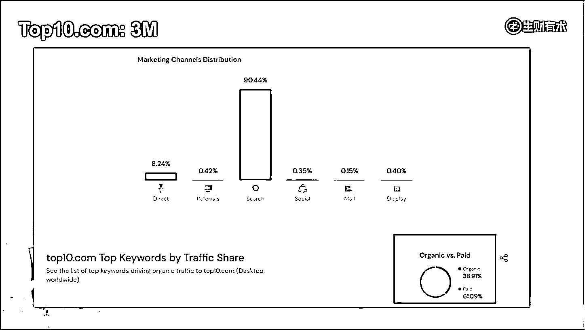
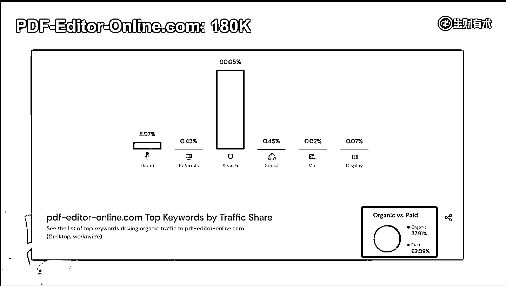

# 4.1.2.1 搜索流量

搜索流量，简而言之就是从搜索引擎搜过来的流量。它包括两种，一种是自然搜索，一种是付费搜索。

大家看到红色的柱子 77.28%，这个是搜索流量的占比，但不要想当然的以为，这 77.28% 这全部都是自然搜索，里面很有可能包含较大一部分付费搜索的流量。

理论上来说，别人能够付费搜索排上去，你也可以付费搜索排上去。因为大家都没有用过这个产品，用之前都是盲盒，理论上来说 ROI 能够打平，你也是有可能的。

举个案例， PDFfiller 是一个做在线 PDF 编辑的，它一个月的流量是 13.7M ，我们可以看到它搜索流量的占比是 77.28% 。

然后看右下角，它的 organic traffic（自然流量）占比 60%，剩下 39% 都是 paid traffic（付费流量），也就是它做付费搜索流量占了 39% 。

这个是非常高的，大家算一个数，假如说 14 M，1400 万流量一个月，70% 就是将近 1000 万。1000 万的搜索流量里面，付费搜索占 40%，也就是有 400 万的付费搜索流量，这个量级是非常非常高的。

这个我们就要注意，他投了广告，我们也要注意好好利用一下广告。如果我们只会做广告，也可以在这里面分一杯羹，400 万分 100 万，足够养活自己了。这就是做分析所带来的价值。

另外一个网站，就是 Top10.com ，它是 3M，90% 的流量都来源于搜索，我们就直接认为它基本上都来源于搜索。搜索里面有 60% 来源于付费，就是说这个网站主要就是靠广告。如果对这个领域感兴趣的朋友，看一下这个网站，就会发现它其实就是一个广告套利的网站。

什么意思呢？他自己做一个列表榜单，比如说 10 个最好的域名服务商，或者是主机，或者是其他的一些产品。然后他从谷歌购买广告，通过销售自己代理的产品获得佣金。如果佣金大于付费搜索带来的成本，就可以赚钱。

就是这么一个生意。毫无疑问他生意做得比较大，一个月流量都有 3M ，付费广告是 180 多万，一个流量进来最少得 0.5 美金，那一个月是大几十万美金这个广告费，所以这是个比较大的生意。

我们再看另外一个产品，就是 PDF editor online ，它有 180k 的流量， 60% 都是付费。如果我们做一个这个网站，有这么一个功能，直接通过广告投放就能赚钱。其实如果 ROI 能够打平，这是非常好的一件事情，因为广告投放是一个确定性很高，然后即时响应的事情。

当然，目前就在线 PDF 编辑还是比较难的，如果能够做出来，直接通过广告投放就能够打平，这个生意还是很不错，因为即使是投入这个产品研发，也不是那么难。

