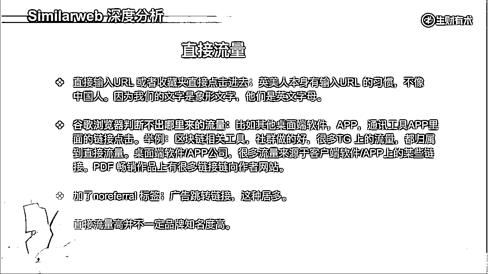

# 4.1.2.2 直接流量

直接流量，第一种是直接输入 URL 或者点击收藏夹和插件进去的。英国或美国人本身就有输入 URL 的习惯，不像中国人，我们主要的文字就是象形文字，而互联网的世界都是英文，英文字母本来就是他们的语言，所以很多人直接就输入 [google.com](http://google.com/) 进去了。中国人很多不会输入 [google.com](http://google.com/) ，会输入 Google 或 Apple 再进去。

第二种就是谷歌浏览器判断不出哪里来的流量，都把它归类于直接流量。这里有好几种举例，比如说其他桌面等软件；比如说视频编辑软件、图片编辑软件、文档编辑软件；比如说 App 通讯工具；比如说我在 telegram 或 WhatsApp 里面有链接，点过去其实就相当于直接输入 URL 。

为什么呢？比如说在 adobe 的软件里面，桌面的软件里面点击一个链接直接过去了。对于浏览器来说，它就是直接打开这个 URL 和你直接输入这个 URL 的意思是一样的。他不知道你到底是从 A 页面还是 B 页面过来的，压根没有 A 页面。

B 页面它是两个孤岛，一个是叫 adobe 一个是叫 Chrome 两个完全不一样的东西，直接是从 adobe 过去的。 adobe 不是个网站，它是个桌面软件，它在这个桌面的软件过去，就相当于直接输入 URL ，所以它就把这种归类于直接流量。

所以如果是很多桌面软件或者 App 公司，他们的网站 web 端网站有很多的流量，很有可能他们的这些直接流量，都是来源于他们的桌面的软件或者是 App 。

另外还有一种情况案例，比如说很多 web 3 的工具或者是区块链相关的工具，直接流量都非常高。因为他们很多都是通过社群进行传播的，在 telegram 上面很多链接，点击后就直接到了这个网页。

像这种如果看到流量很高，然后说要做一些 SEO ，对不起，你可能压根就没找对方向，人家压根就没有做 SEO ，主要做的社群。这些链接在社群里面分享，大家都点过去了，导致有很多的流量。

比如说我是个 PDF 作品，我是个免费的或者付费的，我里面有很多的链接链上我的网站，这些流量也是直接流量。当然，这里面的 PDF 是在 adobe 或者是像其他的 PDF 的这种桌面的软件，不是指的 web 端。

第三个是指加了 noreferral 标签的，也会把它归类为直接流量。很多广告跳转的链接会比较多，比如说是很多网盟过来的，这种很多的链接都带了 noreferral 或者是一些弹窗广告。

