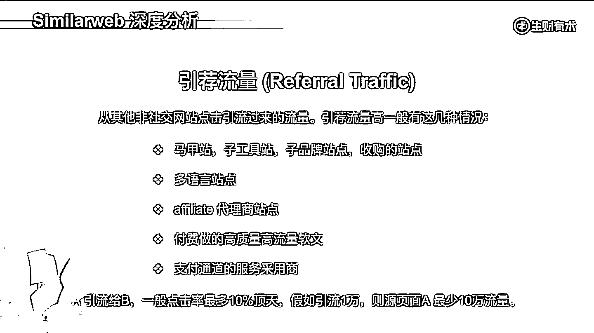
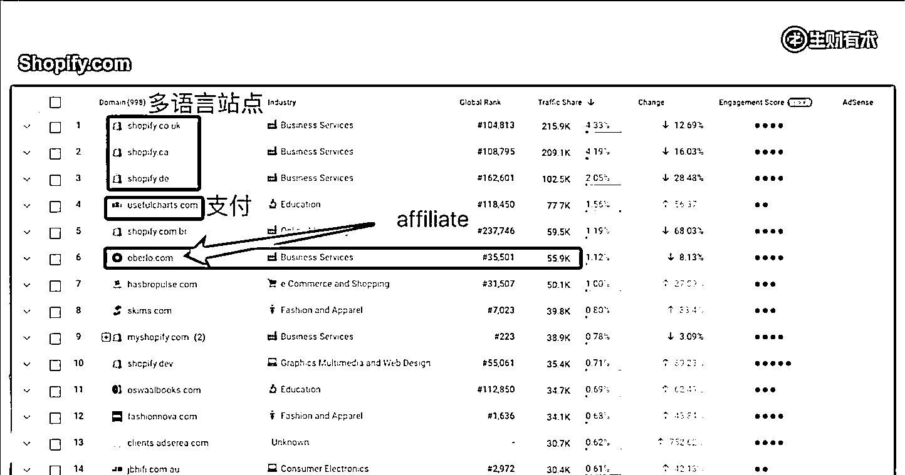
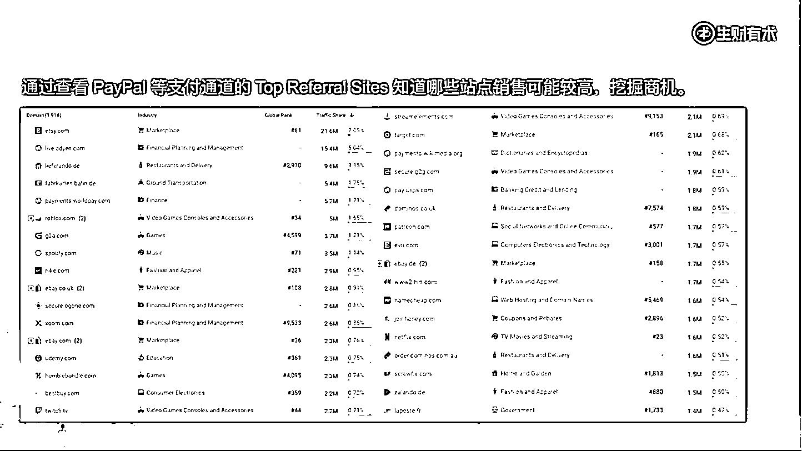

# 4.1.2.3 引荐流量

引荐流量，大概的意思是从其他非社交网站点击引流过来的流量。引荐流量如果比较高，有这几种情况：

•主网站的马甲站、子工具站、子品牌站或者是自己收购的站。这些引荐流量比较高的，很有可能就成为他下一个潜在的要收购的站。马甲站就换个壳，颜色不一样，功能都一样；子工具站，以视频编辑为例，它里面有很多小工具，每个小工具做一个子站，那这个子站就一个小功能，全部都引流给主站；子品牌站，就是一个子的品牌。

•多语言站点。就是它的后缀不一样。

•Affiliate 代理商网站。大概意思就是因为很多主品牌网站它会发展自己的代理商业务，如果我们看到它引荐流量比较高，很有可能是他自己的代理商。

•付费做的高质量的高流量软文。

•支付通道的服务采用商。比如说我是 PayPal ，很多人采用我的支付，他要到我网站来支付对不对？它会跳到 [paypal.com](http://paypal.com/) ，然后后面一个 URL 的后缀。如果我的网站采用了 PayPal 支付的话，最后就会给 PayPal 导流。

这里大家要注意，引荐流量，一般就我们目前 80% 的常规用户而言，要通过软文这种方式是不太现实的。举个例子，比如说 A 引流给 B ，一般来说 10% 顶天了，3-5% 都不错了。假如说一个月给你引流 1 万，原来的页面一个月最少流量得 10 万，一个月 10 万，这种是很少很难得的。

我们可以通过 Top Referral Sites 知道对方的营销策略，知道对方有哪些代理商网站、马甲站和多语言站点。

这个图是免费版本的，我们看一下付费版本的。

这是给 [pdffiller.com](http://pdffiller.com/) 这个网站引流的，都是它的 Referral Traffic，就是刚刚那个在线 PDF 编辑的网站。大家可以看到一个月的引荐流量，6 月份到 9 月份，引荐了 200 多万流量，分别是哪些网站引流过来？看红色方框，右边这一列还列了很多。然后 traffic share 中间这一列，会发现比如说 [`pdf-editor-online.com`](https://pdf-editor-online.com/) 这个网站，它这三个月引流是 393k 等。

一直往下，大家会发现这些网站的 logo 都长一个样，很明显就是这个网站的子工具站，它把很多的子功能都单独地做成一些网站，然后给他的主站导流。

这些子工具站的流量是怎么获得的呢？可能 60% 甚至 80-90% 以上都是来源于广告投放，也就是说主站做了很多的广告投放，子工具站也做广告投放，然后给主站引流，这就是他的一个策略。

SEO 玩家里面应该是属于 top 3 系列的，感兴趣的朋友可以再仔细研究一下。这是一个全生态的产品，既做了 web 端的这种网站在线编辑，也做了客户端、App、浏览器插件，也就是说刚刚我说的这些生态它基本上都有涉及。这是一个全终端的软件，全终端的公司能获得大几千万美金的投资。

我们看另外一个 [shopify.com](http://shopify.com/) ，可以看到很多都是它多语言站点，引荐流量排名第四的是 [`usefulcharts.com`](https://usefulcharts.com/) 这个网站，给 Shopify 带来的流量是 77.7k。

为什么他是引荐流量给 Shopify 呢？原因很简单，就是这个网站用的 Shopify 的购物车和支付，然后给他引荐了这么多流量。后面我们还可以看到 Oberlo 这个排名第六的网站，带来流量是 55.9k ，仔细看这就是他的代理商网站。

我们看一下 PayPal 的引荐流量，通过查看 PayPal 或者其他支付通道的 Top Referral Sites，可以知道哪些站点销售比较高，来挖掘商机。

它是个支付通道，它最关键的一个环节就是收钱。谁到 PayPal 的流量最多，肯定谁收钱就越多。假如说把它前 1 万到前 1000 的都导出来，一个个筛一下，看到哪一个比较感兴趣，在能力范围之内就可以做。

这里面排名第一的个电商网站，她一个月的导流量是 21.6M，2000 多万超级高，因为它本身就是个电商平台。下面还有其他很多我们比较熟悉的站点，就不一一列举了。

这里面肯定没有适合大家的，因为都是巨头，只是这个思路可以学习，多看看排名比较靠后的那些。比如说我是做 Shopify 的，我是做工具站的，看一下给 PayPal 导流比较多的其他工具站，说明很赚钱，我也可以考虑一下，这是挖掘商机的一个方式。