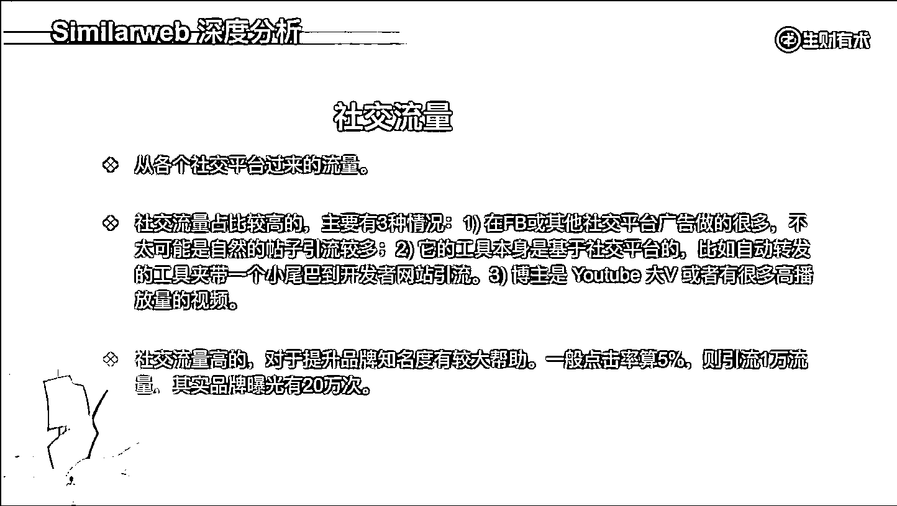
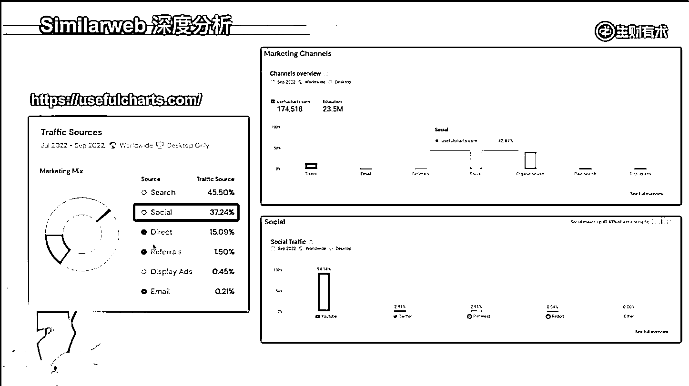

# 4.1.2.4 社交流量

社交流量很简单，就是从某个社交平台过来的。社交流量占比比较高，主要有这三种情况。

第一种就是在 FB 或者其他社交平台做广告做得很多，导致有很多社交流量过来，这里面不太可能是发的这个自然帖子。

比如说我粉丝有 500 万，然后我天天发帖子，想着会有很多的引荐流量或社交流量过来，这种可能性比较低，原因是 Facebook 是要赚钱的，你把它的流量都薅走，那它怎么赚钱呢？你发一条帖子，500 万的粉丝，能有 5% 的人看到就不错了，5% 的人看到，然后又有 5% 的人点击就不错了。

你想一想， 500 万粉丝的大 V 发条帖子能有多少引荐流量，能有多少社交流量？很有限的，基本上都是广告做得非常凶猛，尤其是一些做跨境电商的独立站，他们基本上就是在社交平台做广告，导致有很多的这种社交流量。

第二种就是它本身的工具是基于社交平台的，比如说它自动转发某个 Twitter ，然后尾部夹带一个小尾巴，去到某个开发者的网站。这种基于平台的工具，它可能有很多的社交流量。

第三个是 YouTube ，它的引流效果很不错，而且是可持续的，它本身是全球第二大搜索引擎，有很多搜索流量，你的视频有很多观看量，下面加了链接，然后这些链接就会成为你的社交流量。

这三种就是社交流量高的，对于提升品牌知名度是有较大的帮助。你算个数，比如说点击率 5% ，引流 1 万，其实你的品牌曝光是有 20 万次。如果是搜索， 20 万次的成本远远大于社交流量。

你展示广告也没有社交，也不一定有这个效果，但成本肯定会高很多。流量要不来自于搜索，要不来自于社交，主要就这两个渠道。如果是要品牌曝光，做社交广告或者是信息流广告有较大的帮助。

举个例子，[`usefulcharts.com`](https://usefulcharts.com/) 就是 Shopify 引荐流量比较高的，它 social traffic 流量占比 37%，这很高了。

算一笔数，5% 的点击率，曝光要乘以 20 倍，那品牌曝光得多高。他 9 月份 social traffic 流量占比 42%，具体细分一下，94% 来自于 YouTube ，看一下它的频道（直接在 YouTube 里搜 usefulcharts）， 有 100 多万的观看，100 多万的订阅者。

前面这些观看量高的一个都是大几百万，这里面给他带来的引荐流量肯定是相当高的。当然，这些引荐流量是归属于社交流量，这就是做 similar web 深度分析所得来的。

我知道他给 Shopify 导流比较多，主要用的 Shopify 的购物车。然后通过分析发现它社交流量来得比较多，又发现来自于 YouTube ，这就完成了整个事件的分析。

内容来源：《直播回放：简单聊聊出海工具，流量和支付的一些事》

