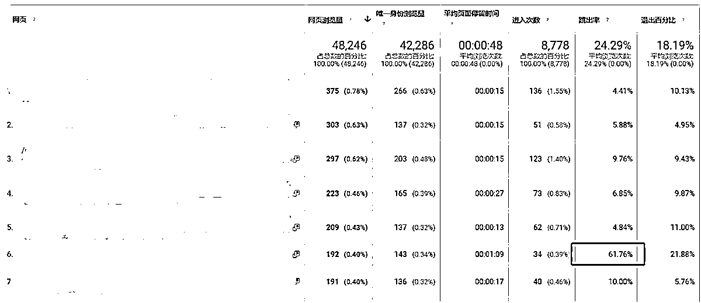

# 4.1.3 跳出率

跳出率，通常跳出指的是在进入网页没有进行任何其他操作就关闭网页的行为，也有把返回上一级作为“跳出”这个定义的另外一个行为。跳出率则是浏览网页的用户中，跳出的占比。高跳出率意味着用户对于浏览的网页不满意、误操作或者不感兴趣。

这里对不同网页的跳出率做了统计，这个案例里面，一个商家页面的跳出率显著高于其他页面，说明这个商家页面可能装修得太差了，也有可能产品太少，具体要点进去这个页面，对比其他页面做分析。一个页面的高跳出率不会影响到其他页面，但是用户确实有可能因为一个页面做得不好而流失。