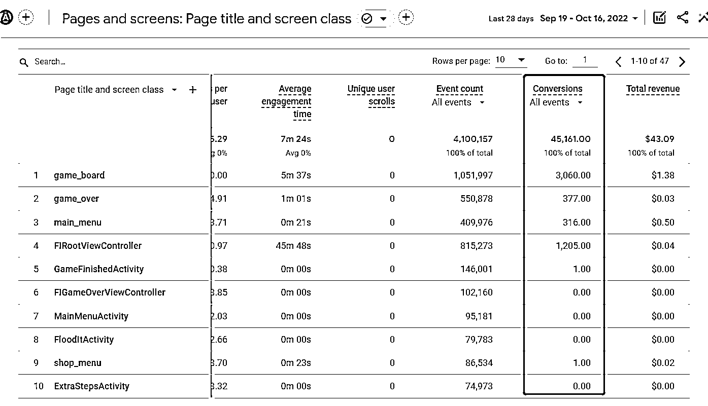
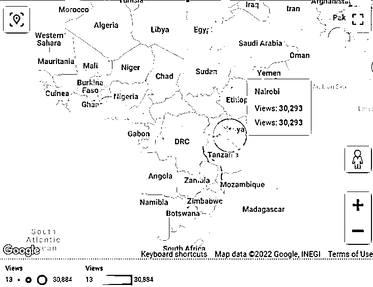
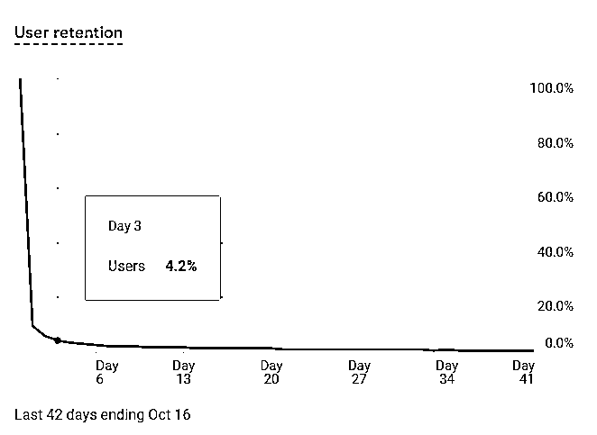
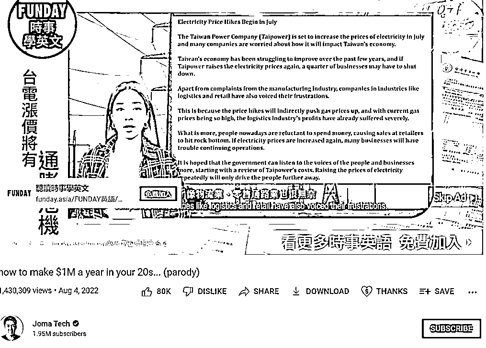
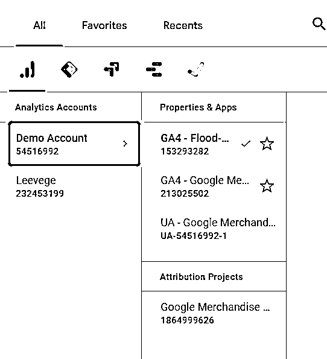
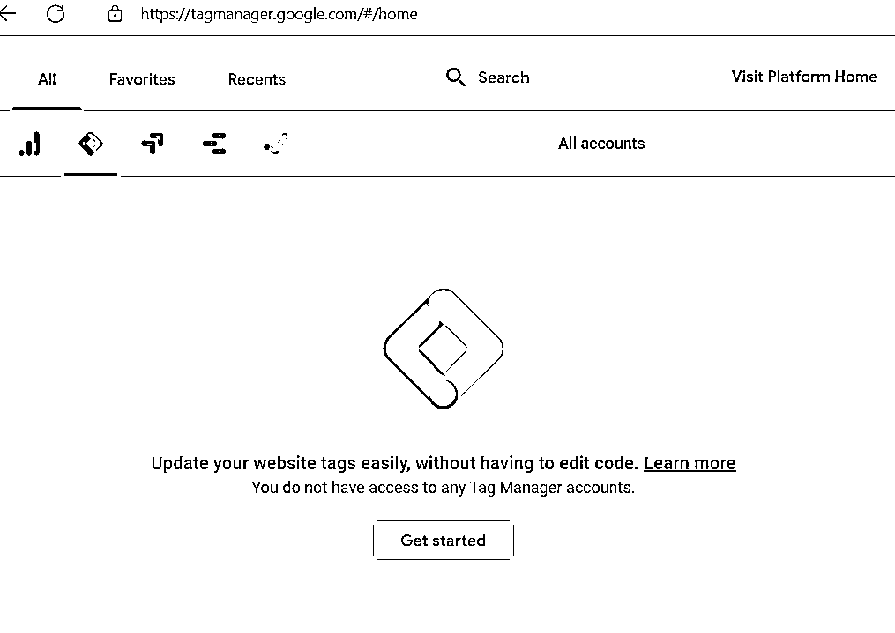
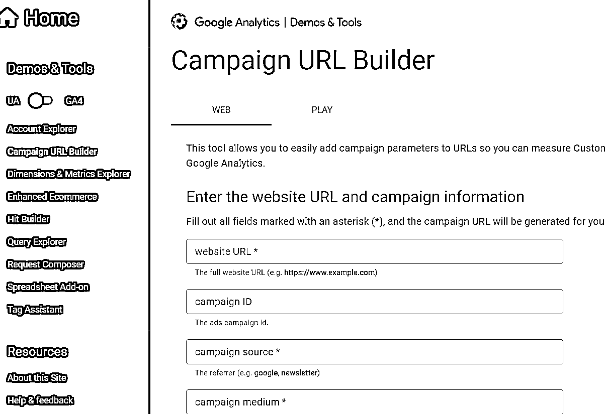
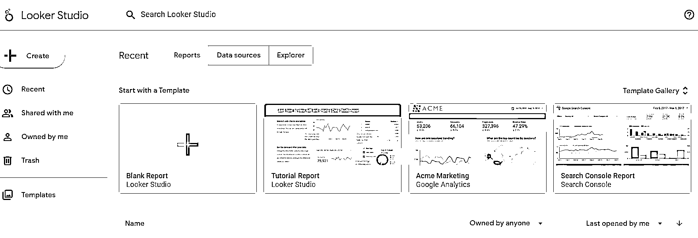

# 4.1.4 转化率

用户从进入网站到最后设定的目标占所有进入网站用户的比率，目标不一定是购买什么产品，可以是发表一个帖子或者看了一个视频，还可以是一段时间的用户留存。对于大多数不以直接消费作为主营业务的网站，我们看的都是某组件的点击率或者广告的观看率。

分析面板这里可以看到每个页面的转化情况，其中转化率可以用在这个页面的互动（转化）操作除以这个页面的全部其他非互动性操作，这个案例中的转化率偏小，因为谷歌统计数据的时候会把 sending_request、receive_response 这种事件也统计进去。分析时可以做横向对比，看看哪个页面的转化率相对偏低，也可以针对某个组件单独埋点，用统计数据做分析。

说到这里，可能大家都觉得很奇怪，是不是无论我做什么样的网站，我只要流量高，跳出率低，转化率高就可以了呢？其实不一定。海外网站分析和我们其他业务的分析一样，要先确定自己的目标。

工具站的目标可能是促进用户付费，内容站的目标可能是促进用户分享内容，点击广告。对于工具站，我们就需要考核用户的流量来源渠道。

拿我们公司在做的海外餐饮 Saas 来说，用户通常的消费场景是和自己生活的物理区域息息相关的，所以我们在投放广告和做裂变的时候会很关注用户的物理特征。

如果用户来源于我们基于物理位置的投放和裂变分享链接，或者通过已下过单的用户即时沟通工具的传播了解到我们的，基本上都可以进入付费转化的环节，而其他渠道过来的基本上都是看看就走了。匹配渠道和用户标签在这里就显得格外重要，不然更多的流量只会增加我们的投放成本。

城市和地区也可以是用户来源的一个渠道，如果发现自己的链接被不属于那个地区的用户点击了，需要及时找到那几个链接和被这些非目标用户点击的原因，否则推广越猛，浪费的钱越多，不过也有例外。

这个案例中的网站是面向全球的，但是我们可以看到非洲内罗毕的浏览量很多，针对这种情况可以做一个交叉分析，看看在那边都是什么样的用户点击了我们的网页，看了什么内容，他们的用户价值怎么样。

对于内容站，重点就要放在用户的分层和留存上面了，因为持续的用户活跃是让用户越来越多，越来越依赖这个内容站、甚至变成自来水自发推荐给其他用户的关键点，考核也从流量来源渠道变成了 DAU、MAU 这些留存指标。

用户留存如果用了谷歌数据统计软件（下面会提到），就可以帮你计算出来，在这个案例里面，如果网站是做内容为主的，第三天 4.2% 的用户留存就显得偏低了，要回到上面去看看是不是有什么页面跳出率太高。

对于一个全新的内容站，用户的曝光机会基本上都是平等的，而我们对于高度活跃的用户，会检查其他用户对于这些用户所发的内容的浏览量。在这里，单个用户帖子的 PV 越高，这个用户的内容对于其他用户来说可以说是越有价值，那么我们就会对这种类型的用户做激励，鼓励这些用户去为我们的网站增加自然流量。

做好用户分层，自然跳出率会降低，帖子查看的比例（转化率）自然会提升。这个时候对于高转化率的内容，我们就可以想办法变现了，比如对想看高转化率内容的用户推送合适的嵌入式广告，赚取广告费，类似的这种做法在 Youtube 上面很常见。

只要你没有装 Adguard 插件，一定会看到的 Youtube 千人千面广告，通常用户为了自己喜欢看的 Youtuber，都愿意看点广告。如果这个时候广告还匹配了他们目前的痛点，让他们产生了兴趣和点击，就可以吸引更多的广告商来投广告了。

说了这么多，我们想看自己网站的这些数据要怎么做呢？

出海网页和 APP 都可以通过 Google Analytics([`analytics.google.com/analytics/`](https://analytics.google.com/analytics/)) 追踪数据，目前配置功能性埋点除了 Firebase ，还可以用 Google Tag Manager，也叫 GTM([`tagmanager.google.com/#/home`](https://tagmanager.google.com/#/home)) ，后者的配置相对更容易上手。

Google Analytics（也叫 GA 或 GA3 ，将于 2023 年全面替换成 GA4 ）是一个免费软件，还有 Demo 账号可以给我们试用操作。

GTM 可以协助我们用最少的代码去做埋点，部署 GTM 后获取的数据更容易被 GA4 利用和解读。

针对网页本身的埋点，分发埋点后的 URL ，一般会使用 Campaign URL Builder([`ga-dev-tools.web.app/campaign-url-builder/`](https://ga-dev-tools.web.app/campaign-url-builder/)) 。

针对网页链接最基础的埋点，设置好这样的埋点之后，结合 GTM 可以做最基础的用户数据分析。

如果需要对 Google Analytics 的数据进行可视化分析，可以对接到谷歌的 DataStudio （这几天改了名字叫 LookerStudio ）([`datastudio.google.com/`](https://datastudio.google.com/))，刚才展示的图片除了来自于 GA ，还有一部分时来自于 Data Studio 。这个服务之前没有对谷歌账号设置是中国的用户开放，但现在似乎可以重设国家并正常使用了，大家有空可以试试。

Looker Studio 有各种各样的模板，从指引使用这个软件到国家地区等的用户分布，基本上都在模板里面可以直接套用，不需要重复造轮子。谷歌出品的一个优点就是，你基本上所有的疑问都可以通过看一遍官方文档解决。

总结一下，衡量网页表现，我们可以看 4 点：

1) 网页的流量，有多少人、看了多少页面；

2) 网页的流量来源，用户是从什么渠道、通过什么方式找到我们的；

3) 网页的跳出率，对应的网页有多少人没有做其他操作就退出了；

4) 网页的转化率，有多少用户在进入网页之后达成了我们设定希望他们做的一个动作。

内容来源：高手分享 -10 月 17 日《海外网站数据分析需要关注的几个点》

