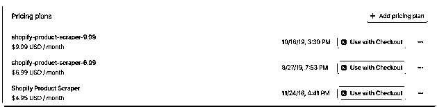
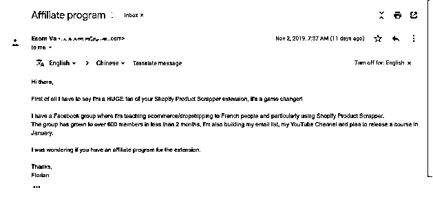

# 4.2 如何分析定价策略 @壹树

在小众市场里，产品价值可以粗暴地通过价格去体现，通过价格去提高用户对产品的预期。价格从 $1.99、$4.99、$6.99、$9.99 这样一路提升，用户的留存颠覆了我的认知。

同时我也对 Shopify Product Scraper 进行了同样的涨价操作，从 $4.95、$6.99、$9.99 这样一路提升。如下图显示，里面显示的时间是涨价时间。

并没有因为涨价，用户出现明显流失，留存比例价格高的比价格低的更好。非常后悔没有早点进行这样的操作，什么产品优化都不用做，直接涨价就出现利润增长了。

下图是我收到的其中一位付费用户的邮件，这种正反馈是最好的回报，比钱更让人愉悦。说明产品对他有非常大的价值。

涨价过程中，多次跳出技术，跳出产品，来到运营层面，对价格与小众市场的进行复盘与总结，更切身体验到一句话，为价值定价！