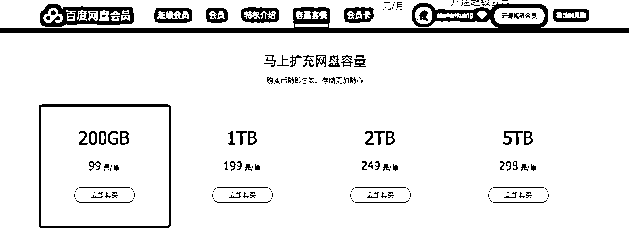
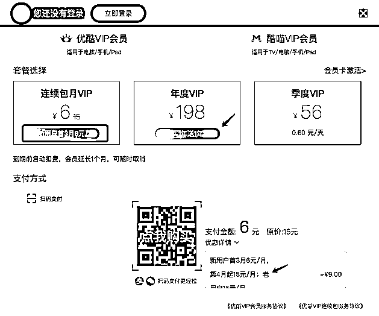

# 4.2.3 定一个价格锚点

价格锚点 即商品价格的对比标杆。营销中，企业通过各种锚点招数，或者利用对比和暗示来营造幻觉的手段，动摇人们对于货币价值的评估。

在消费者眼里，商品的价值是“相对存在的”，这件商品到底值不值这么多钱，这个定价到底实惠与否，都需要一个可供参照的标准。价格锚点既是商家设定的参照标准。

可以理解 99 元/年 就是价格锚点，有了这个价格，你才会觉得后面的价格实惠。

下图是优酷的会员费用，套路满满。季度 VIP 56 元理解为价格锚点。

新用户首 3 月 6 元/月，第 4 月起 15 元/月，老用户 15 元/月。正常办个季度 3 个月的会员，最多也就是 45 元，标一个 56 元季度 VIP 到底是什么意思？:P。

