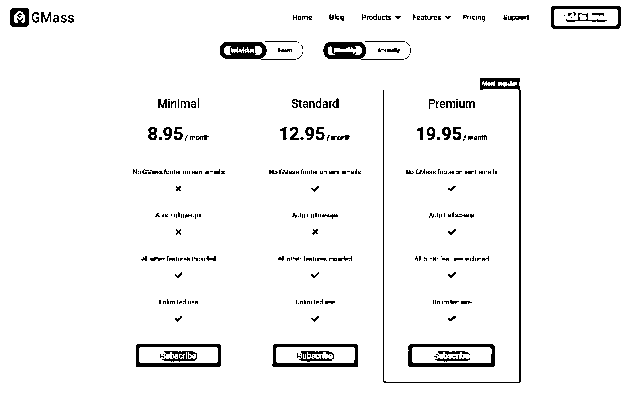
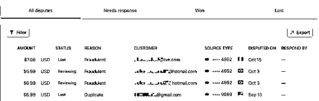

# 4.2.4 订阅模式，有那么一点点黑

这个模式目前在国内比较流行的是在视频网站上面，包月，包季，包年，不同的价格满足不同的人的口味，但相比于国外，自动续费目前在国内依然举步难行（看 App Store 的很多评论就知道了），被扣费了会找客服理论，人力成本挺高的，所以国内更多看到的是一次性付费（准确说不能是订阅模式）。

但在国外，这种订阅付费已经非常流行，用户接受度也高，所以通常一些工具软件都是用这种形式。

一般都是按月，当然也有提供季度，年的。也有支持更多的付费选择，然后 强烈推荐（Most popular） 其中一款，订阅的时间越长，价格通常会越低。

为什么说订阅方式有点黑？因为用户在订阅后，很大概率会忘记取消订阅（或者把取消指引弄得不那么显著），用着用着就忘记了，再过一段时间，把工具删了并彻底忘记了。

结果是怎样？当然是继续扣费，若不主动去取消订阅，或者去信用卡所在银行申诉，基本上都等于白花钱了（偶尔会收到用户要求取消订阅的邮件，他已经把扩展程序删了，但基本上不会叫我退款）。

我的小产品也采用这种模式，不会去判断用户是否依然继续在使用（其实可以通过使用日志去判断，若超过一定时间不登录，自动取消订阅），这算是行业的心照不宣的规则，视而不见，钱来了，就让它来吧。

诚然，也有用户向银行申述的，但属于小概率事件，到目前为止，我也就是收到过 10 来个申述。下图是 Stripe 里具有争议的订阅收费。

上面理由（REASON）有说欺诈（Fraudulent）的，大概率是他的信用卡被盗刷了。对于存在争议的交易，收款方也可以申述，提供相关信息（邮件来往，使用日志等等），不过我一般都不去花这个时间，退就退了。