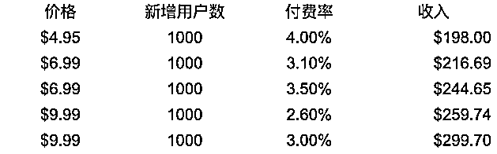

# 4.2.5 涨价是最好的增长方式

标题可能具有一定的争议，但对于我们而言，这个方式是值得冒险去尝试的。做产品就是一连串的试错冒险，尝试不同的方法取得不同的增长目标。

在小众市场，作为产品的各环节负责人，决策必须够果断，能想到的环节都可以去尝试与优化，在这个涨价的过程，有点像温水煮蛙的过程。

对于已经订阅的用户可能造成不了太大的影响，因为不一定感知到涨价了。但对于新的用户，看到产品用户安装量，有一定的迷惑性，会认为旧用户也是按这样的价格去支付的。

我们一起看看下面的涨价表格，若每月新增 1000 用户，付费转化率因为涨价而降低，即使降低 0.90% ，都比之前的收入提高。

决定收入的当然还有流失率，但这个也不会因为你涨价而就马上流失，因为涨价对已订阅的用户没影响，属于自然流失，相对稳定。

注：小众市场，若付费率降去 1% 是属于动荡很厉害的了。在《前言》说过，小众市场属于细水长流，基本不会出现大起大落的情况（除非被下架）。

我们除了站在用户的角度去解决问题，也要站在用户的角度评估价值，为价值定价。大胆为产品价值标上明码实价。

因为我们帮用户解决问题了，所以我们可以理直气壮地接受报酬。

内容来源：《为价值定价，套路无处不在》

