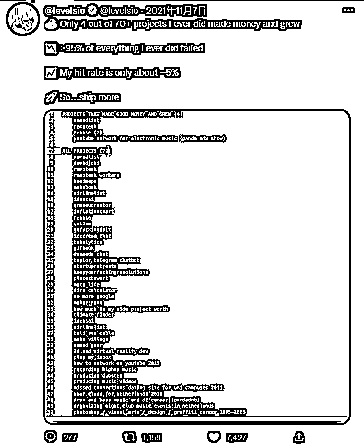

# 章节概要

在找到需求、学会分析方法、知道产品差异化和完整生命周期后，接下来就要开始做自己的英文工具。
为什么需要快速做出产品 MVP ？因为新产品的失败率太高了。为了提高整体成功率，我们只能增加数量，只能不断地尝试新的 iada，这是所有创新者的窘境。
本章节为手册新增内容，我们为大家整理了几个快速做产品的方法论，在精益迭代的商业竞赛里，每年能发布 12 个 MVP 产品的你，比每年只能发布 3 个 MVP 的对手，多了四倍的优势。

著名独立开发者 Peter Levels，在今年 10 月，新发布了一款产品 [avatarai.me](http://avatarai.me/) 。在上线第一天就入账 1 万美元。 上线十天，总共入账 10 万美元。

厉害吧？他成功的秘诀是什么呢？是“多”。

在过去十年左右的时间中，他一共做过 70 个产品，其中只有 4 个成功了。成功率只有 5% —— 注意，他是全世界最厉害的独立开发者之一，成功率才仅仅 5%， 何况是我们呢？

既然这样，那我们最好的选择就是：

•去做你能想到每一个 idea

•用最省事的方式、最快的速度把它做出来，上线。比如：一个周末。

•上线后，看用户数据。让市场告诉你，你是否应该继续投入。

如何快速想到产品 idea，上面挖掘需求部分我们已经讲过了，具体如何做呢？下面是一些比较详细的方法：