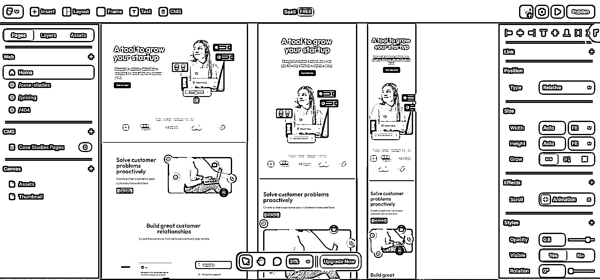
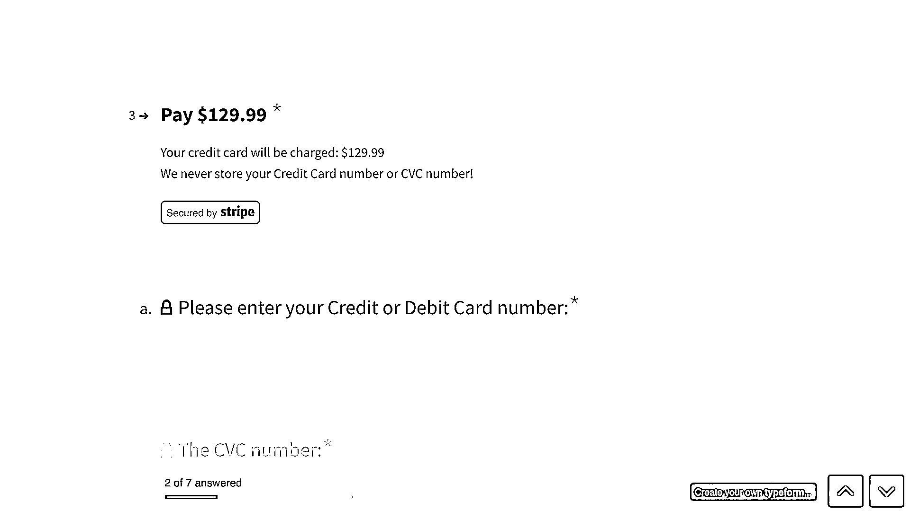
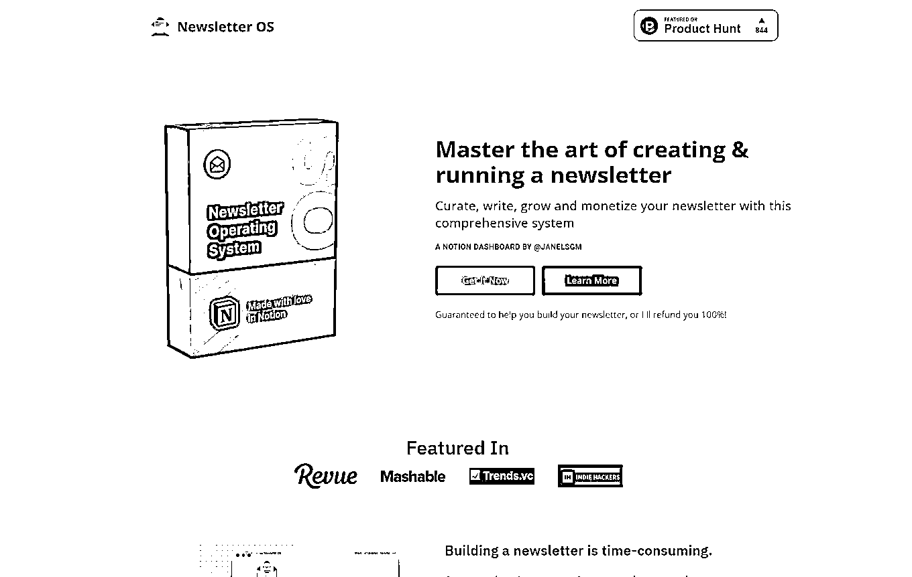
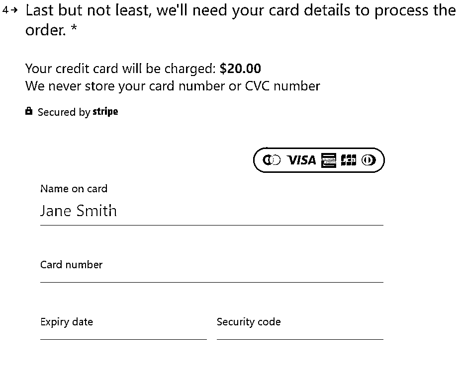

# 7.2.1 如何半天内做出 MVP

敏锐的你可能已经注意到，在上述过程中，最消耗时间的是写主函数，其次消耗时间的是前端界面（买模板+改模板），它们占整个 MVP 时间的 70%以上。

如果这两项功能都不做，岂不是可以进一步缩短做 MVP 的时间？

没错，还真可以。

尤其是对于付费产品而言，你完全可以不做主功能。因为你只需要验证“付费意愿”即可。

“验证付费意愿”的最好办法，就是“预售”，AKA“卖空气”！

具体步骤

•写产品预售的营销文案，尤其是列出你要解决的问题、你的 3 个卖点。

•用工具生成 Landing Page。推荐工具 [carrd.](http://carrd.io/)co、Webflow、Framer，把你的文案填进去

•用 Typeform 接入 Stripe 支付功能。

•购买 Google 关键词搜索广告，关注转化率数据。

carrd.co 和 typeform 的产品体验很好，它们具体怎么使用，我就不手把手教了。

在 carrd.co 里制作 landing page 的界面，如图所示：

在 Framer 里制作 Landing Page 页面，如图所示：

在 typeform 里添加收款功能的界面，如图所示：

再来几个例子。

下面两个产品的 landing page，都是用 [carrd.co](http://carrd.co/) 生成出来的，不需要写代码：

而这个链接，是 Typeform + Stripe，实现了“带有支付功能的调查问卷”。同样也不需要写代码。把这个链接放到 landing page 上，你的 MVP 就算是完成了，可以开始测试转化率 了。大家可以点开链接，感受一下。

[`template.typeform.com/to/zDzdJ3Me`](https://template.typeform.com/to/zDzdJ3Me)

内容来源：《写给独立开发者：如何快速做出产品 MVP》

