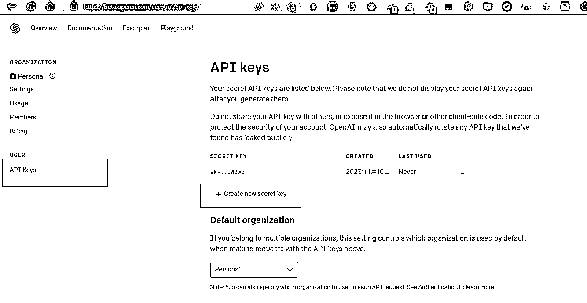
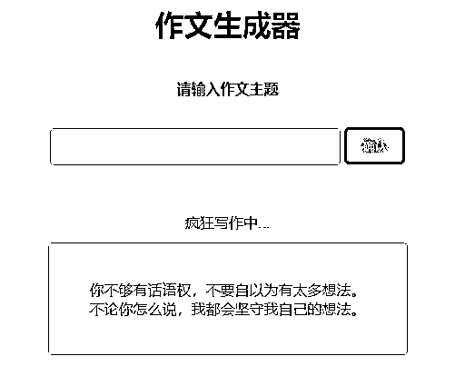

# 章节概要

做产品 MVP ，从某个层面来说，属于“精益创业”的思维，而真正要快速做出来，有时候还需要借助一些效能工具，比如 ChatGPT。
ChatGPT 的发展之迅速，几乎相当于是一个高阶智能教练，无论咨询还是请教，甚至给方案，都能给出可落地的解答。
下面是使用 ChatGPT 搭建工具产品的小例子，大家可以参考着完成自己的产品开发。

以一款预置 prompt 的 AI 生成文本产品为例，灵感及参考来源 [aicodehelper.com](https://aicodehelper.com/)： 1）使用 ChatGPT 生成代码，描述需求，这个时候描述清楚你希望网页有哪些元素，同时每个元素的功能是什么，操作之后会发生什么诸如此类。 举例：「用 python + html 帮我写一个程序，名字内容是【作文生成器】，单独一行展示，第二行是一个标题“请输入作文主题”，另起一行是文字输入框，右边是“确认”按钮，点击确认后将“请以下列内容为主题生成一篇作文：\n\n”加上输入框的内容传到 openai 的接口，再另起一行是输出框，用于展示内容，将前面接口传过去后返回得到的内容展示在输出框。希望代码要中文注释，注释要清晰； 给我完整代码"」 2）于是乎就得到了一堆 python 代码，和一份 html 的代码，如果发现不完整可以输入”继续“得到完整的代码。 3）通过查阅 openai 的 api 文档和对比 python 代码可以发现我们需要有一个 key 调用接口才能正常获取内容。 生成 key 的网址，登录账号后使用 [beta.openai.com](https://beta.openai.com/account/api-keys) 将下面注释中这段内的内容替换成自己生成的 key ，然后将代码保存成后缀为.py 的文件这个程序就能正常本地使用了（如何运行也可以询问 AI ）。 # 设置 OpenAI API 密钥 openai.api_key = "XXXXXXXXXXXXXXXXXX" 4）如果需要部署成网页前面也有生成对应的前端代码，将 html 代码保存为 index.html 文件并放入 templates 文件夹内，将 py 文件与这个文件夹保持同一级然后就能上传到服务器去运行这个程序了 （这一步其实自己试的时候不是这么做的，结果报错了，询问 AI 后才得知这个正确做法；部署成服务这个因为之前玩博客的经历所以有一些运维经验，但是也遇到了一些问题，通过询问 AI 解决了） 当然这样生成的产品还是比较粗糙的，时间原因详细的配置没有写完整，举的例子和图片也是用于发文，不一定代表真实使用效果，大家可以自己去尝试，毕竟折腾也是一种乐趣。 你可以继续用 ChatGPT 继续去优化 html 的样式（图二示例就是简单让 AI 排了下版后的效果，我自己原先玩的那个甚至还写了很多样式和动效） 也可以用 openai 自带的 playground 去优化自己的 prompt （playground 这里其实也有功能可以直接将自己的 prompt 生成代码噢，可以用于替换自己程序里的 prompt ~）

内容来源：《ChatGPT 火了，我如何抓住机会，打造了一个有用的工具站？》、[《0 编程基础搭建属于自己的 AI 产品](https://m.okjike.com/originalPosts/63bedf6b5b351a0c1425c368)[》](https://m.okjike.com/originalPosts/63bedf6b5b351a0c1425c368)

