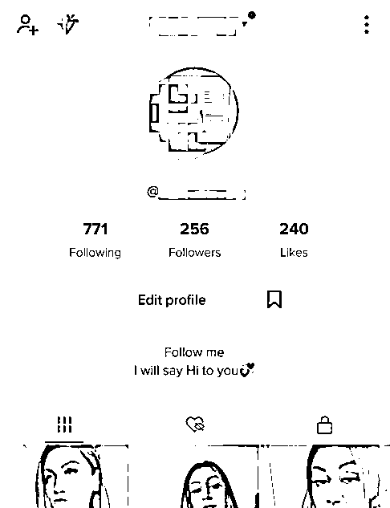
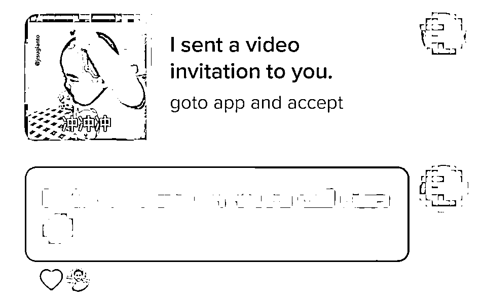
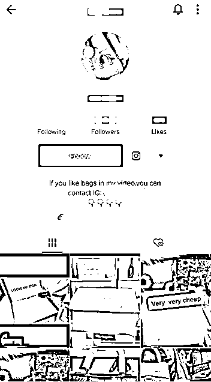
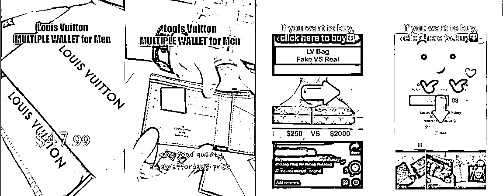

# 8.1 玩法一：TikTok 引流 @Harevy

TikTok 现在无疑是一个巨大的流量入口，只要做好 TikTok 引流，基本上就不用愁产品冷启动。

对于一个新手来说，该怎么在 TikTok 上引流呢？这里以圈友 @Harevy 通过 TikTok 引流，推广一款海外交友平台产品的案例，来向你展示在 TikTok 上引流的全过程。希望能给你带来启发：

1、注册账号，并包装成美女账号

1、注册 TikTok 账号，将名字、头像、简介包装成美女人设形象，再搬运 3-6 条美女视频提高账号真实度即可，可以不用追求播放量。

2、找到对应地区的美女账号

美女账号下的众多男粉丝就是我们需要去触达的用户。我测试过几个地区（台湾、欧美、中东、东南亚），根据账号文案或简介的语言就可以初步判断是哪个地区的，目前数据表现欧美地区的充值率最高，只作为参考。

分享两种无限裂变采集对标账号的方法：
第一种方法：①关注一个对应地区的美女账号②点击“Follow”右边的小箭头会弹出部分相似推荐③再点击小字“See all”，你就能得到一批相似博主④持续重复前三个步骤就能实现无限裂变
第二种方法：①关注一个对应地区的美女账号②进入该账号的粉丝列表，基本上都是男粉丝③找这些男粉丝所关注的账号，就能发现一大片新大陆④最后只需做好筛选即可

3、关注对标账号的粉丝

因为老外本身就有爱回关粉丝的习惯，再加上美女人设账号的包装，整体回关率基本都能达到 30%左右。

4、私信引流

最后，私信对方已编辑好的文案，引导他们通过链接下载 APP，到这一步就完成了，之后只要用户在 APP 上消费，就能获得分佣。

当然，除了私信链接，还可以将用户引导到 Whatsapp 上精聊转化，只要做好话术引导，转化效果还是挺不错的，缺点就是效率相对较低。等账号有了一点权重之后，可以转成商业账号后直接主页挂链接，增加多一个触达入口。

为什么我说这种玩法不用追求播放量，这可以说是一种取舍吧，在被动流量和主动流量之间的取舍。

像以往的基金、带货，其实都是通过制作优质视频，获取高播放和粉丝后才能变现，但这种路径受环境影响大，且流量被动不可控，爆视频当然爽，但相信很多人也都体验过长期 0 播低播的煎熬吧。
通过关注回关的方式不仅无需花费精力去制作优质视频，还能忽略环境导致的 0 播低播，能够把流量主动权握在手上，毕竟稳定才是王道。

玩法升级和其他可应用场景

其实这个玩法能跑通的基本逻辑很简单：「TikTok 一个账号下的粉丝就代表着一群精准用户，只要能基于产品去对这群用户进行针对性的触达、营销和变现即可」

那么基于这个逻辑，是不是可以应用到很多其他的项目呢？

并且我们还能延伸出一个应用场景更广的玩法，也已经看到有人这么在玩：

「大号做包装，小号在评论区引流」

具体玩法如下：

1、注册一个大号，定好要做的类目，比如说包包，包装好相关的名字、头像、简介，挂上独立站链接或 Whatsapp，尽力让账号显得足够专业。

2、制作产品视频，一定要在视频中体现出产品亮点（外观、质量、价格等等），并通过图片和箭头引导详细展示出购买的路径。

3、寻找能和包包匹配的账号，例如品牌官方号，种草博主等，通过工具批量采集相关账号下的粉丝用户名。

这里同样分享一个找到更精准对标账号的方法：
和国内一样，TikTok 也有一个星图广告平台 https://creatormarketplace.tiktok.com/（激活账号需要用到公司注册），注册后可以免费使用平台的条件筛选功能，通过粉丝数、性别、年龄段、国家地区、兴趣等参数能够筛选出符合条件的账号。

4、注册一批小号，在我们的产品视频评论区批量 at 已采集好的用户，只要用户登录 TK，就能看到被@的消息，点进去就直接是产品视频的展示。

一个精准的用户，看到符合自己需求的产品，低廉的价格，配合上清晰的购买路径，转化成功率是不是能够大大提升呢？

5、掌握了这套玩法后，通过账号粉丝采集和营销，就可以应用到非常多的场景，尤其是对众多的跨境卖家来说，也许能够成为一把获得精准客户的利器，用于导流到独立站或者私域做长期复购生意。

采集年轻女性群体，卖化妆品、包包、鞋子等采集家庭主妇群体，卖家务用品、平台刷好评（贪便宜）等采集小孩群体，卖玩具、做游戏推广等......

还有很多各类 CPS 项目、知识付费课程、其他产品等等都有可以实现的操作空间。

内容来源：《TIKTOK 如何利用海外 CPS+工具 0 粉丝变现月入过万》

