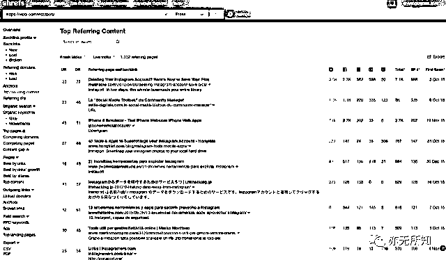

# 8.2 玩法二：请测评网站测评引流 @亦仁

网络上会有大量评测类型的网站以及 how-to 网站，类似于国内创投领域的 36kr，小众软件。这些网站关注用户在使用大网站过程中的痛点，并对解决此痛点的工具性产品进行评测，导入流量。如果能将咱们的网站在这些评测类型的大网站上被评测到，就会引入大量的初始流量。

我在 [ahrefs.com](http://ahrefs.com/) (外链查询网站）分析了下一个竞争对手 [`vibbi.com/instaport/`](https://vibbi.com/instaport/)， 在 top referring content 这个页面

我们发现 [mashable.com](http://mashable.com/)、[lifehacker.com](http://lifehacker.com/)、[makeuseof.com](http://makeuseof.com/)、[pcmag.com](http://pcmag.com/) 等流量巨头都推荐这个小工具网站，给这个网站导入了巨大流量。

显然，这些流量巨头也发现了 Instagram pictures download 这个真实的用户痛点，不过他们是用了更轻的方式，用内容而不是产品，来为用户解决这个问题。通过评测这些工具类型的网站，他们给用户做出指引，而用户最终被指引到这些工具类型的网站。

所以到这一步，要做的事情很清晰，梳理出报道竞争对手的网站，联系他们并请求评测。 这就像启动一个开关，一旦有一些大网站接受了评测的需求，流量就会持续进来，后面就会启动自增长，即使什么工作也不做， 过一段时间也会发现很多评测网站主动的链向我们的工具站了。

内容来源：[《通过 Google 挖掘细分市场的一个案例》](https://mp.weixin.qq.com/s/cXa6Rwiet5gN8bSe-h4QNw)

