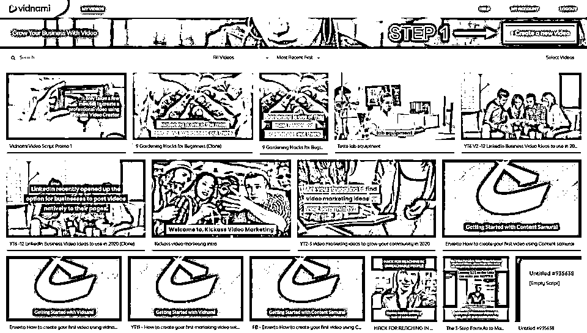

# 8.4 玩法四：利用工具批量制作教程引流 @Muthon

只需要一篇教程，或者一个教学视频，就可以每月获得上万的长期被动收入，是不是很香。

而这些教程或者视频也许根本不需要你自己制作，海外大把英文，中文（繁体）的视频教程，文字教程，只要照着写一遍就好。发布到国内各大平台，特别是 B 站，或者去投放百度，知乎广告套利，我相信，像 Clifunnel 这样的关键词，能去搜索的一定是对这个软件有了解有需求的人，转化率肯定非常高。

类似的工具还有很多很多，再举一个例子。有不少人做抖音，做 TikTok，或者做 B 站，可能很多人不知道这个在海外非常流行的工具：Vidnami，这款工具，拥有大量的视频片段库，能够让普通人输入一段文字，就能自动生成对应的高清视频，是一款非常好用的工具，是做 YouTube 赚钱的人的必备工具，也能用来做 TikTok 视频和 B 站、抖音视频。

内容来源：《从一套课程衍生出来的月入万刀生意，每个人都可以操作》

