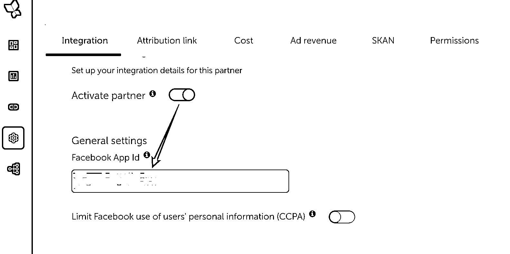

# 8.6.2 投放前准备

认准了产品方向，又假设你有了一个完成度 80% 以上的产品，那我们就进入下一个环节——买量：一个 App 工具产品的投放流程（以 Facebook 为例）。

首先是开户问题，如果你身处大陆就不要想用个人户跑了，100% 只有挫折。

有营业执照的话，Facebook 的大陆账户开户是有返点的，能拿百分之几看你的商务能力。

Google 大陆户返点现在几乎是没有了，但是海外户还能拿到 10～20 的返点（FB 也有），能找到少部分源头 25+也不是没有可能 emmm...

TikTok 的大陆户返点政策会少一些，但是最近也有海外户开始往外放了，返点比例可以做到全球统一。这部分可以扩展的太多，有机会的下次再聊。

因为 Google 没有给我们提供一些用户属性之类的选项，更多的是依靠 Google 的算法来做智能投放（UAC）。而 Facebook 就给我们提供了很多定位和尝试的可能性，这个教程也会主要分享下 Facebook 投放的基础流程。

在 Facebook 投放之前，请确保自己已经有以下这 4 个东西，如果你是通过代理商开下来的账户而非个人户，那这 4 个东西你一定已经有了：

•广告账户

•BM（Business Manager）

•主页（Facebook Page）

•已上架的产品，包括 Google Play、iOS App Store，或已上线网站（Shopify 独立站或你的工具站都 ok）

提醒一下：现在的新账户切忌挂羊头卖狗肉，即拿 A 产品开的户去跑 B 产品，这个是 Facebook 严厉禁止的，有一些 2017 年之前的老账户还是没问题的，但是这么宝贵的账户资源就是行业熊猫，用一个少一个。

好的，解决了账户问题，那我们现在开始进行投放前的一些设置：

第一步，开发者授权

•登录你的 Facebook 开发者后台 https://developers.facebook.com/，输入你的广告账户 ID，将你的 App 绑定到 Facebook 广告前端

第二步，三方 MMP（App）设置或 GA（网站）设置

•此处以 Appsflyer 为例，其他家同理。打开 Meta 的渠道开关，输入上面的 FB App ID，归因窗口选择默认，添加你需要关键的 app 应用内事件，保存即可

下面就开始正式进入投放流程，一起来傻瓜式操作~