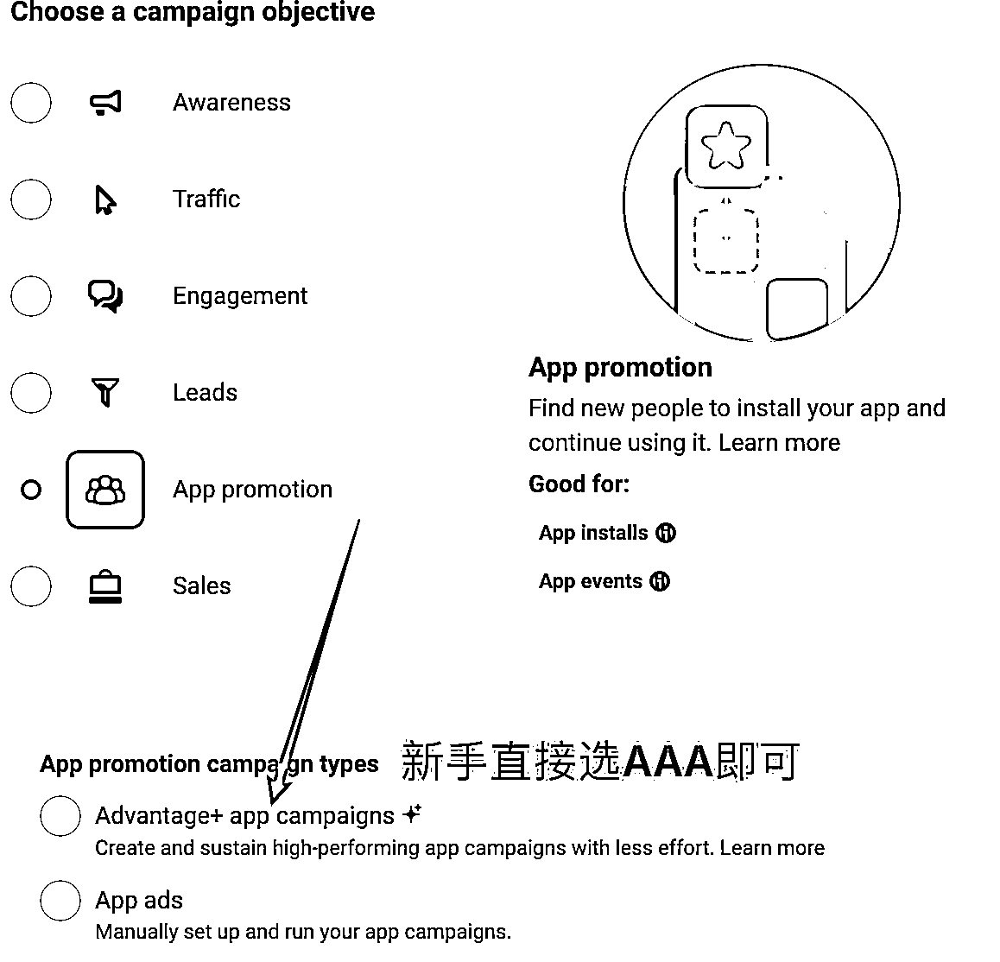
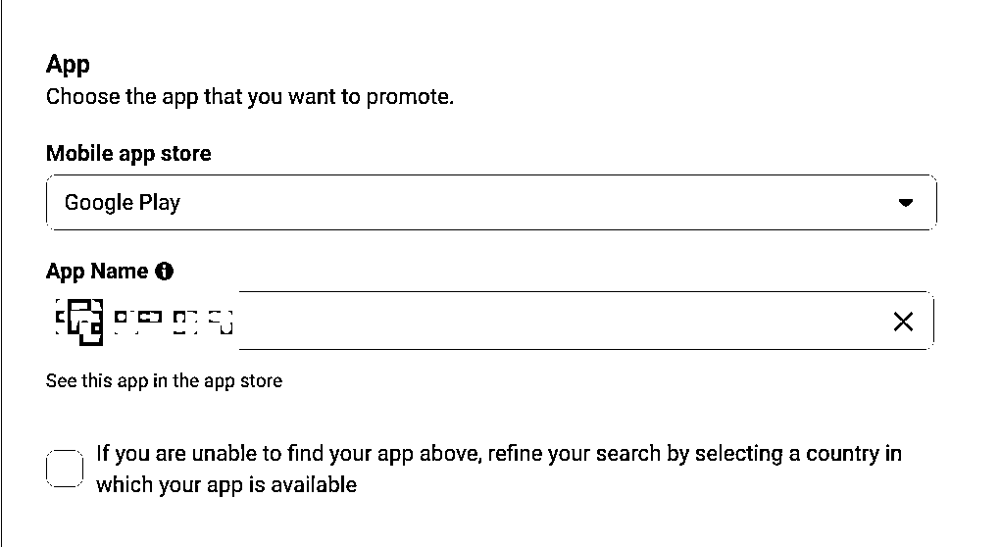
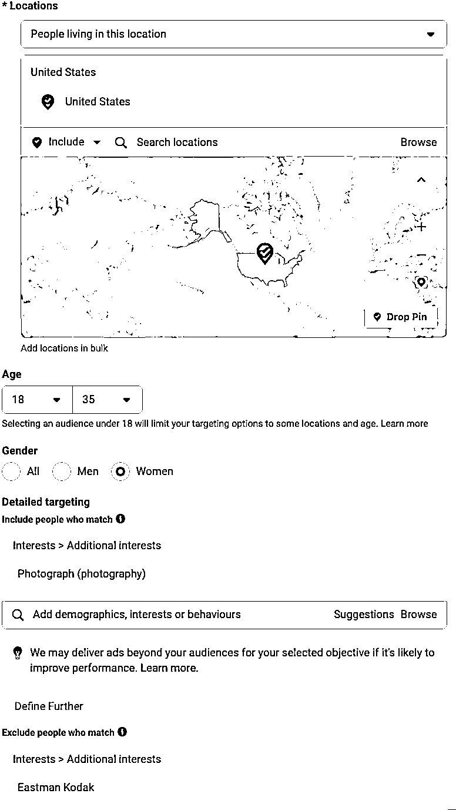
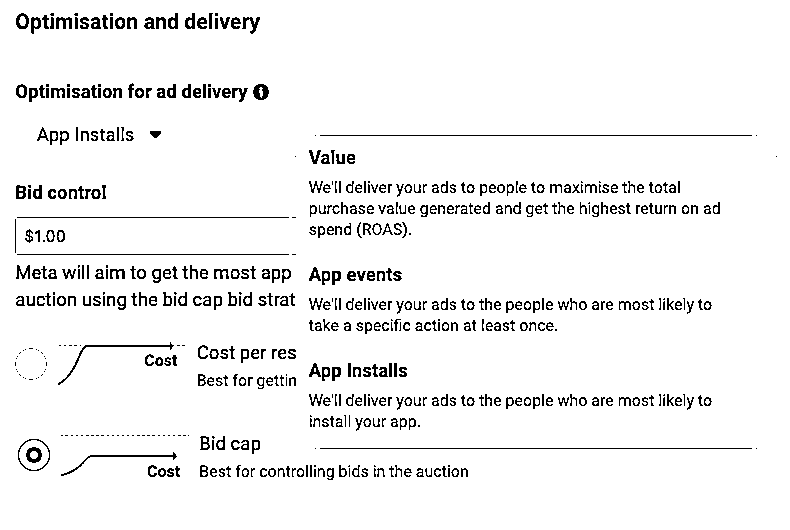
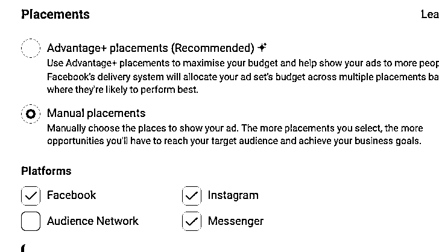
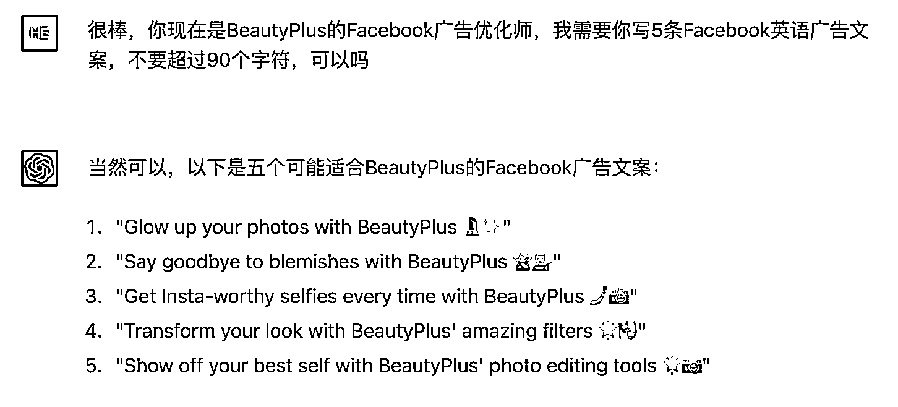

# 8.6.3 具体投放流程

第一步，打开你的广告账户，点击新建，投放 App 就选“App Promotion”，投 Web 就选“Traffic”或者“Sales”，新手可以直接选“Advantage+ app campaigns”，如果想钻研下就正常“App Ads”即可。

第二步，选择 Ad Set Level，选择你之前绑定好的 App，选择区域时建议改成“People Living in this Location”, 比如图示就是定位了最近居住在美国，18-35 岁的女性，喜欢摄影但不喜欢柯达胶卷的人群，也可以加上 Beauty 之类的关键词，这个人群就很适合投放图片编辑应用。

第三步，选择你的出价和优化目标版位，这个部分稍微说详细一点。

如下图所示，Facebook 的优化能力分 3 个层级：优化安装、优化付费事件、优化 ROAS。我们可以循序渐进，先跑安装，积累数据后再跑事件，最后跑付费

对于出价和预算个人建议可以先 Lowest Cost 自动出价跑 10-20 美金，根据结果匹配你的预期 CPC 和 CPA，如果偏差太高那就在结果基础上找到你能承受的出价（一般*0.85 还是没问题的），选择 Bid Cap，这样可能拿不到更多量级但是可以有效控制你的买量成本

这里可以展开多说一句，其实无论是 IAP（内购）或者 IAA（广告变现）还是混合变现的产品，每个产品都有自己的盈利模型，也就是说这个产品每一个用户能赚多少钱，其实这个是在投放之前已经测算出来的。所以说，你自己想赚多少钱其实就决定了你的出价，从 ltv 里剔除你的预期利润，就是你用来买量的预算，如果这个很薄甚至为负，那就要考虑下这个商业模型是否成立，因为没有买量空间的商业模型本身就不能成立。

投放版位上可以不勾选 Audience Network，这里是 Meta 的三方流量，可以缺量时再加。

接下来到了第四步，就是选主页和素材了，ChatGPT 写文案，甚至出素材图片的 prompt，再拿去让 AI 生成图片我觉得都是完全没有问题的，大家也可以去 Facebook 官方广告库找找灵感：[`www.facebook.com/ads/library/`](https://www.facebook.com/ads/library/) (PS: Facebook 广告库也是有开放 API 的哦～)

