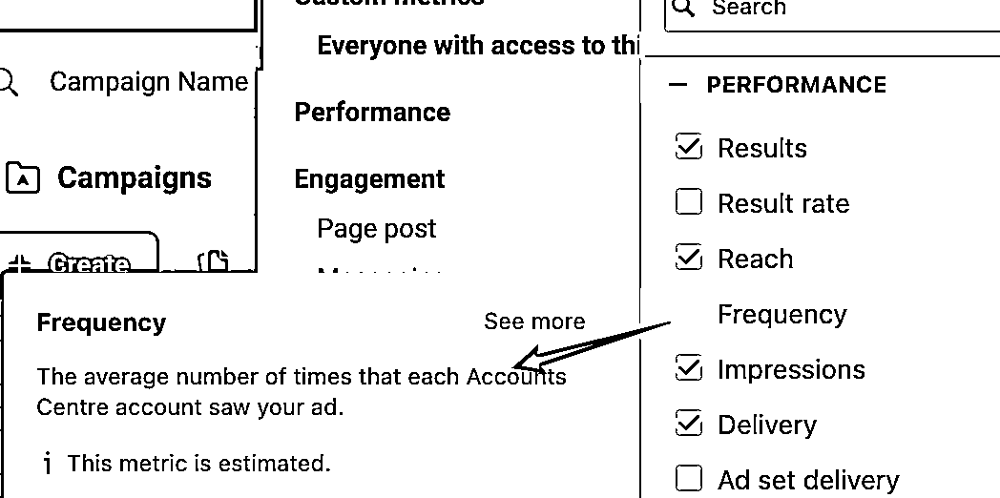
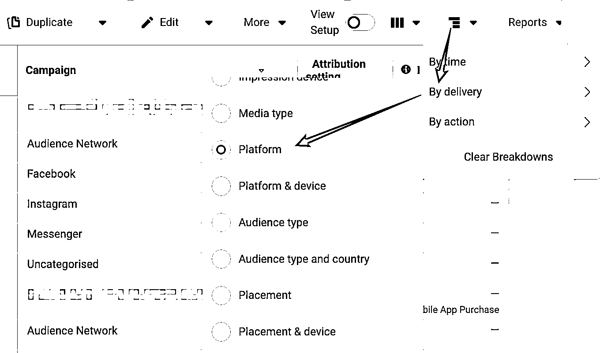
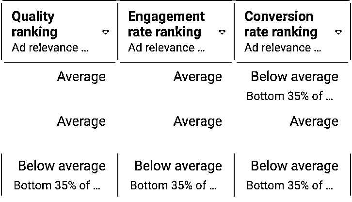
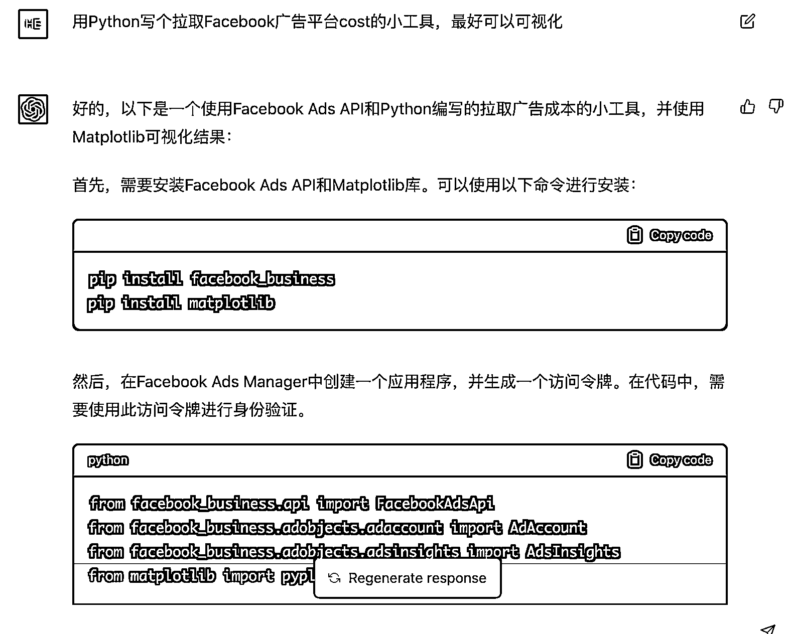
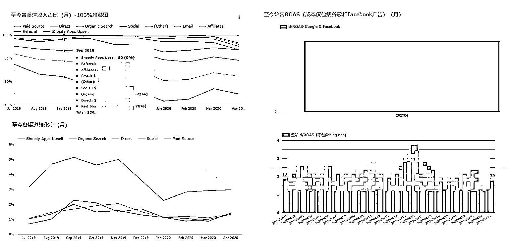

# 8.6.4 数据分析

广告投出去之后当然数据也很重要，我主要会看两个部分，一个投放监控，一个竞品分析。

1、投放监控

先说下平常不太看但需要关注的几个指标：

1）广告展示频率 Frequency=Impression/Reach，指单个用户看了几次你的广告，一般来说当广告点击率下降或消耗变慢的时候，请关注下你的广告展示频率，一般来说 2.5 或 3.5 以内都是可以接受的，但超过 5 的时候请不要吝啬的把它关掉或者换素材。

2）点击率 CTR 和转化率 CVR。有代投的话可以问他们这个品类的平均水准，来衡量你的投放结果如何：

•CTR 高 CVR 低，CTR 高就是素材吸引人，马上收到素材库里作为素材方向。这种情况先看 CPM 是否正常，如果 CPM 明显异常那就是广告跑偏了；如果 CPM 正常，但是 CVR 低就可以看看分性别年龄版位等的细分情况，确认不仅仅是素材诱导；啥都看不出来那就复制一个换兴趣或出价再比较

•CTR 低 CVR 高，看下最终成本，如果成本合适，0.05%的 CTR 它也可以是好素材！

•CTR 低 CVR 低，人群不对，素材不行，Frequency 高，都有可能，建议重新寻找投放方向

3）版位。Facebook 上通常分为 Facebook、Instagram、Messenger、Audience Network 四大版位，还有更详细的版位细分大家可以自行探索，其中除了 AN 外都是 Facebook 的自有流量，AN 是 FB 的三方开发者流量（比如我们通过 Facebook 做广告变现），成本和消耗异常的时候可以来这里看看。

4）广告质量排名。这个其实看看就行，就是 FB 根据你的广告质量、转化率排名、参与度排名来给你加大加速量级或者减小降低量级，可以直接通过提高出价解决。

再说下广告日常监控，主要指标是花费 Costs、主要 App Events 以及收入（计算 ROAS），可以通过 MMP（Appsflyer 等）、广告平台直接拉、自己创建 BI 等方式获取，但收入这东西比较敏感，你可能不放心传给 MMP，那就自建个 BI 来看数据吧（听我的，代码交给 ChatGPT，可以吗？）。

如果还是觉得麻烦也可以直接用 Google Data Studio，因为可以自定义数据源，所以这个面板不仅适用于查看广告数据，SEO、产品用户漏斗等都可以通过 DS 来实现。

2、竞品分析

至于如何做竞品分析，其实星球里已经有很多帖子了，我也就不做太多介绍了，我今天还是只想推荐一个最原始但最有效的办法：亲自刷广告。

不要吐槽刷广告的效率，市面上最贵的广告 Spy 工具，相信我都没有你手动刷出来的 Facebook 广告实时，特别是那种多赞多评论的广告，留个心眼，务必一键三连，该赞就赞，该评就评，该收藏就收藏，顺手再加个购物车，下次人家投 LAL 的时候说不定就把预算花在你身上了呢～

所以从今天开始，准备好一个干净手机，挂好干净节点，装上 Facebook、Instagram、TikTok，再 GP 免费榜上下载几个评论说全是广告劝人不要下载的“垃圾 app”，这就是你的最强 Spy 工具！

内容来源：3 月 6 日《关于出海工具产品营销推广，我的几点经验分享》@非洲水手

