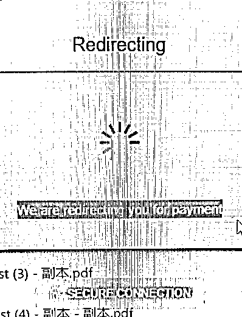

# 11.3 支付坑（大坑）@颜过

国外的工具或一些需求，或产品，除了广告变现以外（Google Adsense）；常用的变现方式：捐赠（paypal）；还有通过分享产品等知识，用 affiliate 模式（分销赚佣金）来实现；那最直接的方式，就是直接收费。

chrome 插件大多数情况下，只能选择捐赠，或直接收费的方式。结果现在的 Paypal 账号是不支持国内账号的捐赠。

直接收费方式，因为 google pay 官方支付停止，但接受第 3 方支付。你可能直觉是 Paypal，但不好意思，虚拟产品，Paypal 不支持（应该大型软件会有收款白名单）。还有其他选择：stripe 等（但现在申请，又是门槛 N 高，申请下来，也会被封号的风险）。

现在收款，是先试的是 Sendowl（可以再转 Paypal，现在测试的结果，几十美金，通过 sendowl 付款链接，Paypal 是直接到帐的）。

因为 sendowl 是 web 端网页支付，插件端要有个支付回传（webhooks），确认用户已经支付成功。不做登录就可以整个本地的唯一标识 Key，当用户付款了，就生成一个标识 Key，保存到数据里（或者用户本地电脑缓存）；另外最好手动或自动再发一下支付邮箱一封邮件，把其 Key 发给用户。如果用户卸载了，就可以用这个 Key 来识别。

另外插件内是不支持回传确认的，如下图，即卡死在那里，因为没有回传确认是否支付成功。朋友 Y 是直接用的单独新开浏览器标签页，让付款用户直接通过 sendowl 网页链接付款。

