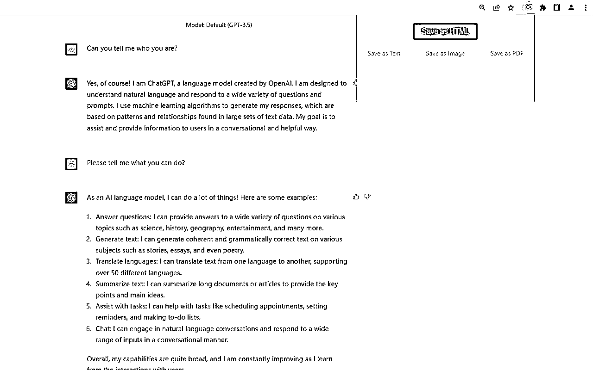
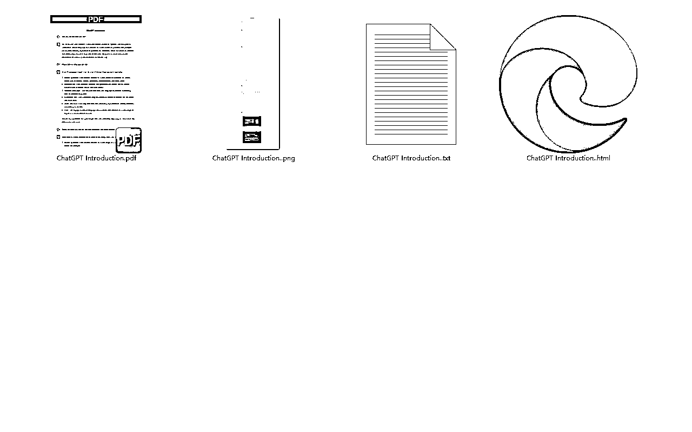

# 案例二：通过 ChatGPT 开发上线 Chrome 插件 @易焘

3 月份，我第三次参加英文工具站航海，终于在 ChatGPT 的帮助下上线第一个 Chrome 插件，实现把 ChatGPT 对话记录以 HTML、TXT、PNG 和 PDF 多种文件格式保存到电脑本地，不需要分享或者保存在线上而担心对话记录泄露，同时，还让 ChatGPT 实现一个 WordPress 插件 API 给 Chrome 插件加载远程站点的指定的文章列表。

[`chrome.google.com/webstore/detail/`](https://chrome.google.com/webstore/detail/chatgpt-save-data/ocejkjkjbhbkgdidjhodiejdppbiahna)[ChatGPT](https://chrome.google.com/webstore/detail/chatgpt-save-data/ocejkjkjbhbkgdidjhodiejdppbiahna)[-save-data/ocejkjkjbhbkgdidjhodiejdppbiahna](https://chrome.google.com/webstore/detail/chatgpt-save-data/ocejkjkjbhbkgdidjhodiejdppbiahna)

最近 ChatGPT 封号很严重，也许这个插件能帮助大家尽快把自己的调教记录保存在自己的电脑中，账号是不值钱的，但大家和 ChatGPT 的调教记录和创意灵感却是无价的。

这是一个纯粹由 ChatGPT 编写出来的插件，我不需要写一行代码，完全通过与 ChatGPT 对话，从最简单地获取当前网页的 html 内容开始，再到把代码保存到 TXT 文件，然后保存前对获取的 html 内容做处理和优化，再到保存为 html 文件、PDF 文件和 PNG 图片，最后再修改成多语言版本，一步步地完成整个插件的功能，开发这个插件的十几天时间里，其中不乏我和 ChatGPT 每天长达 8 到 10 小时的悉心陪伴和促膝长谈，中间遇到了许多困难和相互不理解的地方，但最终都在我的引导调试和 ChatGPT 不厌其烦的配合下一个个突破。

结果，插件准备上线之前才发现原来自己被 ChatGPT 忽悠使用了 Manifest V2 做开发，然而，从 2023 年 1 月 1 日开始，Chrome 应用商店不再接受基于 Manifest V2 规范的新插件上传，于是，又不得不重新让 ChatGPT 一步步修改出 Manifest V3 规范的版本，几天折腾之后，插件终于申请上线审核。提交上线和审核过程中又遇到一些问题，还好 ChatGPT 再次出马，把问题一个个丢给 GPT，它都帮我一一解决，连上线使用的插件概述也是由 ChatGPT 代劳写了一个 PAS 模型的插件概述，最终插件终于在昨天正式审核通过上线了。

虽然这仅仅是一个小小的浏览器插件，如果能在 GitHub 上找到功能类似的代码做二次开发，说不定能更快完成所需的功能，但是作为一次新的尝试，这个插件验证了 GPT4 所具备的开发能力。但通过 ChatGPT 编写项目需要注意以下几点：

1）项目的切入点一定要小

GPT4 已经非常智能，但是并不能奢望直接把一整个项目需求丢给 GPT4，让他帮你写出所有代码。即使项目很小，稍微有一些功能模块，GPT 也不一定能真的帮你实现整个项目。一开始的时候，一定要抽象出项目的最小功能点，项目切入点一定要小，小到 GPT4 能给出完整能用的初始版本。

比如这个插件，我的第一步切入点并不是让 GPT 写出能处理网页代码并保存成各种文件的功能，而是让他写一个最简单的谷歌插件，实现读取当前网页的源代码并显示在 popup 页面中。实现第一步之后，再逐步给 GPT 增加需求。

2）要分模块让 ChatGPT 编写程序

ChatGPT 在输出的时候，经常会遇到输出中断的问题，有时可以通过“继续”、“继续写”、“继续输出代码”等指令引导它继续输出，但并不是总能奏效，而且程序这种上下文强关联的内容，一旦前后逻辑有偏差，就有可能出现问题。因此，我尝试让 GPT4 分模块帮我输出，先让他告诉我实现这个功能需要哪些文件，然后再引导它把一个个文件的代码单独输出。

3）不断和 ChatGPT 确认开发好的代码

GPT4 的输出有时候还是会出现前后逻辑接不上的情况，因此在开始增加一个新功能前，我总会让它再次确认需求，并重新提供代码让他检查确认是否存在问题。确认无误之后再在代码基础上增加新的功能和逻辑。

4）适当地深入功能和代码来对 ChatGPT 做引导

虽然 GPT4 已经非常智能，但在编程过程中有时它会陷入一个功能点的某一种实现方式出不来，不断地在里边打转，但给出的代码就是不能解决问题。这个时候，我们最好要深入具体功能需求和代码中，根据自己的经验做一些判断，引导它尝试使用其他方式实现需求。

插件开发过程和审核过程中，我遇到了许多困难和波折，但我都和 GPT 合力把问题一个个解决，ChatGPT 不单纯是你的工具，更是你的帮手或者同事，我们要像对接同事一样与它合力一起探讨和解决问题。

这个插件虽然功能很简单，但它的上线也意味着我们可以通过 ChatGPT 来辅助开发英文工具站，未来无限遐想，我们和 ChatGPT 一起创造。

内容来源：《通过 ChatGPT 开发上线第一个 Chrome 插件，实现保存 ChatGPT 对话记录》

