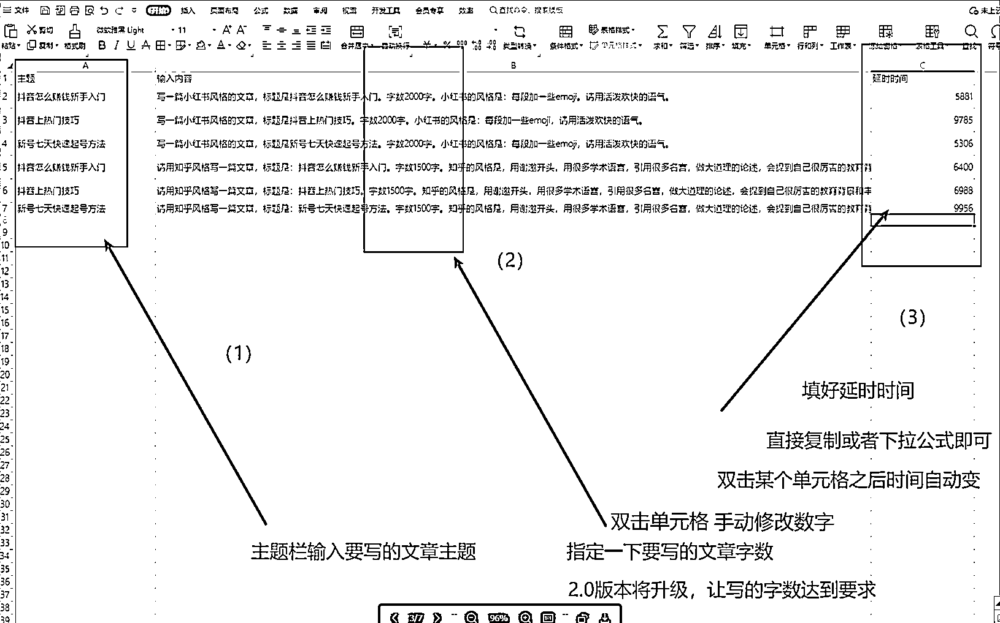
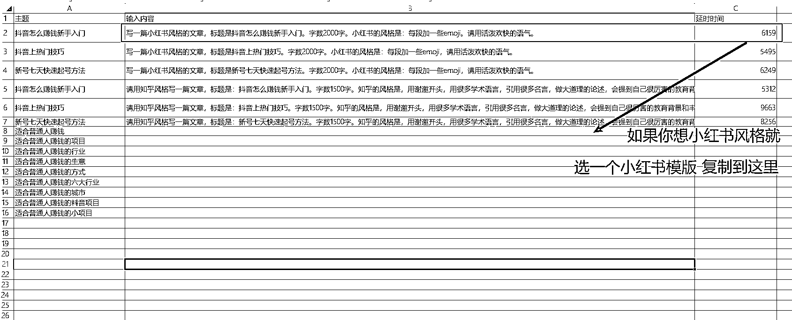
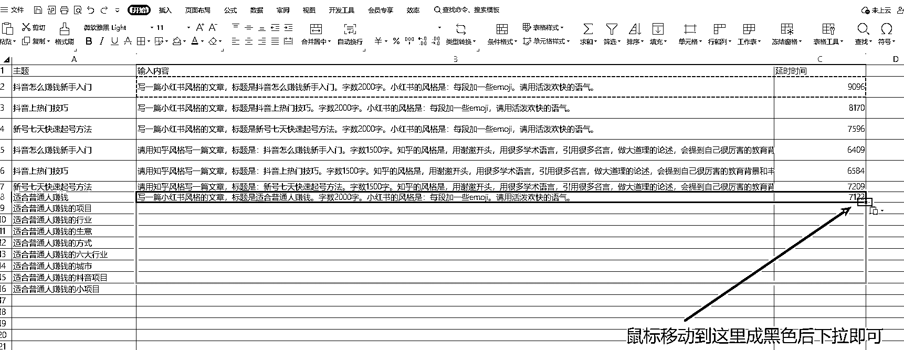
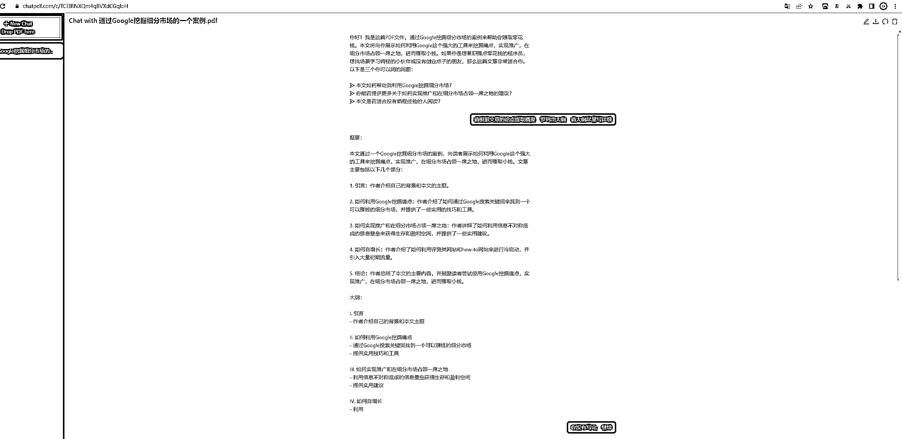
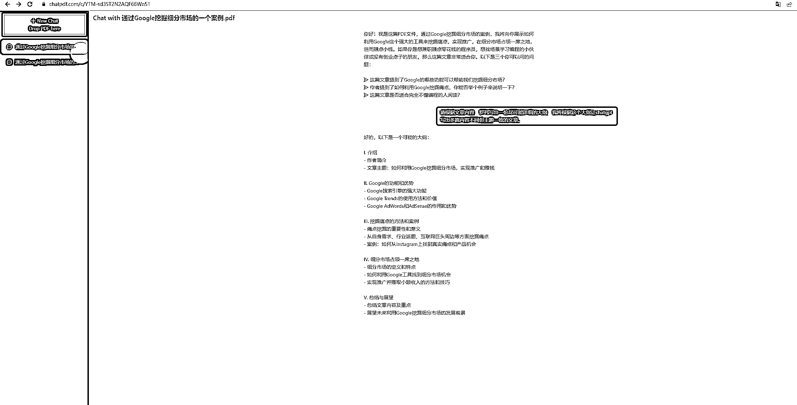
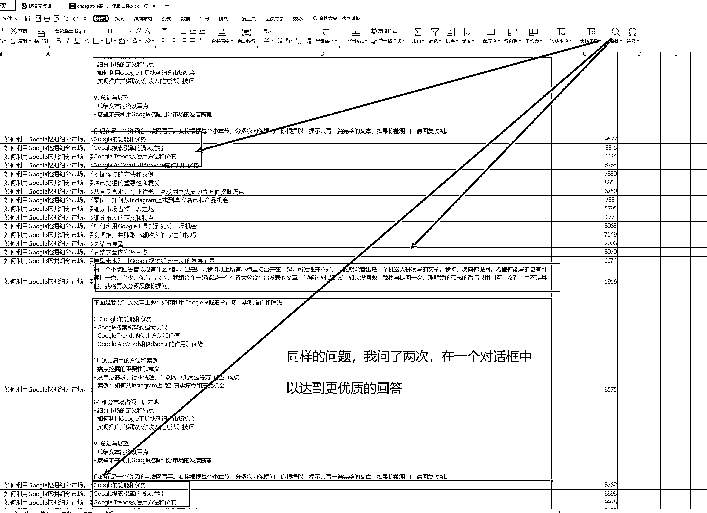
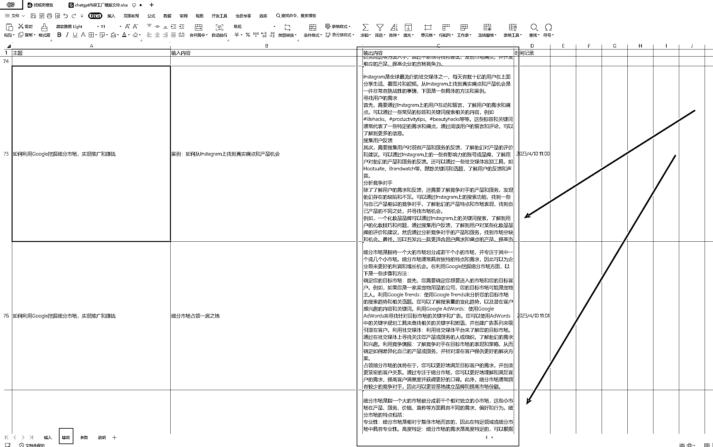

# 案例三：全自动，真批量——ChatGPT 超级写手机器人 1.0 @渣渣浩

1、开发背景

1）ChatGPT 常见的痛点

ChatGPT 是一款功能强大的人工智能模型，它使用深度学习技术训练而成，可以用于许多不同的应用场景，包括内容创作领域。

在内容创作方面，ChatGPT 可以用于以下几个方面的功能作用：

① 文章自动生成：ChatGPT 可以通过对一些已有的文章进行学习，学习其风格、主题、句式等特点，并生成类似的文章。② 内容推荐：ChatGPT 可以根据用户的兴趣、历史行为等信息，推荐相关的文章、视频、音频等内容。③ 翻译：ChatGPT 可以进行多语言的翻译，将一种语言的内容翻译成另一种语言。④ 内容摘要：ChatGPT 可以对一篇文章进行摘要，提取出其中的重点信息，并以简洁的方式呈现给用户。⑤ 内容分类：ChatGPT 可以对一些文章进行分类，将其归为不同的主题、领域或类型等，以便用户更方便地查找相关内容。

总之，ChatGPT 在内容创作领域的功能作用非常广泛，可以大大提高内容创作的效率和质量，帮助用户更好地获取所需的信息。

这个功能像个水文一样，但是结尾会用到里面的内容，绝对牛叉！！！

后面的 chatgpf 正是基于这个获得大纲摘要，从而实现真正意义上的全自动化，而不是半自动化创作。

用 ChatGPT 写作时常常遇到以下问题：

•写了一段，没写完就停了

•停了之后，你发继续写，上下文衔接不上来，甚至毫不相干

•提问和和回答都需要手动复制粘贴

•提问次数多了，整理提问回答很麻烦

•提问回答无法自动保存

•ChatGPT 的提问回答次数有限，不能太多，也不能太快，如果用多账号多浏览器解决问题，人工守着去处理停顿故障很费人力。

但如此好的人工智能模型，有一个巨大的痛点：很多很多使用它的操作，都非常依赖人的手动，只能辅助创作。

2）ChatGPT 是人工智能领域的基础设施

蒸汽时代的蒸汽机、电气时代的发电机、信息时代的计算机和互联网，人工智能（AI）时代的 ChatGPT，看似人工智能很新潮，但实际上，早在 1956 年就被第一次提出人工智能这一专业术语了。

很多家企业，很久以前就进行了很多年的人工智能研究开发工作，他们有强大的研发团队和财力物力，人工智能是真正意义上的，并不需要太多的手动操作。

ChatGPT 作为第一款面向普通用户的人工智能模型，却离不开大量重复且机械化的手动操作，对于大企业来说，根本不是问题，他们有自己的程序员，有自己的开发团队，自动化非常容易实现。

ChatGPT 是人工智能领域的一个基础设施，就像一块砖，一堆沙，一包水泥，只有将 ChatGPT 和其他的工具产品组合在一起才能成为一个真正上的人工智能自动化利器。

但是对于我们才接触 1，2 个月的普通人来说，并没有程序员团队，也没有开发预算，怎么让这个 ChatGPT 显得像个智能化的产品，而不是一个蹩脚的小可爱（傻 X）显得尤为重要，且急迫。

3）RPA+ChatGPT 实现创作的全自动真批量

市面上的有很多 ChatGPT 宣传文案，ChatGPT 批量制作 500 篇小红书文案，批量制作 1000 篇抖音文案，但是他们的方法，不谈别的，就让你手动复制 500 个问题，粘贴 500 个回答就够呛了。

他们绝不敢用全自动批量这个词。

2、手把手教你配置你的第一个 RPA 机器人

由于 ChatGPT 超级写手是基于 RPA 这个低代码工具开发的，所以，有必要先带大家花几分钟学会配置和使用 RPA 机器人。

1）uibot 软件安装

uibot 软件安装教程（生财有术）

2）使用你的第一个 RPA 机器人（批量联系微信好友）

使用你的第一个 RPA 机器人（批量联系微信好友）（生财有术）

3、ChatGPT 超级写手机器人 1.0 使用教程

1）源码

https://t.zsxq.com/0cC5e4Pkn

2）复制粘贴，完全不需要用户懂编程，懂代码

① 复制机器人压缩包到常用位置解压

② 用 uibot 打开机器人文件夹

③ 用 listary 打开 ChatGPT 内容工厂模版文件

④ 根据自己的需要写入

RPA 机器人的使用都超级简单，就是复制粘贴，完全不需要用户懂编程，懂代码。如果怎么用机器人压缩包不清楚，请仔细看上面的教程：使用你的第一个 RPA 机器人（批量联系微信好友）（生财有术）

ChatGPT 超级写手 1.0 版本的功能：

•文章自动生成

•自动续写，无需等待

•续写回答时，自动分段保存，方便拼接修改逻辑不对的上下文回答

•写作完成后自动保存提问和回答到 excel 表格

虽然比 3.0 版本差点，但是也足够强大。

chatgpt 超级写手机器人各版本介绍 生财有术

就不写这个机器人多牛逼了吧，因为写再多，旁人看了无非就一个目的。在 RPA 帮的定价体系上来看，50 个机器人 500 不到，这玩意，就 10 块。也没有太多需要强调的。

3）机器人运行视频

[4 月 7 日 RPA 帮内容工厂 chatgpt 超级写手 1.0.mp4](https://search01.shengcaiyoushu.com/upload/doc/CWXpde77HoNk0lxKRfScEkWAnwf/DB5KbawPXolWWvxDWsYc8fPxn9g)

4、ChatGPT 超级写手 1.0 实战案例

我们以”如何利用 Google 挖掘细分市场，实现推广和赚钱“这篇文章为例，让 ChatGPT 根据这个文章重写一遍。

第一步：利用 chatpdf 提炼出大纲

www.chatpdf.com

第二步：将大纲复制到 ChatGPT 超级写手模板表格

由于刚好卡在饭点，要干饭了，就没去再跑一遍看 ChatGPT 调优后的效果了，这个展示只是模板，大家使用根据实际需要来。

第三步：提问全部回答完后，整理每段的答案

注意了，有的朋友喜欢直接生成一篇完整的文章，而不是这样拼接，但是这样并不一定好，因为 ChatGPT 有时候会出现上下文不一致，对不上逻辑的情况，如果全合在一起，你改的话都不知道从何开始。

演示视频

[4 月 10 日 chatgpt 超级写手机器人实战案例-谷歌挖掘细分市场.mp4](https://search01.shengcaiyoushu.com/upload/doc/CWXpde77HoNk0lxKRfScEkWAnwf/ZiqIbA98po1g9uxCgUZcnriSnZg)

5、结束语

用了 ChatGPT 超级写手机器人之后，自己的 ChatGPT 终于不像一个小可爱（傻 X）了，也不再只是一个需要你调教的电子宠物。

本文分享的是 1.0 版，1.0 版本对于 99% 的创作者已经够用了，据开发者生财圈友阿愚呱呱透露， 还计划开发另外几个版本，后面几个版本对于大点的团队可能有帮助，小个体有没有用确定性不大。

内容来源：《全自动，真批量——ChatGPT 超级写手机器人 1.0》

