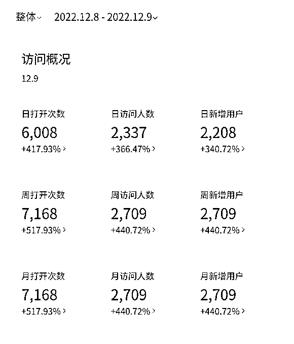
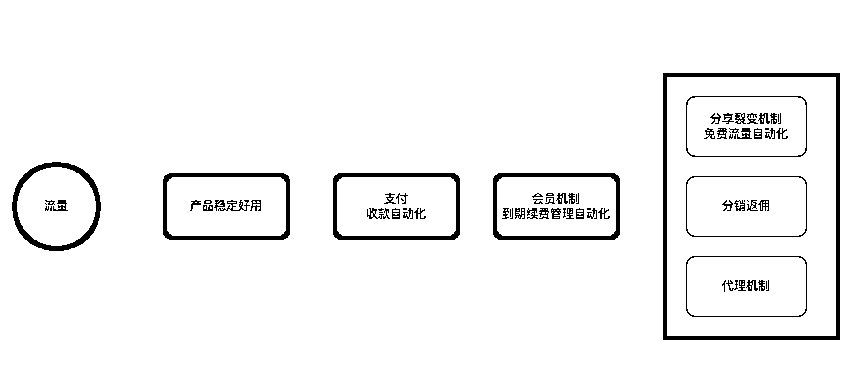

# 案例四：AI 程序的变现项目基础思考 @Hyman

大家好，我是 Hyman，之前 9 月份参加过咱们的英文工具站航海，很开心今天来和大家分享这段时间的一些工具实践。这次分享的工具虽然做的是国内产品，但是其中的方法论也适用于其他例如海外的工具场景中。

阶段一：看到机会点，行动第一

这次的工具，开始于 ChatGPT 的一个小程序。

去年 12 月 5 号左右，ChatGPT 开始大热，大概是在 12 月 8 号，聊天群里一个朋友突然抛出了一个开源库，说是可以体验，我当时直觉感觉，得动手干了。12 月 8 号晚上 6 点左右，小程序基本功能完成，提交上线，7 点左右，居然就给通过了，（这里发现小程序的提交规律，11：30-13:00，17:00 到 18:00 之间提交审核，通过速度贼快)，晚上就发了个朋友圈，做了个小宣传，另外在咱们生财星球里，也发了个小帖子，被亦仁大佬插了支标。

因为是热度刚起来，当时又没有特别顺手的工具，很多人想体验找不到途径，只能去买账号体验，科学上网又难住了一大波人。由于之前做过小程序，所以很自然的想起先做个小程序，不用科学上网，也不用买账号，就可以体验用 ChatGPT 进行问答。这里其实也是因为之前有小程序的积累，所以能很快的出来。

发到朋友圈里后，很多朋友就自行的会去转发，并发些示例来帮宣传，这是流量的初始来源。当天流量大概破了 1000 左右，到了第二天增长大概了到了 3000 用户左右。

阶段二：实践过程，思考变现

流量在初期，很大一波是借助了 ChatGPT 热点的趋势。为了做更好的流量推广，我吸收之前做房产小程序以及跨境营销的一些经验，主要做了以下几个点：

【搜索流量】

•优化小程序的标题、描述等关键词，带上一些热度相关例如 ChatGPT，人工智能，AI 的关键词。（但由于风险问题，这块后续没有持续）

•突出品牌词，注册公众号，增加品牌词被搜索的概率

【私域流量】

•朋友圈发放推广，带上小程序码，配上示例，引导大家分享

•在之前加入的一些群组，社群、知识星球进行曝光

【关键 KOL 流量】

•尝试联系一些报道 ChatGPT 的公众号大 V，在热度期，寻求合作

•找到一些比较有影响力的一些朋友，让他们帮助在朋友圈或者群组推广

•关键场景下的大 V 的推荐

【裂变流量】：未完善。这块由于基础设施没有准备好，没有做的很好，这点会在后面提到，属于没有准备好的环节。

【付费流量】：未投入。

这里与做海外的营销是一样的原理，当人们被某个事件调起了情绪以后，会有迫切想了解和参与的欲望，这时候你只要恰好提供了一个释放他们情绪的入口，那么将会有海量的人流进入。如果这种入口在市场中比较稀缺，刚好又有关键的传播 kol，那么流量引爆，将是大概率事件。当时的房产工具小程序就是这种打法，借助了深圳中介的群体，几个小时内，破 15w 的流量。

要做到好的传播效果，我大概总结了几个关键点：

1）市场上当前有足够的情绪和需求热度，且还未被满足

2）产品满足需求，且市场稀缺，最好是还不存在，这点比拼的是产品的速度。

3）有关键的传播节点和通道，能快速的将产品投放到人群面前。这里考验你之前的准备和积累了，私域、kol 渠道、投流渠道、裂变机制，如果都有所准备，那么组合起来将威力巨大。

做了一些引流的动作，流量有了明显的效果。但是每天看着流量往上涨，心里也觉得慌，觉得太浪费了。这里暴露了第一个没有准备好的地方：变现转化没有做好准备。

由于有做营销的经历，我开始去想，不能立马变现，能不能先把人囤着。

对于当时只有一个简单对话框的页面，我开始在页面关键的位置，放置一个群二维码，每天的流量直接进群，一是比较懒，想着群可以自动加入，二是也想跟进群的人聊聊大家的使用场景是什么。

这里提醒下，批量加人，最好不要用个人二维码，容易被微信限流。被大家提醒可以用企微，但是我没有企微，于是赶紧去注册，好在这个环节不是特别复杂，很快弄好了。

这个时间段内，接口因为是手动在维护，时不时的挂掉，每次挂掉，群里就会有一堆人“提醒”。这样跑了大概一周左右，突然有很多人跑过来找我“开会员”（因为没提问几次就要看广告），还有因为我没有会员机制而骂我的。后面我才了解，因为一部分人会用来专业场景，所以对他们来讲，有广告会很影响效率。但这是也让我发现了关键点，有人愿意付费了！

这个时候，我开始意识到，必须得加速，因为大家的群里的聊天会发现很多其他的竞品也在加速出来。这里是我第二次体会到“机会和准备”的事：要做会员，就得做支付，要做支付，就得有企业，还得有公账，这样反推下去，如果是一个完全从零开始的新手，等你注册企业，拿到公账，至少得 3 个月以后了。那时候，这个热点可能已经凉凉了。

好在这时候碰到了给力的教练子木，他给了我非常多很好的建议，开会员，没有企业支付，没问题，先手动记。于是做好了会员逻辑，开放的当天，我从早到晚，一直干的一件事就是收红包，发激活码，收红包，发激活码。第一次收钱收到手软...当然总数不太多，当天大概收了 2000 多，因为会员价格定的很低，19.9 一个。

这是第一次感受到钱来的如此迅猛，简直是被人追着给钱（虽然是小钱），让我感叹到有需求的工具的威力。

阶段三：自动化设施，放大变现

很快遇到了第二个瓶颈：由于基础设施不完善，产生了人手不足的困境。

大概过年前后，包括春节的的 7 天，我几乎是 18 小时没有离开房间。一方面，当时的程序的接口机制不完善，得手动维护，程序崩了就得赶紧修复。另一方面由于自动支付、会员管理机制没有完善，不得不采用人力手工加微信好友、收款，发激活码，开通并记录会员。

这一系列的操作，这时候一个人根本扛不住。子木给了另一个建议，招聘兼职，当时记得是 2 月 19 号，明天就是除夕了，我又得回家，于是当天晚上我就从群里招聘了一个兼职，约定每两周结算一次工资，设定好 sop 的操作流程，火速开通并分配了企微账号（便于整体人员管理），就开始去准备企业支付了。

过年前 3 天到过年的这几天，我大概完成了这样几件事：

1）申请到了企业微信认证

2）紧急申请了企微支付

3）搭建了手动会员全流程

4）构建 SOP，引入兼职人员

5）跟用户聊使用场景，补充新功能

关于第 5 点，补充新功能，这是我个人最喜欢的环节。我会每天选取进群的一些人去调研，会询问他们用这个工具的主要场景是什么？然后多人反馈的一些共有痛点，就会安排在下个版本中进行更新。

例如有些人提到是在做一些答题内容，对应的答题场景有要求，需要丰富的内容，于是我增加了让内容丰富的拓展模式；有些人反馈用来写作，需要开放文字录入限制；有些人提到需要历史记录等。一些能做的功能，我会陆续添加版本里，并观察更新后群里的多人反馈。

也有一些自己觉得不错的功能，例如：问答极速模式（速度快，回答少），但证明比较鸡肋，后面又给移除了。这种基于真实场景的产品改进，就比较有趣。

群有一个好处，能及时观察反馈，但群的维护也是一个大的问题，负面的声音同样会耗费大量的精力，是一把双刃剑。

这个过程中最痛苦的几件事：

1）企微没有提前准备，个人微信加人限制多，经常被屏蔽

2）技术没有准备到位，耗费大量精力维护接口

3）自动收款没有自动化，不能通过微信支付自动开通会员，损耗了不少转化。由于人不能一直在线，很多时候用户的时间可能在半夜、或者你刚好忙碌的时候找到你，由于前面的都没有打通，一些转化就会流失掉。

后面这些都慢慢补上了，这些自动化的基础设施补全，释放了人力，也让过程变动更加高效。

整个这个过程基本是被拖着往前走和完善的。这时候就很感慨，如果这些设施，在这次之前就有所积累和准备，那一定不是目前的效果。

感受危机

慢慢让我更深刻感受到“机会是留给有准备的人”的事是，来自竞品的全方位竞争。这时候 ChatGPT 的热度已经很高了，市面上出现了大量的同类竞品。而他们出现的同时，就带着更完善的市场竞争武器参与了进来，例如：

1）分销合伙人机制

2）分享激励机制

3）网页、小程序、app、公众号，全体系支持问答机制

这些裂变工具出来，瞬间吸收了大量的用户，而这恰恰也是做软件工具推广最需要的环节。我们反思了一下，一套合理的工具+流量自增长模型，应该如下图

按照这套去做的，只要产品本身符合需求，又在热点上，基本上都有很不错的收入。但是因为没有准备好，这些“基础设施”缺少积淀，纵使有很好的产品，也难以有威力的去放大，只能看着别人吃肉，自己喝点汤或者是错过。

复盘

对于做工具，我个人有着强烈的兴趣，这次的工具实践让我学习到了不少内容，也加深了很多认知，当然更重要的是认识了不少很给力和合作的朋友，像子木，凡灵等。下面是我小结的一些点：

1）做工具，要么做能帮别人挣钱的工具，要么做能给别人带来情绪价值的工具，这两个方向最挣钱。

2）机会是留给有准备的人，你在机会到来之前，应该要积淀到一套足够去承接这个机会的基础设施，否则只能看着机会像水一样流过，接不住。

3）流量、产品、交付，这三个环节是任何变现项目的基础，需要针对每个环节去思考，你准备了什么基础设施。

4）面对竞争，持续的迭代速度是致胜的关键。但这要求你有足够多的时间和精力投入，才能打磨的更好，一个松散投入的团队，是干不过竞品的，持续去模仿，持续去改进。

5）分享裂变、分销裂变是工具流量核心，当然另一个更 nb 的打法，是投流，流量端的武器，要准备完善。

6）任何一个热点是可遇不可求的，如果逮住，就尽量全力去投入。

最后，关于如何寻找热点和机会点，之前看过刘小排老师分享的很多内容，关于流量、产品、交付模型，关于如何积累创意点，这些给了我很好的启发。我有一个在手机做笔记的习惯，平时自己遇到的一些问题，看到社媒平台上热点报道、群里大家讨论、一些新技术，都会比较留心，将它们记录下来，然后尝试去往【流量、产品、交付】这几个层面去靠，定期也会回头去整理下，看有没有可能形成一次实践。

所有的热点，都是一次大众情绪的引爆，在人们寻求释放情绪的出口时，做一个刚好满足需求的合适产品，当你具备足够的人群投放能力，又准备好了产品交付时，这将会是一次最佳的实践。不过所有不完美的实践，也都在为下一次更好的尝试做好积淀。

内容来源：[《3 月 10 日《流量、产品、交付：我对于 AI 程序的变现项目基础思考》@Hyman》](https://shengcaiyoushu01.feishu.cn/docx/XB8UdhGD6oN6A6xKQTHcwKHenFc)

