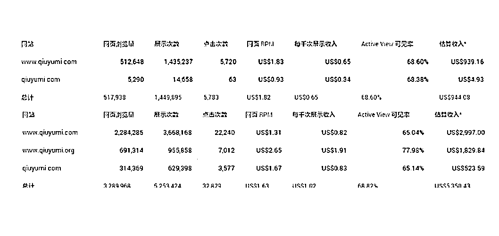

# 案例一：网页版扫域名工具：秋玉米 @哥飞

2009 年我从网上下载了一个桌面版的扫域名软件，用了几年，发现很好用。它能按要求生成各种组合的域名列表去逐个查询注册情况，并把未注册的标注出来。并且可以自定义词库，但是它本身没有自带词库，几年时间，我自己做了好几个词库，如拼音、区号、邮编、人名、水果名、动植物名等等。 2012 年 2 月底，我想其他玩域名的人也会有同样的需求，为什么不做一个网页版的扫域名工具出来呢，并且把我的词库都内置进去，就节省了大家自己搜集整理词库的时间，而且网页版随时随地想搜就搜。开发了两周左右，做了第一版出来，到 3 月 7 日 [qiuyumi.com](http://qiuyumi.com/) 就上线了，这个域名也是用那个桌面版软件扫出来的。

后面因为各种原因，到现在五年了，都没去花时间把第二版给做出来。我设想中的第二版需要有账户系统，用户可以自建词库，并且提交搜索需求之后就不用管了，有结果了直接通知给用户。还有定时任务，比如每天扫描一下某个组合，发现未注册域名也通知。另外围绕域名的各种需求，做更多更好用的工具补充到秋玉米上。 秋玉米从上线到 19 年，总 PV 应该在 380 万左右，平均每天两千多 PV。因为后面一直没增加新功能，也没有去推广，所以流量一直比较稳定。这就是一个小众人群使用的工具而已，流量做不大，赚点零花钱可以。而累计广告费却有六千二百多美元，相当于四万多一点人民币。相比于花费的精力，这个投入产出比倒是还可以。

内容来源：《生财有术 #轻享栏目：做 Adsense 网站赚到 3 万美金的实操经验》

