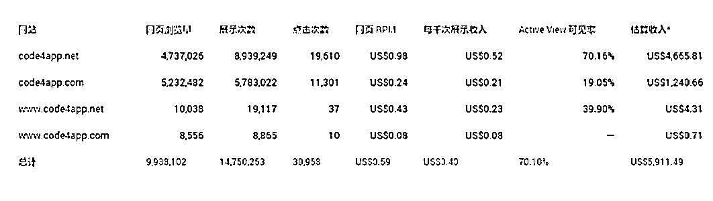

# 案例二：面向程序员的代码聚合网站 @哥飞

还是 2012 年，那是秋玉米上线一个月后的 4 月 6 日，[Code4App.com](http://code4app.com/) 上线了。Code4App 是一个给 iOS 开发人员用的代码下载网站，最初上线是因为我搭档自己就是一个 iOS 开发者，他以前是在 Oracle 做 JAVA 相关工作，对于 iOS 也是边学边开发。 学习期间他积攒了一百多份源代码，有实现某些功能的，有实现某些界面特效的。他发现想要实现某个功能的代码，只能通过搜索引擎，或者去各个论坛搜索下载，但是下载之前根本不知道代码是否有用，适合哪个系统，对于代码的使用方法也需要花时间摸索。 他就想，如果把每一份代码都测试一遍之后，用自己的语言去描述代码的作用，写出代码的使用方法，并且给出代码运行效果截图，对于其他开发者一定有用，因为能够节省开发者时间。 然后我们几个分工，他负责整理代码，测试、截图、写描述。我开发网站，当时的实习设计师妹子设计了第一版界面。很快，我们花了两周多时间就把网站做出来了，并且把这一百多份代码都放到网站上面去了，Code4App 有了初始内容。 然后在 V2EX 发帖宣传了一下，大家都很喜欢，站长 Livid 还帮我们在 Twitter 上面发推做推荐了。 后来 7 月份，我们做了一个英文版，就是 [Code4App.net](http://code4app.net/) 。没有任何宣传，只是在中文版底部放了英文版的链接，过段时间就慢慢被 Google 收录了。慢慢有 iOS 开发者通过搜索引擎来到网站，觉得网站好用之后，成为了网站的常客，并且在 StackOverflow 里边回答问题时，把我们英文版链接贴上去。外链越来越多的，这使得英文版在搜索引擎的权重越来越高，流量也不断变大。 对于中文版 Code4App ，为了体验，我们很克制，只是放了一段时间的广告用来测试广告点击情况，后来发现广告费不多之后，就撤掉了广告代码。后来遇到有人想要购买 Code4App ，而且开的价格我们也还接受，就把这个站给卖掉了。当时我们没有去分析英文版的广告数据，所以傻傻的把 .net 英文站也一并送给买家了。 中文版放广告期间的累计 PV 大概在 530 万左右，广告费才 1250 美元。而英文站从上线到卖掉，总流量大概才 480 万 PV 左右，但是广告费却有 4670 美元。

内容来源：《生财有术 #轻享栏目：做 Adsense 网站赚到 3 万美金的实操经验》

