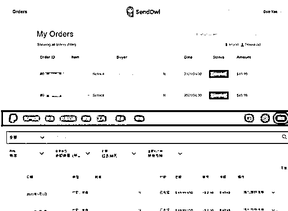
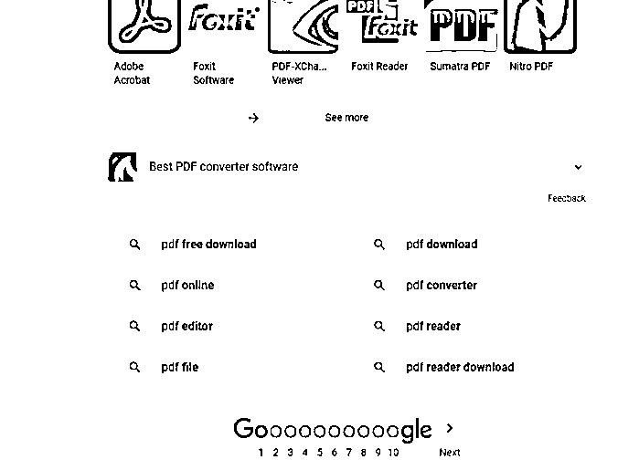

# 案例六：围绕 PDF 制作相关小工具 @颜过

选哪个细分市场或需求，其实跟跨境选品一样，往往新人觉得是玄学，其实你真动手做了第 1 个小产品，然后慢慢就会有感觉，但是你整天想这想那，那很大概率，就没有然后的然后了。

其实这次小工具选品，也还是走了一些固有的思维的弯路，例如最早有两条大路，电商类小工具，或 wp+woo 小工具，但其实等于没有，因为没有办法立马就干，还有开发人员的选择（在这里浪费了很多时间......后面再讲）。

最后，是一美国的做物流的朋友，她有个小需求，即 pdf 相关的需求，最后付费这里也是（半买半送，后面相关的 pdf 需求 PDFXYZ（暂时隐去插件名字，后面有公开，因为上架有一段时间），都会免费送给她一整套小插件使用）。付了两笔 49.99 美金（钱不多，但至少有个正向反馈，这个最重要）。

最终选 PDFXYZ 这个细分需求，还有几个原因，你可以细品一下，尤其是想做一个新市场，找个细分点，快速试一下，小成本跑通整个流程，即完成大于完美。当然还有 deadline 的作用（这个对于小众产品或市场，太重要了，开发进度一拖，各种成本就上来了）。

另外这个 PDF 需求，在 github 找到相关的实现源码（虽然是其它语言的，但对于 chrome 插件也是可以复用的），即可以借前人的轮子来用，加快整个进度。

PDF 各种需求，在国外市场是巨大的，直接 Google 一下，居然有 250 多亿的搜索结果。因为软件是边际效应的，你开发出来，其实后面的维护成本很低的。另外这个需求，也是为了先试 chrome 插件市场，还有积累原始的 pdf 需求的第 1 批种子用户。因为周边需求的拓展太多了。每个子功能，都是可以做成一个小工具的，即形成了小工具矩阵（是不是有点跨境的多账号味道了）。

内容来源：《Chrome 插件从 0 到 1 的试错经验》

