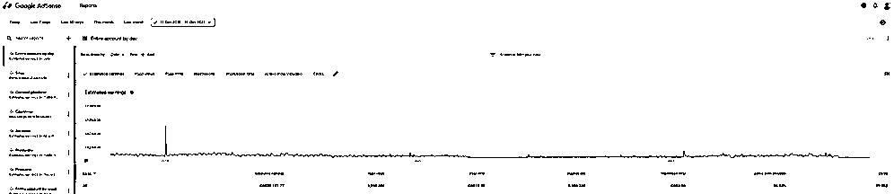
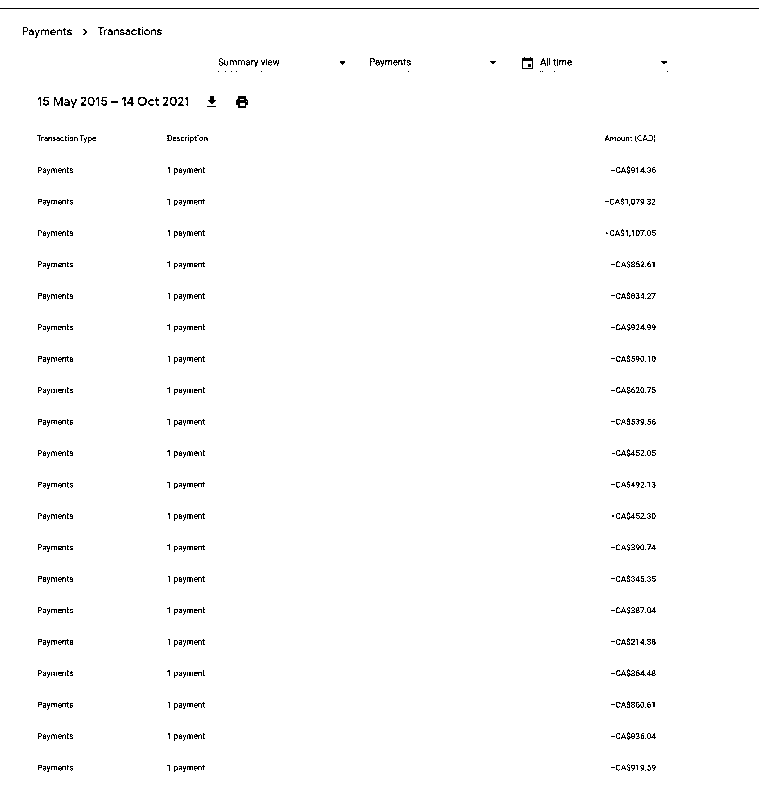

# 案例八：各大酒店协议代码集合网站 @静水流深

简单介绍下 Adsense，就是谷歌版的百度联盟，但是比百度联盟好 N 倍。主流玩法是流量主（以前可以用站长来表示，现在因为还有 UP 主，甚至 APP 里也可以内置谷歌的广告，所以统称流量主）卖流量给谷歌即可。

谷歌的广告简单到不需要你布置，一段自动广告代码会自动布置到你的媒体最佳位置，广告内容也会根据你的用户画像来生成。当然也有流量套利等玩法，这里不深入阐述，最简单的理解就是谷歌版的百度联盟。

这里我放几个 Adsense 的图：

收入不多，每个月平均 $1000 美元左右，可能很多人问，这也太没意思了吧，才 5000 人民币一个月。但是我告诉您这只花了总计两个小时做出来的一个小项目，而且没有去管理，就这样了，不知道您还有没有兴趣？

这个项目每年的成本除了一个域名的费用 $9 美元，服务器费用每个月 $5 美元，就没有其他成本了。

然后，我只需要用我的信用卡支付上述费用，我的银行付费接受来自谷歌 Adsense 的每个月的付款，设置信用卡自动还款，这就是一台自动赚钱机器，当然上面仅仅列举了 Adsense 的收入，还有一些其他广告联盟的收入，加起来就平均每个月 $1000 美元，持续了几年了，未来也一样。

网站地址：[`hotelcorporatecodes.com`](https://hotelcorporatecodes.com/)

中文版：[`xieyidaima.com`](https://xieyidaima.com/)

为什么有流量？原因在于「hotel corporate codes」这个词在谷歌第一页的前三位，而且搜索的人不少。

内容来源：《3 个单人就能做的赚钱案例，告诉你怎么通过互联网在海外淘金？》

