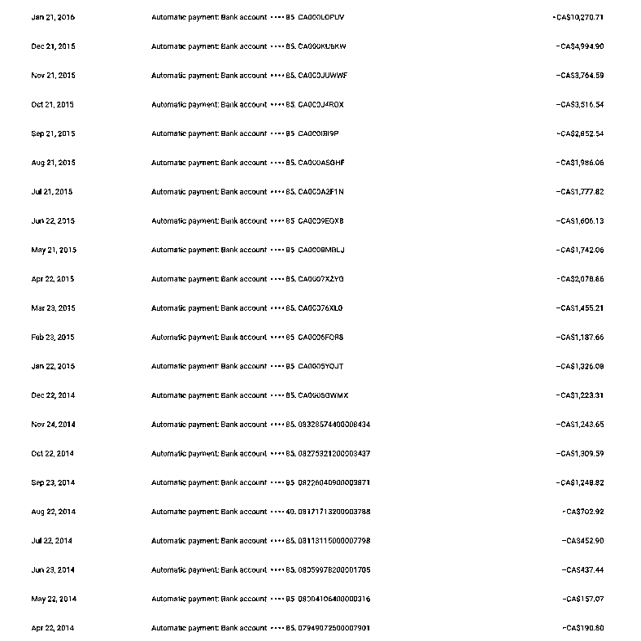
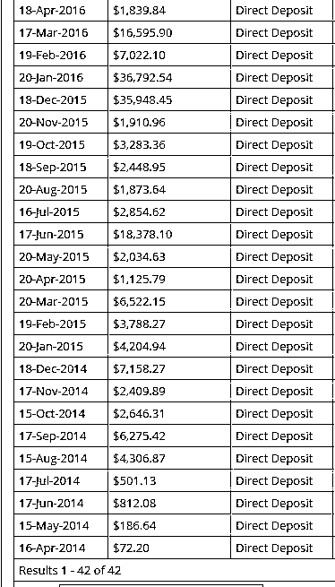

# 案例九：旅游网站 @静水流深

这个案例中，我主要是分享以前做 [3798.com](http://3798.com/) 旅游网站的收入情况。

现在互联网的流量，都是各种巨头掌握，之前我就在广告中国说过，很多人看着做 Facebook 投放或者谷歌投放赚钱，但是没有人说过做投放的亏损超过 90% 吧？能够花得出去钱是第一步，但是优化还有杂七杂八的一些东西，你如果连一个网站都不会，你觉得哪怕机会同时给了所有人，赚钱的一定不会是你。

做网站往往是最便宜的起步，你可以平时上班，回家之后花个把小时维护下，然后就可以肉眼可见的速度慢慢发现谷歌 Adsense 以及一些广告联盟给的收入超过了你打工的收入，关键还是持续性的、被动的。

这个圈子里很难找到有人真正做过产品，以及日 PV 过几十万的大站，这个图就是当时做 [3798.com](http://3798.com/)，从零收入到光靠 Adsense 就可以过万美元收入的历史图：

为什么从 4 月才开始有收入？因为到 4 月才够有收入，网站是 2 月开始做的，这些数据都可以从网站历史工具里查得到的。而获得这个收入其实非常简单：[`loyaltylobby.com/`](https://loyaltylobby.com/)

这是一个老外的网站，老外很勤奋，天天发布文章，而且量也少，每天一篇，于是我只需要每天用中文翻译他的文章，然后图片保存下来放在自己的网站上即可，要么就自己切个图。这样通常我每天半小时就做完了工作，唯一一点是全年 365 天基本上没有一天不工作。

如果某天这个博主偷懒，没有更新，那么我就跑到另外一个地方：[`boardingarea.com/`](https://boardingarea.com/)

或者这里：[`www.flyertalk.com/`](https://www.flyertalk.com/)

反正每天工作一小时以上都觉得累，后来网站人多了，就用 Discuz 把论坛搭建起来了，以 UGC（User Generated Content）的方式运营。高峰时候抢走了飞客论坛 67% 左右的流量，日发帖区间在 4000-10000 之间。

整个项目成本其实很低：

服务器用 2H4G 的阿里云服务器，后期 OSS 加上 CDN，然后数据库分离为云数据库，当时用阿里云比较早，很多价格比现在便宜得多，但是哪怕放到现在，每个月费用不会超过 2000 元人民币（对标高峰时期的收入，流量越大服务器成本越贵，但是越可以忽略不计）。

同时收入还有来自 CJ 等广告联盟的收入：

原帖地址：[`ads.org.cn/thread-34407-1-1.html`](https://ads.org.cn/thread-34407-1-1.html)

大家有兴趣可以看看以前的老教程，我个人觉得很多东西并未过时：[`ads.org.cn/forum-101-1.html`](https://ads.org.cn/forum-101-1.html)

内容来源：《3 个单人就能做的赚钱案例，告诉你怎么通过互联网在海外淘金？》

