# 案例十三：卖 Notion 模板赚了 5w 美金 @infinity

1）什么是 Notion？什么是 Notion 模板？

其实很难用哪一类软件来简单地涵盖 Notion 所能做的事情，因为 Notion 是一款包含了，笔记、数据库、工作看板、日历、以及甚至多人协作的软件。

与其把它归类为某一种软件，不如说它是一个信息库，然后你可以通过它提供的各种功能来记录、管理、收集、追踪、呈现这些信息。

Notion 模板呢，简单来说是一个信息的体系，可以简单到纯文字的日记本，复杂到能管理整个产品项目生命周期的协作工具。

来看看 Notion 都能做成什么样：

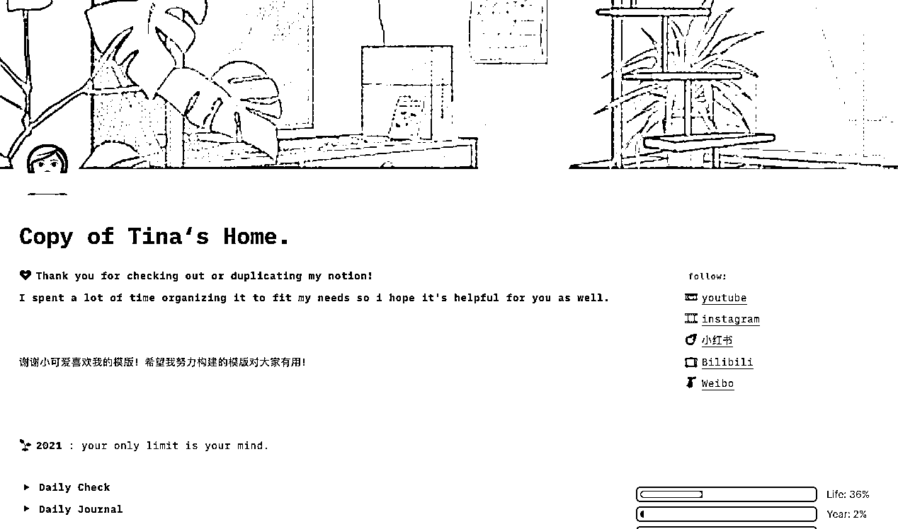

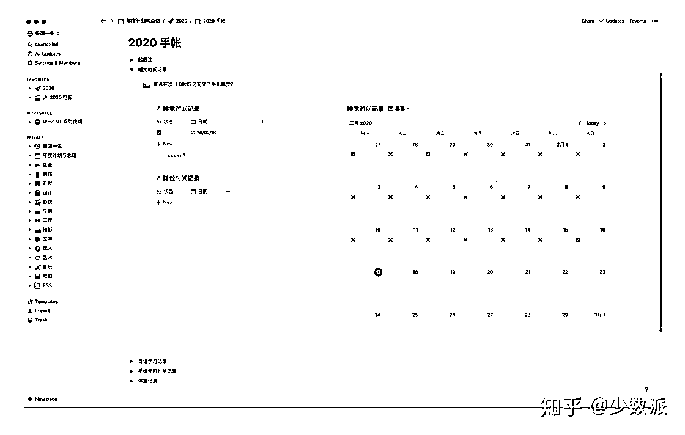

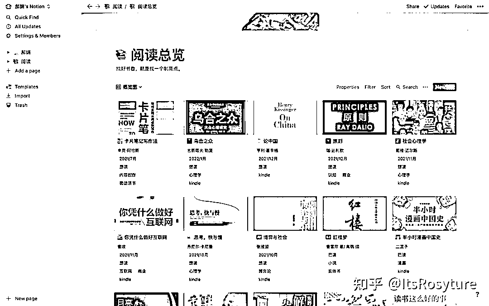

这只是几个比较基础的模板，由于本文不是以介绍 Notion 为主，更强大的功能大家可以自行搜索，b 站和 知乎 都有不少 Notion 的狂热爱好者。

2）一个卖了 5 万多美元的 Notion 模板

先放几张截图看看这个叫 Newsletter OS 的 Notion 模板长什么样：

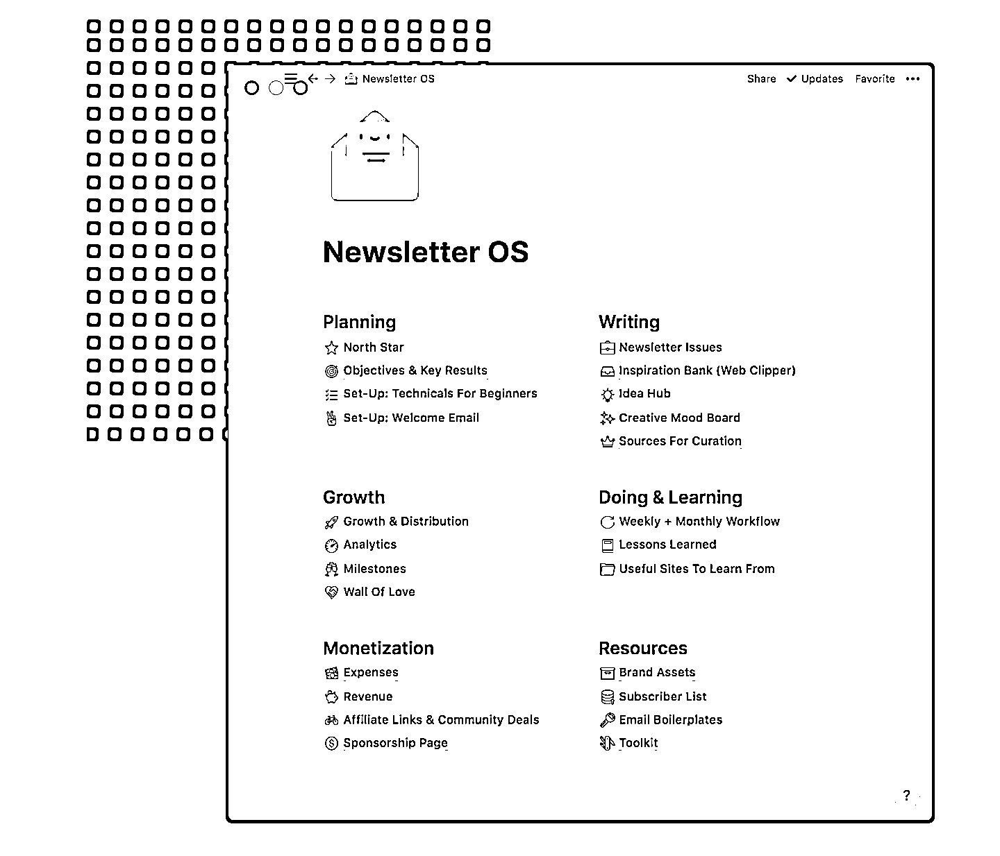

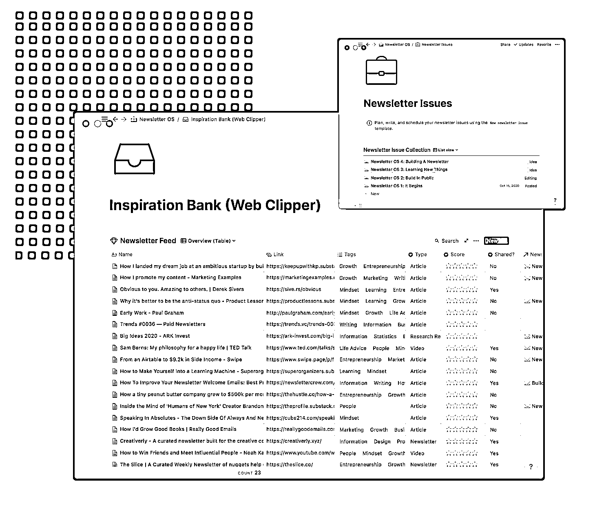

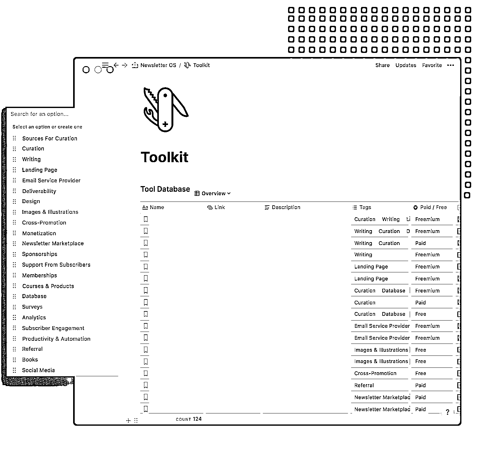

3）使用了哪些工具/平台？花了多少钱？

•Notion - 主要内容的承载软件 - 免费

•Figma - 设计工具 - 免费

•Flaticon - 图标网站 - 免费

•Gumroad - 电商平台 - 手续费（只有你赚了钱它才收费）

•域名 - $8 / 年

4）上线两天就超一千多美元的营收，她做对了什么

① 产品定位好

有没有留意到这个 Notion 模板产品的名字叫什么？Newsletter OS!

OS 就是 Operating System 操作系统的意思。给人的第一感觉就是，“买来就能很快上手成为 Newsletter 作者”。

前文说了，如果是模板，会显得很廉价；谁也不会为模板买单，即使会，单价也不高。厉害的是，这位创作者把自己的经验、工作流、以及最佳实践整合在了一个模板里，并刻意把产品叫“操作系统”，这样客户买的的就不是冰冷冷的模板，而是某个领域的“最佳实践”了。

另外 Newsletter （简报）创作也是国外很流行的打造个人 IP 的方式，并且非常主流；类似于博客，只是简报更突出订阅功能，这样简报的作者可以向订阅者推送新的内容。

在国内，叫微信公众号。哈哈哈

② 新冠带来的机遇

2020 年正是新冠席卷全球的一年，很多失业在家的人都有在网上创业的想法 - 开网店、做 Instagram / Tiktok 网红、等等。简报创作也是其中一个大类。

这算是碰上了风口，有准备做简报的人看到这样的产品都会愿意购买。另外定价并不算特别高，算是合理的价位。

（这个不算是她做对了的事，算她碰上的， 哈哈）

在坚持输出 6 个月内容后，她突然意识到或许其他简报作者能从她的简报运营经验中获益不少。然后她就将她自己用的 Notion 模板丰富了一些内容以及常用的资源，包装成了一个可售卖的产品。接下来就是在 Twitter 上做推广啦。对比起以前，现在这条推的传播效果是不是好了很多？

这一次她自己也没预想到会获得那么多的关注：

后面发生的事我们都知道了，上线两天就超千元美刀收入，这也算是完成了这个产品从 0 到 1 的阶段。

③ 产品实力强

如果说疫情是火箭的助推器，那产品就是火箭的主体。见过很多火箭发射，起飞是挺成功的，但飞到一半就炸了，前面的助推器再好，也是徒劳。

在 Gumroad 这个电商平台上，Newsletter OS 只有一个四星评分，其他都是满五分。

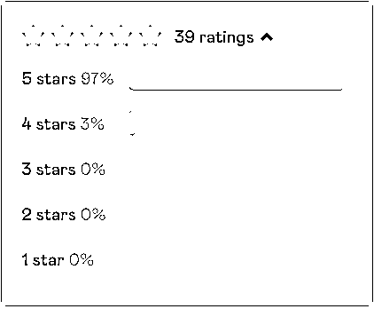

现在我相信在 Newsletter 的这个圈子里，但凡有新人进入，如果在网上问到了怎么开始 Newsletter 的写作，都一定会有人出来推荐 Janel 的这套系统。

④ 说服力极强的销售页面

我把 Janel 在商品页面上这个框架勾画了下来，基本回答了所有购买者可能会有的疑问。链接 -> [`janel.gumroad.com/l/newsletteros`](https://janel.gumroad.com/l/newsletteros)

•Copies Sold: 1200+ - 已经卖了 1200 多份了 •由于平台不会公布卖了多少份内容，所以她上来先直接给你一个有力的销售数据

•Why did I create this? - 是什么驱使我去做这个“操作系统”？ •因为正好自己有 Newsletter 的运营经历，这个就很顺理成章了，也很好增加了购买者的信任度 •“I've spent 150+ hours working on it, so you don't have to spend time building it yourself.” 这句是点睛之笔，言下之意就是“我花了 150 多个小时做的这套系统，你花钱买了就省了 150 多个小时。”

•You'll benefit from this if: - 如果你是以下几类人，你会从这个“操作系统”中有所收获 •筛选人群，就直接告诉用户，哪类购买者会有收获；而不是想把产品卖给所有人

•What's inside: - 这个“操作系统”里都有什么 •内容都包含了什么，突出数字以及盈利，比如 130 种创作工具、20 种变现方式

•What are people saying? - 看看大家都是怎么评价的 •列出了优质的购买者评价，并附上他们的个人链接；用户可以自己看这些购买者的可信度/影响力

•FAQs - 常见问题 •这里就是其他小问题了，比如退款政策这种

⑤ 乘胜追击 + 持续经营

前面提到了“产品实力强”，各路大神都觉得这个产品好，愿意为她背书做推广。有人还把这个产品发到了知名的新产品发布网站 ProductHunt 上面，当天获得 400 多赞，目前总共获得 800 多个赞。在 ProductHunt 上能获得那么多赞是非常出色的成绩了，很多产品发上去完全无人问津。

获得那么好的成绩当然不能停下来准备躺赚，更是要快马加鞭抓住热度，让更多的人知道这个 Notion 模板，带来更多的收入。

Janel 也受邀做客了很多采访以及播客，通过这些媒体/播客本身的受众又更进一步地扩大了这个产品的知名度。而这一切都是免费的。

5）Newsletter OS 的从 0 到 1

作者最早也是线上小透明；我翻了翻她的 Twitter 记录，2020 年前的推都是流水帐，清一色 0 赞 0 评论 0 转发。2020 年 4 月是她第一次开始推广她的免费的简报产品（不是本文讨论的 Notion 模板），结果也是很惨淡，1 赞，1 评论（还是自己写的）。

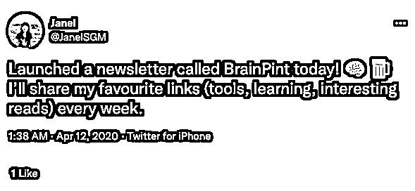

但是，起码她开始了。

接下来的 6 个月，她都定期地输出简报内容，并在 Twitter 上以及一些在线社区，像 IndieHackers 这样的平台发问推文。在这 6 个月，她的简报也慢慢地涨到了 500 多位订阅者。虽然没有赚到很多钱（仅有一些赞助商）但是，这也为她带来了一些关注者以及简报的订阅者。

在 Twitter 这种社交平台，她除了用来推送自己的简报内容，也会分享她简报的数据：

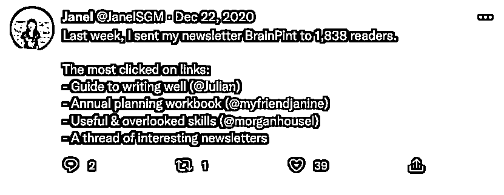

时不时也会分享一些干货：

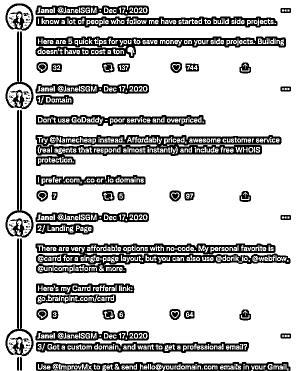

明显看到，她的推已经越来越受欢迎，虽然没有当时的粉丝数据；单从点赞数已经互动率来看，但就算是她个人 IP 的从 0 到 0.5 了吧。这都是在为后续产品的爆发作铺垫。

在创作简报内容时，她为更好地持续输出内容，用 Notion 给自己打造了一个工作流/工作系统，从选题、调研、撰写到推广等。

在坚持输出 6 个月内容后，她突然意识到或许其他简报作者能从她的简报运营经验中获益不少。然后她就将她自己用的 Notion 模板丰富了一些内容以及常用的资源，包装成了一个可售卖的产品。接下来就是在 Twitter 上做推广啦。对比起以前，现在这条推的传播效果是不是好了很多？

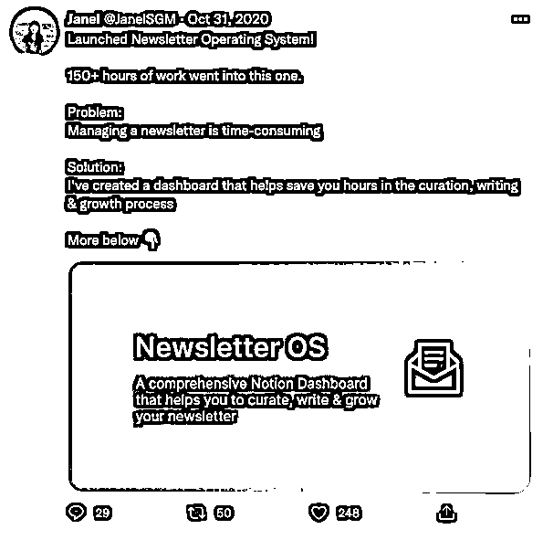

这一次她自己也没预想到会获得那么多的关注：

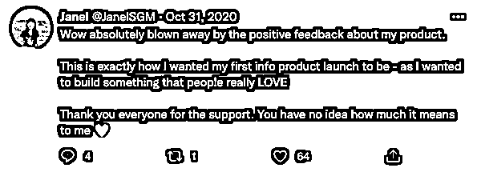

后面发生的事我们都知道了，上线两天就超千元美刀收入，这也算是完成了这个产品从 0 到 1 的阶段。

内容来源：《卖 Notion 模板也能赚个 5 万多美元》

