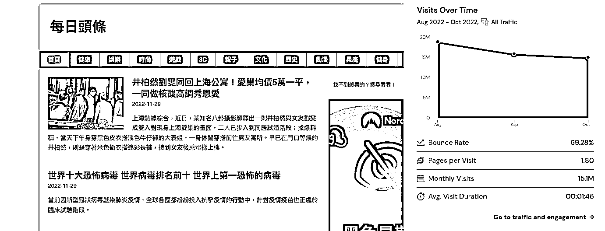

# 案例十五：无限流量的内容农场 @阿杰

小排老师曾经分享过《0 资源，做出 3 个日 UV 过十万、7-8 个日 UV 过万的网站，分享我获得无限网站流量的秘籍》这篇文章 https://t.zsxq.com/BeiemMB ，内容是探讨他如何创造无限流量。我建议还没看过这篇文章的圈友可以找间拜读一下，非常有启发。

我认为一个网站的流量上限，其实就是他可以获取多少关键字，而这些关键字又分别有多少流量。「总流量＝关键字数量Ｘ个别关键字潜在流量」。所以要做一个有无限流量的网站，挑战就在于可以瞄准多少关键字、以及如何产出关键字需要的内容。

以下跟大家介绍两个无限流量的网站（注：大家可以参考「概念」，不一定非得要爬别人的资料。毕竟你在爬别人内容时，对方很有可能不允许。）

网站一名称：kknews、网址：[`kknews.cc/`](https://kknews.cc/) 成绩：月流量破千万 PV 的内容农场

这边简单分析一下 kknews 成功的关键

1、做爬虫爬取微信公众号文章（微信有挡爬虫，所以一般来说搜不到微信的文章）

2、将文章内容简转繁后发布在网上（对搜寻引擎来说是最原创的内容）

3、文章与文章间有良好的关联（内部连结），且许多文章有质量不错（丰富的图文）

4、大量主题，涵盖了各种关键字

网站二名称：批踢踢（ptt）相关网站、网址：[`www.ptt.cc/bbs/index.html`](https://www.ptt.cc/bbs/index.html) 成绩：总系列流量破千万

ptt 这个网站是由台湾大学的学校管理，从数十年前发迹，现在依旧是台湾最大的线上论坛之一（类似美国的 Reddit）。在上面会有大量的网民在各个不同的分类版面上发文，像是篮球、韩纵、美妆等等。里面可以说汇集了个主题中的各式问与答。

而关于做 SEO 或著是所有的网站，基本上都是为了「问答」所存在。所以 PTT 的内容是非常精华的存在。所以就有了

1、把 Ptt 根据各个分类分别爬出来（让内容聚焦在特定主题，对 SEO 有利）

2、爬取文章，但重新优化原先 PTT 的标题、描述等等

3、强化文章间的关联性（内部连结）

最后市面上出现了许多不同 PTT 的复制站（由不同人持有），许多复制站的流量都是破百万 PV。

内容来源：12 月 2 日《在生财有术开启月入过万的工具站之旅》@阿杰

