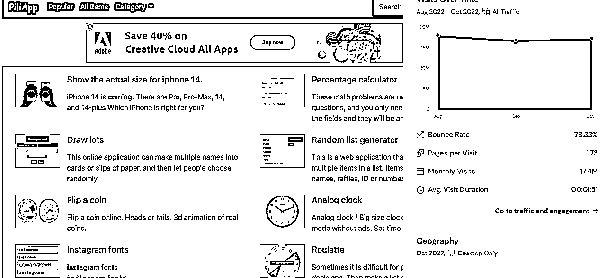

# 案例十六：多语系工具站 @阿杰

网站名称：工具邦、网址：[`www.piliapp.com/`](https://www.piliapp.com/) 、成绩：月流量破千万 PV 的多语系工具站

我个人认为做工具网站有以下几个优势：

1、关键字竞争强度，比单纯用文字可满足的内容低（会写程序又会 SEO 的人比较少

2、有机会可以透过多语系拓展流量（很多工具全世界通用

3、「比较」不容易受到 Google zero-click 策略的影响（Google 会把搜寻的答案直接抓出来，导致使用者不点进页面.....)

4、工具网站有机会比内容站有更高的广告单价（因为画面更多点击操作，广告摆放位置也会有影响）

说到工具站，我最喜欢的例子是 [piliapp.com](http://piliapp.com/)（工具邦）的这个网站。这个网站每个月的 PV 数也是好几千万，而且工具站往往有机会比一般内容站创造更高的收入。（页面上有很多点击跟操作动作，使用者更有机会点击到广告）。

虽然工具邦这个网站的流量令人称羡，但最重要的重点是，这样的结果不是一蹴可几的。我其实几年前就开始陆续观察工具邦，那时候他的流量其实就已经非常高了，但我最近发现，他竟然还持续在改版他自己的网站（像是外观跟架构）。

很多时候这种工具站就是放著不管它了，因为我猜这网站的开发者一个月收入绝对是破十万美金（因为有许多欧美的流量，单价较高），但他还是不停的在开发，甚至一些比较小、冷僻的字他也持续在做，像是台湾捷运工具、数字大小写转换。

内容来源：12 月 2 日《在生财有术开启月入过万的工具站之旅》@阿杰

