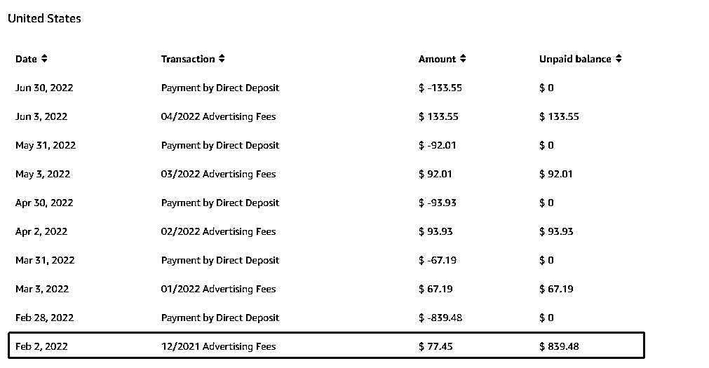
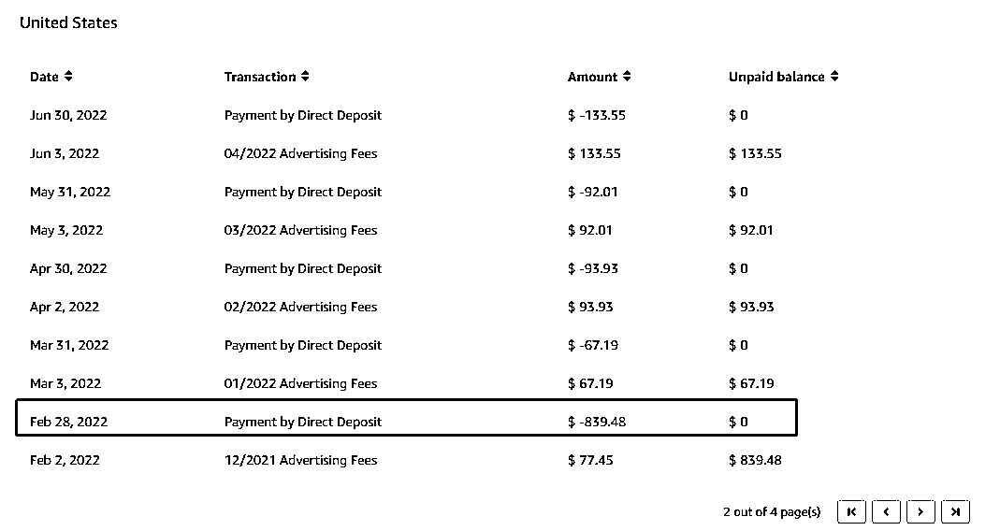
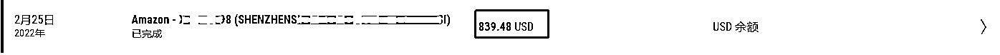
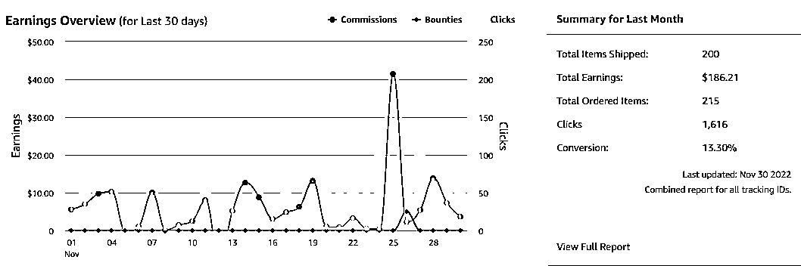
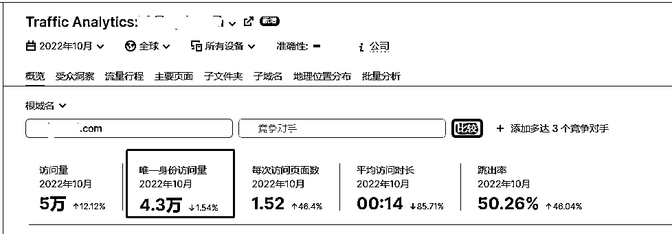
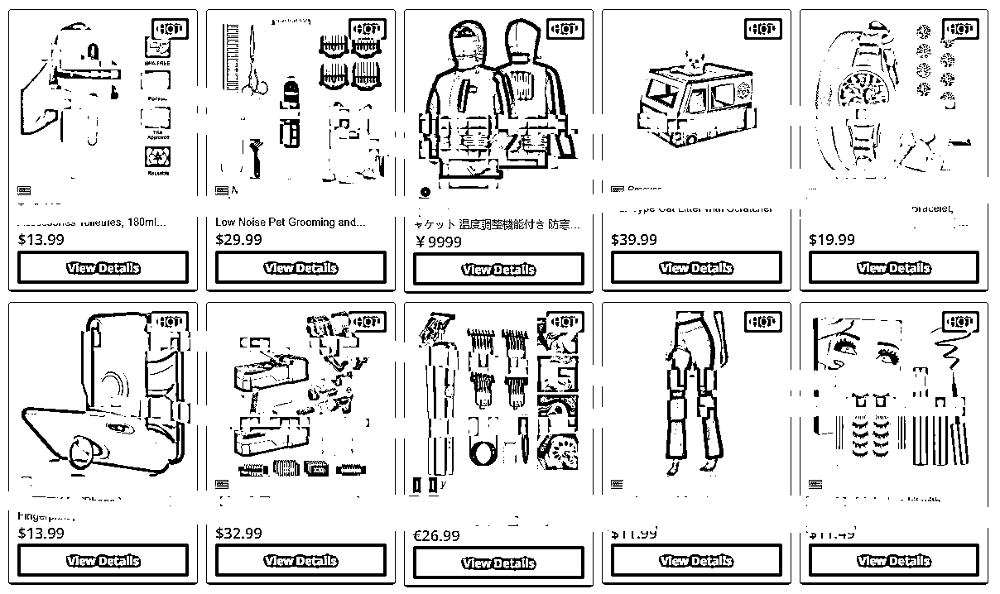
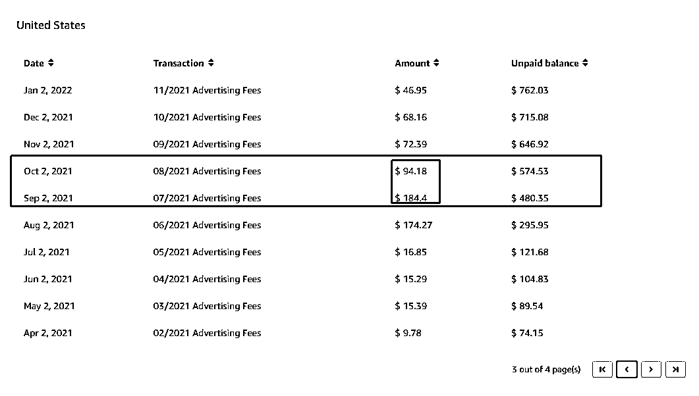

# 案例十七：海外促销折扣站 @比浪 Belone

1）海外促销折扣站的成绩：接近 2000 美金的亚马逊联盟收入

由于公司其中一个主要项目的原因，简单搭建了一个海外促销商品的展示网站。

实际就三个代码网页：首页、产品分类列表页、产品详情页，连界面都是简单结合了几个促销网站([slickdeals.net](http://slickdeals.net/)，[myvipon.com](http://myvipon.com/))借鉴的，没有专门页面设计。

大概 2 天时间就搭建了这个网站，当时这个网站就是一个商品内容的展示，没有任何会员注册或者输入邮箱领折扣码的功能，连发放折扣码的功能都没做，纯商品展示。

后面我们想着别浪费了，就去申请了个亚马逊联盟，然后将联盟 ID 埋在产品的链接里，用户点击购买链接就带上我的联盟 ID 跳转到亚马逊购买，我们可以拿到佣金。

网站运行两个月左右，也没有进行什么管理，而且由于之前的项目不再需要这个促销商品网站，就更加彻底没管这个折扣网站，我记得大概当时这个时间段也挣了百来块美金吧。

不过，那时候是 2019 年提现有点麻烦，也没深入研究，亚马逊给把这些钱折合成礼品卡兑换码给我们了。

当时想着挣了点美元还没法提现，就更加没管理这个网站，过了一段时间收到了一封邮件，告诉我们联盟账号被封了，应该是多少天没达到多少销售额，具体也记不清了。

但还可以用原来的亚马逊账号重新注册联盟，当时只重新注册了美国站，没注意到其他国家站也全部被封了，其他国家没重新申请替换，相当于到现在也就少挣了一些钱，哈哈哈。

然后替换了新的亚马逊美国站的联盟 ID 后，基本上又彻底没管过这个网站了。

一直过了一年半左右，今年 2022 年 2 月底，进亚马逊联盟美国看站了一眼，发现有 848 美元（如下图所示）

这个时候，我们才想着怎么去把钱提现一下，经过这些年时代与技术的进步，亚马逊联盟支持派安盈 P 卡的提现了。

我赶紧注册了账号配置好提现账户，于 2022 年 2 月 28 日提现了人生中第一笔亚马逊给的美元，真真正正到了口袋里。

虽然收入了差不多 6000 元人民币，但是还是没有引起丝毫重视，哈哈。

因为这还是与自己公司主项目没关系，这点钱没有精力与动力去产生任何下大功夫的想法，本身自己主业项目一堆的杂事要忙。

唯一改变点的可能就是，去亚马逊联盟后台看佣金的次数稍微多点了，一周左右会看一眼数据。

截止上个月 2022 年 11 月，11 月份收入还有 186.21 美金的收入

成绩不算耀眼，但是对于想挣到第 1 块钱美金的小新手来说，也算个路子。

2）小破促销网站月独立访客 4.3W

这是 2022 年 10 月的数据，月独立访客突破在 4.3 万左右。

在这之前，我并没有深入学习过 SEO，就简单看了几篇 SEO 招数的文章，就是给这个网站设置了每个产品页面单独的 TKD，然后产品的链接带上了产品的标题（比如*-mechanical-gaming-keyboard-）。

然后在 FB 上分享的话有设置好的图文展示，另外就是生成自己的站点地图，也设置了定期生成，然后提交给了谷歌。

其他好像真的没什么了，时间太过久远也没上心，现在要分享这个东西，只好看看现在的网站和代码回想一下，可能不太全面，以前从来没考虑过 SEO 有多重要（坑爹，现在等于才开始学习入门）

3）挖掘需求的过程

这个真的没有去挖掘过产品需求，就是上面所提到的，因为一个其他的项目，误打误撞随意搞出来的一个网站。但是要谈这个话题，我就来想一想我能够简单思考到的。

促销打折算是个大众化需求吧，总是有人需要的，尤其是现在这个经济环境，老外日子也紧巴巴的，能省点是点儿。

拼多多海外版 TEMU 上线这几个月多火爆，不过大众化的需求，也意味着激烈的竞争，确实有很多大大小小的促销网站。

但是促销网站只需要定期更新尽可能多的产品（基本上可以一键操作），和不断优化网站的 SEO，不需要浪费什么精力，而且变现路径很清晰（直接佣金收入）。

如果新手有精力的话，还是可以尝试一下的，看似是个内容站，实际也相当于是个工具站的，内容的添加也可以用很多自动化方法，然后 SEO 搞流量的同时，多有精力的点多花点精力海外社媒搞流量也行。

如果后期流量大了，有了一键代发的自己的产品，有更多赚头的话，搞搞谷歌等广告投放也应该可以吧，随意畅想了，哈哈。

另外如果流量大了，还可以给卖家放站外单挣个中介费，之前看生财有术里面也有站外的圈友分享过。围绕促销网站的收费模式倒是还挺多。

4）过程中的经验和坑

•当时系统设置了产品 30 天后自动下架不展示，导致产品减少了很多，当然付费转化少了很多。

•由于网站没管理，导致证书到期了也不知道，结果导致老用户流量减少了不少，当然付费转化也少了，本来流量都起来了的，结果直接腰斩（如下图所示）

•其他国家站点初期被统一封号了后，只重新申请了美国站，导致促销网站上其他的国家的产品等于白帮别人卖了，一分钱佣金都没有挣到，大家可以多注意自己的所有其他国家站点的联盟 ID，一旦失效尽快补上，除非你不做这个国家产品，否则还是搞上多个挣钱的机会；

•SEO 优化做的不足，自己没有系统学习过谷歌的 SEO 优化，当时只是看了一两篇文章，照着几个技巧改了一下，如果深入做好 SEO 的话应该流量数据会更好；

•网站没有弄多语言站点，对那些小语种国家的用户不太友好，估计难以转化；

•应该要带上博客功能，搞一些产品类别的排行榜的文章，可以尝试模板化，更方便谷歌收录搞点流量；

•可以注册一些一键代发平台的网站，然后上一些那种产品，这样相当于卖自己的产品，应该挣得更多一些吧；

•稍微做了些流量后，也可以发折扣码的时候要求买家输入邮箱，这样还可以后续邮件营销唤回老用户回购；

内容来源：12 月 5 日《海外促销折扣站案例分享》@比浪 Belone

