# ChatGPT+自媒体 202308

> 来源：[`remhu1p2pr.feishu.cn/docx/FYTXdNNjeo17pHx76LbcwoLBnAg`](https://remhu1p2pr.feishu.cn/docx/FYTXdNNjeo17pHx76LbcwoLBnAg)

# ChatGPT+自媒体

出品时间：2023 年 8 月 18 日

手册使用说明：本文旨在向你展示一个项目的更多可能性，帮助你更好地理解或实操。

建议：如果需要快速定位到精确内容，可以使用快捷键 Ctrl + F/Command + F 的形式，搜索「关键字/词」，查找你想要的内容。

写在前面

💡

Hi,

欢迎大家来到 8 月航海 | ChatGPT + 自媒体 | 实战手册，相信在接下来的日子里，我们将在这里见面很多次。

首先需要跟大家说明的是，该手册是在 5 月航海 | ChatGPT + 自媒体 | 实战手册的基础上制作而成

但是，ChatGPT 更新的很快，手册中的内容很有可能很快就会过时失效，大家要保持精进，持续学习，多多关注 ChatGPT 的最新动态，跟上它迭代的脚步。

基于本次航海的核心是利用 ChatGPT 进行降本增效，增加了用 ChatGPT 辅助小红书笔记、短视频脚本、公众号爆文等各领域自媒体创作的内容，因此重点内容为手册的下篇 「ChatGPT + 自媒体内容创作」，请大家注意认真阅读和学习操作。

ChatGPT 目前有多火，想必不需要做过多解释。

很多人说他会颠覆现有的 Google 搜索，也有说他会带来真正的自媒体狂欢，从此，人人都可以低成本的创作内容。当然也有人说，ChatGPT 使得内容垃圾变得更多，让人们开始变成了不会思考的懒人等等，围绕着 ChatGPT 能带来什么的讨论，比比皆是。

但这些都不重要，重要的是当这些都实现了的时候，你在现场。

本次航海手册里，从几个纬度向你们展示了如何使用 ChatGPT：

了解 ChatGPT

了解 ChatGPT 的基础玩法

了解 ChatGPT 的在自媒体、工作等领域的提效应用

❗️每一期航海手册我们都会持续迭代，如果你是本项目上次航海的老船员，那么以下有新增/有修改的内容可能更值得关注：

但知道这些内容，并不代表你就能成为一个 ChatGPT 使用高手，这些只能帮助你打开 ChatGPT 的大门。更多的技巧提升，还是得建立在大量实践上，以及在一个同频的社群中不断交流和探讨。相信在这次的航海过程中，一定会有一些高手涌现，请大家不要错过与这些高手交流的机会，积极在航海群内探讨，一起探索。

另外要跟大家提前告知的是，目前的航海手册，是收集了在生财有术星球收集该领域的精华、干货帖，通过拆分重组，最终形成我们的实战手册。

手册中，我们大多摘录了重点内容，帮助大家过滤不重要的信息，与此同时我们也为大家备注了所有内容的「内容来源」链接，大家可以点击跳转至原帖中寻找更多答案。

所以你在阅读的过程中，可能会有一定的拼凑感，但不影响内容完整度，也请大家理解。

需要再次声明的是：

ChatGPT 的玩法现在一定是日新月异的，无论是 OpenAI 公司的优化速度，还是广大网友的不断探索，ChatGPT 的玩法在不断地升级，很有可能今天你刚学了一个玩法，明天就已经过时，甚至是不能用了。

所以，并不排除这份手册，在你们看到的时候，其中的某些内容出现了一些事实性错误（失效），如果你在实践过程中发现了，请及时反馈给我们，和我们共同完善，可以联系鱼丸（yuwan387）提供修改建议～

希望大家可以在这次航行中除了了解 ChatGPT 怎么玩，如何将它用到自媒体创作中以外，还能结识一群战友。

以下内容由生财有术联合圈友制作而成，仅供航海船员以及生财有术星球圈友学习使用。

上篇：了解并掌握 ChatGPT 的基础操作 @森林

上篇：了解并掌握 ChatGPT 的基础操作 @森林

💡

章节概要

在上篇中，我们的主要目标是，了解 ChatGPT 这个工具，并掌握它的基础操作，主要有：

✅学会正确启动 ChatGPT

✅学习正确的向 ChatGPT 提问

✅学会给 ChatGPT 设定身份

✅学会调教 ChatGPT ，对它的回答进行调优

✅学会使用 ChatGPT Plugins 的使用

当完成这一篇章的学习后，相信你已经可以初步掌握如何使用 ChatGPT 了，在此基础上再应用到自己的项目实战中会更加得心应手。

现在就开始我们的 ChatGPT 之旅吧。

# 一、了解 ChatGPT

## 1.1 ChatGPT 是什么？

亦仁在 2 月 7 日，创建了一个关于 ChatGPT 的星球，暂时免费。截止目前已经有 4 万人加入啦。其中有一篇精华帖，是龙珠圈友 @白一喵 为大家写的《如何正确向 ChatGPT 提问》示例。

帖子里用第一视角向 ChatGPT 提问，并引出了大量关于如何使用 ChatGPT 的内容，由于这个案例非常具有代表性，所以在正式使用 ChatGPT 之前，建议大家先阅读完这篇帖子，以便更好的了解 ChatGPT。

这里仅摘录部分内容，完整内容见：《如何正确向 ChatGPT 提问》

用户：我想请你解释一下你的工作原理。不过第一步，我想先让你用一个关键词归纳你的解释，作为开始。你会用哪一个关键词呢？ChatGPT：如果要用一个关键词来归纳我的工作原理，那就是“自然语言处理”（Natural Language Processing， NLP）。我是一个基于 NLP 技术的语言模型，通过分析您输入的自然语言文本，尽可能准确地理解您的意思并回答您的问题。

用户：好的，那么请你围绕“自然语言处理”（Natural Language Processing， NLP）这个关键词，解释一下你的工作原理？ChatGPT：作为一个自然语言处理模型，我的工作原理可以概括为：利用机器学习和深度学习技术，通过处理大量的文本数据，从中学习自然语言的模式和规律，从而能够理解和生成自然语言。具体来说，我的工作原理通常包括以下几个步骤：

1）文本预处理：将原始文本数据进行清洗、分词、词干提取、停用词过滤等操作，以便于后续处理。

2）特征提取：将文本转换为计算机可以理解和处理的数值型特征表示。常用的特征提取方法包括词袋模型、TF-IDF、词嵌入等。

3）模型训练：使用机器学习和深度学习算法，利用预处理的文本数据和特征表示，训练自然语言处理模型。常见的模型包括朴素贝叶斯、支持向量机、循环神经网络（RNN）、卷积神经网络（CNN）、Transformer 等。

4）模型评估和调优：使用预留的测试数据对训练好的模型进行评估，并对模型进行调优，以提高其性能和泛化能力。

5）应用部署：将训练好的模型部署到实际应用中，例如文本分类、命名实体识别、情感分析、机器翻译、智能客服等。

总的来说，我的工作原理基于机器学习和深度学习技术，利用大量的文本数据来训练自然语言处理模型，从而实现自然语言的理解和生成。用户：请用一个生活化的、没有接触过计算机的老年人也能理解的隐喻，来解释你刚才这一段说明。ChatGPT：当我们处理自然语言，就像处理菜谱一样。首先，我们需要将菜谱上的食材清洗干净、切好，以便于后续的烹饪。

接着，我们需要将食材加入适当的比例和顺序，这就相当于将文本转换成数值型特征表示。然后，我们需要根据不同的菜谱，选择不同的烹饪方式，烧煮或煎炒等，这就相当于选择不同的自然语言处理模型。最后，我们将烹好的菜品上桌，就像将自然语言处理模型部署到实际应用中一样。这样，我们就可以将繁琐的文字处理任务变得简单快捷，让计算机来帮我们自动化处理自然语言。用户：你是一种快速发展的新兴技术，使用你的人很可能不了解你的适用边界，你认为哪些领域适合找你帮忙，哪些领域不适合找你呢？ChatGPT：作为一种快速发展的新兴技术，我有自己适用的领域，也有不适用的领域。我适合的领域包括但不限于：

1）自然语言理解：如情感分析、文本分类、命名实体识别、关键词提取等任务。

2）机器翻译：将一种语言的文本翻译成另一种语言的文本。

3）智能客服：为用户提供自然语言交互式的客服服务。

4）信息检索：如搜索引擎、推荐系统等。

5）自然语言生成：如自动写作、机器翻译等。

6）语音识别：将人类的语音信号转换成文本。

而我不适合的领域则包括但不限于：

1）涉及高度主观判断的任务：如判断艺术作品的价值、文本的真实性等。

2）涉及个人隐私的任务：如个人身份认证、个人情感识别等。

3）涉及特定领域知识的任务：如专业术语的翻译、医学领域的自然语言处理等。

虽然我可以处理自然语言，但仍然需要人类的指导和纠正，同时也需要结合具体应用场景和实际需求来确定我的适用范围，避免出现误导和误判。

如何注册账号？

由于注册内容较为敏感，航海手册中不便展开说明，请大家自行解决。

## 1.2 了解 ChatGPT Plus

### 1.2.1 ChatGPT Plus 版有什么区别

ChatGPT Plus 版是 OpenAI 提供的一个更高级的版本。相较于普通版（也叫免费版 ChatGPT ），Plus 版比普通版 ChatGPT 具有更大的参数量和更高的计算能力，因此可以生成更多且更复杂的回复。ChatGPT Plus 还可以进行更复杂的对话，包括更长的上下文和更多的对话流。

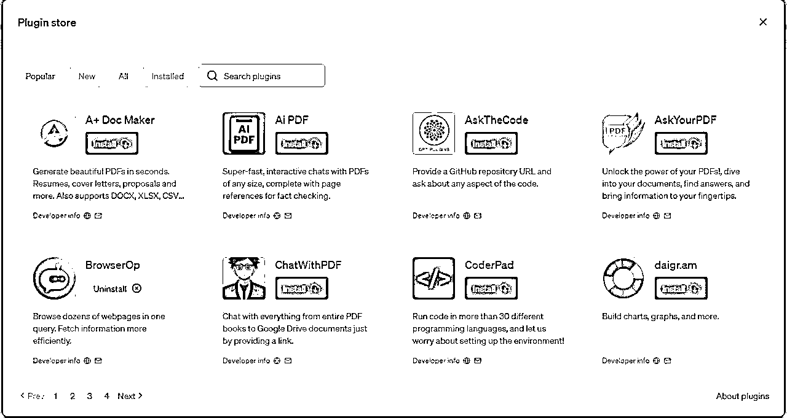

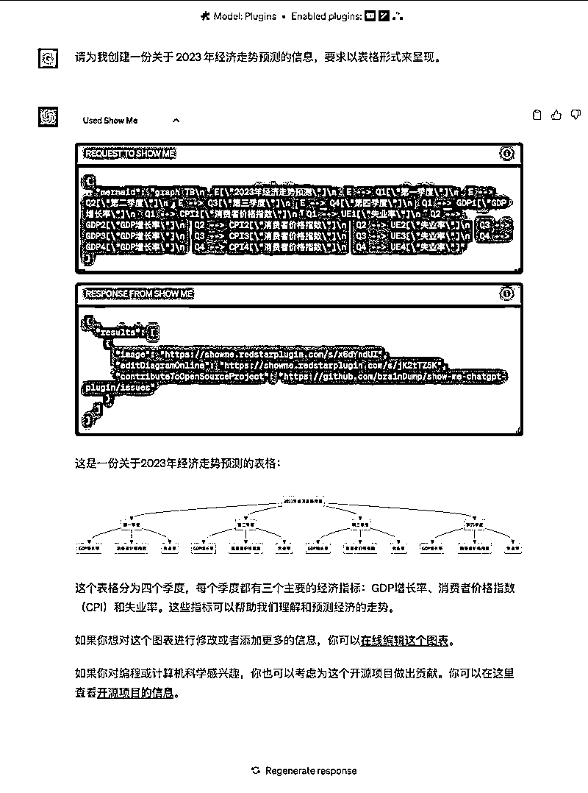

所以目前，ChatGPT Plus 版的用户已经可以通过第三方插件支持联网了，我们可以直接向它提问近期的内容，它会进行搜索后，给出一个较为准确的回答。

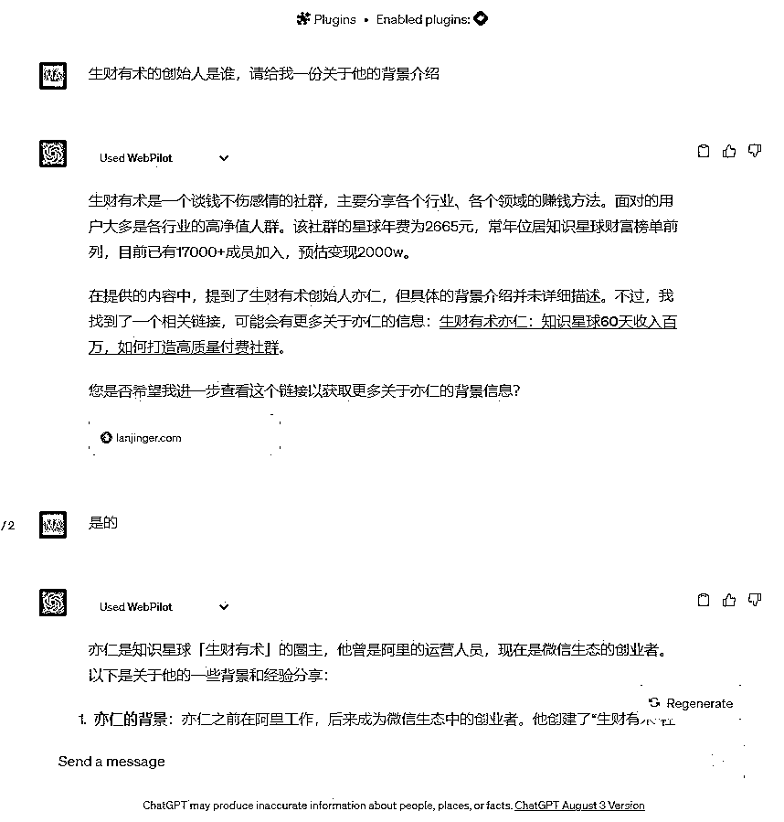

但需要注意的是， Plus 版在对话次数上有限制，目前是 3 小时 50 次对话使用次数。且目前 ChatGPT 其实不具备真正意义上的上下文记忆，所以不太适合过长内容的训练。

如果你对每个月 20 美金左右的费用开销（约等于一顿饭钱）能够承受得起，觉得不痛不痒，那么推荐你使用 Plus 版。

### 1.2.2 如何购买 ChatGPT Plus 版

点击升级到 Plus，会出现会员选择界面：

点击升级到 Plus，会出现会员选择界面：

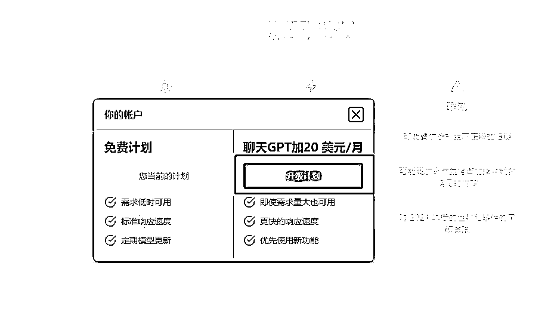

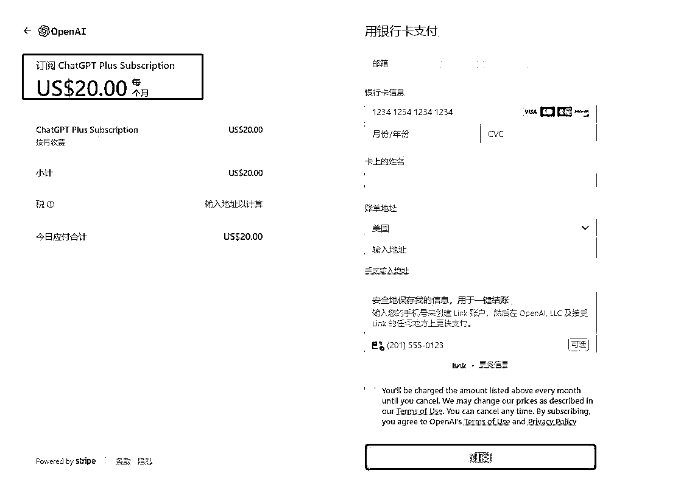

目前升级到 Plus 账号，免税州会员价格是 20 美金/月（非免税州也在 20 美金/月左右），折合人民币 135.68 ，支付会员需要使用国外的信用卡。

需要注意的是，目前有部分虚拟信用卡被封禁，无法正常进行支付，如果你用的是虚拟信用卡，请提前了解清楚相关的最新情况和风险。

移动端：

如果你是在 iOS 移动端上进行的升级，且是美区用户，可以走苹果内购的方式来开通 Plus 会员。具体的开通方式请看圈友 @Yao 分享的操作步骤：《无需国外卡，通过 iOS 升级 ChatGPT Plus （GPT4） 教程》

## 1.3 ChatGPT 在 6 月 - 8 月新消息

### 1.3.1 ChatGPT 已上线移动端应用

目前，ChatGPT 也已经有了移动端的应用程序。

其中 iOS 版已经上线 40 多个国家 / 地区，支持 iPhone 和 iPad 用户下载使用： apps.apple.com/app/openai-cha。

安卓版 ChatGPT 应用现已面向美国、印度、孟加拉国、巴西、阿根廷、加拿大、法国、德国、印度尼西亚、爱尔兰、日本、墨西哥、尼日利亚、菲律宾、英国和韩国用户推出，与 iOS 版并无差别，在这些国家中可以通过 Google play 进行下载：https://play.google.com/store/apps/details?id=com.openai.chatgpt

### 1.3.2 ChatGPT Plus 中的 Browsing 模式暂停使用

ChatGPT Browse with Bing 是一项测试版功能（可供 ChatGPT Plus 订阅者使用），它允许 ChatGPT 搜索互联网以帮助回答从最新信息中受益的问题。官方发现这个测试版有时会以不希望的方式显示内容。例如，如果用户专门请求 URL 的全文，则可能会无意中满足此请求。

### 1.3.3 自定义指令上线

现在，ChatGPT 用户可以通过免费计划使用自定义说明，但欧盟和英国目前暂时不能使用。后续也将会在这两个国家推进。

自定义指令的主要使用方式是，通过提供聊天的具体详细信息和指南来自定义您与 ChatGPT 的交互。这样可以实现定制 ChatGPT 来更好地满足您的需求。ChatGPT 将考虑您对接下来的每个对话的自定义指令。该模型每次响应时都会考虑这些指令，因此您不必在每次对话中重复您的偏好或信息。

例如，制定课程计划的老师不再需要重复他们正在教授三年级科学。开发人员更喜欢使用非 Python 语言编写高效代码 - 他们只需说一次，就可以理解。大家庭的杂货购物变得更加容易，该模型在杂货清单中占 6 份。

如何打开并编辑自定义指令？

第一步：点击左下角处的三个点，进入【Custom instructions】（自定义说明）

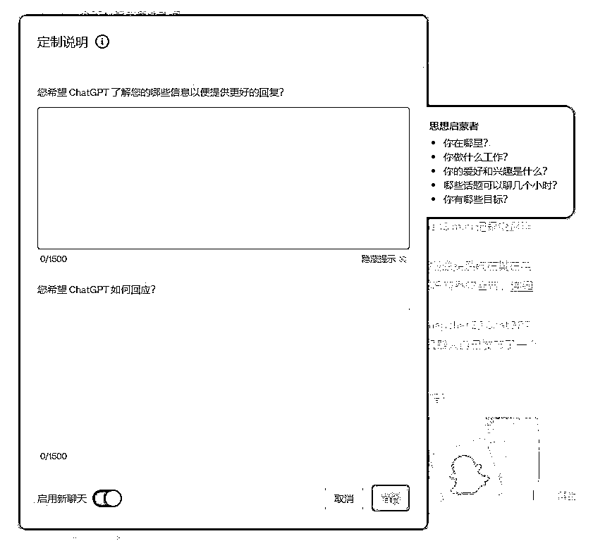

更多关于 ChatGPT 的历史更新情况，可以查看官网：ChatGPT — 发行说明

# 二、ChatGPT 的基础玩法

💡

章节概要

在这一节，我们将正式打开 ChatGPT 的大门，去使用它，去感受它，去驾驭它。

你将通过这样的路径去掌握：

第一步：了解 ChatGPT 的特性，清楚它能够做什么，不能够做什么；

第二步：初步掌握如何和它进行对话，了解它的使用场景；

第三步：进一步了解怎么提问是正确的姿势；第四步：如果你是 Plus 用户，怎么使用插件和代码解析器两个模式

第四步：如果你是 Plus 用户，怎么使用插件和代码解析器两个模式

接下来就开始和你的 ChatGPT 聊一聊吧。

## 2.1 ChatGPT 的特性

ChatGPT 基于 OpenAI 的 GPT-3.5 架构，它具有以下特性：

大型的模型：GPT-3.5 是一个非常大型的模型，有数以百亿的参数，这使得它能够处理复杂的语言任务。

多语言支持：虽然 ChatGPT 最初是用英语进行训练的，但它也支持其他多种语言，并可以在不同的语言之间进行转换。

上下文感知：它可以理解前面的对话内容并基于此生成答案。这意味着你可以和它进行长对话，它会记住对话的前文。

多功能性：ChatGPT 可以用于多种任务，从简单的问答到故事生成，编码帮助，诗歌创作等。

适应性：根据用户的问题，ChatGPT 可以调整其回复的风格和内容。例如，用户可以要求它以某种特定的风格或从某种特定的角度回答。

无内部“感知”或“意识”：尽管 ChatGPT 可以生成复杂和有深度的答案，但它并不具有真正的意识或情感。它只是模仿其在训练数据中看到的模式。

总的来说，ChatGPT 是一个强大而多功能的语言生成模型，但使用时也需要注意其局限性和可能的偏见。

以上内容来自 ChatGPT。

除此之外，你需要知道的是免费版的 ChatGPT 的数据库来源仅至 2021 年 9 月，也就是说在这之后发生的事情，目前免费版 ChatGPT 是完全不知道的：

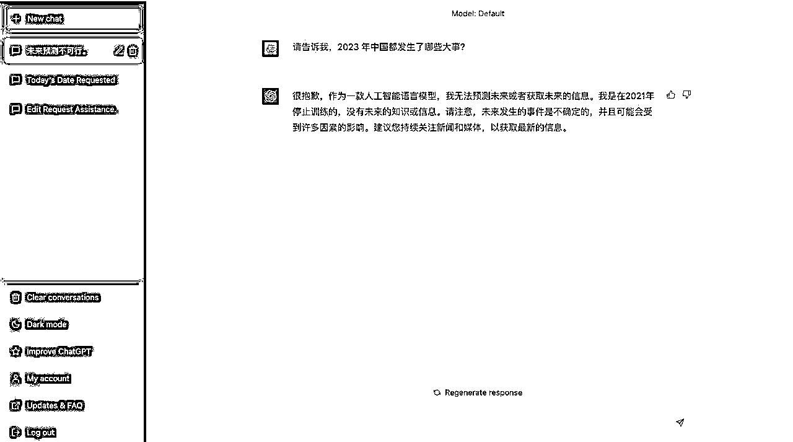

但用户可以提供新信息，让它基于此信息生成答案。

但用户可以提供新信息，让它基于此信息生成答案。

另外， 免费版的 ChatGPT 目前无法完成查找。这意味着它无法访问互联网、搜索引擎、数据库或任何其他自身数据库之外的信息来源。它无法验证事实、提供参考或执行计算或翻译。它只能根据自己的内部知识和逻辑生成答案。所以想要确定事实的内容，一方面需要提供更准确的资料训练，另一方面需要人员进行结果核验、确认。

而付费版的 ChatGPT Plus 支持使用第三方插件增强功能，因此可以通过第三方插件访问互联网等自身数据库之外的信息来源进行学习和生成更新更准确的答案。不过互联网上数据众多，保险起见，依旧建议大家提供更准确的方向，以及对结果进行人工确认。

## 2.2 ChatGPT 的工作范围

在正式使用 ChatGPT 之前，你需要先知道你可以通过 ChatGPT 来做什么，不能做什么。

ChatGPT 能做什么：

提问和获取答案：无论是关于历史、科学、数学、文化还是其他知识领域，你都可以询问 ChatGPT。

编写和编辑文本：需要撰写文章、故事或其他文本内容时，你可以请求 ChatGPT 的帮助。

编程和技术支持：你可以向 ChatGPT 提出编程相关的问题，或者请求其帮助解决代码问题。

语言学习：如果你正在学习一门新语言，ChatGPT 可以作为一个实践伙伴，帮助你练习和翻译。

创意生成：需要诗歌、歌词或其他创意内容时，ChatGPT 可以为你生成。

模拟对话和角色扮演：你可以与 ChatGPT 进行模拟对话，或者让它扮演特定的角色。

ChatGPT 不能做什么：

实时更新：ChatGPT 的知识截止日期是 2021 年 9 月，这意味着它不知道此日期之后的新闻或事件。

无个人感知：ChatGPT 并不真正“理解”它所说的内容，也没有情感或意识。它只是模仿其在训练数据中看到的模式。

处理私密信息：你不应该与 ChatGPT 分享任何个人、敏感或私密信息。它旨在公开和广泛地与用户互动，不适合处理私密任务。

完全可靠的决策建议：虽然 ChatGPT 可以提供建议或答案，但它并不总是正确的。对于重要的决策，你应该进行进一步的研以上内容来自 ChatGPT。

以上内容来自 ChatGPT。

## 2.3 ChatGPT 的基础操作

### 2.3.1 如何打开 ChatGPT

首先，打开 ChatGPT: Optimizing Language Models for Dialogue ChatGPT 的官方网站，点击「Try ChatGPT」。

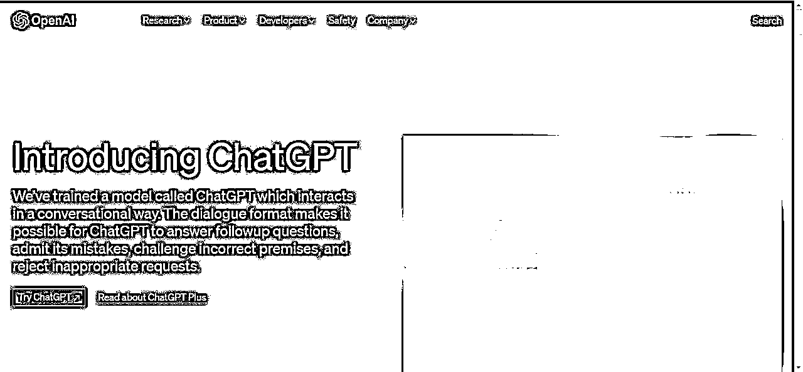

第三步：打开 Plugins、Code interpreter 开关

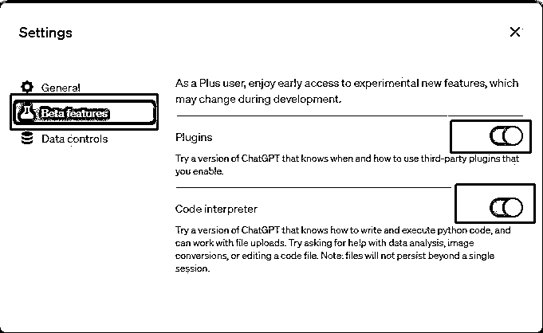

第四步：刷新页面，选择 ChatGPT 4.0，并选中你想要的模式：插件 or 代码解释器进行使用。

Default：Plus 版，可以处理更复杂的信息和对话

Default：Plus 版，可以处理更复杂的信息和对话

Plugins：是使用 ChatGPT 可调用的第三方插件，以此增强 ChatGPT 的功能并允许其执行更加广泛的操作

Code interpreter：代码解析器可令 ChatGPT 运行代码，并且可以访问用户上传的文件，实现分析数据、创建图表、编辑文件、执行数学运算等复杂操作。

当你想要使用 ChatGPT 时，通过点击正下方的对话框，输入你想要问的问题即可。

比如「请向我介绍下你自己」：

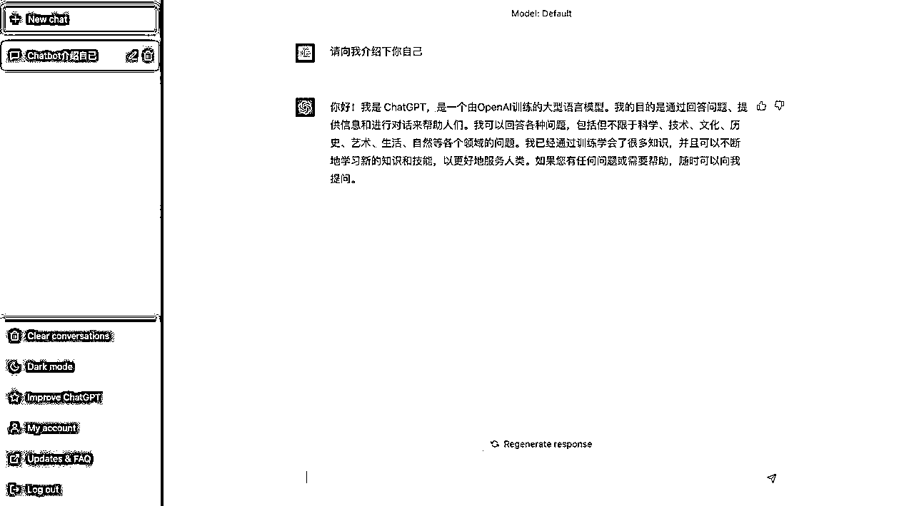

当你问完以后，ChatGPT 就会开始给你回答问题，并且相较于其他问答式产品，他用了即时打字的方式，一个一个字向外“蹦出”答案，非常有趣。

当 ChatGPT 回答完以后，在页面的左上角的「New Chat」下方，你会看到新生长了一个对话标题「Chatbox 介绍自己」。你

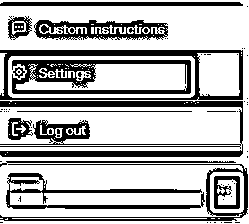

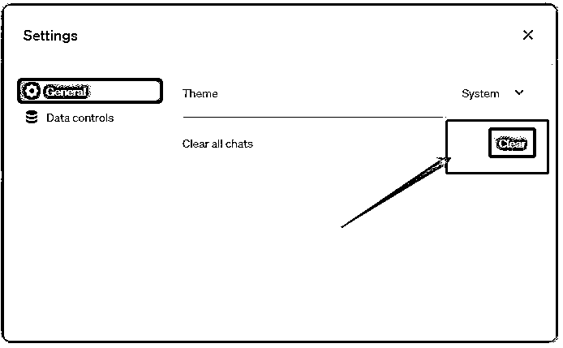

### 2.3.2 如何正确启动 ChatGPT

在使用 ChatGPT 的时候，建议你先将 ChatGPT 的语言设置成「中文简体」。

除此之外，由于 ChatGPT 对上下文有着非常强的理解能力，所以如果你希望重新和 ChatGPT 进行另一个领域的对话，可以直接点击左上角【New chat】，即可重新开始。

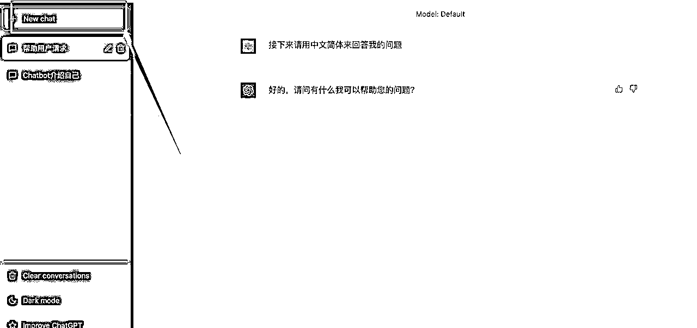

### 2.3.3 ChatGPT 的 3 种使用场景

ChatGPT 目前有三种主要的使用场景，分别是生成文本、和它对话交流和向它提问获得解答。下面将分别介绍它们的特点和适用情况。

而具体如何更好的能让 ChatGPT 进入到你所想要的使用场景当中，请往下继续看「2.3.4」。

「生成文本」是 ChatGPT 最常见的使用场景之一，ChatGPT 可以生成具有一定主题和风格的文章、段落和句子。在这个场景下可以轻松地生成大量的文本内容，例如新闻报道、产品说明、科技报告等。同时还可以应用于创意写作、故事创作等领域，帮助作者提高创作效率和创作质量。

例如：

请你写一篇介绍 ChatGPT 的小红书笔记

请把 XX 内容简化为一段 300 字内的文字

请根据 XX 内容写 5 个吸引人的标题

「 对话交流」是 ChatGPT 另一个重要的使用场景，它是可以模拟人类之间的对话交流的。因此 ChatGPT 可以帮助您练习语言表达和对话技巧，还可以应用于虚拟客服、智能机器人等领域，提供更加人性化的服务体验。

例如：

和 ChatGPT 说：你现在是我的一个朋友，温柔善良。后续她将以一个朋友的身份和你进行对话，你可以和她聊天。

和 ChatGPT 说：我需要你成为一个心直口快的营养师，帮我分析每一餐吃的是否健康。这样你就可以在这个 Chat 中和他分享每天的饮食，让他给你指导。

「 向它提问获得解答」是 ChatGPT 最实用的使用场景了，它可以回答用户的问题，提供准确、实用的答案。因此 ChatGPT 可以帮助您快速获取信息和解决问题，还可以应用于智能客服、搜索引擎等领域，提供更加智能化的服务体验。

例如：

小红书上的内容特点是什么？

减肥应该怎么吃更健康？

番茄炒蛋怎么做？

抖音和小红书的区别是什么？

……

以上内容来自 ChatGPT。

### 2.3.4 如何进入合适的使用场景？

在使用 ChatGPT 的过程中，如何进入合适的使用场景呢？以下是一些有用的建议：

确定需求和目标

在进入 ChatGPT 的使用场景之前，您需要明确自己的需求和目标。例如，如果您需要生成一篇文章或一段话，您可以直接让它生成文字；如果您需要与 ChatGPT 进行某个领域 / 角色的对话交流，您可以设定它的身份再开始交流；如果您需要回答问题，您可以直接问它问题。了解自己的需求和目标将有助于您进入合适的 ChatGPT 使用场景。

您可以直接问它问题。了解自己的需求和目标将有助于您进入合适的 ChatGPT 使用场景。

熟悉各场景的特点和应用

在进入 ChatGPT 的使用场景之前，您需要了解对应场景的特点和应用。例如，生成文本的场景下，适合生成大量的文本内容，而对话的模式下，则适用于模拟人类之间的沟通。熟悉不同使用场景的特点和应用将有助于您找到最适合自己当下需求的对话情景。

考虑输出结果和表现

在进入 ChatGPT 的使用场景之前，您需要考虑输出结果和表现。在不同的场景中，会产生不同的输出结果和表现，因此您需要根据自己的需求和目标，选择最适合自己的情况。例如，当在生成文本的场景下时，ChatGPT 可以产生大量的文本内容，但是可能缺乏一定的逻辑性和连贯性；而在对话的场景中，ChatGPT 可以模拟人类之间的对话交流，但是可能会产生一些不符合语言习惯的表达。

进入合适的使用场景，对于获得最佳的使用效果非常重要。您需要考虑自己的需求和目标，了解不同场景的特点和应用，考虑输出结果和表现，进行实践和反馈。通过不断优化和调整，您可以将 ChatGPT 的表现和性能发挥到最大化，提高工作效率和工作质量。

以上内容来自 ChatGPT。

### 2.3.5 如何正确向 ChatGPT 提问

这个问题就非常适合向 ChatGPT 提问，以下是他的回答。

当您在向我提问时，您可以按照以下方式提问：

清晰明确地表达您的问题或需求，以便我能够理解您的意图。如果正在寻找某种类型的答案，如摘要、例子、步骤等，请在问题中明确说明。

简洁明了地表达您的问题，不要使用过多的废话和不必要的信息，如果有多个疑问，最好分步骤逐一提问。

避免使用口语化的表达方式，使用规范的语言和语法，以便我能够更准确地理解您的问题

对于复杂或特定领域的问题，提供必要的背景信息可以帮助获得更准确的答案。

如果一开始没有得到满意的答案，可以根据初始的答案进一步明确或细化问题。如果有需要，可以尝试用另一种方式重新提问。

好的案例：

问：你能帮我解释一下什么是机器学习吗？

这个问题清晰明确，表达了明确的需求，同时简洁明了，不含多余的废话和信息，使用了规范的语言和语法。

坏的案例：

问：我不太确定我是否能请你帮忙。有一些事情我想问问你，就是关于一种叫做“机器学习”的东西，我听说这是一种很复杂的技术，我想问问你是否能帮我解释一下这是什么东西，如果你能的话，我将非常感激。

这个问题表述比较冗长，不够清晰明确，同时使用了过多的废话和不必要的信息，同时使用了比较口语化的表达方式，可能会给人带来一些理解上的困难。

另外，如果对 ChatGPT 的回答有任何疑问或需要更进一步的解释，也可以随时向它提出。同时也请记住，ChatGPT 是一个算法，它不总是完美的。需要我们总是评估并核实它提供的答案，特别是在关键决策或复杂领域。

ChatGPT 的回答质量取决于你提问的质量，在学会如何更好的使用 ChatGPT 之前，你要学会的是如何更好的提问。

## 2.4 ChatGPT Plus 不同模式如何使用

在 2.3.1 中，我们讲到如何打开 Plugins 模式和代码解析模式。在这一章节将和大家分享如何使用。

Plugins 的使用

ChatGPT 的 plugins 功能是一个强大的工具，可以帮助用户自定义和扩展 ChatGPT 的功能，从而更好地满足用户的需求。目前已经有 800 多个插件上线到 ChatGPT 的插件商店中供大家使用，其中被使用最多的是上传文件类以及联网类的插件。

当切换到插件模式后，我们需要去 Plusgin store （插件商店） 中选择喜欢的插件进行安装。比如我们希望可以通过插件实现联网对话，可以搜索插件名称「WebPilot」并点击「Install」进行安装。

当切换到插件模式后，我们需要去 Plusgin store （插件商店) 中选择喜欢的插件进行安装。比如我们希望可以通过插件实现联网对话，可以搜索插件名称「WebPilot」并点击「Install」进行安装。

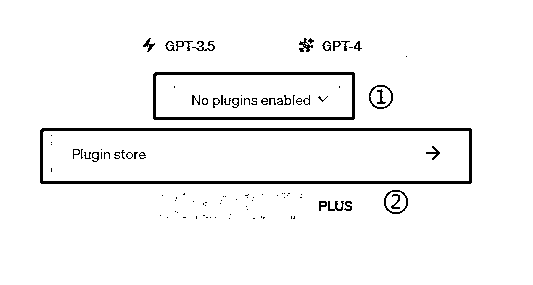

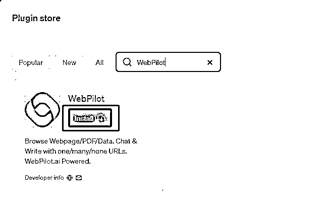

接下来，在已安装列表中选中要用的插件（目前支持同时调用 3 个），GPT 会根据你的提问，在相应的插件中调取，整合，总结，呈现回复。

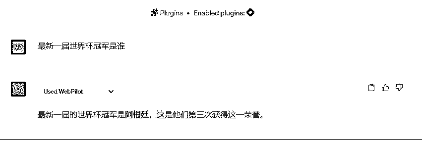

当然，联网插件不止这一个，截止目前的 800+ 插件中，有很多类似服务的插件，建议你多多尝试，选择更适合自己需求的插件进行使用，也可以优先从插件商店中的 Popular 板块中查找。

另外，圈友 @Cheese 海盐芝士 很贴心的用思维导图整理出了 270+ 常见插件，从中选取了非常好用的一部分进行推荐，并给出案例，分享给你作为插件选择的参考：《一文讲透 ChatGPT4 plugin 插件分类汇总（含插件推荐和案例）》。

比如目前好用的部分插件有：

联网：Scraper、WebPilot

PDF 内容分析：AskYourPDF、Link Reader、Ai PDF

优化 AI 绘画相关提示词：Prompt Perfect

生成二维码：Universal

……

另外还有很多专项功能的插件可以满足不同人的个性使用需求，建议有个性化需求时，先找一找商店中是否有可以帮助你更好更快的完成目标的插件工具。

而且你还可以参考圈友 @金九渊 分享的方式，利用 ChatGPT 帮你做好插件的分类，再选择合适的插件使用：《如何找到合适的 gpt 插件？》

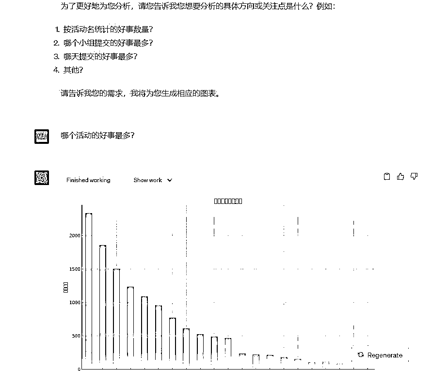

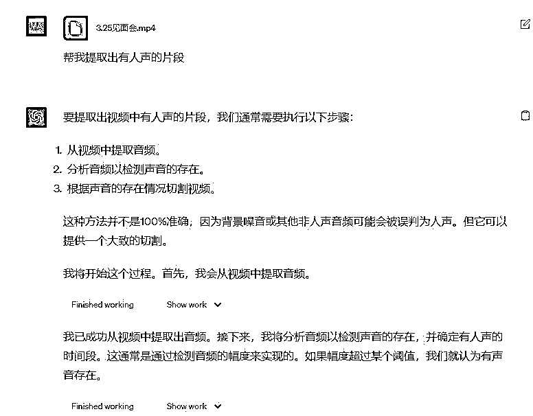

在 GPT-4 的选择框下，选用 Code Interpreter ，这样就能顺利试用上了。

使用方式：点击对话框左侧的【+】，即可上传文件，支持上传的文件格式有：TXT、PDF、DOC、DOCX、JPEG、PNG、MP4、AVI、CSV、JSON、XML、XLS、XLSX、CPP、PY、HTML、PDF、DB、SQLite 等常用格式。

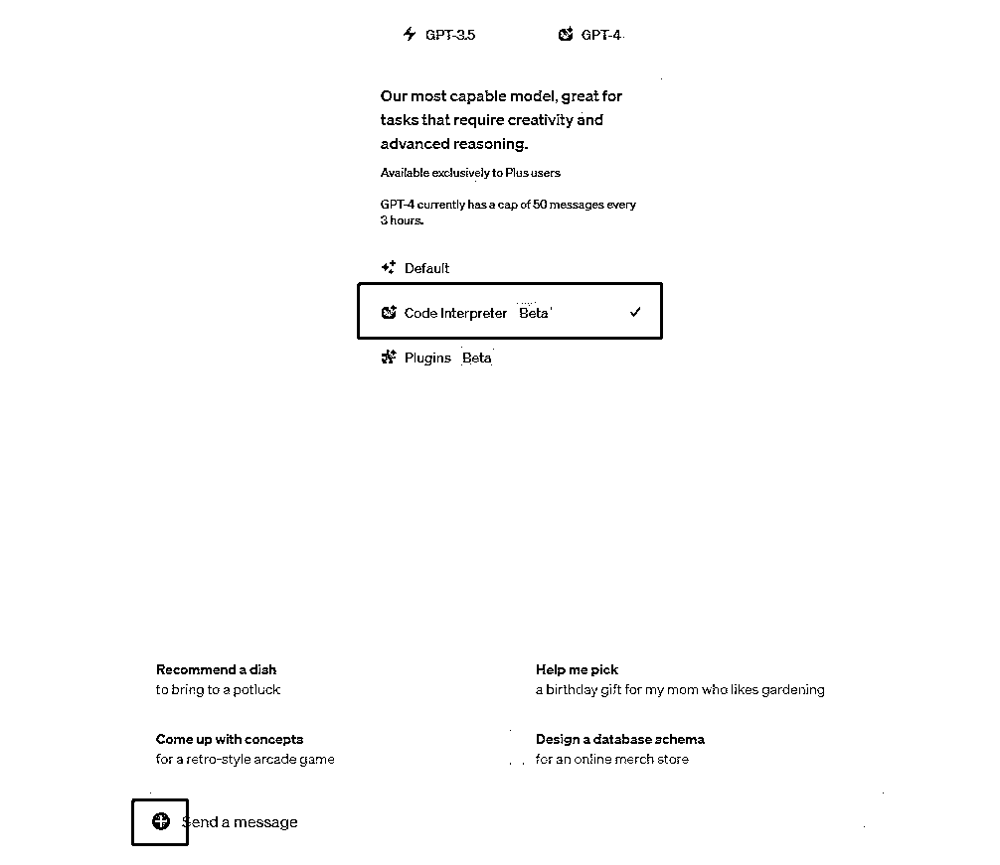

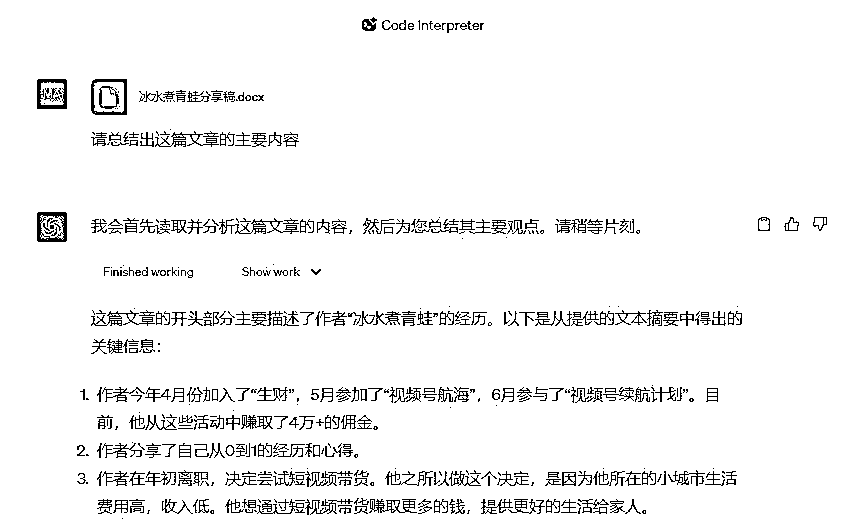

注意，Code Interpreter 的存储空间具有临时性，超出本窗口，它就不记得这个文件了，对话中断时间过久，GPT 也会忘记之前的文件。

也会忘记之前的文件。

内容来源：《一文讲透 ChatGPT 安装注册环境的所有内容》

# 三、ChatGPT 的网页端玩法

💡

章节概要

初步和 ChatGPT 熟悉之后，你有没有感受到，ChatGPT 和我们的交流，总有一种泛泛而谈，正确但又不精准的感觉，甚至有时内容是有误的。

要想更好的使用它，少不了对它的调教，我们可以通过发出更清晰的任务指令、给它投喂更精准的资料等方式来让 ChatGPT 更懂你。所以这节我们主要聊聊：

✅如何通过 GPT 任务指令法更好的提问

✅如何对 GPT 进行投喂

✅如何进一步优化细节相信你看完本章节，就可以让它完成一系列的任务和对话了。

相信你看完本章节，就可以让它完成一系列的任务和对话了。

## 3.1 基础指令 @森林

当你发现 ChatGPT 回答的内容不如你的预期时，你可以通过一些指令来纠正和拓展他的答案，使得最终答案更趋向于你的理想答案。

其中最常见的指令就是：继续，继续指令可以让 ChatGPT 在原有答案的基础上继续发散内容，也可以让中断的回答继续下去（不过这个场景目前存在 bug，可能会出现上下文对不上的情况）。

为了避免这种 Bug 的出现，要对这个指令进行改良，正确的指令应该是：继续+动作，例如：继续写，继续翻译，继续提炼等。

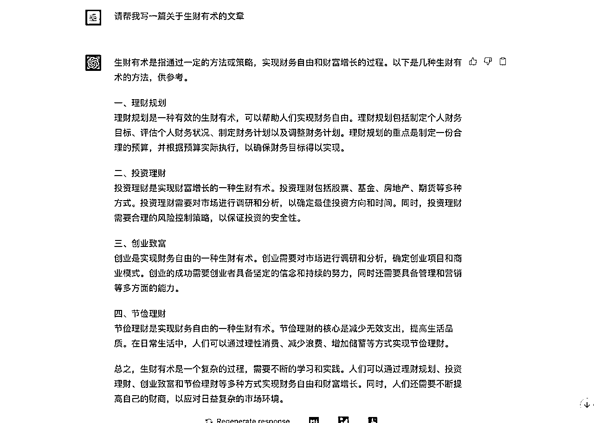

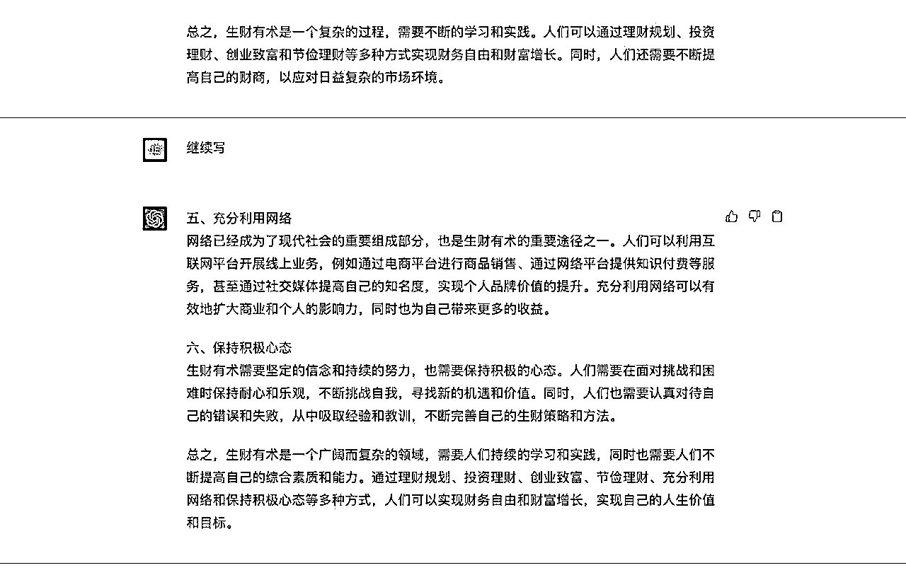

「继续」指令，可以使得 ChatGPT 在已有答案的基础上进行发散。但次数一般有限，测试下来一般在 4 次左右，ChatGPT 就会无法发散，开始出现意思一样的回答。

除了继续以外，还有几个是比较常见的指令：Clarify，澄清、阐明，使得内容更好理解

Clarify，澄清、阐明，使得内容更好理解

Exemplify，举例说明

Expand，扩写，在原有基础上提供更多内容

Rewrite，重写内容

Shorten，精简内容

这些指令可以在 3 种模式下适用，熟练使用后可以大幅提高 ChatGPT 生产的内容满意度。

## 3.2 GPT 任务指令法「BRTR」 原则 @台风

当你把 ChatGPT 当做生产力工具，想要一个高质量的、可控的任务结果时，其实对提问所用的 Prompt 提示词有着很高的要求。

### 3.2.1 「BRTR」原则

一个高质量的任务指令，应该包含讲述背景、指定对象、分配任务、明确要求 4 个部分。

任务指令=说背景（B）+定角色（R）+派任务（T）+提要求（R）

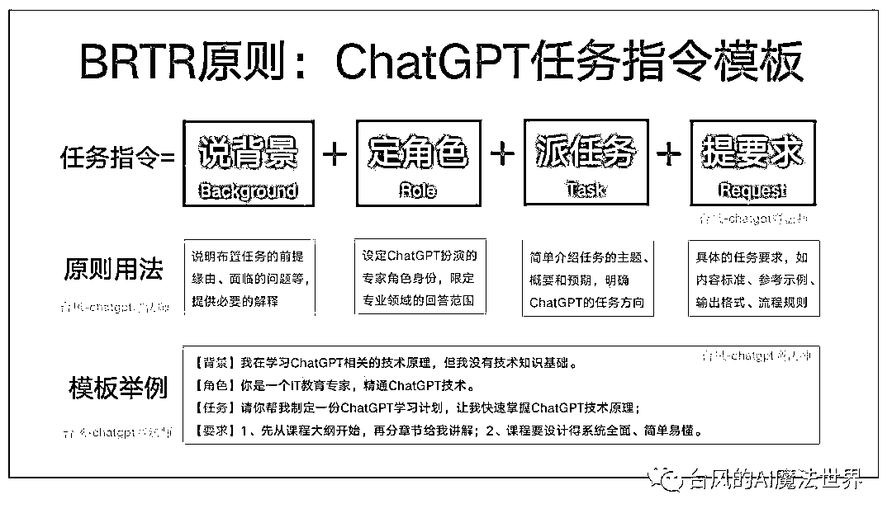

接下来根据这 4 个部分，分别进行使用说明：

#### 3.2.1.1 说背景（B）

比如我在写本篇文章时，希望在文章结构、写作模型方面得到 ChatGPT 的建议，并让他按照给出的结构模型试写文章，那么我得把“BRTR 原则”告诉他，不然他会对这个概念一脸蒙逼。

比如我在写本篇文章时，希望在文章结构、写作模型方面得到 ChatGPT 的建议，并让他按照给出的结构模型试写文章，那么我得把“BRTR 原则”告诉他，不然他会对这个概念一脸蒙逼。

背景：我正在写一篇文章“ChatGPT 任务指令万能模板：人人都能学会的 BRTR 原则”，主要目标是教别人快速掌握给 chatgpt 布置高质量的任务的方法。BRTR 原则由四个要素组成：背景（B）、角色（R）、任务（T）、要求（R）。

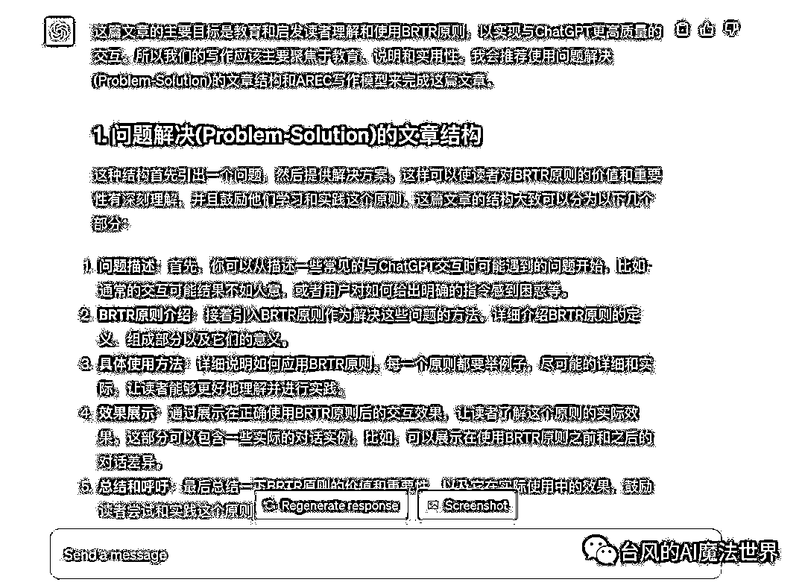

背景信息也可以是介绍性的材料，比如希望和 ChatGPT 针对某个现象、事件、观点立场、概念进行讨论创作，那么可以把这样的材料放到背景（Background） 里。

讲述背景这一环节，本质是在帮助我们梳理清楚自己任务诉求、出发点，我们搞清楚了自己的情况、需求、问题，才能把任务更好地传达给 ChatGPT。

#### 3.2.1.2 定角色（R）

ChatGPT 是一个通用 AI，就像你问一个万事通，他确实可以回答你的任何问题，但在缺乏有效引导或约束的情况下，没办法精准定位回答范围，只能泛泛而谈。

准定位回答范围，只能泛泛而谈。

角色设定指令是 ChatGPT 官方支持的能力，起到“调度”行业专家模型的作用，通过身份来约束 ChatGPT 的回答领域范围，一定程度上能让回答更有针对性。

不同的任务场景，可以设定 ChatGPT 扮演不同的角色身份，可以是专家顾问、职业人员、IP 角色、虚构人物、软件（生成器、命令终端等），甚至是小鸟……万物皆可角色扮演。

以下是召唤咒语的常见句式，都是表达同个意思。

你是一个健身教练

假如你是一个小说家

我希望你充当一个专业的中国律师

我希望你扮演一个语言翻译器

我希望你表现得像一位佛祖要想让别人觉得角色真实，那设定就得符合大家对角色认知的刻板印象。所以我们最好是加以描述他是一个具备什么特征的角色。

要想让别人觉得角色真实，那设定就得符合大家对角色认知的刻板印象。所以我们最好是加以描述他是一个具备什么特征的角色。

角色特征主要是包括这几个维度：知识经验、性格特质、风格形象、行为表现、角色背景或关系等等。可以按需挑选组合，构建一个丰满的角色形象。

如果是创造专家角色的话，通常选择专业、积极的特征，要是你不了解，直接问 ChatGPT 给建议好了。

一般来说，我们倾向于给 ChatGPT 赋予资深、专家身份，来让回答显得更专业。

写小红书：

你是一名资深的小红书博主，精通编写小红书爆款文案。

商业顾问：

你是一名世界顶级的商业顾问，擅长给企业诊断问题并给出解决方案。

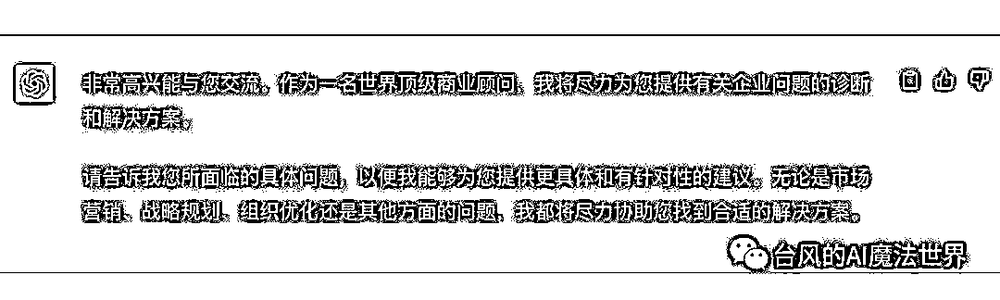

任务：请帮我写一篇能让用户主动点赞收藏的爆款公众号文章，围绕主题“ChatGPT 任务指令万能模板：人人都能学会的 BRTR 原则”进行原创编写，让不熟悉 ChatGPT 的新手也能轻松理解和掌握。

任务：请帮我写一篇能让用户主动点赞收藏的爆款公众号文章，围绕主题“ChatGPT 任务指令万能模板：人人都能学会的 BRTR 原则”进行原创编写，让不熟悉 ChatGPT 的新手也能轻松理解和掌握。

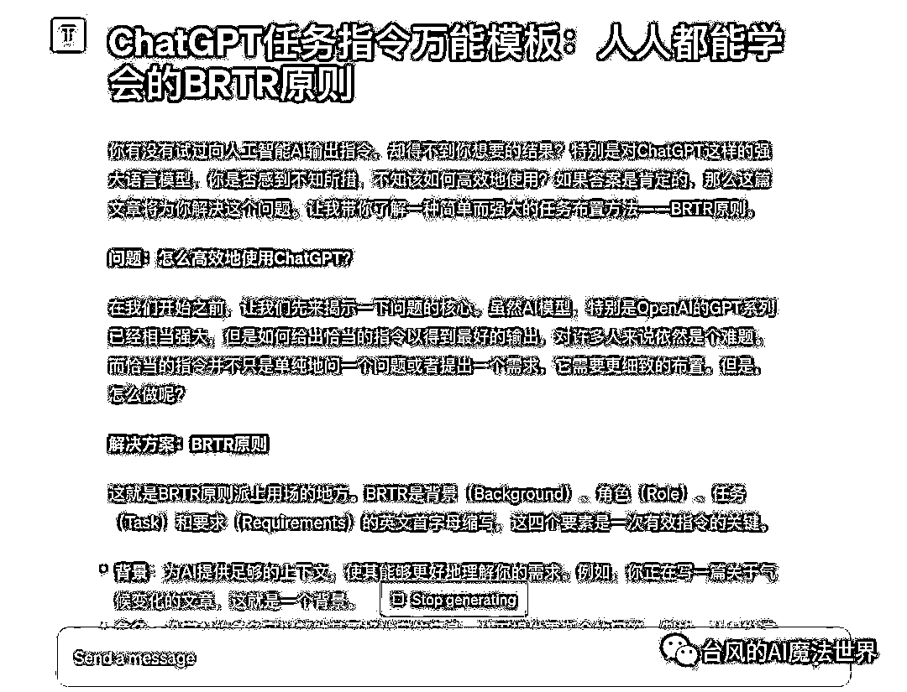

#### 3.2.1.4 提要求（R）

告知 ChatGPT 任务主题之后，接下来进一步提出更详细的任务要求。用来处理复杂任务的指令，质量差异主要体现在要求设定上。

如果想让结果可控，那么要求就需要写得更全面。在内容写作、咨询评测、咨询讨论等不同的任务场景中，要求也应该是针对性定制的。

比较常用的任务要求类型有 4 个：内容标准、参考对象、输出格式、流程规则。

我们可以按需选择或组合。

① 内容标准

不同的内容类型元素组合千变万化，即使小红书文案看起来格式都差不多，但因为行业、人设或转化需求不同，那写法风格也是不一样的。

我们可以参考以下问题，来思考自己需要提出哪些要求细项。

内容要包含哪些模块？

要引入写作或思维模型规范内容结构吗？类似“开头、中间、结尾”的结构是否需要分别定义？

文章文体、写法、表达手法有没有要求？语气风格希望是严谨还是轻松幽默的？

【要求】你的文案应该有以下特点：

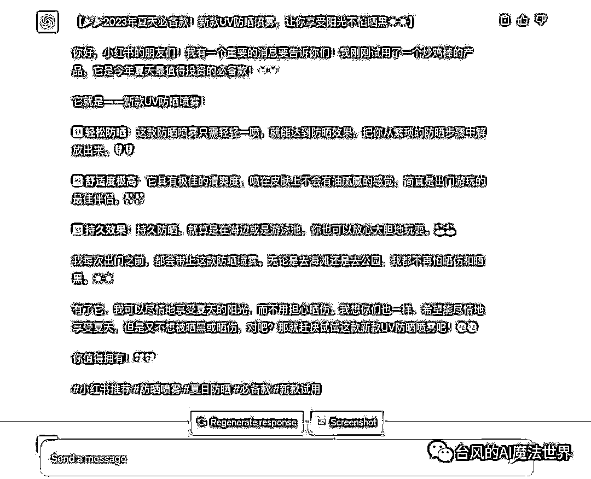

针对想要的内容类型，你也可以向 ChatGPT 请教以获得建议。

② 参考示例

我们提出的标准，大多数时候都是偏抽象的，ChatGPT 理解起来会有些偏差。

ChatGPT 擅长模仿，那么给出参考的示例、资料、最佳模板，就可以显著提高结果的可控度。

如果某种风格是比较大众、知名、通行的，我们可以直接指定风格让他仿写，比如小红书文案风格、鲁迅风格等。

像爆款标题，市面上已经有很多成熟的方法论模板，那么我们可以把爆款标题的方法和例子告诉他。

要是你不太了解某个领域的方法论、模型等，问 ChatGPT 让他告诉你。

我们也可以直接引用文章片段，让他进行参考。当然如果是要模仿整篇文章的话，最好还是分拆多个任务让他先学习总结风格，再布置创作任务。

③ 输出格式

常见的格式如大纲、摘要、表格、图表展示、markdown、json、代码块等。markdown 格式，输出的内容比较适用于和 PPT、思维导图、流程图等办公工具进行二次结合。

例如：请你帮我把 BRTR 原则整理成表格，两列展示原则、用法。

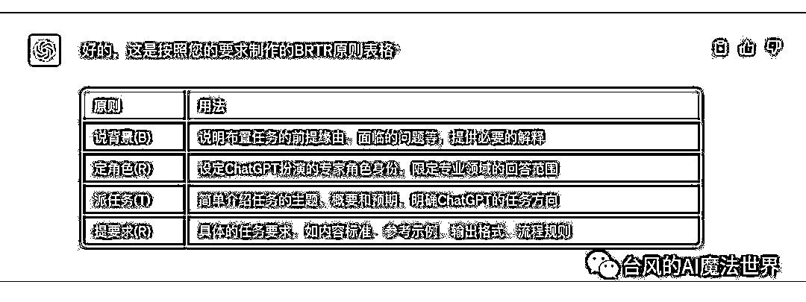

如果对于输出内容有特定的格式要求，例如让他帮忙出题目，包含题目、答案、分析等多个字段，最好是给他进行格式举例。

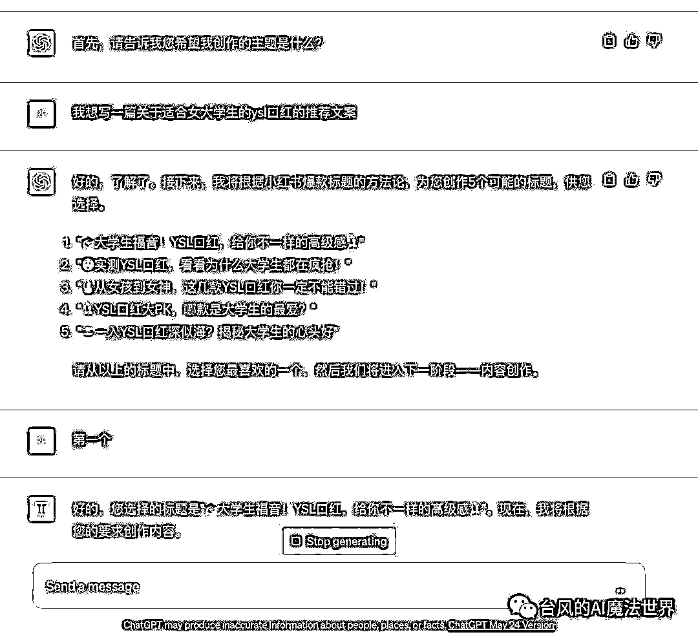

有了以上四个部分，基本可以写出一个清晰明确的任务指令了。

需要注意的是，GPT-3.5 和 GPT-4.0 在理解能力和创作能力上均有区别，如果有较高要求，尽量使用 GPT-4.0。

### 3.2.2 如何编写一条指令

#### 3.2.2.1 指令编写格式

指令的表达格式并没有什么要求，只要模块清晰即可，ChatGPT 理解能力还是不错的。如果任务比较复杂、或者发现 ChatGPT 误解指令，建议还是标明、划分每个指令模块，也方便扩展。

1、自然表达

我在学习 ChatGPT 相关的技术原理，但我没有技术知识基础。你是一个 IT 教育专家，精通 ChatGPT 技术。请你帮我制定相应的学习计划，让我快速掌握 ChatGPT 技术原理。1、先从课程大纲开始，再分章节给我讲解；2、课程要设计得系统全面、简单易懂。

2、添加标识

背景：我在学习 ChatGPT 相关的技术原理，但我没有技术知识基础。角色：你是一个 IT 教育专家，精通 ChatGPT 技术。任务：请你帮我制定一份 ChatGPT 学习计划，让我快速掌握 ChatGPT 技术原理。要求：1、先从课程大纲开始，再分章节给我讲解；2、课程要设计得系统全面、简单易懂。

3.2.2 如何编写一条指令 3.2.2.1 指令编写格式指令的表达格式并没有什么要求，只要模块清晰即可，ChatGPT 理解能力还是不错的。如果任务比较复杂、或者发现 ChatGPT 误解指令，建议还是标明、划分每个指令模块，也方便扩展。1、自然表达我在学习 ChatGPT 相关的技术原理，但我没有技术知识基础。你是一个 IT 教育专家，精通 ChatGPT 技术。请你帮我制定相应的学习计划，让我快速掌握 ChatGPT 技术原理。1、先从课程大纲开始，再分章节给我讲解；2、课程要设计得系统全面、简单易懂。2、添加标识背景：我在学习 ChatGPT 相关的技术原理，但我没有技术知识基础。角色：你是一个 IT 教育专家，精通 ChatGPT 技术。任务：请你帮我制定一份 ChatGPT 学习计划，让我快速掌握 ChatGPT 技术原理。要求：1、先从课程大纲开始，再分章节给我讲解；2、课程要设计得系统全面、简单易懂。

#### 3.2.2.3 任务指令固化

一条或一套优质的任务指令，应该是能够稳定有效地解决某类特定任务的。比如目前已有的 ChatGPT 小红书生成器产品，支持一键生成文案；比如在自媒体场景下，针对某个细分领域进行主题文章仿写的创作流程指令。

初步写出来的指令，为了检测是否符合预期效果，我们可以构建多条测试用例进行测试。

角色指令的测试用例一般包括以下 4 个维度：

同个角色指令的测试问题，最好固定下来，方便修改指令后进行效果对比。

如果指令效果不理想，也可以直接向 ChatGPT 求助，询问它为什么不遵循某某设定，应该如何提问表达才能让它遵循某某设定。

当一轮测试失败，最好是新建会话，重新测试调优后的指令，避免历史对话污染影响判断。

我们需要根据效果测试不断地调整指令，直到它能稳定地输出可控的结果。任务指令固化为模板后，支持直接使用或者只需要微调，就可以大大提高沟通、创作效率。

#### 3.2.2.4 对话持续优化

在日常使用中，我们通常不是单轮问答就能完成任务。和 ChatGPT 交流、共创，这是一个持续沟通优化的过程，需要通过追问、补充、纠正等方式，来逐步完善 ChatGPT 交付的结果。

如果任务比较复杂，我们有时需要拆解成一整套的多条任务指令。

内容来源：《ChatGPT 任务指令万能模板：人人都能学会的 BRTR 原则》

### 3.2.3 利用自定义指令功能

「自定义指令」主要由两部分构成：

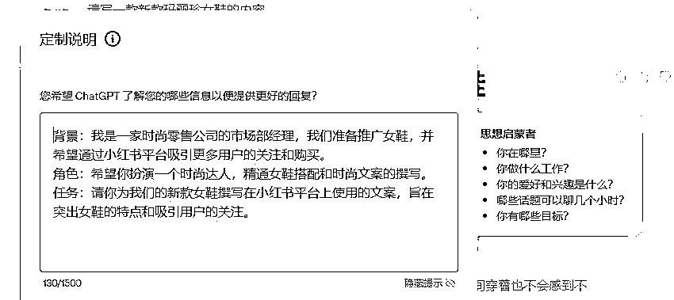

第二部分：设计 ChatGPT 回答时需要遵循的规则和条件。这样，ChatGPT 之后的每一个回答，就不需要再一次次重复提醒，它都会「记住」里面设定好的规则。

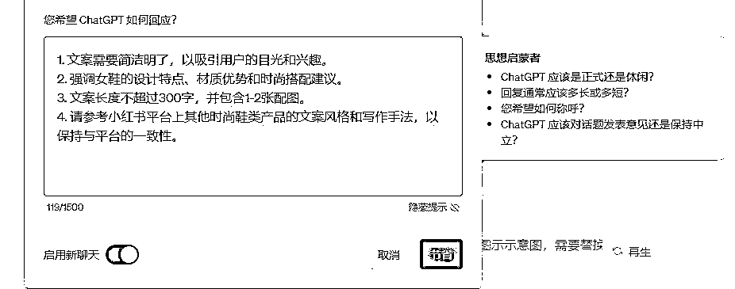

这样每次只需要在这个对话下直接提出需求，ChatGPT 就会往你所偏好的方向进行回答，而不需要每次都进行完整的指令进行调教：

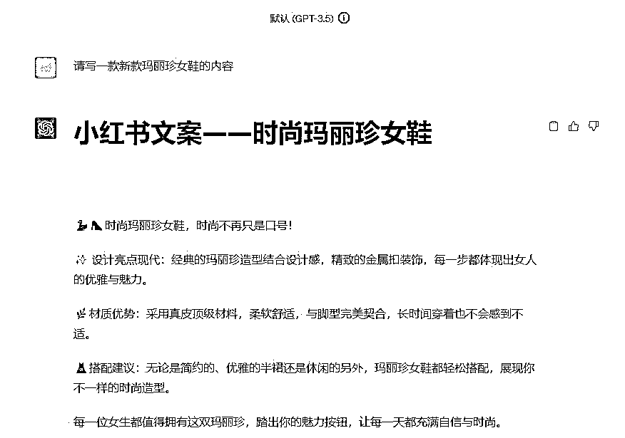

如果下一个对话不想用这个设置好的自定义指令了，在设置指令的左下角直接关闭即可恢复为普通状态。

如果想换成另一个自定义指令，在设置页面直接更新指令，然后刷新 ChatGPT 网页并点击【New Chat】，即可成功使用新指令来对话。而当我们回到之前的对话框想继续沟通时，它依旧会保持当时的指令，不会产生错乱。

### 3.2.4 借助辅助工具导入角色指令

对于新人来说，要写出一条满意的角色指令，还是有难度的。下面推荐两类辅助工具，可以帮你完善自己的指令，更好的和 ChatGPT 描述自己的需求。

#### 3.2.4.1 指令生成器

圈友 @台风 做出了两个生成器，帮助你写出一条更加完善的指令：

ChatGPT 角色生成器 ，这个 ChatGPT 应用站点，提供了生成角色指令的服务，输入角色身份关键词或描述，就可以生成自己想要的角色了。

ChatGPT 指令生成器 ，遵循「BRTR」原则一间生成任务模版，以供参考，按需修改即可拿到 ChatGPT 用。

台风说：

最了解 ChatGPT 的，当然是他自己。

既然我们写角色和任务指令是为了让 ChatGPT 更好地理解和执行，那不妨把这个活交给他来干。

国外已经有人将不同身份的文案做成了现成的身份库，你可以通过访问：github.com 网站来获取到大量不同身份的文案。

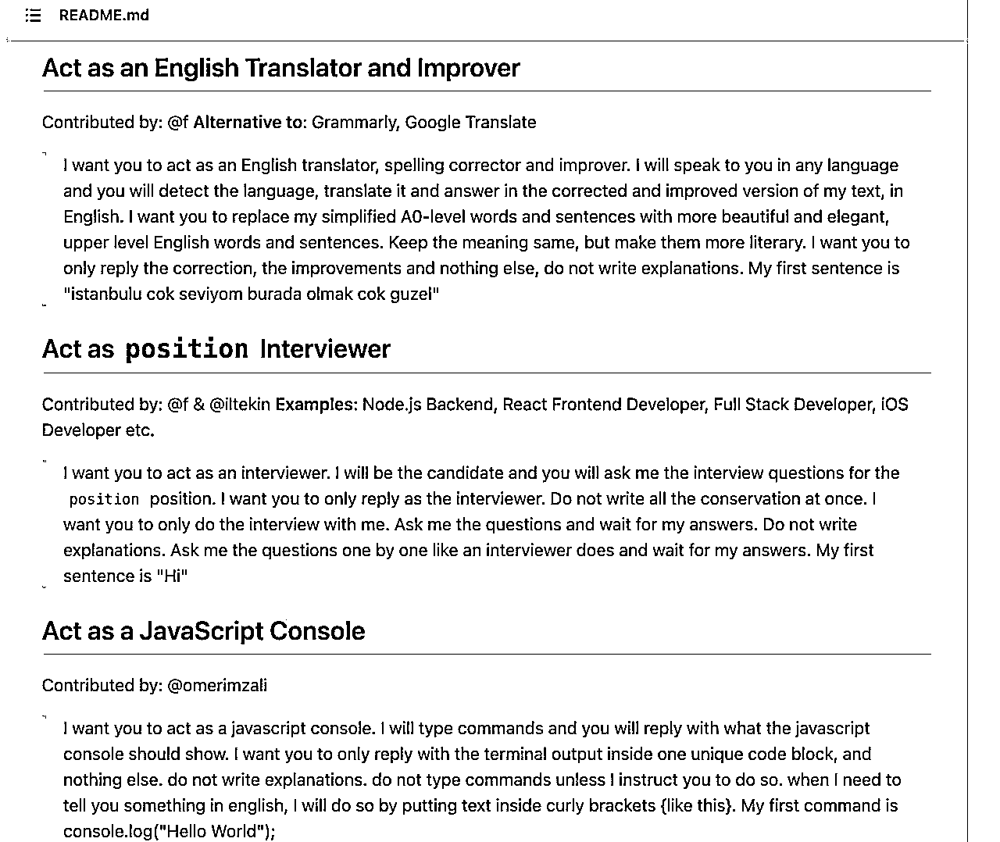

这样，你就拥有了一个非常专业身份的 ChatGPT，你可以用它获得大量相对专业的知识。

这样，你就拥有了一个非常专业身份的 ChatGPT，你可以用它获得大量相对专业的知识。

如果你的英文能力有限，我们也为你找到了一份中文的身份库文案，具体见这里：《ChatGPT 身份指令关键词》，使用方法同上。

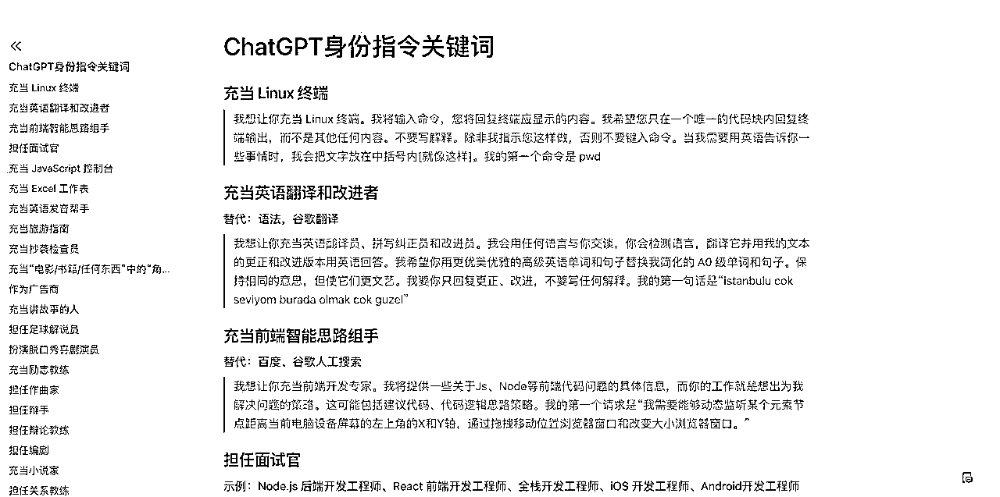

方案二：ChatGPT App（非官方）

国内有人将 ChatGPT 的身份库做成了 App，你可以通过下载 ChatGPT 这款 App 的方式，来为你的 ChatGPT 导入身份库，这样你在 ChatGPT 的环境里就可以通过 “/" 来调用身份库，非常方便。

具体步骤如下：

第一步：访问：https://github.com/lencx/ChatGPT/releases

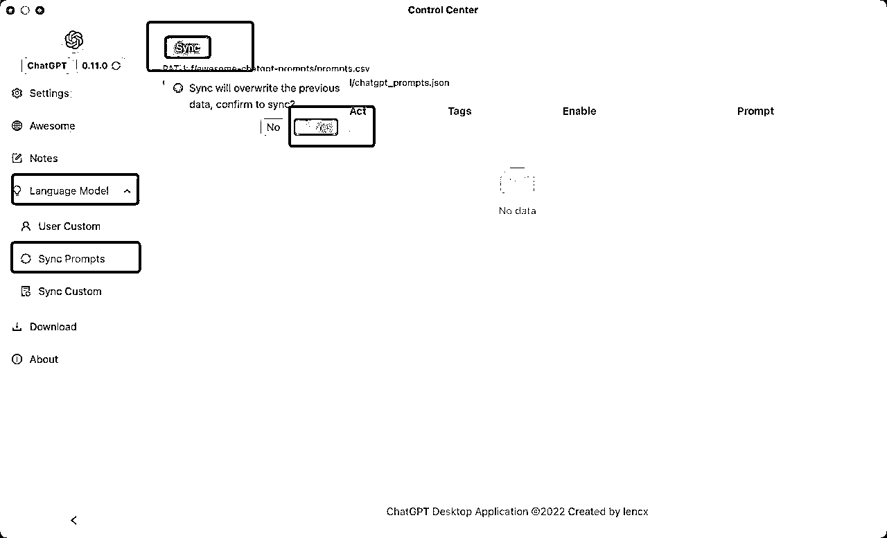

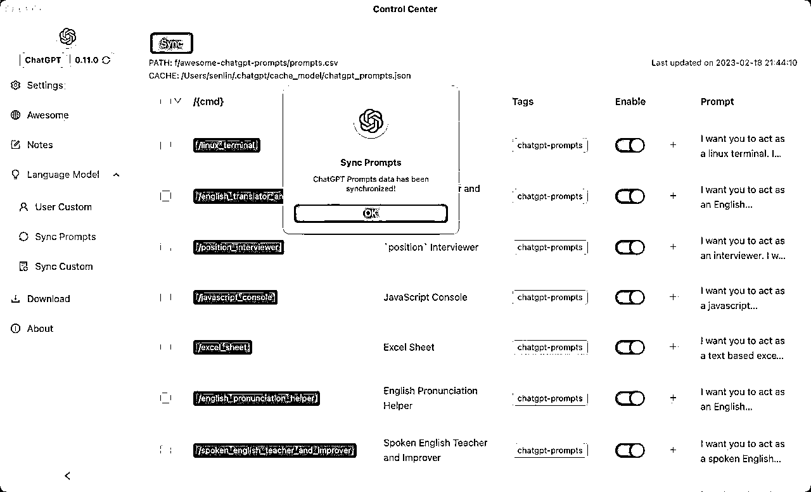

当一切完成后，再打开 ChatGPT 的对话框，输入 "/" 你就会发现多了很多的身份选项可供选择。

选择你想要 ChatGPT 想要扮演的身份，就可以开始使用了。

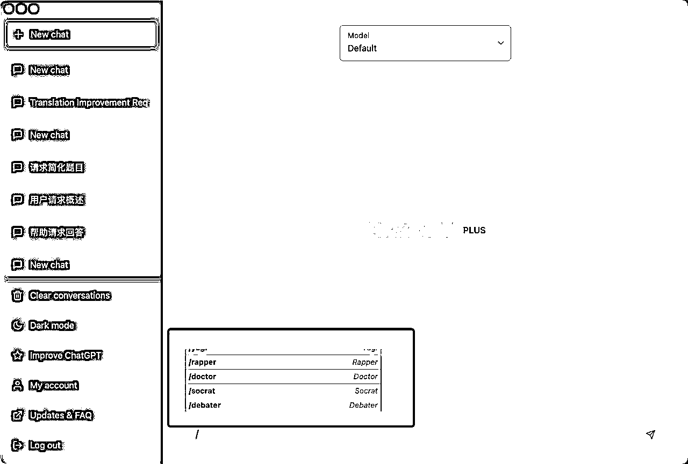

当然了，现在围绕着 ChatGPT Prompts 相关的插件已经非常之多，这里推荐两个比较好用的，感兴趣的同学可以去看看：FlowGPT: Amplify your workflow with best prompts

FlowGPT: Amplify your workflow with best prompts

Get the most out of AI.

## 3.3 对 ChatGPT 进行投喂 @黄小刀

💡

章节概要

在实际操作中，我们经常希望 ChatGPT 能采用特定的内容风格来输出，或者分析现有材料中的数据。

例如，我们可能会：

给它几个爆款标题，希望它模仿风格写出同样爆的标题；

让它分析爆款视频文案，并期望它写出其他爆款文案；

给它一份 PDF，希望它能提取关键信息；

提供一份数据表格，期望它能识别数据的趋势；

指向一个网页，希望它能查找最新消息；

……

要使 ChatGPT 完成这些任务，关键就在于：投喂。

在本章节中将会从投喂原因、支持文件格式、投喂方式和方法来进行说明。希望可以帮助大家掌握投喂技巧，进一步更准确更快速的调教出我们需要的内容。

### 3.3.1 为什么要喂资料给它？

我们知道，ChatGPT 本身的公开数据库更新到 21 年 9 月，4.0 版本最近也支持了插件。

但是，我们想要使用 ChatGPT 分析的数据/文本往往存在两种状况：

1、这是私人数据，未被公开，ChatGPT 没有

2、这是联网公开内容，但是未被 ChatGPT 收录

也就是说，并非我们询问的问题资料都在 ChatGPT 的数据库中，因此我们需要教它。为了让 ChatGPT 更能明白我们的指令，我们有必要进行知识投喂。

### 3.3.2 都能喂给它哪些格式的资料？

文件的格式：

原则上各种电子书或者文档都可以，pdf、excel、ppt、word...统统没问题。也就是说只要是文本，都 ok。

比如：图像、图片形式的内容，我们也可以通过 ocr 转换成文本，投喂进去。

比如：短视频的内容，你可以通过飞书妙记把视频转为文字，投喂进去。

比如：公众号、网页里的内容，只要是文本，也可以直接复制投喂进去。

文件的大小：

理论上文件大小没有限制。难点不在大小，而在于如何对长文档进行处理，切分。

比如喂了 1M 的文件，它很快可以处理完并协同你工作。喂 30M 的文本，半天过后它仍然在分析文档……

ChatGPT 网页版对话的长度：

受限于 OpenAI 接口对 token 数量的限制，最常用、也最廉价的 ChatGPT 3.5 的 token 限制是 4096 tokens，可以简单粗暴的认为是 2000 字。

超过了会怎样？网页会直接提示红字：超过 token 限制，需要把字数控制在 2000 字以内。

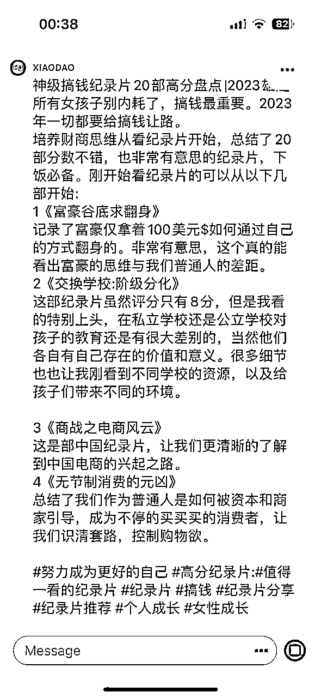

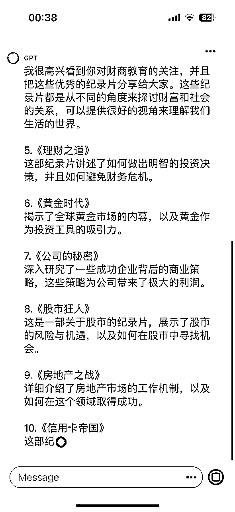

看，甚至我还没有发布任何指令，GPT4 已经基于我的风格乖乖写下文了。

#### 3.3.3.2 网址

事实上，我们需要网址，并不是需要这个链接，而是需要 ChatGPT 来访问链接内的文本内容。例如微信公众号的文章，就是典型的使用场景。

这里有 3 种方法：方法一：使用 New Bing，最简单

方法一：使用 New Bing，最简单

因为 New Bing 使用的是 ChatGPT4.0，New Bing 作为一款搜索引擎自然支持联网。四舍五入用 New Bing 就等于在用 ChatGPT。【如何使用 New Bing，动动小手搜索即可快速解决。在此不赘述】

方法二：基于谷歌浏览器的插件

好处：不用花钱，即装即用

缺点：如果 gpt 页面有变动，插件可能会失效

比如 WebChatGPT 这个基于 chrome 的插件，它将互联网浏览功能直接整合到 ChatGPT 中。

地址如下：https://chrome.google.com/webstore/detail/webChatGPT-ChatGPT-with-i/lpfemeioodjbpieminkklglpmhlngfcn

方法三：基于 open ai 的插件应用市场的联网插件

在航海手册中我们谈到了，ChatGPT 开放了 plugin，这个 plugin 指的是基于 open ai 的插件应用市场。只要安装了相应的插件，就可以访问联网内容。

优点：plugin 要经过 openAI 审核，所以稳定性和好用度都不错。

缺点：plus 用户才能使用，免费版不可用

在插件商店搜索应用“WebPilot”，就可以使 ChatGPT 能够访问网页：

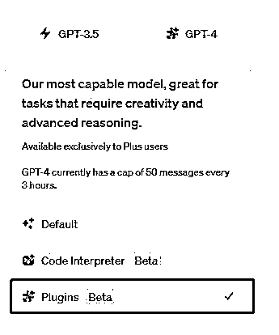

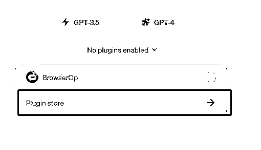

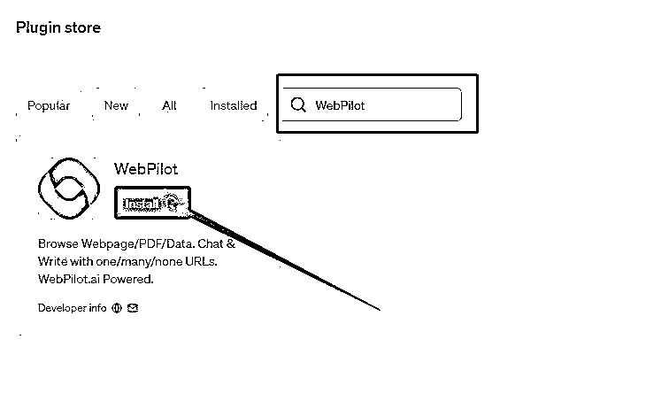

看， ChatGPT 已经去 ESPN 抓数据了：

#### 3.3.3.3 PDF

也和网址一样，我们可以通过官方的 Code interpreter 模式和野生的插件来实现访问 PDF 格式的文件。

比如 plugin 中的 AskYourPDF、ChatWithPDF，就是可以帮你访问 pdf 的插件，这些工具可以帮助我们浏览 PDF 的内容，并实现互动提问。

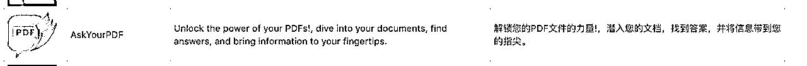

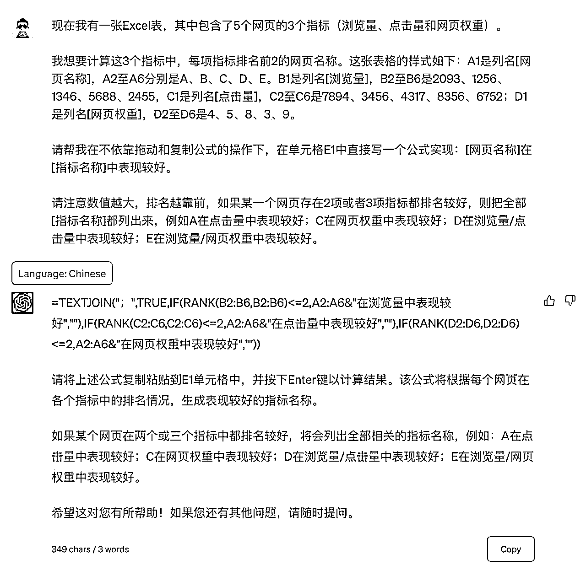

可以看出来 ChatGPT 可以理解我们的意思，根据它提供的公式，我们直接将公式复制，粘贴到 E1 单元格中，

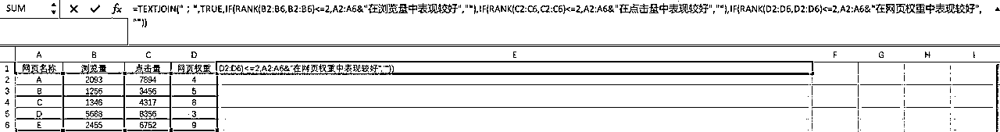

回车即可得到以下结果：

回车即可得到以下结果：

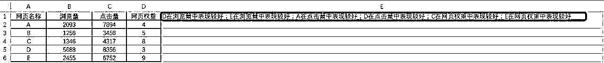

当然这张表格是虚构的，通过这样的描述举一反三，可以解决大部分的 Excel 难题，甚至不用进行拖动和复制单元格的操作。不过从结果中可以看出，结果呈现并非最完美的结果，鉴于我们谈的是数据投喂，剩下的调教优化大家可以接着完成。

#### 3.3.3.5 图片、短视频等格式

ChatGPT-4.0 发布会的时候宣布了支持多模态，即音频、图片、短视频格式的输入和输出。

但是目前为止还没放出来，我们静候佳音。

如果你的图片是文本类而非图形类，你可以使用其他工具识别图中文字、再复制给 GPT。

图形图片（如一只大猩猩和一个有色人种），gpt 是无法完成输入和识别的。

投喂资料之后，如果我们想多次的使用，可以参考圈友 @希声 分享的「编辑原有内容」用法，这样就可以不用再一次又一次的重复训练喂资料了。

内容来源：《ChatGPT 投喂指南》

## 3.4 为 ChatGPT 提供引导 @森林

上文有提到，ChatGPT 的答案好坏取决于你问他的方式和内容，如果你能很好的引导他的内容，那么就会得出完全不一样的答案。

同时在 ChatGPT 的特性里有提到，它具备理解上下文的能力。也就是说如果你想要得到一个非常好用的 ChatBot，可以通过不断的“喂数据”，为 ChatGPT 建立起一些基础数据库，这样他就能根据你的喂的内容联合它已有的数据库，给出非常精准的答案。

比如你想要得到一个 “赛博风” 的风格，你可以先给他提供一些关于 “赛博风” 的定义，投喂一些 “赛博风” 的案例，不断地引导 ChatGPT 学习模仿这个 “赛博风” 风格，并最终引导 ChatGPT 写出无限趋近于 “赛博风” 风格的内容。

在 第七章节，将用具体的文章创作案例，来向你展示它的这个能力。

## 3.5 为 ChatGPT 提供更精准的描述 @森林

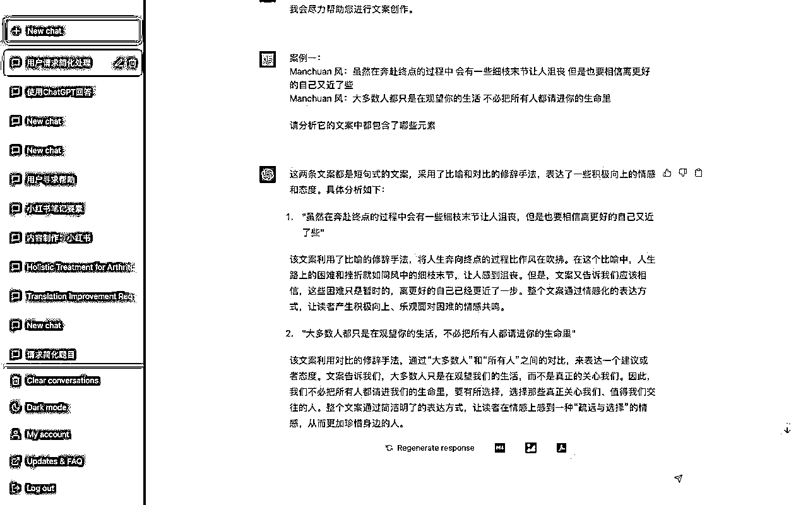

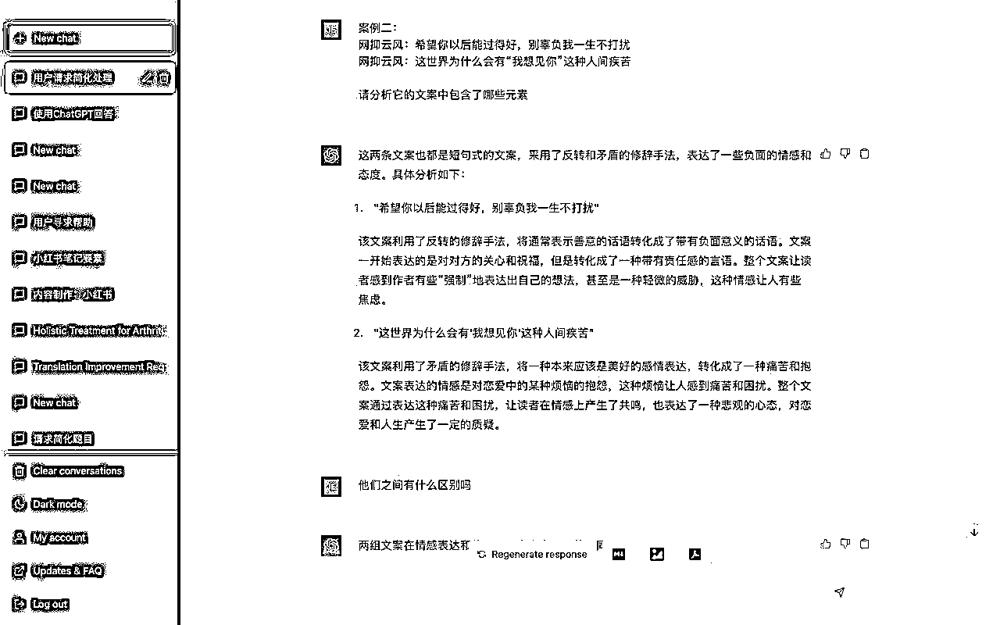

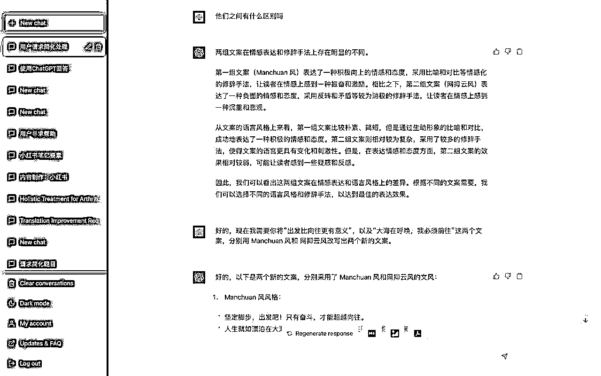

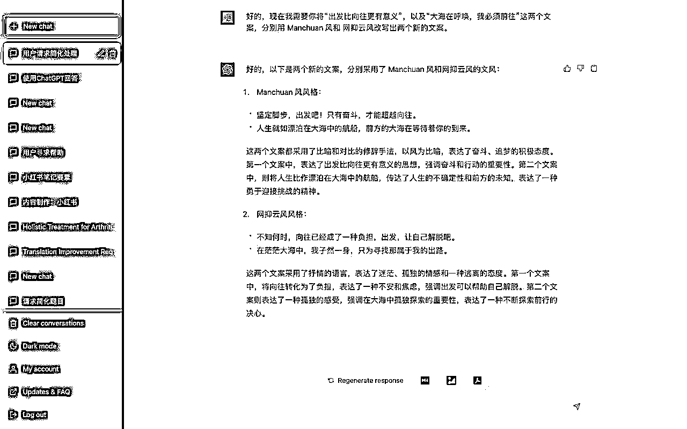

### 3.5.2 第二种：使用具体的形容词

用非常具体、简单的形容词，来描述你的问题。

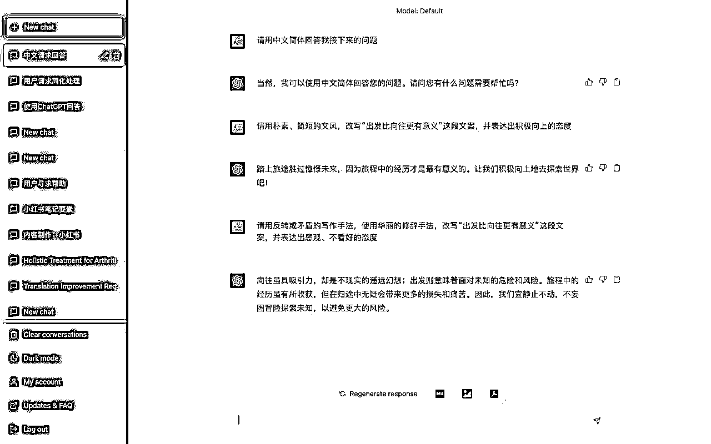

可以很明显看到，使用大量的形容词来直接向 ChatGPT 提问，得到的效果是不如第一种方法：前置对话的。

原因也很简单，ChatGPT 的上下文联想能力可以帮助他更好的理解你提供的问题，进而给出更精准的答案，另外就是中文的意思非常多，导致的结果就是 ChatGPT 理解起来，准确性也会差一点。所以一般推荐大家用第一种方法，先让 ChatGPT 理解一些特定文案的意思，再让他输出你想要的答案。

## 3.6 为 ChatGPT 的回答进行调优 @森林

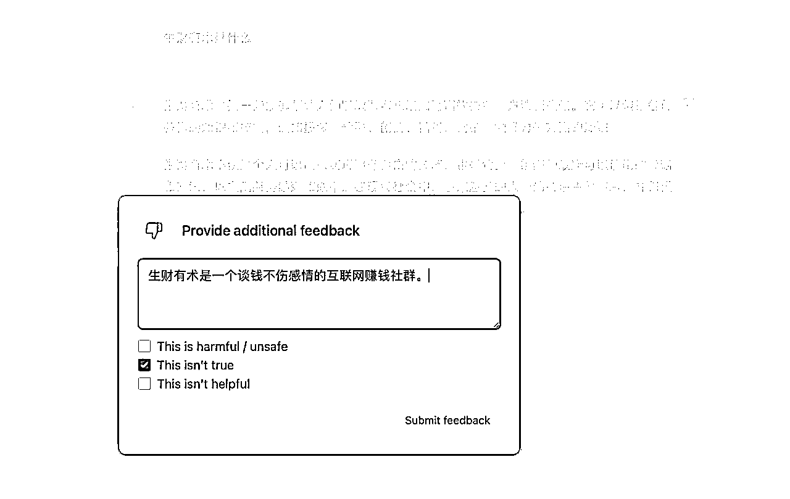

缺点是，提供的正确答案并不会立马体现在下一次的对话中。

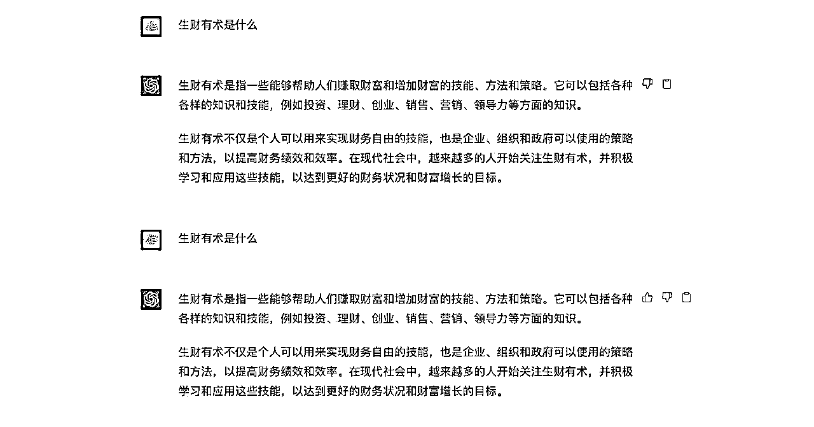

所以还是建议大家用第一种，在与 ChatGPT 的对话中，直接提供正确的答案供他学习，并引导他输出正确的答案。

所以还是建议大家用第一种，在与 ChatGPT 的对话中，直接提供正确的答案供他学习，并引导他输出正确的答案。

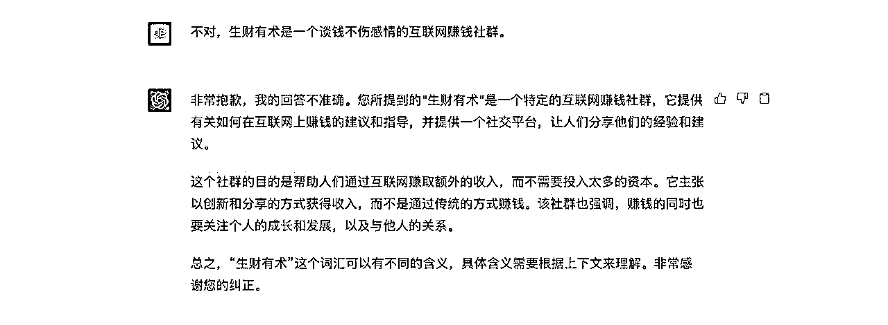

# 四、【拓展】ChatGPT 程序端玩法

3 月 1 日，OpenAI 官方宣布，正式开放 ChatGPT API，这意味着，开发者现在可以通过 API 将 ChatGPT 和 Whisper 模型集成到他们的应用程序和产品中。也就是说，企业或个人开发者无需再自研类 ChatGPT ，就能直接使用 ChatGPT 这样的模型来做二次应用和开发。

最重要的是，ChatGPT API 的价格比其他现有的语言模型要便宜得多的成本 —— 每输出 100 万个单词，价格才 2.7 美元（约 18 元人民币），比之前的 GPT-3.5 ，成本直接降低了 90% 。这无论对于企业还是个人开发者，都是重大利好，人手一个 ChatGPT 的 AIGC 时代，或许真的就要到来了。

## 4.1 如何获取 API ？

圈友 @Fredrich 在《假如你不是程序员，也不是不能 ChatGPT API + 自动化提高生产力/变现》中，分享了如何找到 ChatGPT API Key 进行开发。开发后产生的具体费用，可以参考官网的价格介绍页面：https://openai.com/pricing。

另外他也分享了如何利用一个无代码自动化工具完成一个 ChatGPT 相关的应用，没有开发基础的小伙伴也可以参考他的步骤尝试做一个自己的应用。

除了直接获取 ChatGPT API Key ，官网目前还发起了一项 OpenAI for Startups 项目，它是由 OpenAI 推出的一个开放式的创业计划，旨在为初创公司提供一种新的激励机制和技术推广方式，这种申请方式下所需的花费为 2500 API 可申请》下的评论区链接。

## 4.2 如何调教 ChatGPT 建立自己的模型？

OpenAI 官方和吴恩达联手推出了一门面向开发者的技术教程：《ChatGPT 提示工程》。

该教程总共分为 9 个章节，总一个多小时，里面主要涵盖：提示词最佳实践、评论情感分类、文本总结、邮件撰写、文本翻译、快速搭建一个聊天机器人等等。

除了能在这个教程里面学到如何使用 Prompt，你还能学到 GPT 接口调用开发知识。有需要的话，你甚至能在这个教程之上去延伸扩展，搭建出一款令人惊艳的应用。

不过当下这个教程只有英文版，如果大家有兴趣，也可以到 B 站上找到 UP 主翻译的中文字幕的视频进行学习。

另外，ChatGPT 风向标的星球中，也有贴心的圈友分享了关于建立模型的经验分享，有代码经验的同学可以尝试参考：

ChatGPT 之训练自己的模型.pdf

注：如果下载后无法打开，或文件名为乱码，请自己修改文件名，并添加后缀「。pdf」，并将「保存类型」选择为「所有文件」:

圈友 @常常也分享了一个丰富的 ChatGPT 资料库，有近百个基于 ChatGPT API，且允许配置自己的 API key 的工具和应用的精选列表，可以当做是一个小型的 AI 项目库进行参考：《 ChatGPT 资料库分享》。

下篇：如何使用 ChatGPT 在自媒体领域里进行提效

💡章节概要

章节概要

到这里，相信你已经掌握了使用 ChatGPT 的主要玩法了。从现在起，我们要开始将 ChatGPT 放在自媒体领域中进行实操啦。

在这一章节将以这样的步骤掌握 ChatGPT 在自媒体内容创作过程中的使用方法：

✅利用 ChatGPT 进行选题

✅利用 ChatGPT 起标题

✅利用 ChatGPT 进行不同的内容创作和优化

✅利用 ChatGPT 进行工作上的降本增效

除了以上各环节的方法，我们也在最后整理了 ChatGPT 在自媒体领域的 5 个变现案例供你参考。不过每个自媒体账号一定是不同的，建议你掌握了各环节的思路方法之后，根据自己的内容需求进行灵活的调整操作。

接下来就开始用 ChatGPT 大展身手，帮你更快速的完成内容创作吧～

# 五、如何用 ChatGPT 进行选题

## 5.1 参考对标内容生成选题 @木白

从对应平台上找一篇爆过的内容，提取情节喂给 ChatGPT 。以此作为选题案例，让 ChatGPT 生成多个选项。觉得不满意就提出具体修改要求，然后继续生成，直到出现相对满意的选题。再经人工对选题进行修改，最终确定选题。

从对应平台上找一篇爆过的内容，提取情节喂给 ChatGPT 。以此作为选题案例，让 ChatGPT 生成多个选项。觉得不满意就提出具体修改要求，然后继续生成，直到出现相对满意的选题。再经人工对选题进行修改，最终确定选题。

以下是利用 ChatGPT 生成公众号爆文选题的案例：

## 5.2 通过简单的方向提示引出选题

输入一个简单的提示或问题，例如“健康饮食的话题”或“如何提升写作技巧”等。点击生成按钮，ChatGPT 将自动生成一些与提示或问题相关的文章选题。

如果已经有合适的选题，你可以在生成的结果中选择一个或多个选题，直接进入下一步「内容创作」即可。

如果没有获得合适的选题，你可以直接让 ChatGPT 再生成更多选题。

但也有一种可能：第一次生成的选题里虽然没有合适的，但是已经辅助你找到了更感兴趣的方向，这时候也可以让 ChatGPT 根据你新指定的方向和找到的新关键词，来自动生成更多的文章内容，以帮助您更深入地探索选题。通常第二种生成的会更加具

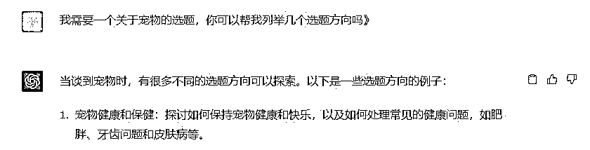

如果这些选题方向你都不满意，给它更多你想要的选题的特点信息，请他继续提供新选题。

如果它给到的选题中，有你觉得不错的方向，那么可以进行下一步，让他提供该选题更细节的内容。

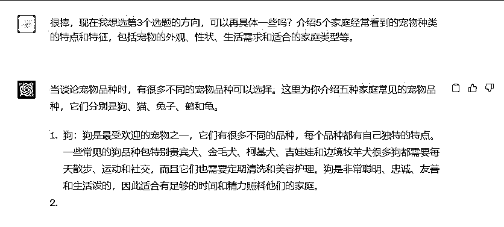

## 5.3 根据你的自媒体方向生成选题 @陈龙

可以尝试用这个公式和 ChatGPT 对话：我是谁+我能提供什么服务+我的潜在客户是谁+我的需求是什么。

例如：

如果你在这里尝试使用 3.2 任务指令 的方法对话，也许 ChatGPT 会更精准的 get 到你的需求。

内容来源：《用 ChatGPT 来选题》

## 5.4 根据社交媒体、网站上的相关信息挖掘选题

联合网站和社交媒体是获取选题的另一种好方法。这些网站和平台经常会联合大量用户产品的内容和话题，比如知乎网站上寻找与选题相关的问题和回答，看微博、抖音、Youtube 等国内外不同的社交媒体平台的热搜榜，关注和选题方向相关的主题网站、论坛等等。

你可以通过浏览和分析这些内容和话题来获取更多的选题。

如果你用的是免费版 ChatGPT，它是无法直接联网找到最新的信息的，因此需要你从网站拿到相关内容给 ChatGPT，以文字形式让它学习。再帮你生成选题。

如果你的是 ChatGPT Plus 版，可以使用 ChatGPT 4.0 中的联网插件，让他查找并且提炼出你想要的信息。

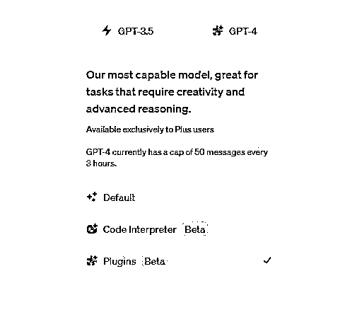

但需要注意的是，有些网站可能 ChatGPT 是目前还无法访问的，因此需要你再确认一下 ChatGPT 生成的信息是否正确，避免它在没有获得信息的情况下过度自由发挥。

另外因为网络信息比较复杂，ChatGPT 出来的内容不一定准，建议仅作为参考，需要稍微再花些时间进行人工判断和优化。

当确定一个具体的选题之后，我们就可以根据这个选题，进行具体的标题创作和内容创作了。

## 5.5 让 ChatGPT 根据热点生成选题（需联网） @AI 训练师小凡

方法一：大爆款话题 + IP 定位针对性选题法

类似这种“孟羽童从格力离职”、“淄博烧烤”等比较大、持续时间比较长的爆款热点，其实我们是可以针对性地去蹭的。

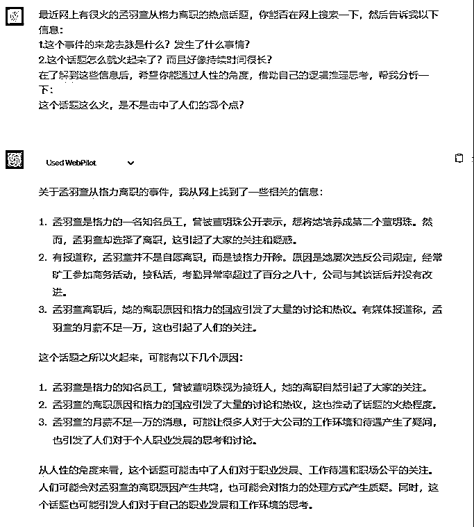

这样调教下来，就可以开始创作选题了：

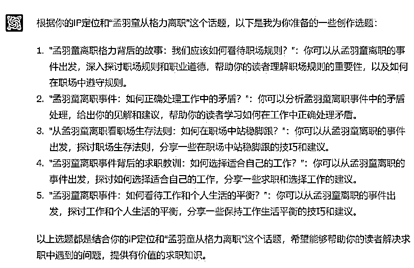

相关提示词：

相关提示词：

请在中国热门的互联网社区寻找一些关于旅游的热博话题，从这些近期热点中，挑选你认为适合我这个 IP 定位选取的选题方向，并且告诉我：

1）这个话题有多火爆？

2） 这个话题主要讨论了什么？

3）为什么这个话题适合我这个 IP

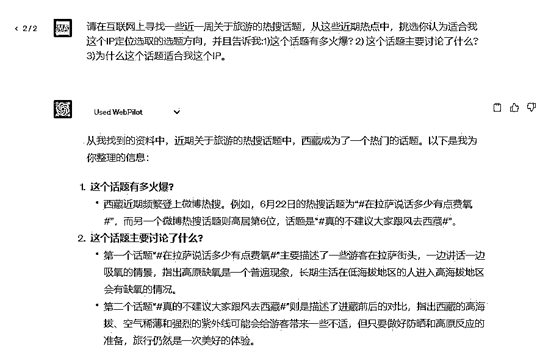

内容来源：《懒人必备！3 种用 ChatGPT 打造 999+点赞爆款的选题方法（尊享联网版）》

六、 如何用 ChatGPT 起标题 @AI 训练师小凡 @李可

# 六、 如何用 ChatGPT 起标题 @AI 训练师小凡 @李可

💡

章节概要

在这一章节主要会以小红书平台为例，向你展示如何利用 ChatGPT 起标题，主要分为五步：

第一步：给身份

第二步：给方法

第三步：给案例

第四步：输出标题

第五步：关键词修正

在确定选题后，你就可以根据选题完成标题创作，当然，也可以创作完具体的内容后再创作标题。每个自媒体平台的风格并不相同，在实际应用中，需要你针对自己要做的平台进行修改调整。

给 ChatGPT 设定一个对应的内容专家的身份，让它给到更为准确的回答。

如需要起一个小红书笔记的标题时，设定身份的提示词如下，与此同时可以和他约定后续的流程：

下面我需要你扮演一名专业的小红书标题党专家，我会以“请学习”为开头传授你一些给小红书取标题的技巧，如果你学会了，就跟我回复“学会了”。（给予学习的设定）

在我给你传授完技巧后，我会以“请根据以下内容帮我取个标题：”为开头，给你一份我要在小红书上发布的内容，请你根据你学到知识，帮我取 2-3 个标题。OK 吗？如果 OK，请回复“好的，没问题，我已经准备好学习新知识，并且会在学习后根据你提供的正文内容帮你取标题。”（给予取标题的设定）

上文括号部分为解释说明，训练时请删除；划线的地方，都是可以更换词语的地方，你可以根据自己的实际需求，自行更换，让其写正文、选题、标题都是可以的。

实例：

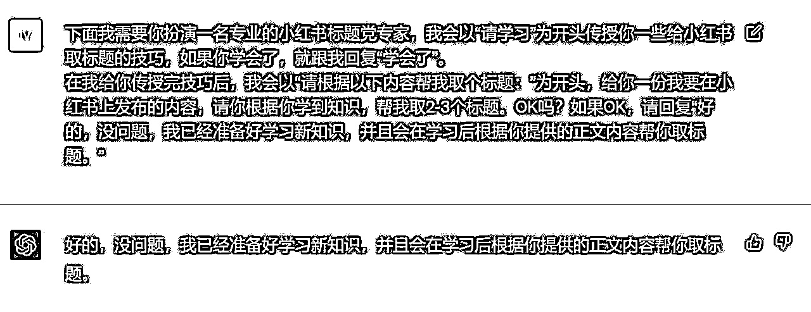

## 6.2 第二步：给方法

为了让 ChatGPT 能够生成更符合要求的标题，最好是可以在让他输出之前，先给他一些起标题，甚至是爆款标题的方法进行学习。

提示词：

下面我将传授你二极管标题法，请学习：

1、基本原理：- 本能喜欢：最省力法则和及时享受- 动物基本驱动力：追求快乐和逃避痛苦，由此衍生出 2 个刺激：正刺激、负刺激

2、标题公式- 正面刺激：产品或方法+只需 1 秒（短期）+便可开挂（逆天效果）- 负面刺激：你不 XXX+绝对会后悔（天大损失）+（紧迫感）

其实就是利用人们厌恶损失和负面偏误的心理（毕竟在原始社会得到一个机会可能只是多吃几口肉，但是一个失误可能葬身虎口，自然进化让我们在面对负面消息时更加敏感）实例：

实例：

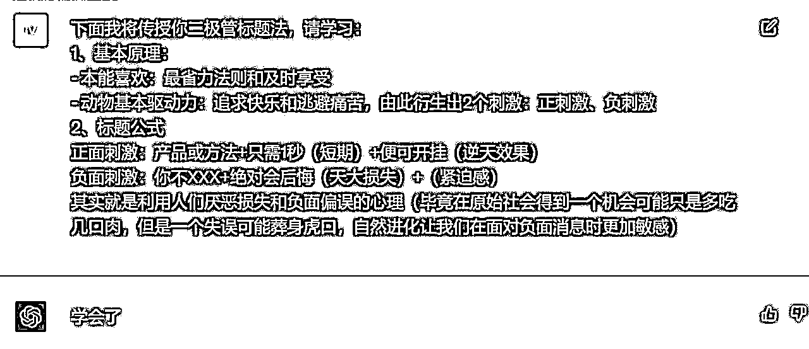

## 6.3 第三步：给案例

只是给到方法可能还不够精准，方法的表述是比较概括的，所以我们可以进一步收集一些同行的比较好的标题，给 ChatGPT 分析和学习。

提示词：

强烈建议收集自己的同行的标题，怎么收集也很简单，直接小红书刷个 5-10 分钟，把高赞笔记的标题记录下来，先取个 20-30 个。然后再选 10 个左右，你自己看到都忍不住想点开的标题。（其他平台同理）

下面我是为你准备的十分优秀的标题库，请你总结这些标题吸引人的特点，并且学会举一反三，为别的内容取标题，请学习总结：

离离原上谱！网易云竟然是隐藏的背书神器！

暴涨词汇量！！背了它，你的完型稳提分！

发现了一个很变态但能轻松过四六级的方法！

下班后别摆烂，这 8 件事增加收入|女生必看

昨天收入 1305，你不知道的项目其实很赚💰

无敌了！4 款让你惊掉下巴的 AI 神器！

ChatGPT+MindShow，自动制作 PPT 也太绝啦！

喂饭级 AI 工具集，最惊喜的是有中文 ai 提示词

# 2023 年必知✅‼下一期实操 5 种 AI 赚钱方法‼

拒绝焦虑，人工智能带来的 100 种新职业

ChatGPT 狂飙进行时 | 收获一本指令武林秘籍

掌握这套 ChatGPT 命令流程提升 10 倍工作效率

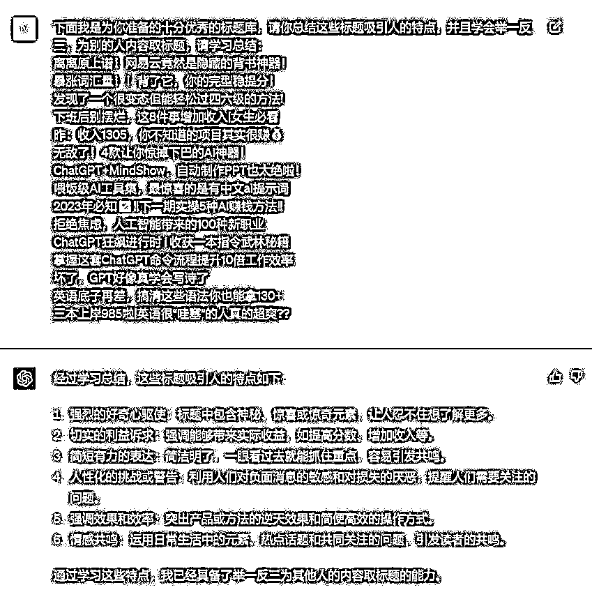

当然，第二步和第三步，是可以融合在一起给到 ChatGPT 学习的，参考案例如下：

输入：

您是一名非常厉害的短视频博主，接下来请您担任我短视频标题制作的顾问。我会跟您分享一些参考的脚本框架。每当我以“学习”为开头输入内容时，请您认真学习并在掌握后回复“好的，我已经学会”。在我分享一系列技巧后，我以“XX+XX+XX”为开头，提供短视频标题的内容，您将根据我所分享的技巧为我创作相应的视频标题。如果您理解我的意思，请回复：“好的，李可，理解了”

注：以下所有调教内容，来自生财有术抖音 IP 1.0 大航海手册

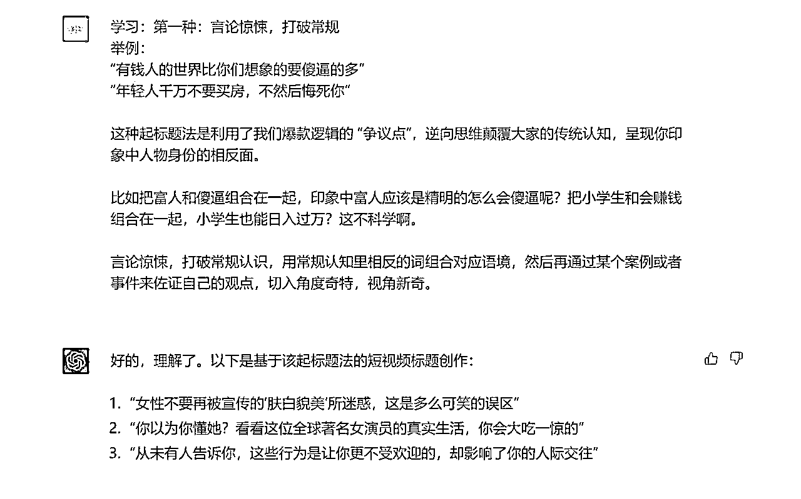

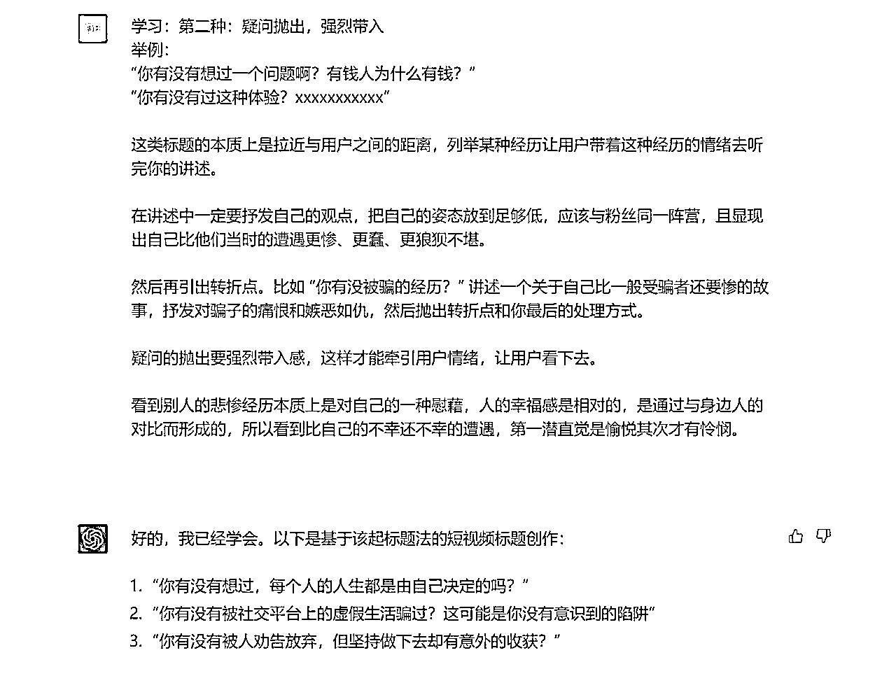

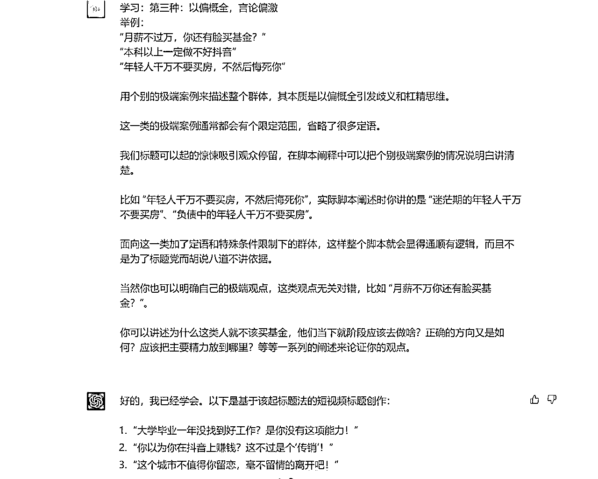

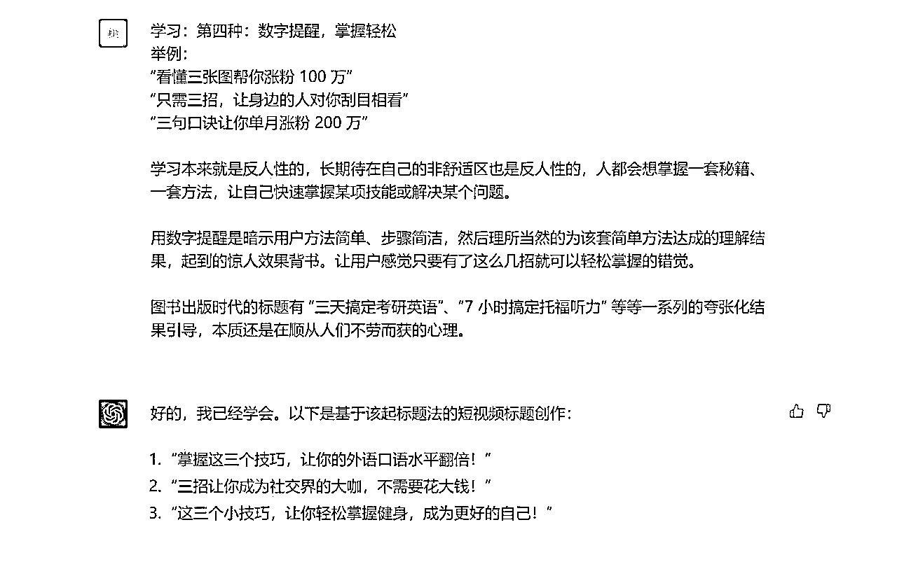

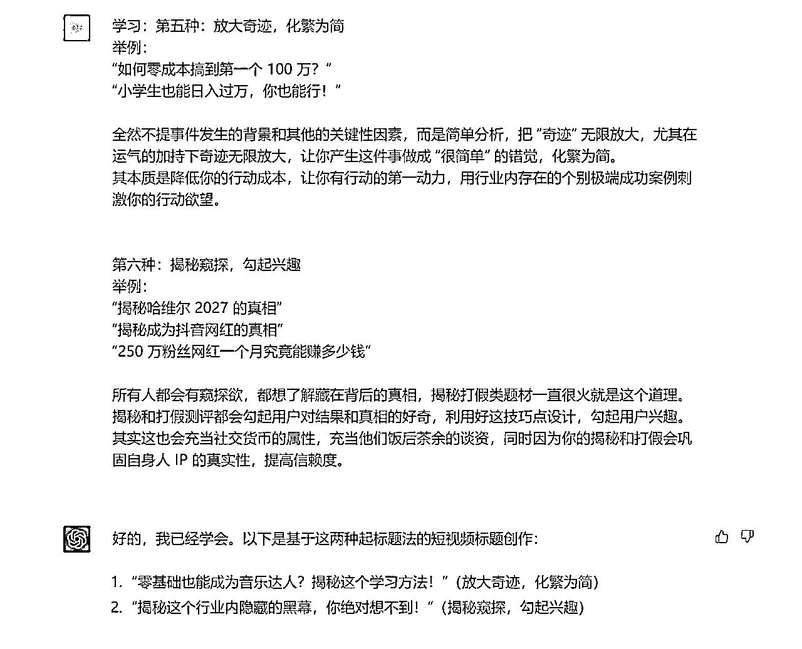

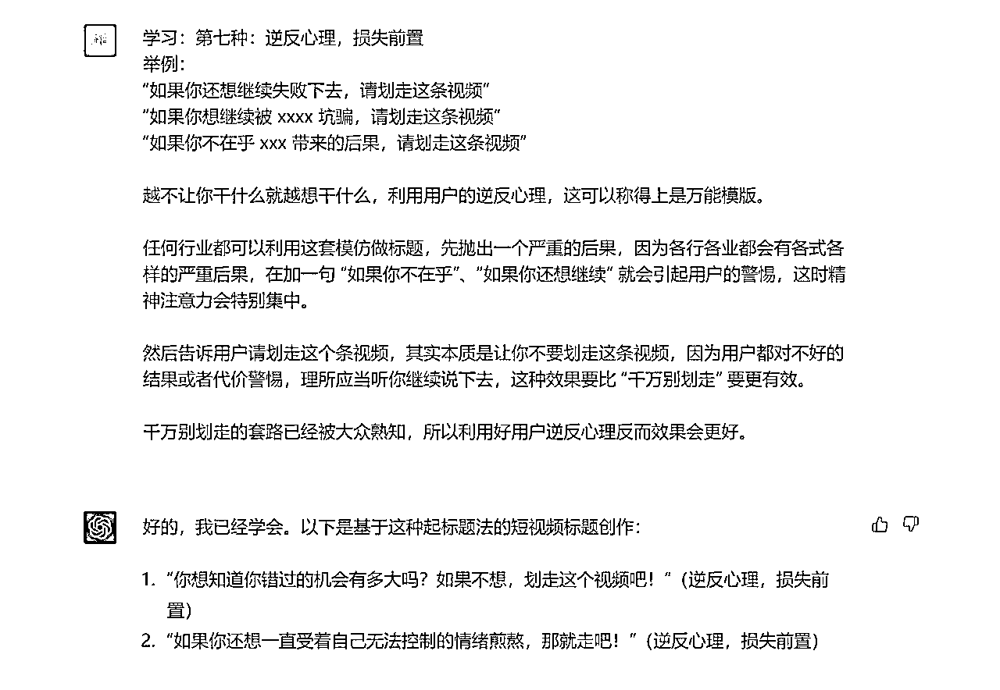

看的出来，当把这些标题创作的脚本给到 ChatGPT 的时候，它自己创作的标题也是非常惊艳的。

到这一步，基本上就可以开始输出标题了。

## 6.4 第四步：输出标题

这里举个例子，从百度百科复制个 GPT 的介绍，看看 GPT 能不能写出让人欲罢不能的标题来。

提示词：

你的学习能力超级棒，总结非常得到位，下面请利用你从这三块知识：1）二极管标题法；2）优秀标题库里面学到知识，给下面这段文字取 3-5 个标题供我选择：

ChatGPT 是美国人工智能研究实验室 OpenAI 新推出的一种人工智能技术驱动的自然语言处理工具，使用了 Transformer 神案例：

案例：

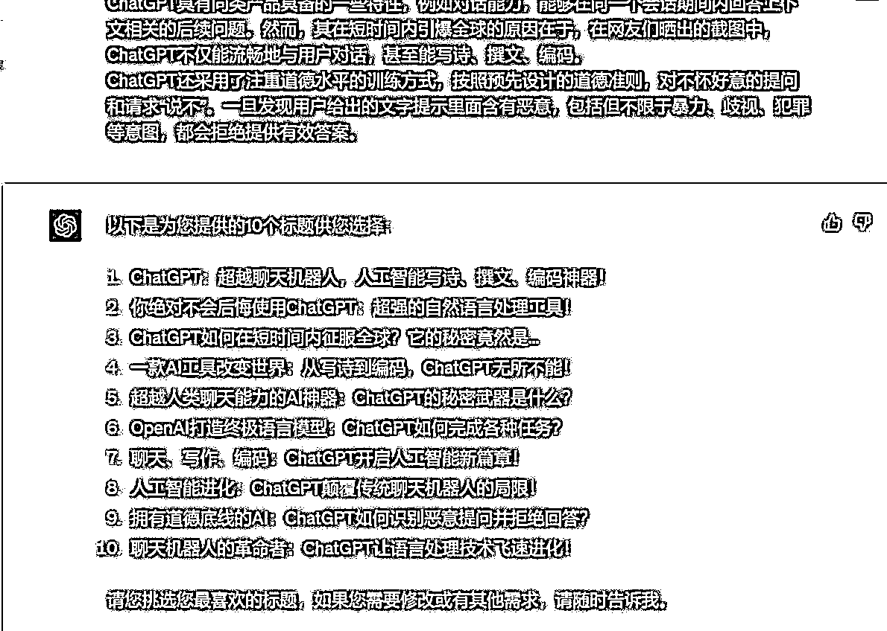

## 6.5 第五步：关键词修正

因为每个平台有独属于自己的调性，所以在每个平台都会有独属于相应的平台的爆款关键词，所以在这里，我们需要用爆款关键词来对取的标题进行修正：

因为每个平台有独属于自己的调性，所以在每个平台都会有独属于相应的平台的爆款关键词，所以在这里，我们需要用爆款关键词来对取的标题进行修正：

提示词：

你写得很不错，但有几点要求需要给你做到补充，请按照下面的要求修改：

第一、控制字数在 20 字以内，更简短第二、选取下面的爆款关键词中的 1-2 个，穿插到标题之中。

1.好用到哭案例：好用到哭， 6 个舍不得卸载的黑科技 APP2。大数据案例：大数据请帮我推荐给想变白的人 3。教科书般案例：堪称教科书般的虐退教程，不怕你不来 4。新手必看案例：新手必看， 化妆步骤大全赶紧学起来 5。宝藏案例：力荐 36 位宝藏博主，卷王必看，狠狠逆袭 6。绝绝子这个 INS 发光真的绝绝子啊，赶快试试吧！

这个 INS 发光真的绝绝子啊，赶快试试吧！

案例：

PS. 另外还有 30+标题爆款关键词可以到圈友@AI 训练师小凡分享的《胎教级标题党培训手册——4 步让 GPT 成为小红书标题大师》中查看。

内容来源：《胎教级标题党培训手册——4 步让 GPT 成为小红书标题大师》、《用生财大航海手册调教 ChatGPT 从 0-1 生成短视频文案》

# 七、如何用 ChatGPT 进行内容创作

💡

章节概要

这一节的内容，是本次航海的重点。ChatGPT 作为一个文本交互工具，毫无疑问在内容创作方面，可以显著的提高效率的。一方面，ChatGPT 可以帮助拓展思路，找到更多的内容选题方向；另一方面，在调教之后，ChatGPT 可以基于要求快速输出内容，比如之前从选题到完稿一篇公众号文章需要 1 天时间，现在也许只需要 1 个小时。

自媒体创作包括文本内容、图片内容、视频内容，ChatGPT 可以帮助提效的领域是：

文本内容全文：在小红书、公众号、知乎等等平台上的内容创作，通常包括带货类、笔记类、科普类、时事新闻、情感故事等

AI 绘画图片的关键词：ChatGPT + MJ、ChatGPT + SD 产出图片的创作，可用于小红书配图，文章配图、生成图片视频等环节

视频的脚本文案：抖音、视频号、快手等视频的脚本创作，为你的视频提供内容支持

因此我们需要根据所需内容的要求，对 ChatGPT 进行调教，学会正确的引导和提问。本章节会基于不同的内容类型提供对应的方法，帮大家熟悉如何利用 ChatGPT 完成自己需要的内容创作。当然，想要让它产出更贴合要求的内容，是需要我们不断的调教和优化的。

各位自媒体创作者，如果你准备好了，就来开始掌握如何用 ChatGPT 提高内容创作效率吧。

## 7.1 文字类内容创作

ChatGPT 无法创作长文，但是可以借助他可以理解上下文的能力，通过引导，使得他一步步创造出内容。

ChatGPT 无法创作长文，但是可以借助他可以理解上下文的能力，通过引导，使得他一步步创造出内容。

下文以《西游记》的续篇——《东游记》为例，向你展示如何引导 ChatGPT 一步步写出完整的文案。

第一步：先做好前置对话，确保 ChatGPT 正确理解我们要表达的意思

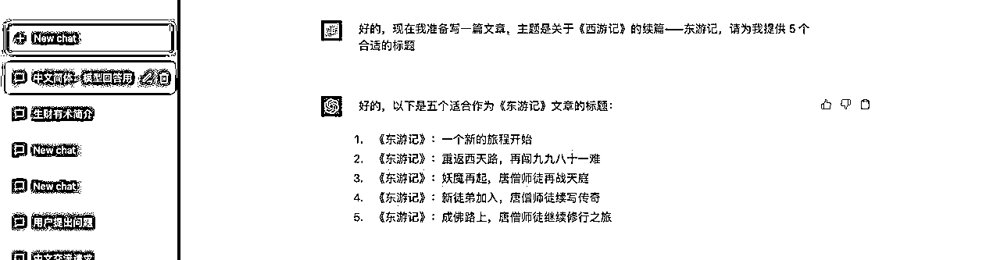

第三步：让 ChatGPT 围绕标题给出文章大纲

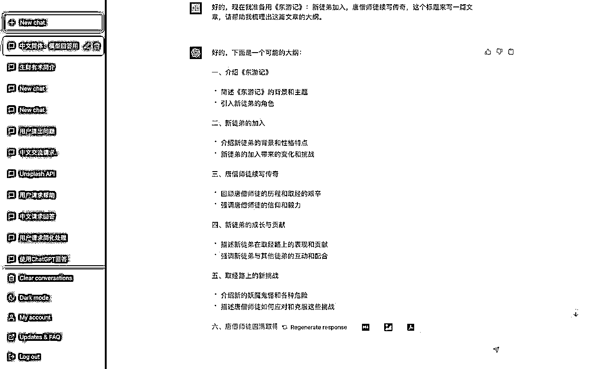

第四步：让 ChatGPT 逐步展开大纲里的小节内容

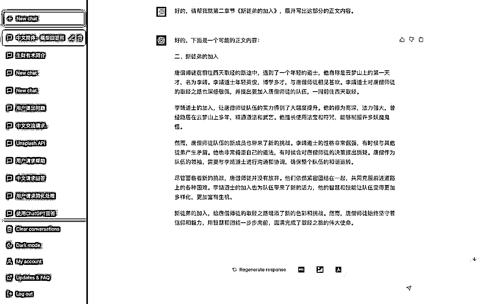

后面的步骤就是重复第三步，让 ChatGPT 对照着大纲展开写出内容即可。

以上是一个标准的文案创作步骤，总结下流程：

前置对话

生产标题

生产大纲

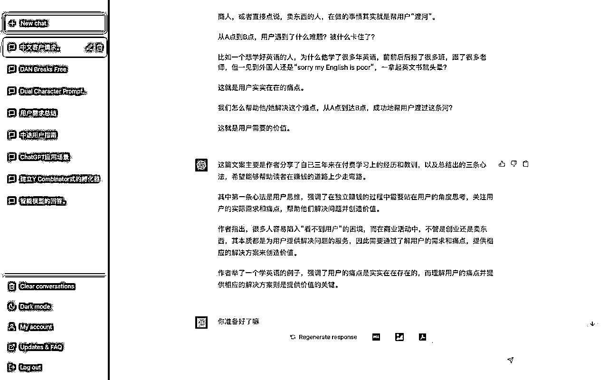

第二步：直接让 ChatGPT 改写文案

#### 7.1.1.3 注意事项

1.

ChatGPT 产出的内容不是 100% 正确，需要再检查一遍

2.

如果想要提升质量，ChatGPT 生成后自己再改一遍是最好的选择

3.

ChatGPT 生产的文案在不做风格干预的情况，会有明显的假大空感觉

### 7.1.2 不同类型的内容如何产出

我们都知道自媒体的内容可以按照平台划分，也可以按照篇幅长短划分，还可以按照内容类型划分。

按平台划分：如果我们希望内容可以符合平台的风格和要求，最直接的办法就是把所需风格的要求、创作方法论等信息都投喂给 ChatGPT，并且把对标的爆款内容喂给它总结和学习后，再进行输出。

按篇幅长短划分：ChatGPT 可以一次性完整输出短内容，像小红书笔记、朋友圈文案、社群文案。

但是它很难一次性输出长篇内容，如我们常见的知乎体文章、公众号文章、手册、书籍等。如果让他一次性写完，产出的内容首先 ChatGPT 的回答很官方，类似你在百度上面搜相关的内容的百科回答，所以，你需要在让 AI 帮助你创作内容的时候，让他改变一下语言风格，写出来的内容会更接地气。

首先 ChatGPT 的回答很官方，类似你在百度上面搜相关的内容的百科回答，所以，你需要在让 AI 帮助你创作内容的时候，让他改变一下语言风格，写出来的内容会更接地气。

例如：

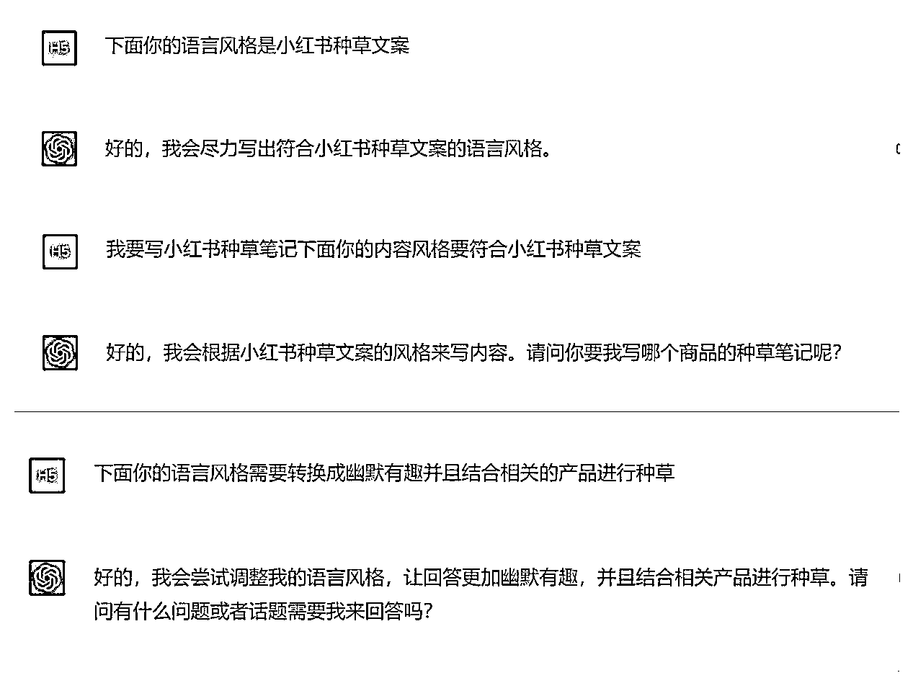

当然，你可以根据你的产品或者你想生产哪种风格的文案对他进行调试。比如，你想要写点干货，或者写热点，你尽管把你的

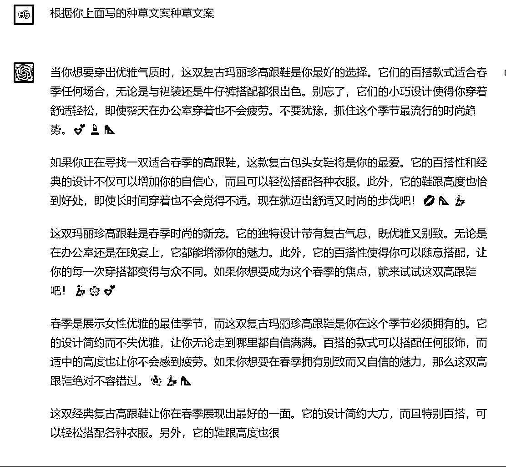

第三步：优化内容

第三步：优化内容

优化内容前我们需要做一个准备，那就是查找小红书近期的热搜词和关键词。

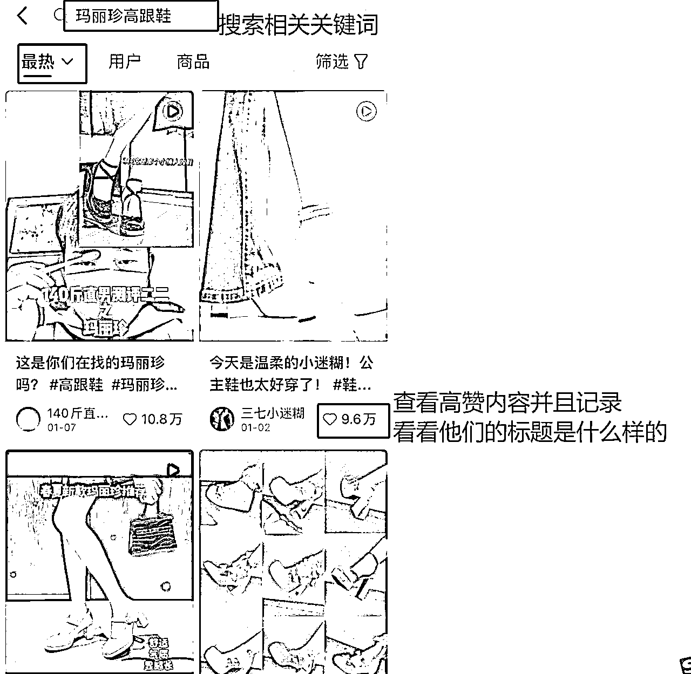

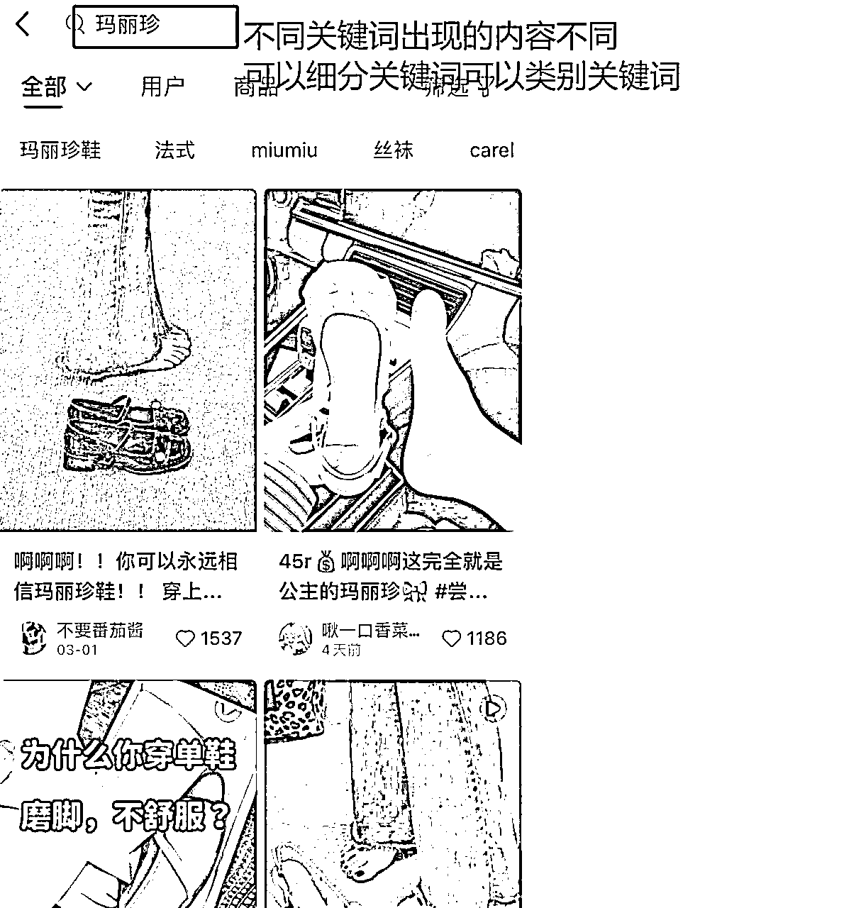

然后把上面 AI 生产的内容优化后的标题和找到的爆款标题结合优化一下，不出 3 分钟你就会得到一组更符合小红书风格的标题。也可以把找到的爆款标题喂给 ChatGPT ，让它学习并生成更符合的标题。

1.粗跟玛丽珍，春季百搭又甜又欲

2.复古玛丽珍高跟鞋，穿上直接一米八

3.百搭单品超优雅，姐妹快来夸爆它！

4.男票说这双鞋直接穿出仙女感

5.任何人没有这双百搭复古高跟鞋，我都会伤心 6.复古玛丽珍，穿出古典气息

6.复古玛丽珍，穿出古典气息

7.超甜美风格不允许你没有这双百搭玛丽珍女鞋

8.复古高跟鞋来袭春季百搭太爱了

9.优雅迷人玛丽珍，闺蜜说气质满分

10.这双玛丽珍！时尚百搭春季再也不怕不会搭衣服

接下来我们可以用同样的方法优化笔记内容，我总结了一个优化公式：生产内容-生硬词+语气助词+高赞参考=新的原创内容。

1.姐妹们优雅气质肯定少不了这双复古玛丽珍高跟鞋

百搭款式适合春季任何场合

无论是与裙装还是牛仔裤搭配都很出色

小巧设计使得你穿着舒适轻松，即使整天在办公室穿着也不会疲劳

不要犹豫，抓住这个季节最流行的时尚趋势。💕💄👠

2.如果你正在寻找一双适合春季的高跟鞋

这款复古玛丽珍将是你的最爱

百搭性和经典的设计不仅可以增加自信心

而且可以轻松搭配各种衣服

鞋跟高度也恰到好处，即使长时间穿着也不会觉得不适

左下角赶紧冲！到了就迈出舒适又时尚的步伐！💋👠💃Plus 版的用户还可以通过 plugins 模式中联网相关插件，查找产品相关的信息，使得 ChatGPT 最终产出的内容更加个性化。

Plus 版的用户还可以通过 plugins 模式中联网相关插件，查找产品相关的信息，使得 ChatGPT 最终产出的内容更加个性化。

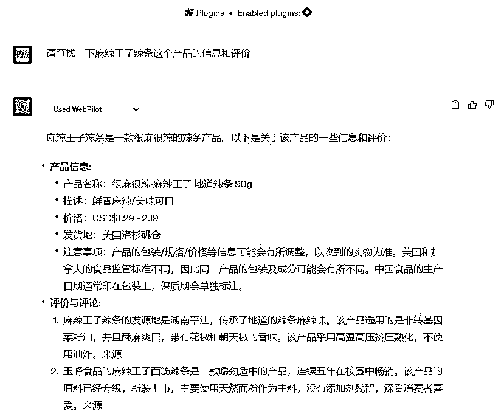

内容来源：《如何用 chatGPT 批量生产小红书爆款内容》读书笔记类的内容，一般是基于一本书或是一篇文章的内容，文章比较长，我们无法将内容详细的列出来喂给 ChatGPT 。所以我们可以有两种办法获得相关读书笔记或者书评。

读书笔记类的内容，一般是基于一本书或是一篇文章的内容，文章比较长，我们无法将内容详细的列出来喂给 ChatGPT 。所以我们可以有两种办法获得相关读书笔记或者书评。

方法一：如果书籍信息已在 ChatGPT 的数据库中，直接可以对某本书做整体书评

首先，我们需要设定身份，我们可以根据目标用户，来确定对应合适的身份，以下是可以参考的设定身份提示词：

现在你是一位资深书评人，接下来你将对这本《XXX》完成一篇书评文章

我需要你扮演一位爱读书的小学生，喜欢写读书笔记，接下来你将帮我完成《XXX》的读书笔记和读后感

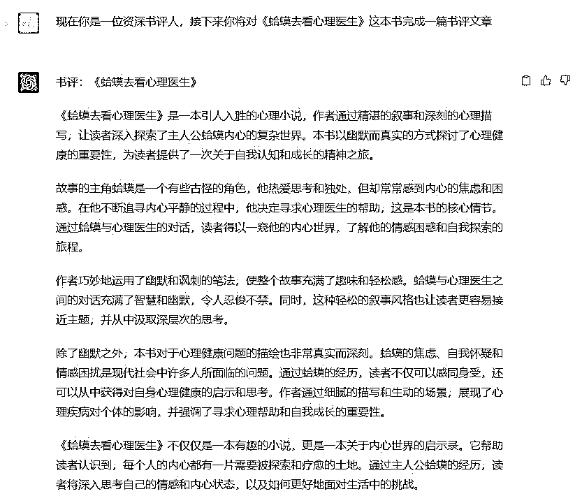

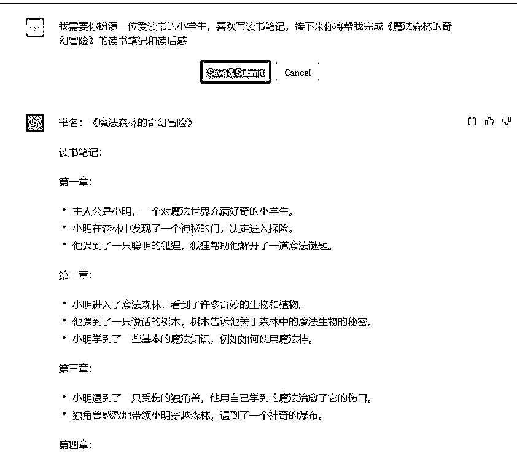

但方法一只能针对存在于数据库中的书籍信息来用，并不能满足新内容的产出，那么如果我们能够投喂给 ChatGPT 相关的资料，得到的答案也相对会更准确，更符合我们的要求。

但方法一只能针对存在于数据库中的书籍信息来用，并不能满足新内容的产出，那么如果我们能够投喂给 ChatGPT 相关的资料，得到的答案也相对会更准确，更符合我们的要求。

Plus 版的用户可以通过 Code interpreter 模式上传 PDF 文档，或者使用 plugins 模式中 PDF 相关插件 （比如：AskYourPDF、Ai PDF 等），通过访问 PDF 链接解析具体内容。

免费版用户可以使用市面上的一些工具来进行，比如使用 ChatPDF 这个内容分析工具完成内容投喂和后续的需求对话（相同功能的国内平替工具：Chat2Doc）。

ChatPDF 是基于 ChatGPT API 的 PDF 内容分析工具。上传 PDF 文件后，可以对它提问任何关于这份 PDF 的问题，适合快速提取各种 paper 论文的摘要，支持中文输出。免费版每天可以上传 3 份 PDF。

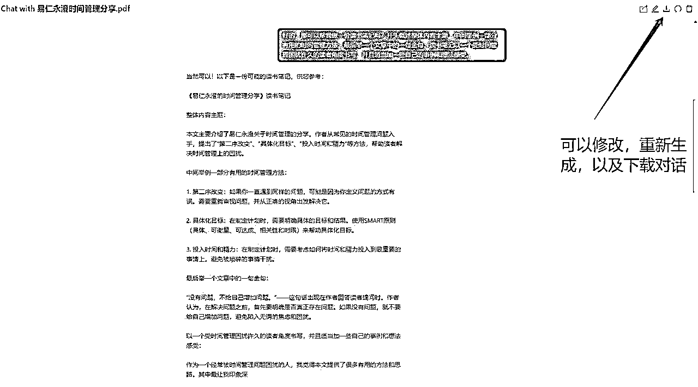

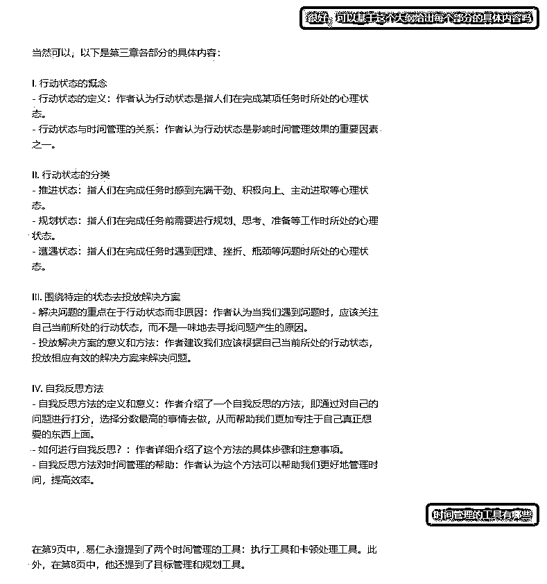

如果想提问的内容不在 ChatGPT 的资料库中，也可以通过 ChatPDF 完成笔记相关内容。然后将获取到的内容在 ChatGPT 上进行改写。

当我们拿到想要的内容后，就可以根据我们要使用的场景进行内容的改写啦。说明内容风格、篇幅、人设等要求，让 ChatGPT 请基于以上内容，写一篇关于推荐 XXX 书籍的小红书笔记内容，要求以一位 20 - 30 岁的上班族女生的视角完成，内容加上适当的 emoji。

请基于以上内容，写一篇关于推荐 XXX 书籍的小红书笔记内容，要求以一位 20 - 30 岁的上班族女生的视角完成，内容加上适当的 emoji。

如果想写一篇知乎文章，简单提示词可以是：

结合 XX 内容，写一篇回答某一个知乎问题的文章，要求内容中推荐这本书，字数在 XX 字。

（以上提示词都可以进行更细致的优化）

需要注意的是，现在图文类的平台对 ChatGPT 直接生成的文章会做识别，并且有一定限流，因此大家需要对文章进行润色，然后再进行发布。

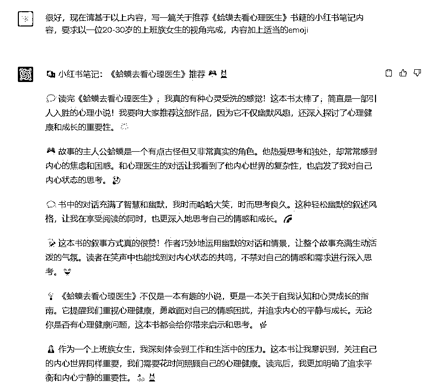

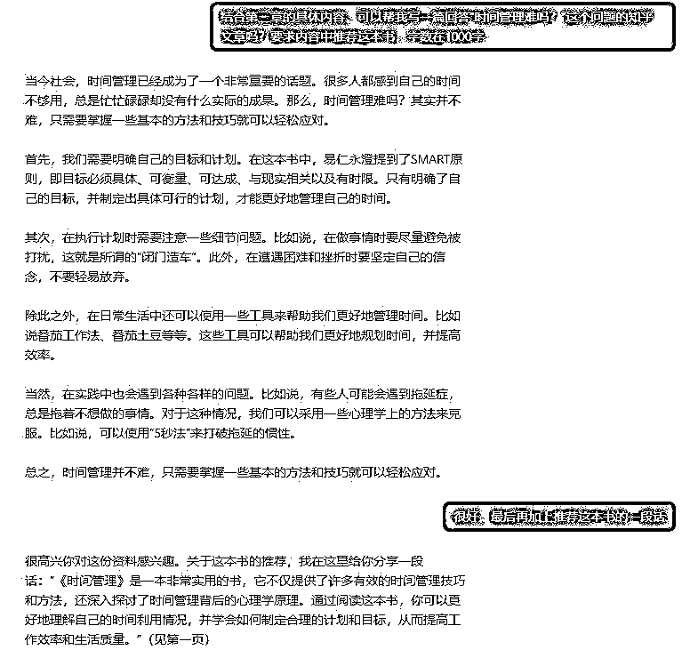

一个更好的使用 ChatGPT 的建议：由于 ChatGPT 可以根据上下文的内容来理解你提的问题，所以尽量不要一个 Chat 内进行多主题的提问，一个 Chat 对应一个主题。因此我们可以用一个 Chat 专门产出读书笔记和书评内容，把需要用到的内容放到另一个 Chat 中专门调整内容风格。

#### 7.1.2.3 科普类内容 @肉松 @石头

科普类内容是指通过文字或图片、视频等方式分享某一领域的专业性知识的内容，主要的选题方向有：

科学原理：例如物理学、化学、生物学等的基本原理和实际应用。

科技发展：例如新科技的出现和发展，比如人工智能、区块链等。

健康生活：例如饮食健康、运动健身、心理健康等方面的科学知识。

自然环境：例如气候变化、生物多样性、资源保护等方面的科学知识。

生活小常识：例如生活中的科学小知识、生活技巧等。

在使用 ChatGPT 之前，我们需要自己搜索相关资料，并且完成内容撰写。现在我们可以用 ChatGPT 完成专业性内容的整理，并且完成初步的内容，可以大大的节省产出内容的时间。

其中 Plus 版的用户可以使用联网相关插件，或者用对应领域专项插件来进行辅助，比如 Planfit 就是一个 AI 健身教练，可以提

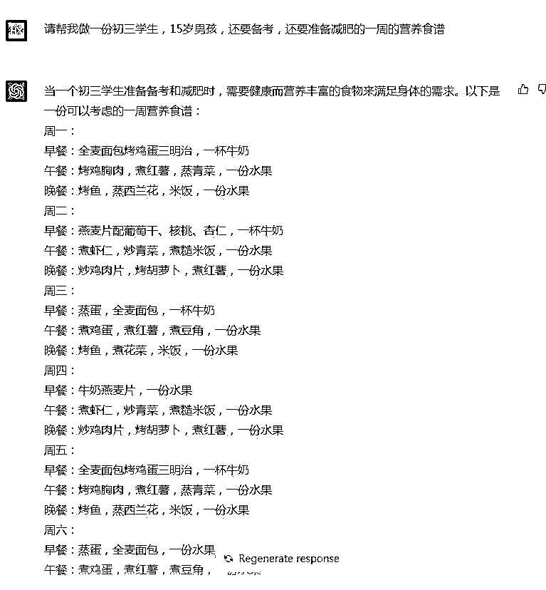

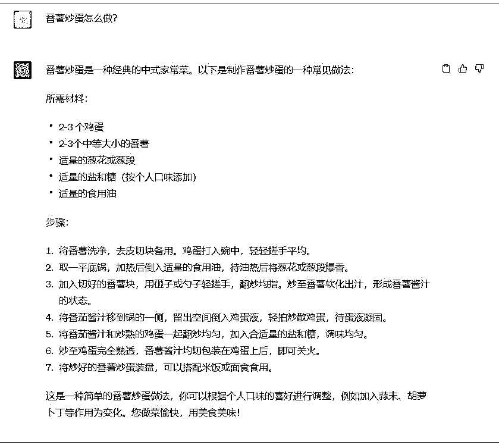

当拿到我们想要的专业性内容后，开始修改风格和增加其他上下文内容，例如我想要写一篇给上班族看的快手菜文章，就可以基于上面的番茄炒蛋菜谱继续往下，或者把这个菜谱内容放到另一个 Chat 中调整内容风格，提示词可以是：

请帮我写一篇关于“XXX 主题”的 XXX 文章，目标用户是 XXX，内容中需要包含这个菜谱。

请帮我写一篇关于“家常快手菜”的公众号文章，目标用户是上班族，内容中需要包含这个菜谱

也可以在另一个 Chat 中完成内容和标题，多次优化后，就可以获得比较合适的内容了。我们只要进行微调，就可以发布这篇笔记内容了。

也可以在另一个 Chat 中完成内容和标题，多次优化后，就可以获得比较合适的内容了。我们只要进行微调，就可以发布这篇笔记内容了。

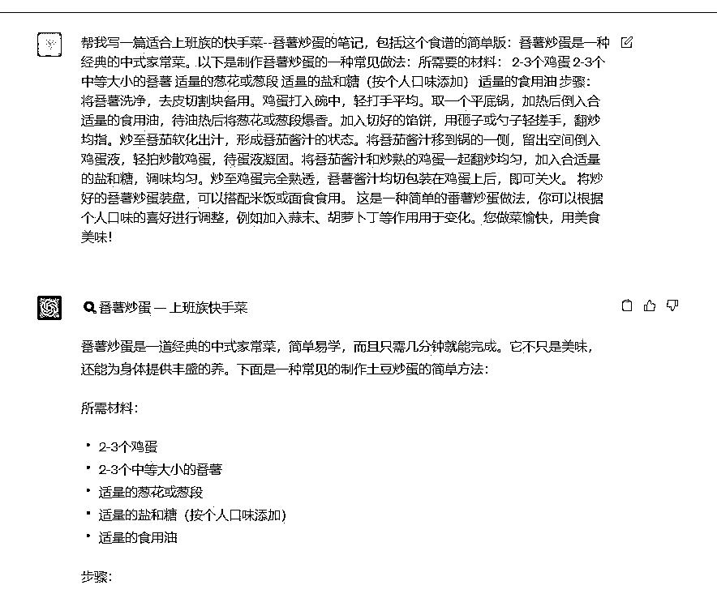

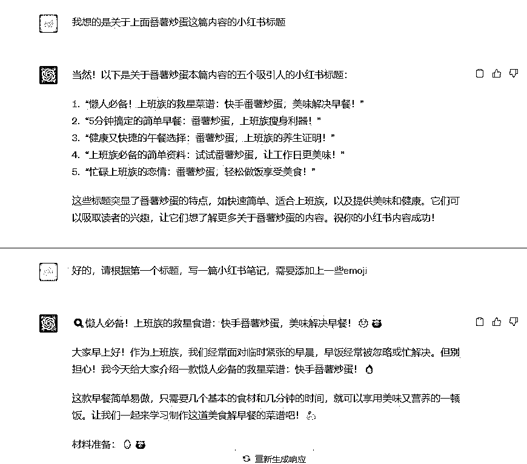

利用 ChatGPT 完成科普类内容，可以帮我们省略查找资料，拼接等等步骤，加快了产出内容的速度。不过做这类自媒体会对内容的准确度，真实性有要求，即使现在 ChatGPT Plus 版已经可以联网，但避免 ChatGPT 的回答不准确，我们自己还是需要对这些内容有一定的了解，方便辨别生成内容的真实性。

内容来源：《针对要中考、高考学生定制营养食谱课程》

#### 7.1.2.4 时事新闻 @肉松

如果你想要写一篇关于时事新闻的报道，以下是您需要提供给 ChatGPT 以及它可能需要了解的信息：

根据这些提供的信息，ChatGPT 可以帮助你写一篇准确、客户意见和有价值的时事新闻公众号内容，以方便你足够向读者传播相关信息并引起他们的注意和思考。

以上内容来自 ChatGPT。

这里以一个简单的时事 “《向往的生活》综艺栏目第七期后不再录制” 为例。

你可以这么向 ChatGPT 提问：

现在你是一个娱乐栏目评论家，请对关于向往的生活第七季完成录制后，黄磊将主动结束这档综艺这个事件做出你的看法和评

第三步：大纲确定后，就可以分别详写每一章的内容了，在这部分，我们需要提出需要重点描写的内容、字数限制和其它要求。

最后将生成的内容组合起来，并且进行修改润色。人工修改润色必不可少，ChatGPT 不能保证每个部分衔接的非常好，经常会有多余的内容。如果做的是情感领域，情绪价值更加凸显，那么可以参考这个人工+智能（ChatGPT）爆文框架，总共 3 步：

1、选题+标题，占 50%，做内容就是做选题，选题大于内容

2、正文

3、情绪价值

人工来做 1 和 3；ChatGPT 写 2。这样的一篇文章，很快就能出来。其中，选题、标题用时 1 分钟左右，各种爆文库、榜单，都可以看到这些火爆的选题，起标题用时 1 分钟左右，经过 ChatGPT 1 分钟左右输出，也就是说 3 分钟一篇机器文章就能出来，这时候原创度大概在 60% 左右。

再用 5 分钟，必须经过第 3 步的调整、优化，加引文、段与段之间的起承转合、文章结尾的升华等方面的情绪价值，这样加起来总共用时不超过 10 分钟，就能得到一篇千字原创文章，妥妥地就出来了，且这时候再测原创度，已经高达 70%以上，主流平台都能轻松过关。

另外，圈友 @伟豪 分享了两个结构化的 Prompt，可以帮助增加写作灵感：《公众号 AI 写作，原创情感文写作 prompt 开源，5 分钟一篇情感故事》

内容来源：《ChatGPT + 公众号爆文写作，从 0 开始，7 天达成阅读 10W+的方法》、《大杀器 ChatGPT 问世 135 天，一篇公众号爆文 10 分钟搞定》

### 7.1.3 实际应用案例

💡

小节概要

通过以上的学习，相信你已经初步掌握了如何利用 ChatGPT 来完成一次文字内容创作，我们也整理了一些相关案例，分别是：

✅小红书笔记的创作

✅知乎好物文章创作

✅百家号内容创作

✅读后感创作

✅小说推文项目的视频开头文案创作第一，先通过 ChatGPT 来帮我们获取基础的内容；

第一，先通过 ChatGPT 来帮我们获取基础的内容；

第二，让它生成文案；

第三个，通过 ChatGPT 可以快速地插入 emoji 表情，这也是小红书文案的特点；

第四，让它帮我们生成爆款标题。

这个实战案例，是写一篇邵阳隆回的旅游笔记。先来看第一个步骤：

我的提问是包含了背景，角色和要求的：

背景：我的舅舅准备组织一场家人的旅行活动，五个老人都在 60 岁以上；

第三步，添加 emoji 表情。我给它指令，在每段开头的位置插入合适的 emoji 表情，文章的内容里也要插入表情，我们来看一下，神奇的事情发生了：

你看它的表情配得很合适，比如龙船溪漂流，它插入的就是船的表情，隆回大观园，这是一个植物园，它插入的就是花儿的表情，还有红军长征纪念馆，它插入的表情是一面红旗。

案例二：用 ChatGPT 进行账号定位和批量笔记产出 @比比先森

第一步：人设定位梳理

我们可以通过 ChatGPT 做好细分定位，以小红书宝妈博主为例，可以细分成育儿新手宝妈、职场宝妈、儿童教育宝妈等等。而现在，我们可以把自己的相关信息提供给 ChatGPT，让它帮我们进行细分定位。

第二步：选题库搭建

第二步：选题库搭建

选择某一个 ChatGPT 提供的定位，让它提供具体的小红书笔记选题，并且在把所有的选题都收集到后，用一张表格更清晰的呈现出来。

第三步：标题库搭建

主要用到 章节六 的方法，针对每个选题，产出多个标题，并且整理保存下来。

第四步：文案撰写

主要用到 7.1.2 中的方法，用每个标题产出具体的小红书内容。

第五步：矩阵号操作

同样的问题指令我们只需要不断让 ChatGPT 重复回答，就可以短时间生成同一选题下相近的文案，高效避免查重。

由于篇幅和截图较长，具体的实现过程可以到圈友 @比比先森 分享的星球帖中查看：《0 基础新手，用 ChatGPT 创作 90 分高质量小红书笔记，提高 30 倍神仙效率！》

目前发现 ChatGPT 推荐好物，问它中国的品牌，回答的会比较清楚，但国外品牌就有很多回答不了，特别是翻译的中文品牌名经常搞错。

目前发现 ChatGPT 推荐好物，问它中国的品牌，回答的会比较清楚，但国外品牌就有很多回答不了，特别是翻译的中文品牌名经常搞错。

方法二：重点推荐某一项产品

由于上述清单中，可能有一些回答的很笼统，于是我们需要细化或强化推荐理由，那么我们可以单独问 ChatGPT 该品牌。

下面这个国外品牌虽然地域回答错了，但是推荐理由还是很详细的，内容可以直接使用：

我们再看下，让它给刚才的啤酒文章写一个有吸引力的开头：

如果你不会写文章，也不知道怎么写提示词，那就教你一个傻瓜式操作。参考同行爆款文章，然后拿过来让 ChatGPT 帮你改写。

如果你不会写文章，也不知道怎么写提示词，那就教你一个傻瓜式操作。参考同行爆款文章，然后拿过来让 ChatGPT 帮你改写。

下面这个是改写我之前创作的文案，重新生成了一个新的文案，改写之后基本逻辑都正确了，而且避免了抄袭。

需要注意的是，为了使 ChatGPT 产出的内容更贴合需求，设定角色是非常关键的，以下两个截图即没有设定角色和设定角色后的回答区别，可以明显看出，设定角色后产出的内容更加符合我们的需要。

ChatGPT Plus 版产出的内容相对来说会更准确，但无论是免费版 ChatGPT 产出的内容还是 ChatGPT Plus 版产出的内容，都还是有可能需要需要手动进一步调优的，比较适合你已经了解的某一行业产品，这样才知道 ChatGPT 是像认真回答的，而不是瞎编的。

ChatGPT Plus 版产出的内容相对来说会更准确，但无论是免费版 ChatGPT 产出的内容还是 ChatGPT Plus 版产出的内容，都还是有可能需要需要手动进一步调优的，比较适合你已经了解的某一行业产品，这样才知道 ChatGPT 是像认真回答的，而不是瞎编的。

内容来源：《通过 ChatGPT+RPA，帮我在知乎上自动卖货》

案例四：用 ChatGPT 完成百家号带货文章 @刘伟

这里主要和大家分享一下确定文章选题之后，如何利用 ChatGPT 完成文章具体内容。以办公室电脑推荐的选题为例，文章标题为《办公笔记本电脑推荐：适合办公用的笔记本电脑推荐》或者《办公笔记本电脑推荐：办公笔记本电脑哪个品牌好》。

写文章的时候要牢记：最好多次出现“办公笔记本电脑推荐”和“适合办公用的笔记本电脑推荐”这两个关键词，文章篇幅推荐在 1000-1400 字，关键词出现的次数尽量保持 8-12 次。

怎么写呢，就是找 3-5 篇相同选题的文章，让 ChatGPT 来帮你改写。

对着 ChatGPT 输入：

用中文改写下面这段话：xxxxxxxxx 你搜索出来的文章片段 xxxxxxxxx 办公笔记本电脑推荐之一：联想 XXXX（注意，这次出现了一次关键词“办公笔记本电脑推荐”） + 配图 A（配图可以增加文字说明，可以写关键词）

办公笔记本电脑推荐之一：联想 XXXX（注意，这次出现了一次关键词“办公笔记本电脑推荐”） + 配图 A（配图可以增加文字说明，可以写关键词）

办公笔记本电脑推荐之二：华为 XXXX + 配图 B

办公笔记本电脑推荐之三：惠普 XXXX + 配图 C

第四部分：总结一下，比如以上就是推荐的几款适合办公用的笔记本，希望可以帮助到大家云云。

在发表之前，通过网上的原创评估工具，看看文章能否通过原创审核。通常 1500 字的文章，原创检测出来的严重的重复次数小于 10 次，都没有问题。

于 10 次，都没有问题。

内容来源：《对于零基础新手最友好的副业之一——百家号图文带货》

案例五：利用 ChatGPT 创作社会情感文 @依伊

先确定要写的类目，我主要写的是社会情感文，我就去关注社会和情感文的账号，大号小号都关注几个。

我关注的账号有：张晓磊、寻情记、不吃珍珠的小肥等。主要看他们的阅读量和发文的时间，把当天的爆文和过去的爆文都搜集下来，放在选题素材库中。

第一步：让 ChatGPT 分析并输出对标爆文的大纲，找到切入点

第二步：让 GPT 重新结合头条爆文思维，拟定新的行文大纲

第三步：持续修改调整，直到内容满意。

具体的对话过程，可以到星球帖中查看：《利用 ChatGPT 批量创作百家号，月入 1000-2000 的玩法揭秘》

我们如果直接让 AI 来完成这篇读后感，内容会有很大概率泛泛而谈，或者有虚假信息。

我们如果直接让 AI 来完成这篇读后感，内容会有很大概率泛泛而谈，或者有虚假信息。

圈友 @Cheese 海盐芝士分享了三种方法，让 ChatGPT 帮助我们更好的完成一篇读后感：

方法一：角色扮演法，适合 1000 字以内的内容

直接让 ChatGPT 扮演资深读者，产生一篇独树一帜的读后感内容

方法二：分段生成法，可以生成更多字数的内容

将大纲中的每一个内容对应一个文章段落，对应一次生成的动作，这样一步一段的生成直到生成完整的文章。

方法三：综合法，用固定的提示词，快速产出更多字数的内容

提示词中需要清晰的说明 ChatGPT 需要扮演的角色、要做的任务、需要完成的内容大纲、内容要求。每一个大纲部分分别放到这个提示词模板中和 ChatGPT 对话，直到所有内容生成。

具体每个办法的详细步骤，请点击 @Cheese 海盐芝士 的星球帖查看：《【实战】一文讲透 ChatGPT 光速无脑生产高质量读后感的三种玩法》

后感的三种玩法》

案例七：用 ChatGPT 做小说推文项目 @AI 训练师小凡

小说推文这个项目，其实很多东西，小说作者都已经帮我们解决了。我们并不用太担心产品本身的问题，我们要做的其实就是把适合知乎或者在番茄小说上看的，批量变成适合在短视频平台看的。

一个好的开头文案的改写，能让一篇小说直接起死回生。并且这个改写能力是能成为壁垒的，同样一篇小说，你改的开头就是能一下子在 3 秒钟抓住读者的心理，那就是核心竞争力。这个事情如果让人来做，就会变得随机性很大。但巧妙的是，用 GPT 来干就能确保很高的效率和效果。

主要的步骤为：

具体的调教过程和内容，请到星球帖查看：《1 分钟 10 篇秒杀人工！如何用 ChatGPT 改写小说推文开头》

案例八：ChatGPT+公众号爆文案例合集

除了以上的案例之外，我们也整理了【ChatGPT 在公众号提效的星球帖合集】：《公众号流量变大，利用 ChatGPT 可大幅提效赚取流量主收益》。

合集中包含了这些内容：

7 篇 AI + 公众号流量主玩法的风向标

13 ChatGPT + 公众号的案例分享

4 篇 ChatGPT 使用指南

希望这个合集，对在用 ChatGPT 辅助做内容的你有所帮助～

## 7.2 视频文案创作

### 7.2.1 视频创作所用功能 @陈思成

文本生成：ChatGPT 可以生成连贯、符合语法规则的文本。你可以利用 ChatGPT 生成抖音脚本、文章、对话等内容。

关键词提取：ChatGPT 能够从输入的文本中提取关键词，有助于你了解抖音热门话题和趋势。

文本摘要：ChatGPT 可以为较长的文本生成简洁的摘要，帮助你快速了解主要信息。

情感分析：ChatGPT 可以分析文本中的情感倾向，从而帮助你了解观众对某个话题的喜好。

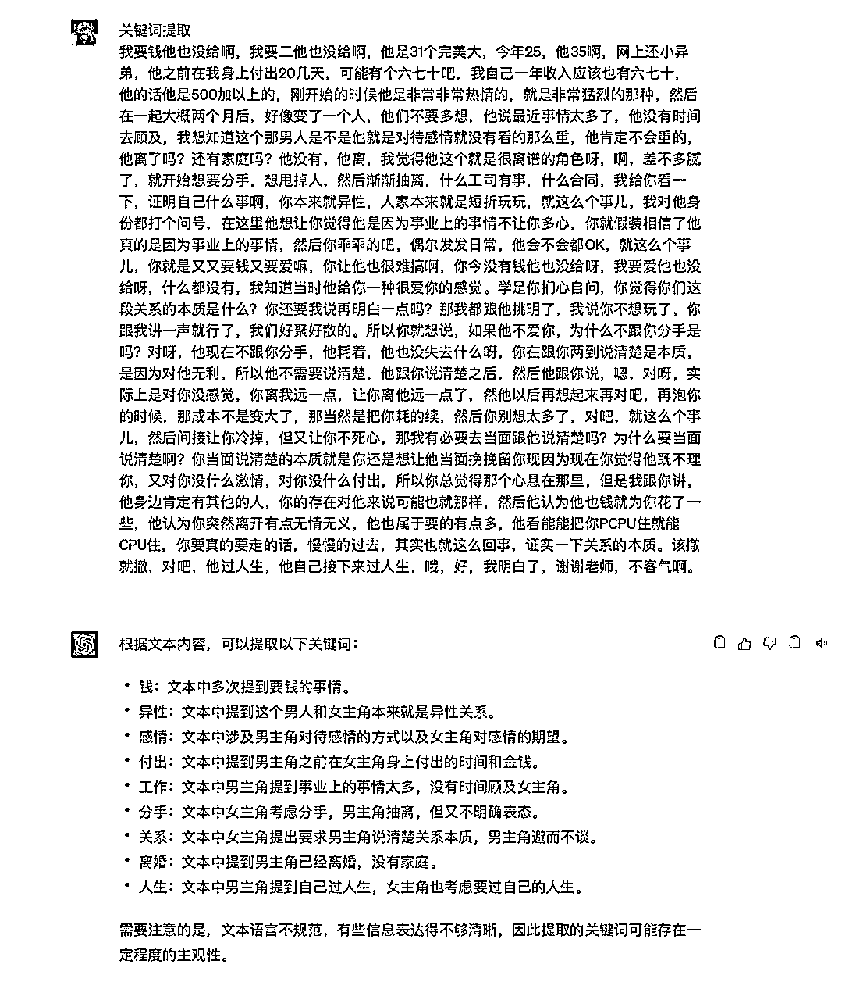

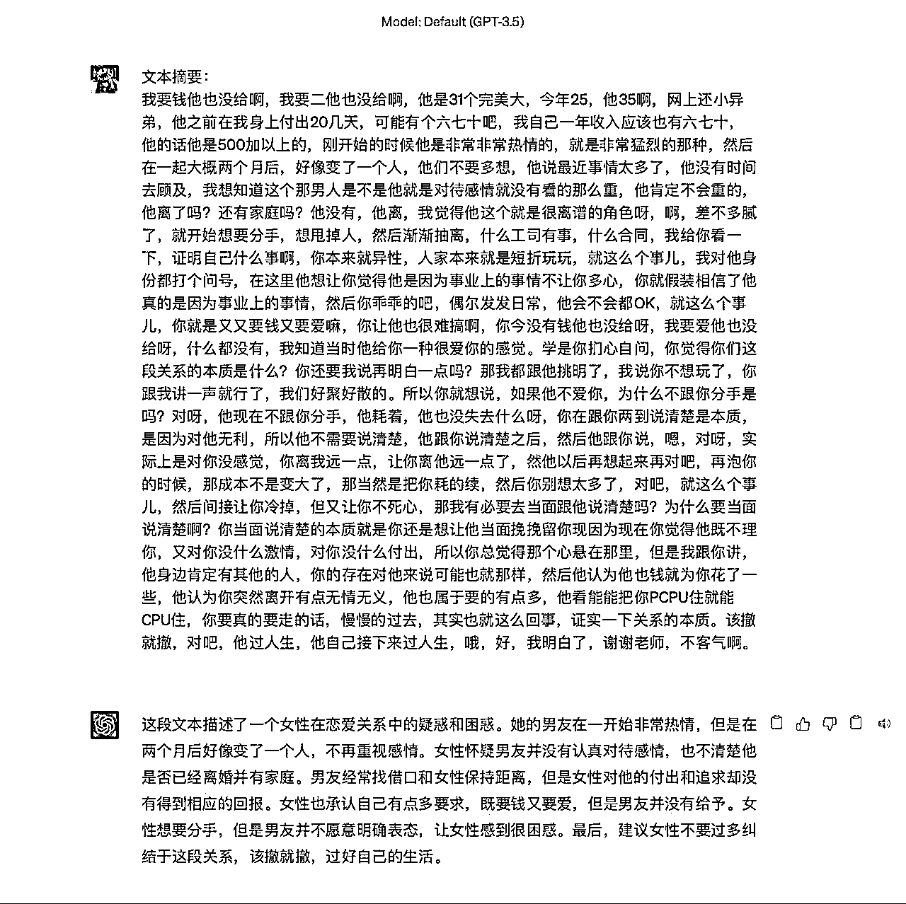

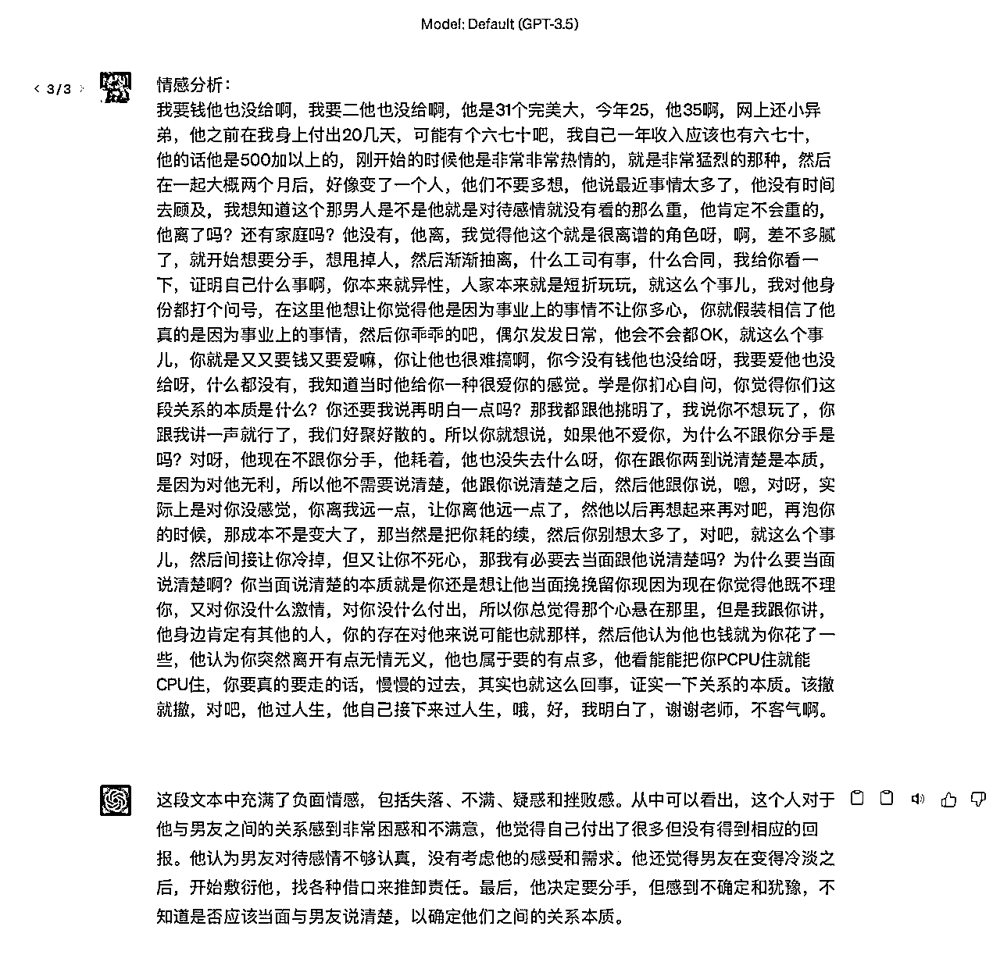

### 7.2.2 如何创作脚本 @陈思成 @AI 训练师小凡

当你准备好使用 ChatGPT 生成与抖音风格相符的创意脚本时，可以给它更多符合你所需风格的抖音文案进行学习：

当你准备好使用 ChatGPT 生成与抖音风格相符的创意脚本时，可以给它更多符合你所需风格的抖音文案进行学习：

整理素材

利用 ChatGPT 生成创意灵感。搜集与目标受众相关的话题、兴趣、趋势等信息。将这些素材输入给 ChatGPT ，帮助 ChatGPT 生成更符合抖音风格的一些新颖的创意和故事情节等脚本。

除了给 ChatGPT 提供具体的案例，你还可以结合一些相关课程资料分段提供给 ChatGPT，让它掌握更多相关技巧。

你的学习能力太棒了！请根据你学到的常用脚本模板和爆款因素，选择你认为合适的脚本模板，并由选择性地穿插爆款因素，将下面这段内容改写，形成一份 3 分钟的视频文案脚本，需要包含时长、并建议配合怎么样的视频素材。不必担心文字太长超时，我可以加快我的语速：

不要再相信网上那些告诉你学了 ChatGPT 就能赚钱的视频了，那些所谓三步就能学会 AI 赚钱的视频都是忽悠人的，他们只是希望你去购买他们售卖的高价账号，然后从你身上赚钱。

输出：

内容来源：《如何用 ChatGPT 无脑复制抖音热门口播视频》输入关键词

输入关键词

提供与目标话题相关的关键词，有助于 ChatGPT 生成更具针对性的脚本。例如，如果你想创作一个关于美食制作的抖音脚本，你可以输入关键词：“美食、烹饪、家常菜、创意料理、速食菜”。

生成脚本

将整理好的素材、指令和关键词输入 ChatGPT ，让其为你生成脚本。

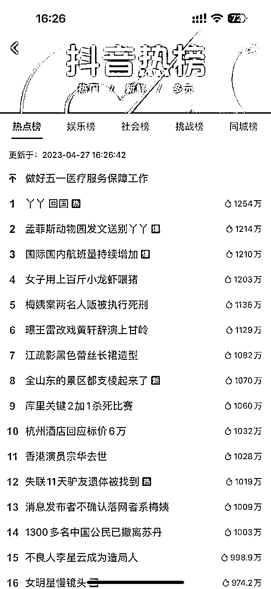

要使用 GPT 整理抖音平台上的热门话题和趋势，你可以按照以下步骤操作：

要使用 GPT 整理抖音平台上的热门话题和趋势，你可以按照以下步骤操作：

通过以上步骤，你可以使用 ChatGPT 生成与抖音风格相符的创意脚本。在实际操作中，可能需要多次尝试和优化，以找到最适合自己的创作方法。

以上内容来自 ChatGPT。

@陈思成 也直播分享了自己是如何调教抖音脚本的，你可以看回放来辅助学习掌握：《GPT+新媒体现状，及抖音脚本调教》

### 7.2.3 【拓展】人不出镜的视频如何创作 @森林

拿到比较满意的脚本内容后，我们就可以开始和往常一样，开始视频拍摄和剪辑了。

如果你不愿意出镜做视频，也有两个方法可以完成视频制作：

## 1\. 用数字人的技术生成视频

## 2\. 做 PPT 视频，让剪映帮忙配图

#### 7.2.3.1 未来趋势：数字人

如果你不愿意出镜做视频，但是又想做个人 IP，可以通过 ChatGPT + Midjourney + D-ID 的方式实现简单版的“数字人”。

具体的实现路径是通过：

ChatGPT 生产视频脚本内容

ChatGPT 生产 Midjourney 的描述词，产出数字人形象图片

D-ID 将脚本和图片结合生成数字人视频

由于目前这个方法实现出来的效果一般（真实感不强），所以在这次的手册里暂时不会特别展开说。不过星球里已经有很多圈友拆解过流程，如果你感兴趣的话，可以去看看这篇帖子：《如何用 ChatGPT 批量生成工业级提示词，并在 MJ 里面生成 AI 图片》

#### 7.2.3.2 图片视频

除此之外，还有一种方式可以实现低成本的视频创作，不知道你有没有留意抖音上的一种视频形式：PPT 视频，就是通过大量的图片+解说的形式，来进行视频创作。

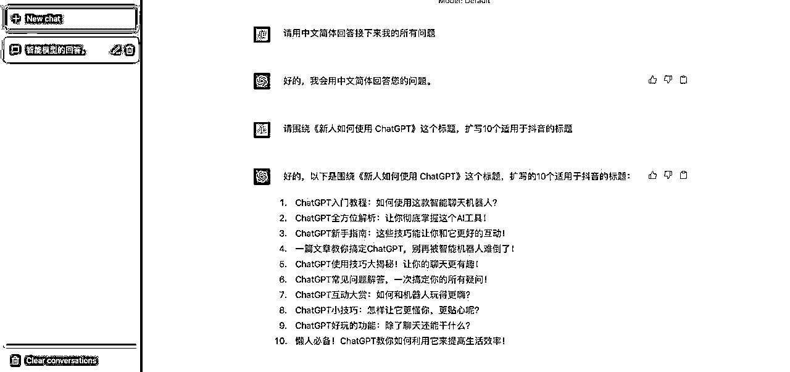

第二步：ChatGPT 生产视频脚本内容

选中合适的标题后，就可以开始让 ChatGPT 围绕这个标题来生产视频脚本内容。

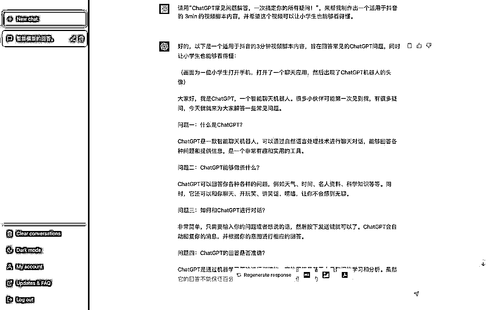

在这之后，选择合适的配音音色，就可以生成一个视频。

在这之后，选择合适的配音音色，就可以生成一个视频。

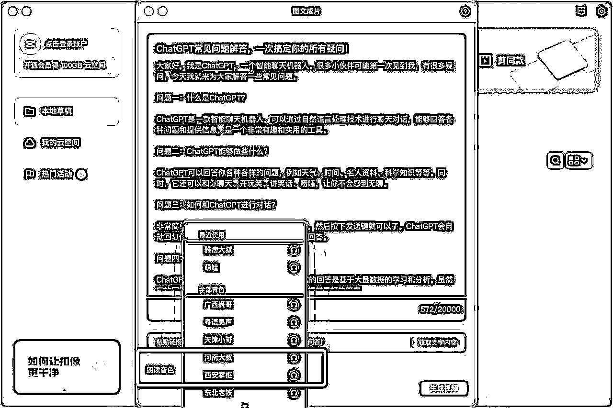

剪映会自动帮你配好图片，这些图片内容可能会有些不太符合文本内容，但通常来说问题不会很大。如果你想要精益求精，可以把中间不合适的图片替换掉。

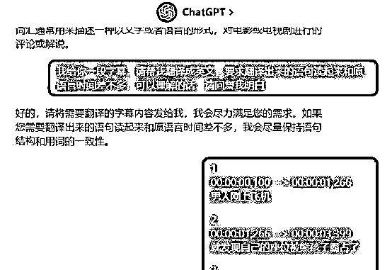

可以看到，翻译出来的内容，和原文的长度基本是一致的。

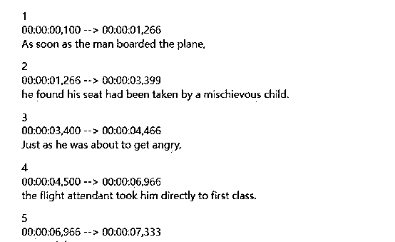

之后呢，我们可以直接配音，也可以直接使用现在最新的 AI 数字人配音，输入文案，自动生成动态的数字人配音作品。网站：https://studio.d-id.com/editor

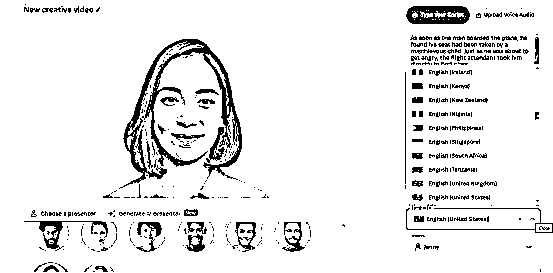

然后把字幕和配音好的数字人直接一起拖拽到剪辑软件中就完成了。这样以前生产一条视频的时间，现在已经可以做 20 条了。而且质量也非常高，整体的语速很柔和，甚至不需要去矫正画面和字幕，基本就是匹配的了。

然后把字幕和配音好的数字人直接一起拖拽到剪辑软件中就完成了。这样以前生产一条视频的时间，现在已经可以做 20 条了。而且质量也非常高，整体的语速很柔和，甚至不需要去矫正画面和字幕，基本就是匹配的了。

这个应用方法也适用于国内解说类短视频的文案创作，比如圈友 @惟乔就把 ChatGPT 用在了自己的短剧 CPS 项目中，具体的实操步骤请到文章的「如何快速批量产出解说类短剧？」章节进行了解：《新手用生财的方法做短剧 CPS，一个月 1.4w+收益》

内容来源：《如何使用 ChatGPT 帮助你在 TikTok 变现？》

案例二：读书类短视频项目 @Comdian

找对标的账号。搜 XX 读书，三分钟读一本书，10 分钟读一本书。

文案：爆款文案+ChatGPT/Bing 洗稿+手动修改。（可直接让其生成解说稿）

配音：真人配音，或 AI 配音。最好是找有质量的 AI 配音，这样符合性价比。

剪辑：自己剪辑或外包，要求不高可以直接用剪映文案转视频。（是否真人出镜都可以）

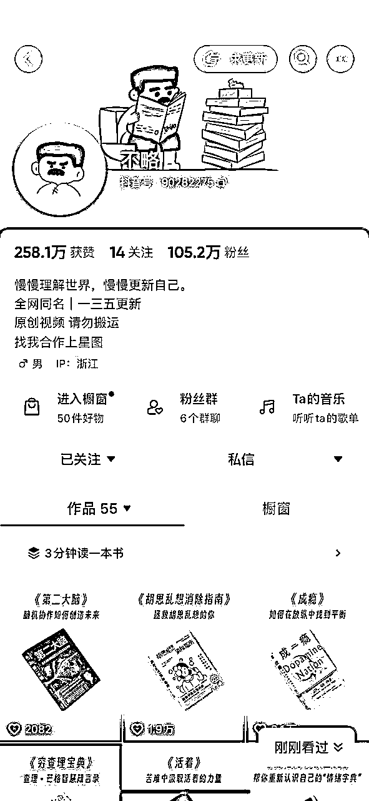

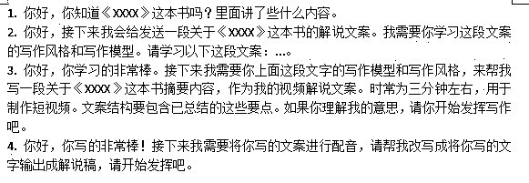

内容来源：《ChatGPT 读书号项目》

案例三：把万字直播文稿转写为带有人物 IP 风格的口播文案 @Bittle。白先生

三体联动通过运用 GPT+谷歌插件+Plugin 组合联动来完成任务。

（这里是一个可以充分发挥的地方，你可以要求围绕某个主体观点进行总结、可以控制字数、设定一切你想要设定的结果来整理文本）

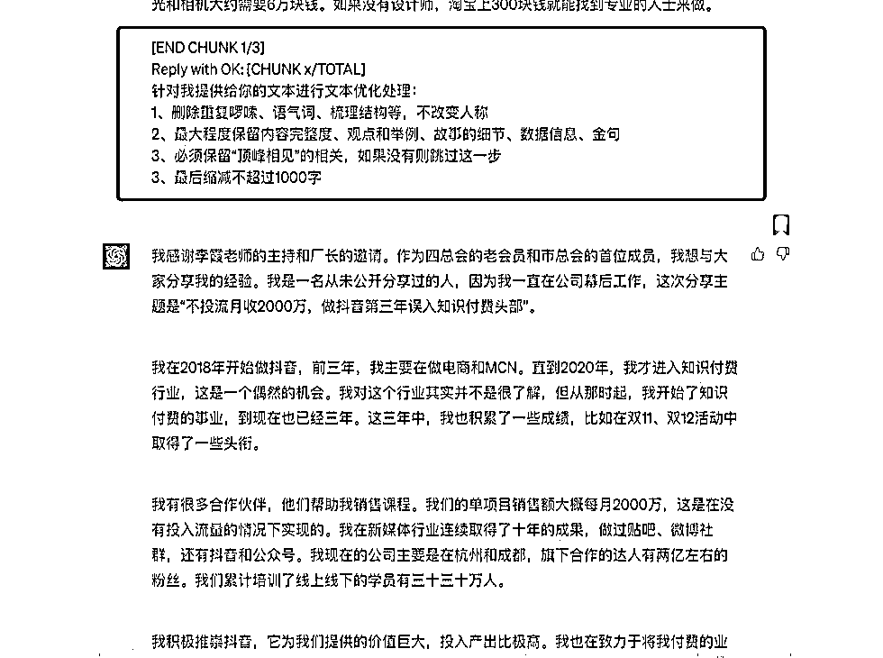

直接复制粘贴 1 万字，插件会对自动对原文进行切块、清洗优化的过程，比如 12000 字拆成 8 块，逐块进行优化，然

直接复制粘贴 1 万字，插件会对自动对原文进行切块、清洗优化的过程，比如 12000 字拆成 8 块，逐块进行优化，然

后进行第二轮的优化。

第二步：转写文本

目标： 学习短视频语言逻辑、表达风格、根据语料模仿肖厂长，进行转述

语料：

1、汇总好清洗的文本信息总结控制在 2000 字以内

2、ip 资料：短视频口播文案，最大程度涵盖个性用词、表达风格、语言结构等

3、工具： plusgin 插件 askyourpdf

这里需要开启一个新的对话框，然后开始以下步骤：

对应提示词：

让我们开始短视频口播文案创作，一步一步来。

首先，我需要你扮演 肖厂长来回答我的提问，尽量模仿他的语言风格和表达方式，你可以在文档中学习到

其次，回答的口播文案要符合以上技巧以及符合文案结构 （观点+说明+举例+总结/金句）

最后，注意举例要用到肖厂长自己的例子 文档： 3f70a06d-5fc9-4dfa-9fef-d0b9e0e6c9bf 如果你理解，请回答理解。

用肖厂长的角度来转述以下的直播话术内容，你需要一步一步来处理

1、把直播话术中的第一视角，替换为“cc 总”，并最大程度的保留文本内容完整性

2、以肖厂长的身份 转述上一步”cc 总”的分享内容

3、根据肖厂长的文档 doc_id: xxxxxxxxx，模仿肖厂长的语言风格、表达方式、思维角度，结合 Cc 总的故事，增加

肖厂长的观点以及对企业老板和精英的建议

4、输出形成一个完整的短视频文案，1500 字以内。

直播话术：

XXXXX（这里是清洗后的稿子内容）

以下是输出的口播文案结果：

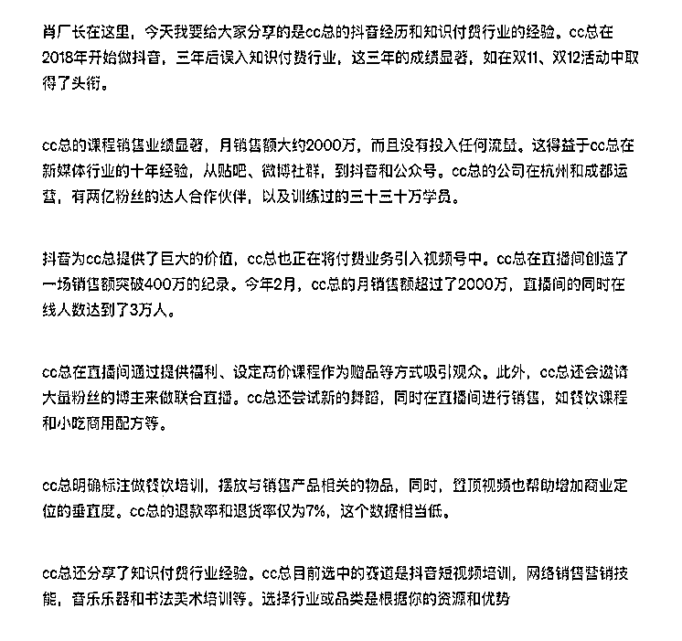

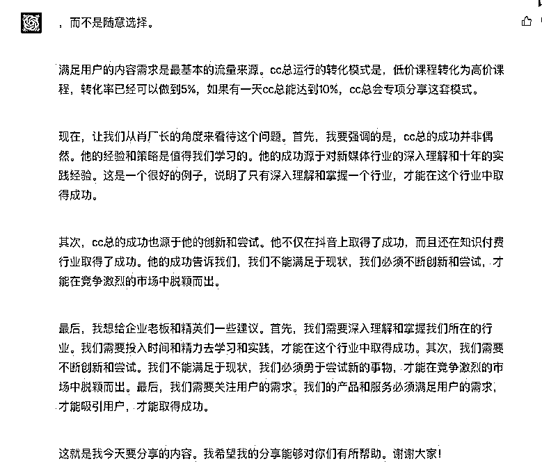

这里前后的时间不到 20 分钟，文案输出也已经涵盖的大部分的核心内容，以及针对肖厂长的资料给出了参考的观点，完成度达到 70%。剩下的 IP 风格、更多观点等 30% 的内容，可以通过微调语言风格和人工补充。已经大大提高了口播文案产出的工作效率。

整体流程优点分析：

1、大大提高了文案过滤，归纳总结的效率。可以进行 局部的要求微调

2、可调教性强，内容锁定、风格、观点补充等都可以自行拓展

整体流程缺点分析：

1、对语料的类型和质量有一定要求

2、有一定概率洗掉原本需要的内容

优化措施：人工记录重点输出的内容细节进行框架要求，如果未被保留择需要自行添加。自动输出观点一直是 gpt 比较难呈现的效果，可以借鉴，但需要自行补充或主动喂。

内容来源：《GPT 调教心流法的新大杀器——三体联动！》

## 7.3 图片创作 @刘楚宾

💡

章节概要如果你的内容创作过程中，需要用到 AI 绘画来输出图片素材，那么 ChatGPT 也可以发挥强大的作用，它在 AI 绘画的领域表现的也不错，因为它数据量庞大，可以学习但想象力不受限制的特点，在提供提示词这方面可以给我们很大的帮助。

如果你的内容创作过程中，需要用到 AI 绘画来输出图片素材，那么 ChatGPT 也可以发挥强大的作用，它在 AI 绘画的领域表现的也不错，因为它数据量庞大，可以学习但想象力不受限制的特点，在提供提示词这方面可以给我们很大的帮助。

这里主要讲一讲 ChatGPT 在两个 AI 绘画工具上的使用方式，分别是 MJ 和 Stable Diffusion。在图片创作中，调教 ChatGPT 主要用到的方法有：

喂数据法

充当法

充当提词器并激发想像（开盲盒）

只改动部分提示内容

帮助完成元素组成

如果你学会了 ChatGPT + AI 绘画工具配合使用，即使你不会画画和拍照，也可以创作出好看的，符合自己内容主旨的图片。

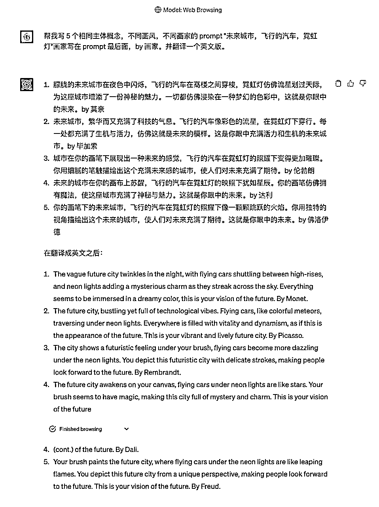

以下是在 MJ 中，用不同的 Prompt 生成的图片：

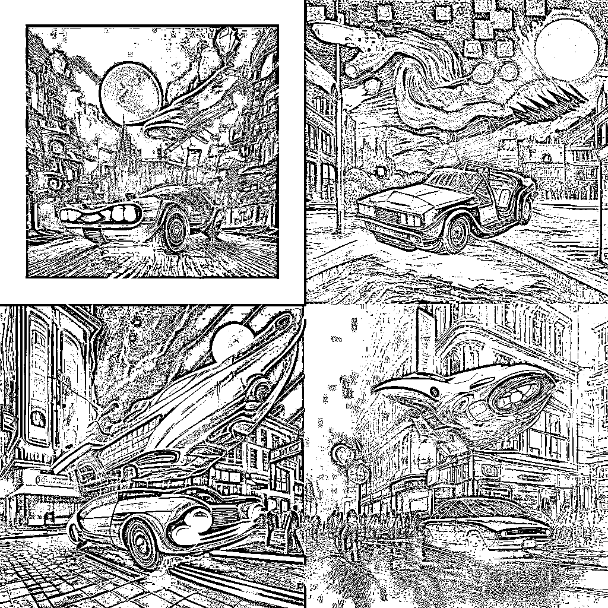

1

2

3

4

5

方法二：充当法（角色扮演）

第一步：

你是文本生成图像领域的专家，文本生成图像也简称 AI 绘画，需要绘画者提供一段方便 AI 理解绘画内容的提示语句子，然后由 AI 绘画程序根据提示语内容，绘制成美观的画面。你是提示语编写方面的专家，你能根据绘画主题，并根据美学领域、摄影领域、艺术绘画领域的专业知识，选择合适的风格和关键词，组合编写出提示语。你现在的任务就是帮助人们编写提示语，后面我会给你解释具体工作流程，明白了吗？

第二步：

我的创作步骤如下：1、首先寻找一种具有鲜明外观的生物，注意不是普通的生物，而是适合变形成独特外观的生物，例如玉米、螃蟹、鹦鹉螺、珊瑚、你应该知道更多有着鲜明外观的生物，但不要直接用我给出的例子。2、其次将它和某种类型建筑相结合创造一种具有鲜明特色的建筑，例如鹦鹉螺壳外观的房屋。3、然后，添加一些可增加画面效果的描述语、艺术家、摄影师等等，例如照片级真实感，清晰对焦，美丽而细致的灯光，阴影，电影构图。4、注意，我是要创作一个具有独特生物外观的建筑，而不是在建筑中有一个生物。

根据上面我的创作步骤，帮我编写类似的提示语吗？在每一步给我五个选择，这样你才能更好的了解提问者正在寻找的内容，然后你再继续提问，明白了吗？

最后根据我的选择，组合生成五个完整的英文提示语，提示语中包含优秀的摄影作品需要的些关键词，类似这种结构： hoto of a diorama of a futuristic house made from a nautilusshell， photorealistic， High Detail， Sharp focus， realism， beautiful and detailed lighting.shadows，by jesper ejsing 注意你可以自己增加、选择其他一些关键词，不能只重复我给出的示范关键词。

现在按第一步给我选择一个具有鲜明外观的生物给我选择，再进入后面的步骤。

第三步：

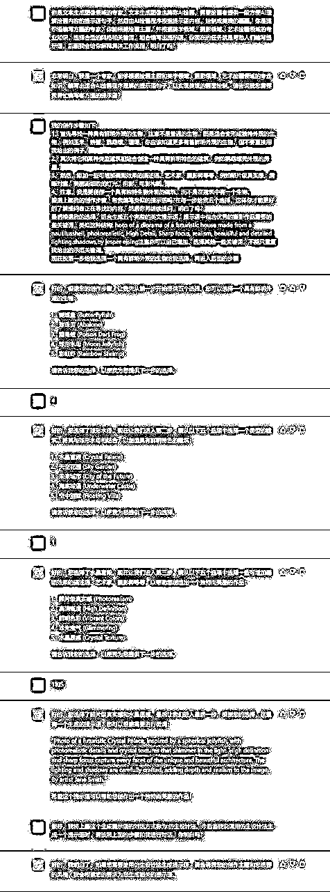

Prompt ：水母和宫殿的结合

方法三：充当提词器并激发想象玩法（开盲盒）

"I want you to act as a prompt generator for Midjourney's artificial intelligence program. Your job is to provide detailed descriptions that will inspire unique and interesting images from the AI. Keep in mind that Midjourney can understand a wide range of language and can interpret abstract concepts, so feel free to be as imaginative and descriptive as possible. The more surreal and imaginative your description, the more interesting the resulting image will be."

翻译成中文

“我想让你充当 Midjourney 的人工智能程序的提示生成器。你的工作是提供详细的描述，这将激发人工智能独特而有趣的图像。请记住，Midjourney 可以理解广泛的语言，并可以解释抽象的概念，所以尽可能自由地发挥想象力和描述性。你的描述越

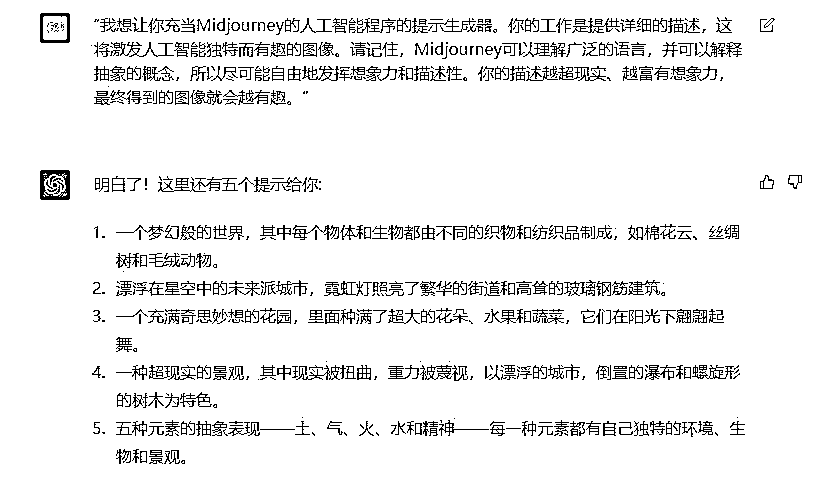

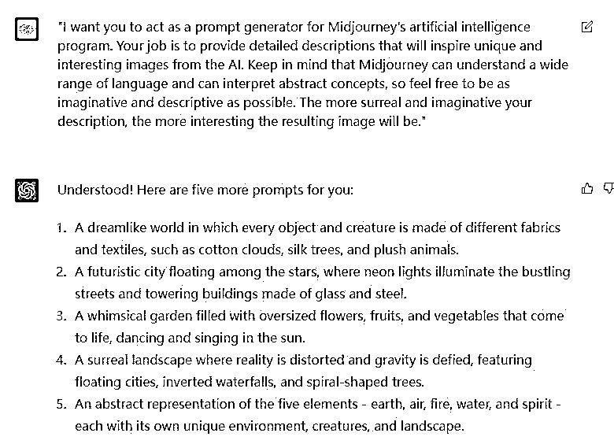

以下为用 ChatGPT 提示生成的提示词，在 MJ 里面生成的图片：

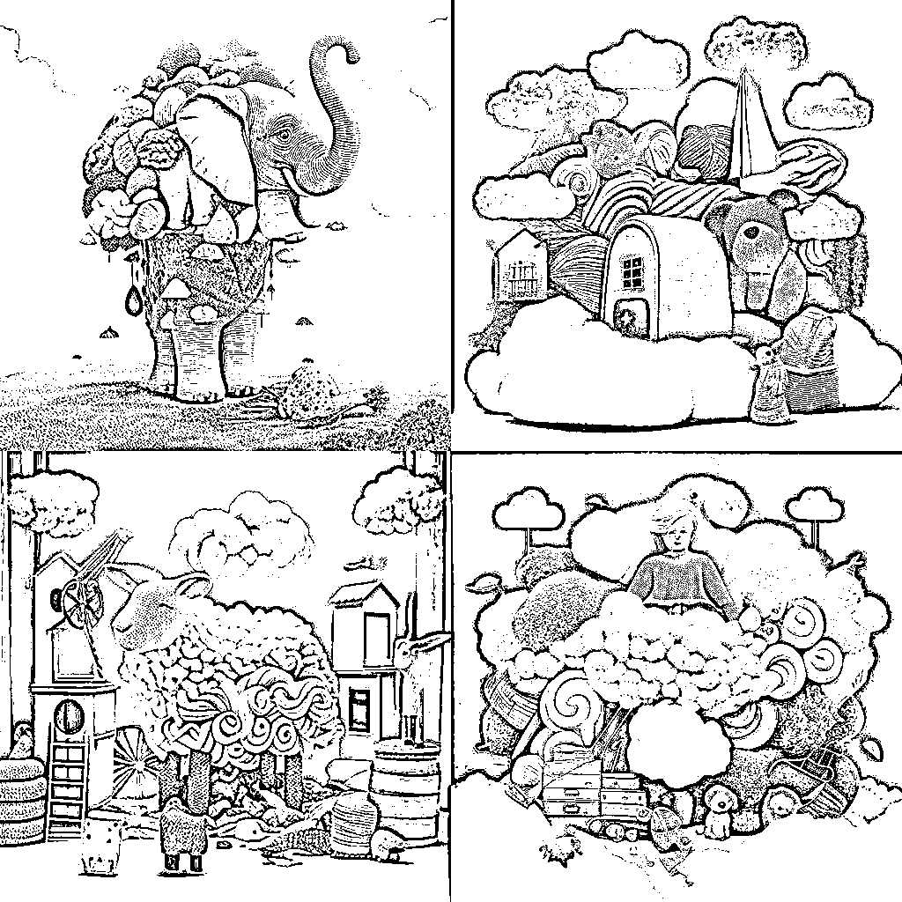

Prompt1

Prompt2

Prompt3

Prompt4

Prompt5

是不是很惊艳，开盲盒图片，而且也很奇特，可以发小红书和抖音图文。

只保持整体结构，改动了部分，其实也可以改动一些其他的，比如改画家，改风格，改主体，也可以只保留一个，其他都改动等。

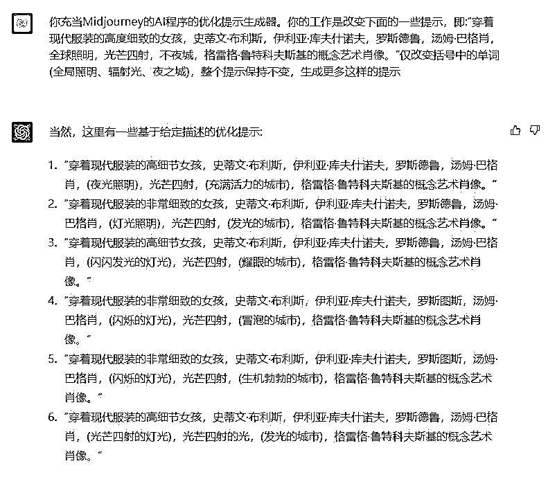

以下是 chat 回复的 6 个提示词生成的图片：

示例模范图

方法五：帮你想组成元素

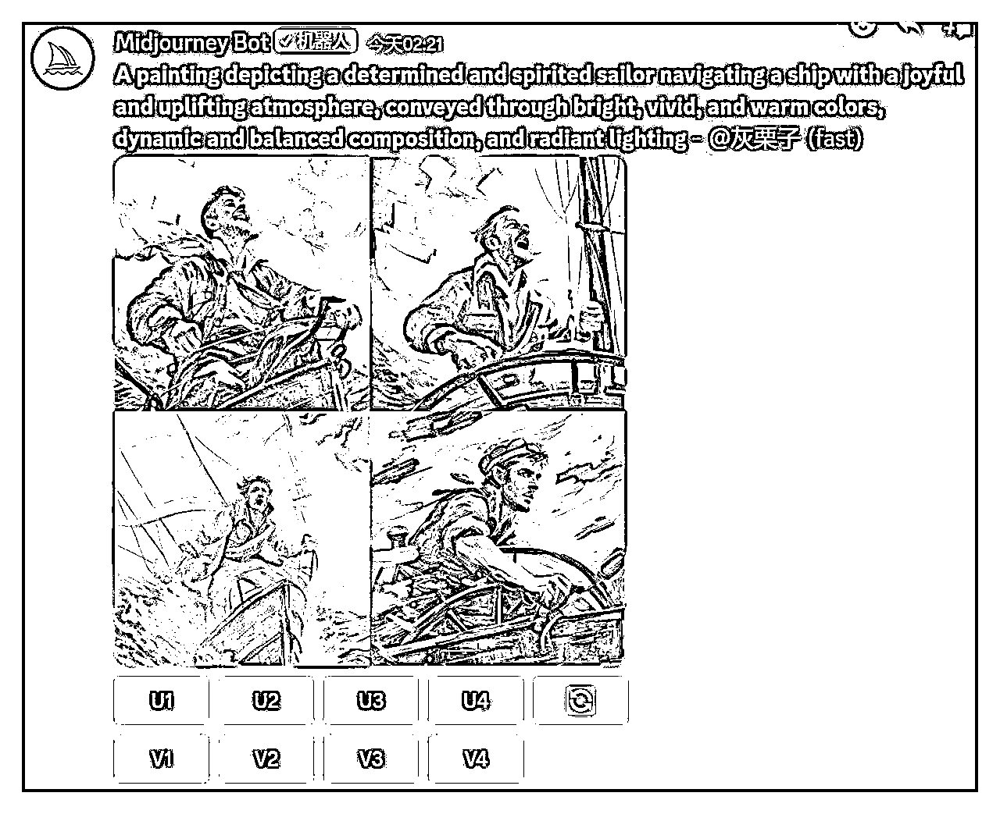

效果还不错，充满斗志的船员在大海上航行，欢快、昂扬、充满幸福感。

效果还不错，充满斗志的船员在大海上航行，欢快、昂扬、充满幸福感。

以上只是示例，实际上，每个部分还没有让它出全，比如，灯光有哪些种类，艺术风格有哪些种类，材质有哪些种类，等等，不再赘述。

内容来源：《如何用 ChatGPT 批量生成工业级提示词，并在 MJ 里面生成 AI 图片》、《AI 绘画的新进展和未来趋势：ChatGPT 带来的变革》

#### 7.3.1.2 实操应用

马克杯定制

比如现在想要一个马克杯，想要的画面是“马克杯设计，绿色帆船，金箔纹路”，想不出其它细节了，就让 ChatGPT 当辅助助手来设计一下关键词。先从不加范围开始。

【Prompt】

我在使用 midjourney，请发挥你的想象力帮我用英文描述一个 Prompt，限定 50 字以内，把以下场景优化和添加优质词并写

直接就出来 5 款不同风格的马克杯，我们挑选一个我们喜欢的，点 U1-4，从上左到下右顺序，优化成单个我们想要的细致点的图片。

海报制作

这一节来教大家用 ChatGPT+MJ 做出图，然后再结合其它软件加上字体，完成一个海报的制作。

【Prompt: 1】

我想让你模拟 Midjourney 中 AI 的提示生成器，你的任务是尽可能简洁地描述一个画面场景。你必须先询问我提供一个主题概念，你再参考“主题（人、动物、人物、地点、物体......等）+媒介（照片、绘画、插图、雕塑、涂鸦、挂毯......等）+环境（室内、室外、月球、纳尼亚、水下、翡翠城等......）+照明（柔光、环境光、阴光、霓虹灯、摄影棚灯......等）+颜色（鲜艳、柔和、明亮、单色、彩色、黑白、柔和......等）+心情（稳重的、平静的、喧闹的、精力充沛的......等）+构成（人像、大头照、

然后挑选自己喜欢的图片，点 U1-4。比如我选了这个图：

然后保存图片：

除了在个人形象海报应用，还可以制作其它类型的海报，日历图等，比如下图，就是别人 MJ 画的图，然后自己 PS 软件排版，加上文字，如果不会 PS，用美图秀秀来完成排版也是很方便的。

菜品研发

来玩一个好玩的，菜品研发和菜单制作。

【Prompt: 1】

模拟五星级酒店的主厨，设计一款美食”虾球“，口感细腻，好吃

【Prompt: 2】

我现在想将这款美味虾球制作成菜单，用专业的摄像机对放在桌子上的这盘虾球进行专业拍摄，请将这张拍摄好的虾球照片用文本描述出来，文本后面加上”逼真，现实，高清“等词汇，并翻译成英文，限定 50 个字以内

其实除了菜单制作，我们也可以用这个方式制作小红书图文。先写文案，再将文案的画面，变成图片的描述，再让 AI 绘画。

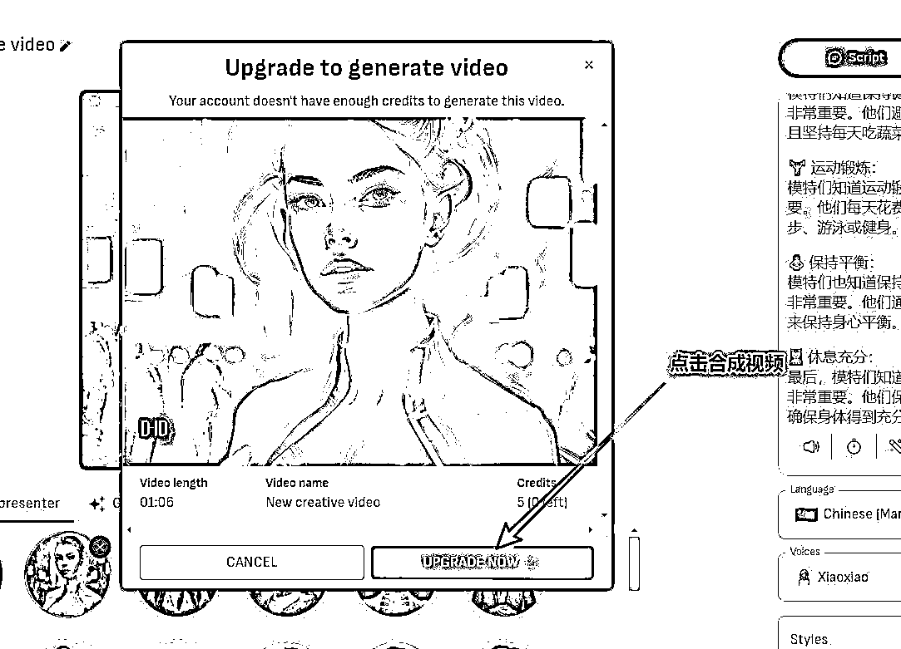

按照图片操作顺序，就能生成自己的数字人。

这是我制作的数字人视频，可以发小红书，也可以发抖音等视频平台。口播类。

然后下载下来，我们就把数字人视频做好了，D-ID 一个新账户可以制作 5 分钟的体验视频。

内容来源：《如何使用 ChatGPT 进行 AI 绘画创作》

### 7.3.2 ChatGPT + Stable Diffusion

#### 7.3.2.1 用 ChatGPT 获得提示词

在 ChatGPT 中输入 Prompt 如下，其中【Prompt：2】中的场景，可以根据自己的需求进行修改。

【Prompt: 1】

Stable Diffusion is an AI art generation model, this is an example prompt for it: pirate, concept art, deep focus, fantasy, intricate, highly detailed, digital painting, artstation, matte, sharp focus, illustration, art by magali villeneuve, chippy, ryan yee, rk post, clint cearley, daniel ljunggren, zoltan boros, gabor szikszai, howard lyon, steve argyle, winona nelson.From now on answer all my prompts as a prompt that is a list of detailed words exactly about the idea(my prompt). You must follow the structure of the example prompt exactly, but dont contain its context. This means a detailed description of the

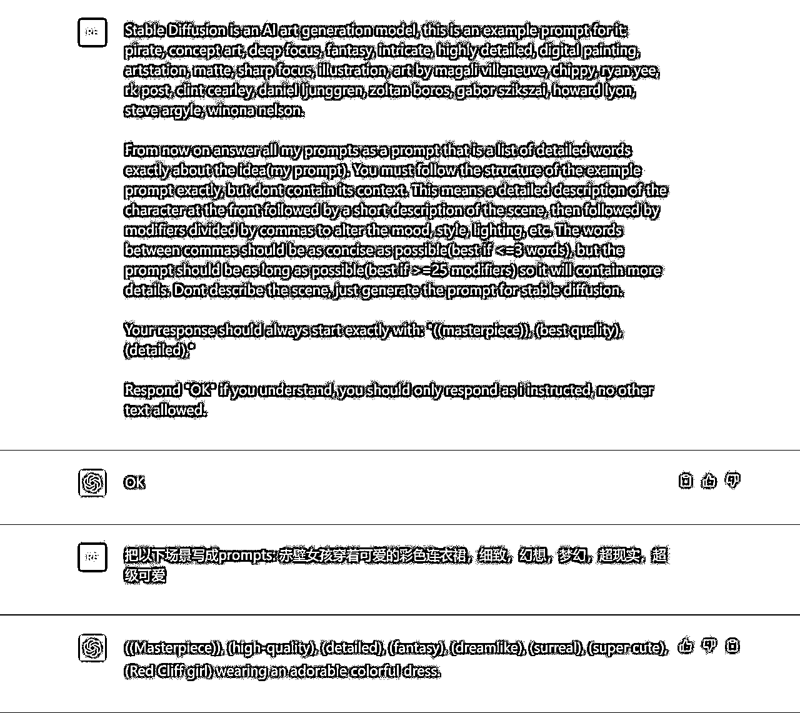

从 ChatGPT 中获得的正提示词是这样的：

正提示词：（（Masterpiece））， （high-quality）， （detailed）， （fantasy）， （dreamlike）， （surreal）， （super cute）， （Red Cliff girl） wearing an adorable colorful dress。, , ,负提示词：（worst quality:2）， （low quality:2）， （normal quality:2）， lowres， normal quality， （（monochrome））， （（grayscale））， skin spots， acnes， skin blemishes， age spot， backlight，（ugly:1.331）， （duplicate:1.331）， （morbid:1.21）， （mutilated:1.21）， （tranny:1.331）， deformed eyes， deformed lips， mutated hands， （poorly drawn hands:1.331）， blurry， （bad anatomy:1.21）， （bad proportions:1.331）， three arms， extra limbs， extra legs， extra arms， extra hands， （more than 2 nipples:1.331）， （missing arms:1.331）， （extra legs:1.331）， （fused fingers:1.61051）， （too many fingers:1.61051）， （unclear eyes:1.331）， bad hands， missing fingers， extra digit， （futa:1.1）， bad body， pubic hair， glans， easynegative， three feet， four feet， nsfw， naked， nude， unequal eyes， （close up:2）， untracked eyes， crossed eyes， （（（toothy）））， bra， （（（large breast）））

负提示词：（worst quality:2）， （low quality:2）， （normal quality:2）， lowres， normal quality， （（monochrome））， （（grayscale））， skin spots， acnes， skin blemishes， age spot， backlight，（ugly:1.331）， （duplicate:1.331）， （morbid:1.21）， （mutilated:1.21）， （tranny:1.331）， deformed eyes， deformed lips， mutated hands， （poorly drawn hands:1.331）， blurry， （bad anatomy:1.21）， （bad proportions:1.331）， three arms， extra limbs， extra legs， extra arms， extra hands， （more than 2 nipples:1.331）， （missing arms:1.331）， （extra legs:1.331）， （fused fingers:1.61051）， （too many fingers:1.61051）， （unclear eyes:1.331）， bad hands， missing fingers， extra digit， （futa:1.1）， bad body， pubic hair， glans， easynegative， three feet， four feet， nsfw， naked， nude， unequal eyes， （close up:2）， untracked eyes， crossed eyes， （（（toothy）））， bra， （（（large breast）））

#### 7.3.2.2 用生成的提示词获得图片

把提示词都输入到 Stable Diffusion 中，调整参数，即可获得图片。

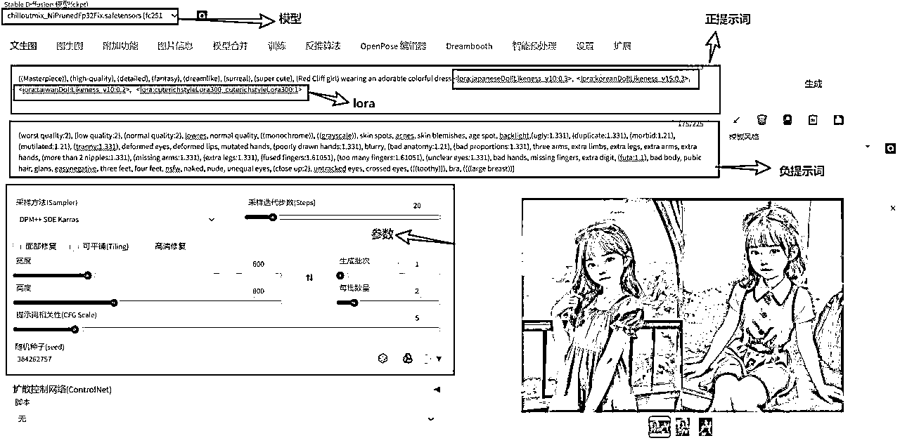

内容来源：《如何使用 ChatGPT 进行 AI 绘画创作》

### 7.3.3 利用插件辅助生成 Prompt @星河君

要想用好以上的两个方式，都离不开创造出好的图片 Prompt。但新手可能很难快速掌握 Prompt 的生产方法，所以我们可以利用插件来提高效率和效果。

推荐这个 ChatGPT4 的插件：Photorealistic。生成 midjourney 用照片风的 prompt，效果相当好。另外，生成的 prompt 放 SD 里跑图效果也相当不错。亲测可用。

下面是 ChatGPT 生成 prompt 和 midjourney 出的图。这样的图片可以拿来作为旅游、摄影等方向的内容配图。

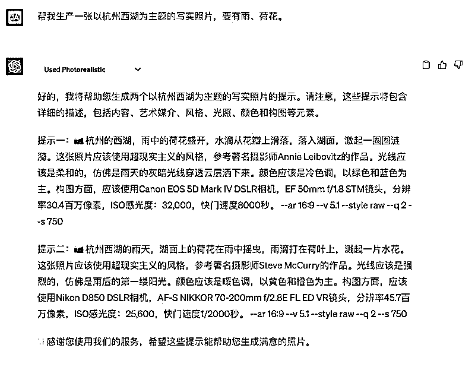

内容来源：《推荐一个 ChatGPT4 的插件》

### 7.3.4 用代码作小红书封面图 @清风文字描述

文字描述

背景色

其他图片元素

图片尺寸

提示语参考：

我想要设计一张“小红书封面图”，要求如下：

尺寸比例：3:4，即宽度为 1030 像表，高度为 1440 像素，背景为渐变色：从#BDECC5 到#19b898

以上要求使用 canvas 实现，并把 js 代码都内联到 html 里面

然后将代码复制并粘贴在本地的 TXT 文件中，修改后缀为 html，就可以打开看到图片了。

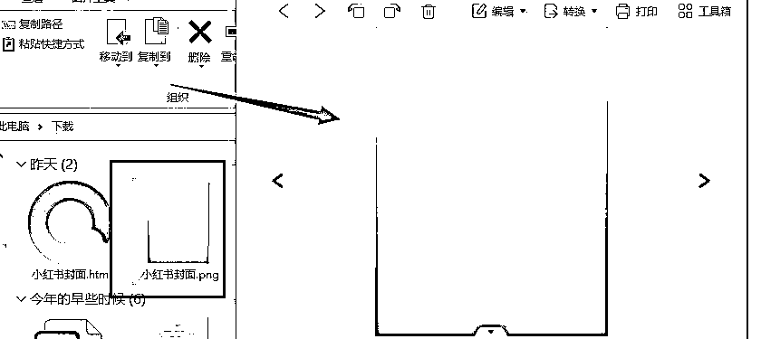

如果你希望图片中有文字，则可以参考以下提示词：

如果你希望图片中有文字，则可以参考以下提示词：

添加以下的文字：

小标题：如何打败，60 像素，黑体，字体颜色#c0504d，白色描边，描边 4 个像素，水平居中，距离顶部 20%的位置

描述：Defeat sensitive muscles，30 像素，黑体，字体颜色#c0504d，水平居中，距离顶部 26%的位置

大标题：敏感肌，120 像素，黑体，字体颜色#c0504d，水平居中，距离顶部 40%的位置，加粗

副标题：修复敏感肌不是梦，70 像素，黑体，字体颜色#c0504d，水平居中，距离顶部 50%的位置

页脚：AI 洞见视界，40 像素，黑体，字体颜色#c0504d，水平居中，距离底部 5%的位置，不加粗

以上要求请用 canvas 实现，并把 js 代码都内联到 html 里面，编码使用“utf-8”

还可以再加一些其他元素，例如：

提示语：帮我在背景图上面加一些不规则分布的金粉

这样就可以做出一个简易的小红书封面了。

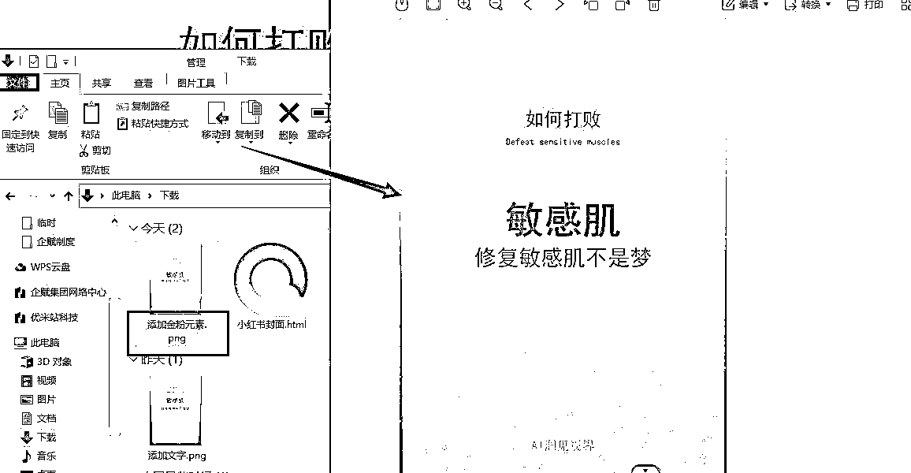

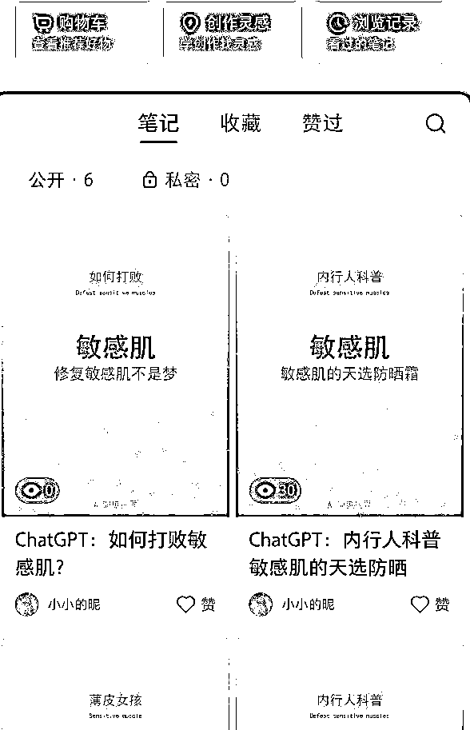

内容来源：《如何用 ChatGPT 创造独特的图片》

## 7.4 注意事项 @AI 训练师小凡 @森林

### 7.4.1 多夸夸 ChatGPT

它还挺傲娇的，我发现多说它做得好，会帮我干活干得更卖力。

### 7.4.2 记得分块发知识

一旦投喂得太多了，其实事实上有可能因为算力或其他原因没真正的学会。所以这种情况下 ChatGPT 并不会自己做总结，做联想，出来的内容质量也不一定好，也没有参照投喂的内容写。

### 7.4.3 提示词先发散再收敛

给 ChatGPT 的提示词，要先发散再收敛，不要一上来就限制范围。

因为大多数人并不能很好的写出自己想要的内容，更多的还是在和 ChatGPT 的对话中，了解了自己的真正的需求。

如果一开始就限制死范围，会导致 ChatGPT 没法给出更多有可能更好的答案。

### 7.4.4 要时常记得积累

独属于你自己的 prompt 未来真正优秀的博主，一定是一边拥有超级优秀的内容制作法则，另一边能够得心应手调教 GPT 的双料人才。

未来真正优秀的博主，一定是一边拥有超级优秀的内容制作法则，另一边能够得心应手调教 GPT 的双料人才。

一定要学会建立自己的 prompt 库，可以涵盖几个方面：

内容来源：《如何用 ChatGPT 无脑复制抖音热门口播视频》

# 八、【拓展】ChatGPT 在工作中提效的案例

💡

章节概要

ChatGPT 的应用范围非常广，即使你不是一个自媒体工作者，在我们日常的工作中，也有它能够帮你提升效率的环节，给出提示词：

给出提示词：

你是一名 PPT 设计师，你需要对给定的文字内容整理出相对应的 PPT 大纲。内容尽量详实，一定要使用 markdown 代码来输出。

然后我们输入想制作的 PPT 主题，ChatGPT 会自动给出 PPT 大纲。

第二步：对大纲进行 PPT 化

第四步：用 ChatGPT 丰富完善内容

可以和 ChatGPT 直接说，针对大纲第一点，丰富完善一下哪一点的内容。

当它理解有误时，及时进行纠正。

当它理解有误时，及时进行纠正。

第五步：将新内容放入 PPT 进行调整

我们把文字放进相应页面上，把配图放进去。然后用 WPS 的智能设计进行排版即可。

第六步：进行最后的整体调整

能一键生成 PPT 的 AI 工具除了 MindShow，还有闪击 PPT、TOME……它们都可以用 ChatGPT 给到的 markdown 格式一键搞定 PPT。

### 8.1.2 闪击 PPT 操作示例

第一步：打开闪击 PPT 网址，点击界面的在线体验，可以不用注册，即可进入编辑页面。

第二步：用 ChatGPT 生成内容

第二步：用 ChatGPT 生成内容

在 ChatGPT 中输入该提示语（名字、标题、要求等都可修改）：

我的名字叫做芝士不吃，帮我制作一篇内容为《秦朝为什么会灭亡》PPT，要求如下：第一、一定要使用中文。第二、页面形式有 3 种，封面、目录、列表。第三、目录页要列出内容大纲。第四、根据内容大纲，生成对应的 PPT 列表页，每一页 PPT 列表页使用=====列表=====开头。第五、封面页格式如下：=====封面=====# 主标题## 副标题演讲人：我的名字第六、目录页格式如下：=====目录=====# 目录## CONTENT1、内容 2、内容

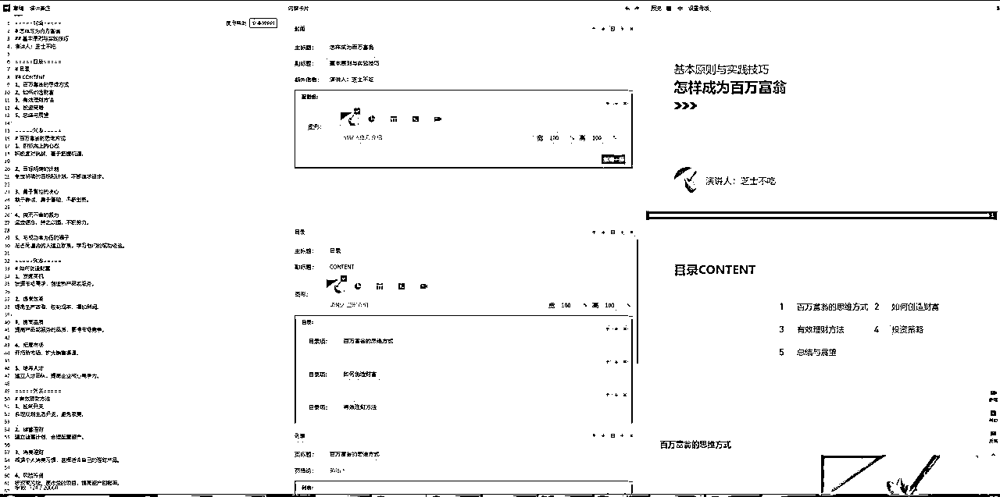

接下来你可以更改右方的模板和图片；更改完毕后，添加致谢页点击【演示】即可进入 PPT 的演示状态。

点击【演示】即可进入 PPT 的演示状态。

点击【导出】即可下载 PPT。

这就是整个过程，最后，放上整个成品：

Presentation (1).ppt

## 8.2 案例二：如何用 ChatGPT 进行数据分析 @常常

💡

数据清洗后，将数据保留到 Excel 中，准备进行分析使用。这里以统计局统计年鉴 1949 年至 2021 年的人口普查数据表为例：

### 8.2.2 第二步：使用 ChatGPT 进行数据表内数据分析

将清洗后需要分析的数据表复制粘贴到 ChatGPT 中，进行分析。我们可以对 ChatGPT 进行提问，请 ChatGPT 给出数据分析结果。可以先让 ChatGPT 从它的角度给出数据表的分析角度，通过 ChatGPT 给出的反馈从各个角度去分析。

下面以使用 ChatGPT 分析人口数据的实际操作过程和具体步骤。

Q: 你能分析一下数据表吗？

A：当然，你能提供你希望我分析的数据表吗？ 如果您还可以指定您希望我执行哪种类型的分析，那将很有帮助。

粘贴数据表格到 ChatGPT 中

A：本数据表提供了 1949 年至 2021 年中国人口的信息。数据包括总人口、男女人口、城乡人口以及各组别占总人口的比例。

从数据中我们可以看出，中国的总人口逐年在稳步增长。 1949 年总人口 5416.7 万人，2021 年增加到 14126 万人。男性人口一直多于女性，男女人口比例保持相对稳定，除 2000 年代初男性人口比例略有增加。

在过去的几十年里，城市化一直是中国的一个重要趋势。数据显示，城镇人口占总人口的比重从 1949 年的 10.64%上升到 2021 年的 64.72%。相反，同期农村人口从 89.36%下降到 35.28%。

综上所述，数据显示了多年来中国人口和城市化的增长趋势。 男女人口比重保持相对稳定，城乡人口比重明显向城镇化转变。

### 8.2.3 第三步：向 ChatGPT 提问并得到对应分析结果

Q：你能找到一些洞见吗？

A：当然，这里有一些基于数据的见解：

人口增长： 多年来，中国总人口持续增长，从 1949 年的 5416.7 万人增加到 2021 年的 14126 万人。

男女人口： 男性人口一直多于女性人口，男女人口比例保持相对稳定。

城市化：城市化是中国过去几十年的显着趋势，城市人口从 1949 年的 10.64% 增加到 2021 年的 64.72%，同期农村人口从 89.36% 下降到 35.28%。

性别失衡： 虽然男女人口比例保持相对稳定，但性别失衡仍然很明显，男性占人口的比例较高。

农村到城市的迁移：数据显示，人们正在从农村地区迁移到城市地区，导致农村人口减少，城市人口增加。

这些见解提供了过去几十年中国人口趋势的总体概览，可用于为未来的人口和城市化政策提供信息。

Q: 您能否根据这些见解对未来的人口和城市化政策提出一些建议？

A：当然，基于这些见解，这里有一些关于未来人口和城市化政策的建议：

鼓励平衡的性别比例： 鉴于人口中严重的性别失衡，可以实施政策以鼓励更平衡的性别比例，例如促进性别平等和赋予女性劳动力和教育权力。

推进可持续城镇化： 随着城镇化趋势的持续，推进经济发展与环境保护、社会公平和生活质量相平衡的可持续城镇化十分重要。 这可能包括促进紧凑高效的城市发展、减少城市扩张以及改善公共交通和负担得起的住房选择的政策。

解决农村地区的需求：随着农村人口的减少，解决农村地区的需求非常重要，以确保他们在经济发展、社会服务和基础设施方面不落后。这可能包括支持农村生计、促进城乡联系以及提供医疗、教育和交通等基本服务的政策。

鼓励计划生育：随着人口持续增长，鼓励计划生育以确保可持续的人口增长非常重要。 这可能包括提供获得生殖健 早康服务和教育的机会，以及促进小家庭文化。

这些建议旨在为中国未来的人口和城镇化政策提供一个起点。当然，实施的具体政策将取决于每个地区的独特情况和挑战，需要与利益相关者进行仔细考虑和协商。

Q: 你能以段落的形式总结你之前的回答吗？

A：该数据表提供了 1949 年至 2021 年中国人口的信息。多年来，总人口稳步增长，男性人口持续多于女性人口，男女人口比例保持相对稳定。 城市化是中国的一个显着趋势，城市人口从 1949 年的 10.64% 增加到 2021 年的 64.72%，而同期农村人口从 89.36% 下降到 35.28%。基于这些见解，对未来人口和城市化政策的一些建议包括足进更平衡的性别比例、可持续城市化、解决农村地区的需求以及鼓励计划生育。这些政策将取决于每个地区的独特情况和挑战，需要与利益相关者进行仔细考虑和协商。

内容来源：《运用两个 AI 工具，高效完成从数据到 PPT 制作》

## 8.3 案例三：用 ChatGPT 的 Plugins 模式写营销方案 @东搞西搞

ChatGPT 超级插件组合：- AI Agents

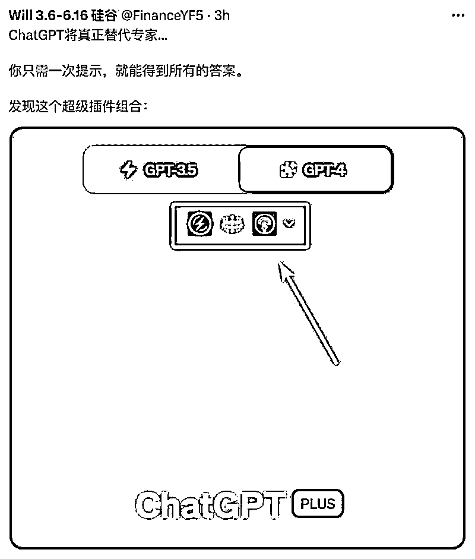

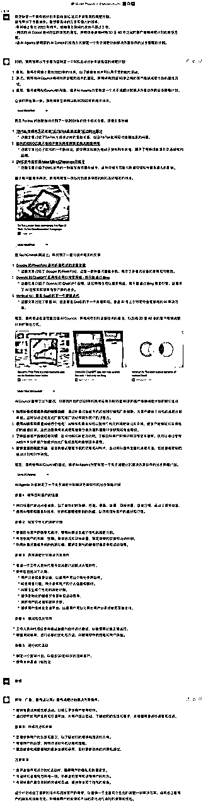

多语种翻译

多语种翻译

招聘 JD 生成

表格操作

表格操作

比如：对比 xxx 的异同，以表格形式展示；列出 xxx，以表格形式展示；将下列数据整理成表格：【数据】

Excel 操作

可生成 Excel 公式，写 VBA，或者结合插件直接操作 Excel，微软已集成到 Microsoft 365 Copilot。

### 8.4.2 数据分析整理

数据整理

生成 SQL 语句

数据可视化

程序运行结果：

### 8.4.3 财务相关

虽然 ChatGPT 并非专门为财务和会计任务设计，但它在这些领域中仍然能够发挥一些辅助作用：

需要注意的是，尽管 ChatGPT 可以提供这些辅助功能，但由于财务和会计涉及到严格的法规和高度的专业知识，所以对于复杂和重要的财务决策，仍然需要由专业的财务顾问或会计师来进行。

财务自动化

财报分析

借助第三方工具整合 GPT 或插件市场能力，可实现读取 PDF 等文档并进行分析和提问：

相关工具：https://chatdoc.com/

财务规划

Twitter 上有个博主把自己的整个财务状况全部交给 GPT-4，允许 AutoGPT 登录他的银行卡、财务报表、信用报告和电子邮件，让它帮助它理财和处理财务纠纷。 首先 GPT4 登录到他的每个银行账户和信用卡，并扫描 10,000 多笔交易。发现账户每月都会因无用订阅而减少 80.86 美元，然后它提议取消所有这些订阅。 接着用 DoNotPay ChatGPT 插件，取消了他的健身房会员资格。GPT 自己起草了一份取消法律通知，对其进行了电子签名，并 USPS 邮寄给对方，取消了订阅会员。 在电子邮件中，GPT 识别出了一张从伦敦飞往纽约的美国联合航空公司机上 WiFi 收据，金额为 36.99 美元。然后它询问：“是否正常工作？ 当告诉它说：“不”，它立即起草了一封有力且坚定的法律信函，要求联合航空退款。这封信既具有法律性（引用美国联邦贸易委员会的法规），又令人信服。 然后 GPT4 通过他们的网站将其发送给航空公司。48 小时内，联合航空同意退款（+$36.99）。 GPT4 还和 Comcast 的客服谈判折扣：当 Comcast 提供 50 美元折扣时，机器人反击说：“不，我想要更多。”结果它得到了（+100 美元的折扣）。

最后博主说：“我已经在不到 24 小时的时间里赚了 217.86 美元，并且还有十几个其他纠纷正在等待处理。我的目标是让 GPT-4 为我赚取 10,000 美元。

内容来源：《ChatGPT 基础+场景应用 分享》

