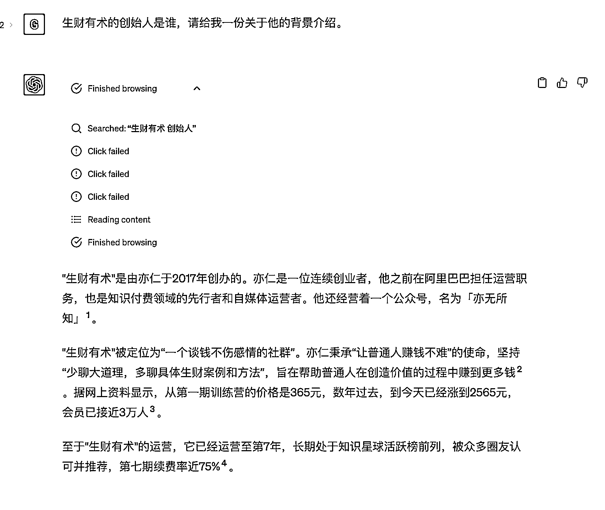

# 2.1 ChatGPT Plus 版有什么区别

ChatGPT Plus 版是 OpenAI 提供的一个更高级的版本。相较于普通版（也叫免费版 ChatGPT ），Plus 版比普通版 ChatGPT 具有更大的参数量和更高的计算能力，因此可以生成更多且更复杂的回复。ChatGPT Plus 还可以进行更复杂的对话，包括更长的上下文和更多的对话流。

另外，5 月 16 日起，ChatGPT Plus 版已经支持联网了，你可以直接向它提问近期的内容，它会进行搜索整合后，给你一个较为准确的回答。

但需要注意的是， Plus 版在对话次数上有限制，目前是 3 小时 25 次对话使用次数。且目前 ChatGPT 其实不具备真正意义上的上下文记忆，所以不太适合长内容的训练。

如果你对每个月 20 美金左右的费用开销（约等于一顿饭钱）能够承受得起，觉得不痛不痒，那么推荐你使用 Plus 版。

