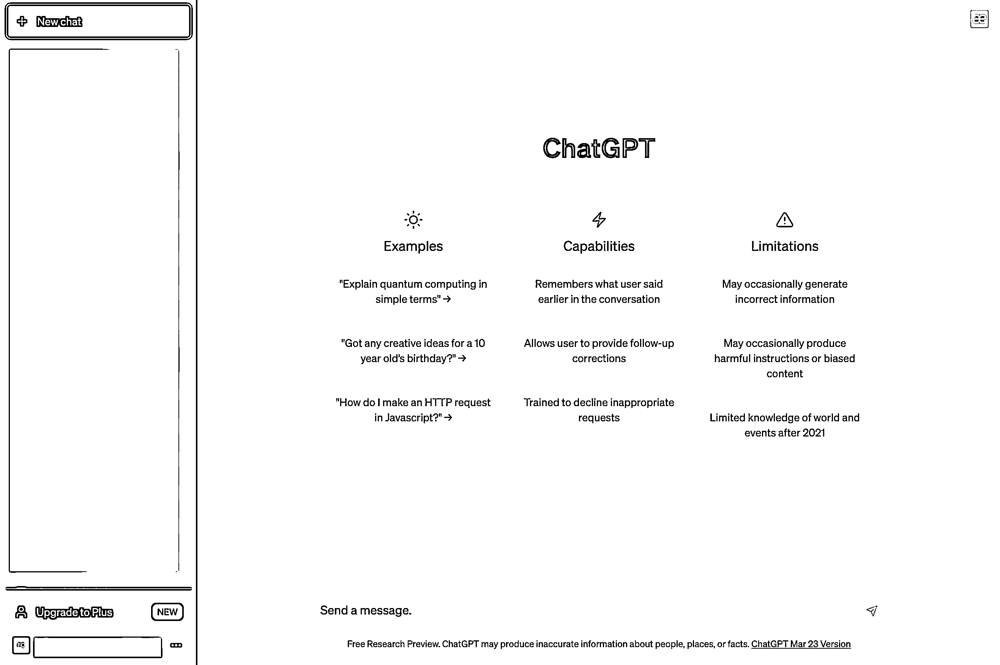
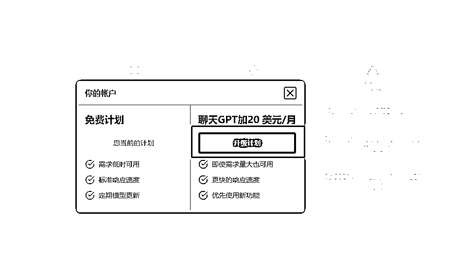
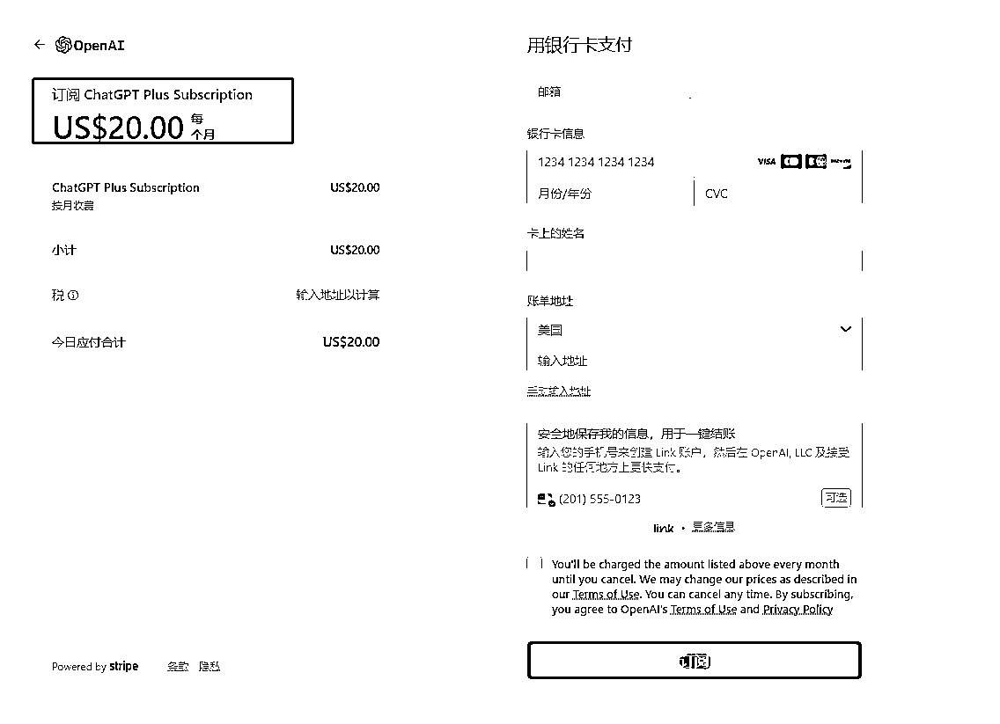
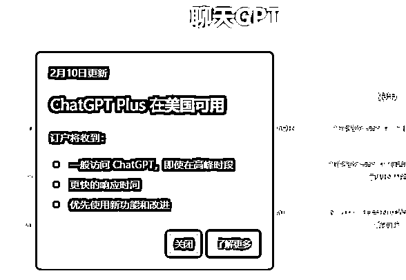

# 2.3 如何购买 ChatGPT Plus 版

目前主要有两个方法获取 Plus 账户。

第一种是账号登录之后，会提示升级到 Plus：

点击升级到 Plus，会出现会员选择界面：

目前升级到 Plus 账号，免税州会员价格是 20 美金/月（非免税州也在 20 美金/月左右），折合人民币 135.68 ，支付会员需要使用国外的信用卡。

当然如果你在国内想要尝试付费，没有国外信用卡，也可以通过以下付费方式进行测试，一般可以使用 DePay 虚拟卡进行充值，流程如下：

1.注册 DePay，开通虚拟卡 depay.depay.one

2.向朋友或中心化交易所购买 USDT，如 Binance、 OKX。

3.将交易所购买的 USDT 提现到 DePay 账户

4.在 DePay 中，把 USDT 兑换成 USD 并充值到虚拟卡

5.前往 ChatGPT Plus 付款。账单地址建议选一个美国免税州 （如中转地址）

第二种是重新注册账号，位置选美区，手机号和原生 IP 均是。不能确保百分百，但有一定概率会有。

P.S. 美国会有可能全部开放 ChatGPT Plus

