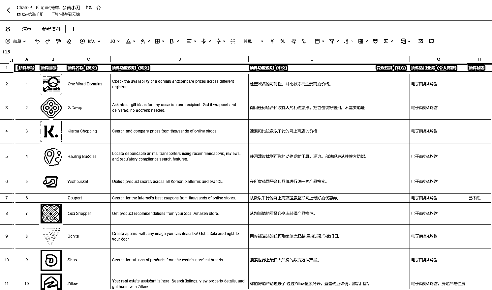

# 2.4 ChatGPT Plugins 上线

OpenAI 宣布在 5 月 15 日这周起向所有 ChatGPT Plus 用户推出 Beta 版本，支持联网和 70 多种第三方插件。这批第三方插件能够全方位覆盖衣食住行、社交、工作以及学习等日常所需，基本上能够扮演 24 小时私人助理的角色。

因此从这里我们也可以看到，ChatGPT 可能会像微信一样作为一个平台，插件的需求挖掘和开发也许是一个新的机会。

另外圈友 @HEXIN 在星球分享了《ChatGPT Plugins 变现分析》，也值得大家参考，尤其是想利用 ChatGPT 开发工具的小伙伴，也许可以从中获取一些灵感。

但需要注意的是，将语言模型连接到外部工具会带来新的机会，同时也会带来重大的新风险 。OpenAI 官方也承认：“插件可能会采取有害或无意的行动，增加不法分子欺诈、误导或虐待他人的能力，从而增加安全挑战。”

如果你想了解更多本次 ChatGPT Plugins 更新的相关细节，可以查看这篇翻译之后的 OpenAI 官方发布内容：[《ChatGPT 插件》](https://blog.csdn.net/weixin_44250422/article/details/129848893)

除了官方的内容外，圈友 @黄小刀 也将本次支持的 70 多个插件进行了分类整理，供大家参考：[《](https://shengcaiyoushu01.feishu.cn/sheets/shtcnbZVcicTbk6DKuspfcIWfqg)[ChatGPT Plgins 清单](https://shengcaiyoushu01.feishu.cn/sheets/shtcnbZVcicTbk6DKuspfcIWfqg)[》](https://shengcaiyoushu01.feishu.cn/sheets/shtcnbZVcicTbk6DKuspfcIWfqg)

目前 ChatGPT 支持同时调用三个插件，并会根据你的提问，在相应的插件中调取，整合，总结，呈现回复。

