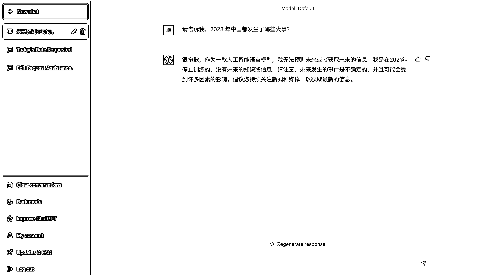

# 3.1 ChatGPT 的特性

首先你要知道的是 ChatGPT 的特性有哪些：

•能够联系上下文：ChatGPT 可以根据回答的上下文进行理解，并给出答案

•能够回答人们的问题：ChatGPT 是一个智能语言模型，可以理解人们的问题，并尝试给出回答。

•可以学习新的知识：ChatGPT 可以学习新的知识，并将这些知识用于回答问题和进行对话。

•可以说多种语言：ChatGPT 可以说很多种语言，包括中文、英文、西班牙语、法语、日语等等。

•能够理解复杂的问题：ChatGPT 可以理解比较复杂的问题，并尝试用简单易懂的方式解释。

•适用于不同的场合：ChatGPT 可以应用于不同的场合，比如在智能家居、智能客服等领域中帮助人们解决问题。

以上内容来自 ChatGPT。

除此之外，你需要知道的是免费版的 ChatGPT 的数据库来源仅限于 2021 年，也就是说在这之后发生的事情，目前免费版 ChatGPT 是完全不知道的：

（免费版 ChatGPT 界面）

另外， 免费版的 ChatGPT 目前无法完成查找。这意味着它无法访问互联网、搜索引擎、数据库或任何其他自身模型之外的信息来源。它无法验证事实、提供参考或执行计算或翻译。它只能根据自己的内部知识和逻辑生成答案。所以想要确定事实的内容，一方面需要提供更准确的资料训练，另一方面需要人员进行结果核验、确认。

而付费版的 ChatGPT Plus，自 5 月 16 日起已逐渐支持联网，可以通过访问互联网等自身模型之外的信息来源进行学习和生成更新更准确的答案。不过互联网上数据众多，保险起见，依旧建议大家提供更准确的搜索方向，以及对结果进行人工确认。

