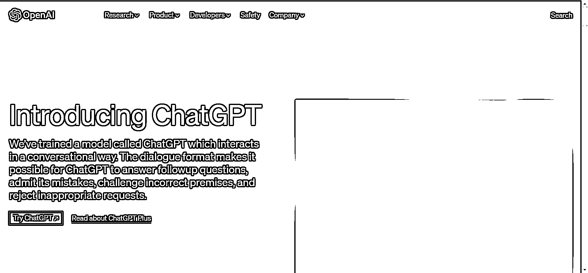
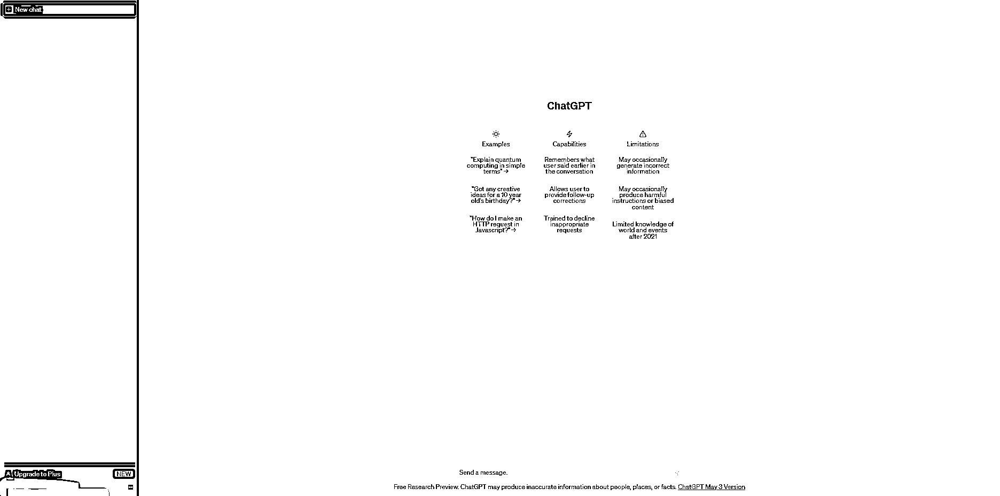
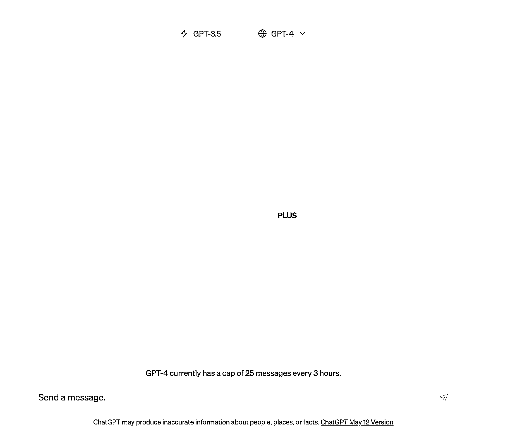
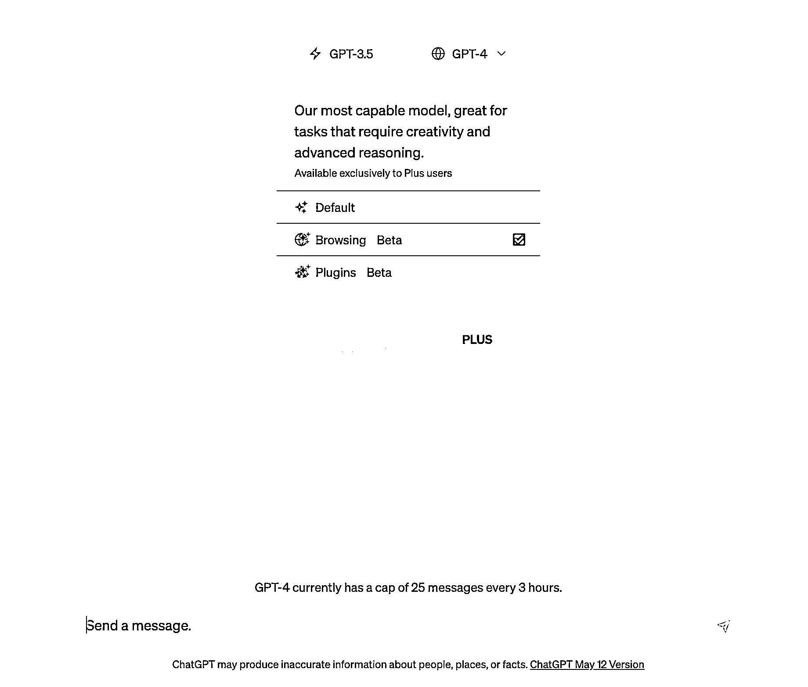
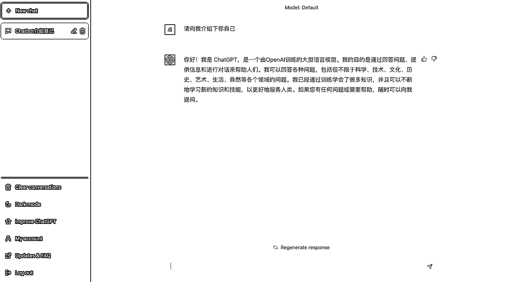
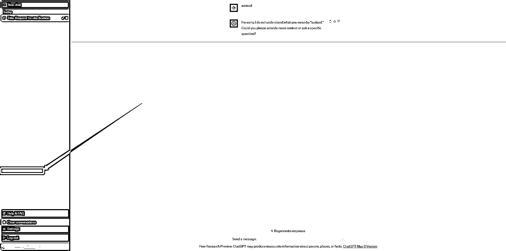

# 3.3.1 如何打开 ChatGPT

首先，打开 [ChatGPT: Optimizing Language Models for Dialogue](https://openai.com/blog/chatgpt/) ChatGPT 的官方网站。

登录上你的 ChatGPT 账号，这个时候你就进入 ChatGPT 的主页面（左图免费版，右图 Plus 版）。

在 Plus 版测定主页面，你可以通过页面正中间的 Model 选择 ChatGPT 的模式：

•Default：Plus 版，可以处理更复杂的信息和对话

•Browsing：浏览器模式，可以联网获取信息

•Plugins：是使用 ChatGPT 可调用的第三方插件，以此增强 ChatGPT 的功能并允许其执行更加广泛的操作

当你想要使用 ChatGPT 时，通过点击正下方的对话框，输入你想要问的问题即可。

比如「请向我介绍下你自己」：

当你问完以后，ChatGPT 就会开始给你回答问题，并且相较于其他问答式产品，他用了即时打字的方式，一个一个字向外“蹦出”答案，非常有趣。

当 ChatGPT 回答完以后，在页面的左上角的「New Chat」下方，你会看到新生长了一个对话标题「Chatbox 介绍自己」。你与 ChatGPT 的每一次对话，他都会根据对话内容生成本次对话的主题，出现在左上角。

当你想要开启下一个主题，又不想删除对话时，就可以通过新建对话，点击「New Chat」来开启新的主题。

当你想要一次性清除对话的时候，可以点击左下角的「Clear conversations」，来结束所有主题对话。

