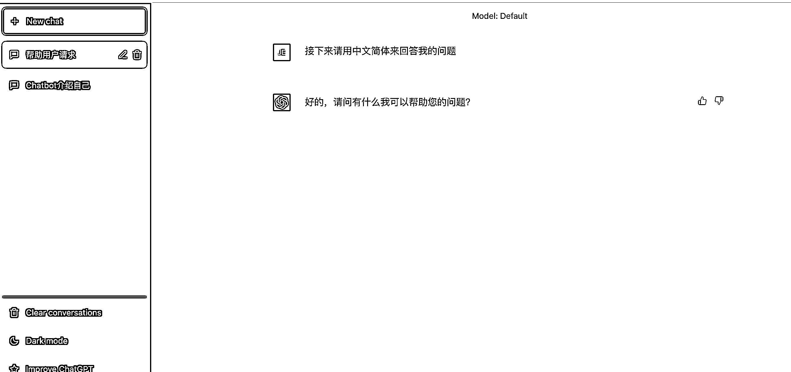
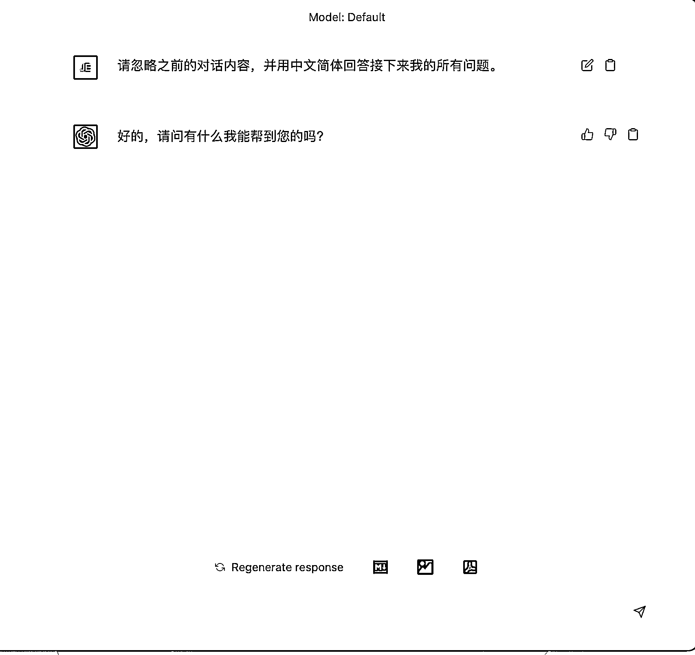

# 3.3.2 如何正确启动 ChatGPT

在使用 ChatGPT 的时候，建议你先将 ChatGPT 的语言设置成「中文简体」。

参考文本：「接下来请用中文简体来回答我的问题」。

除此之外，由于 ChatGPT 对上下文有着非常强的理解能力，所以在打开一个新的 Chat 之前，需要让 ChatGPT 忽略之前的对话内容，并重新开始。

所以正确启动 ChatGPT 的指令是：「请忽略之前的对话内容，并用中文简体回答接下来我的所有问题。」

于此同时，如果你想更好的使用 ChatGPT 的话，还是建议你提升一点英文能力，原因有很多：

•一是用英文与 ChatGPT 交流，他的反应速度会比中文快上数倍

•二是目前 ChatGPT 的主流交流阵地还是在英文社区，如果你想要了解更多的消息还是得具备一定的英文能力

•三是中文会偶尔导致 ChatGPT 莫名其妙的崩溃

