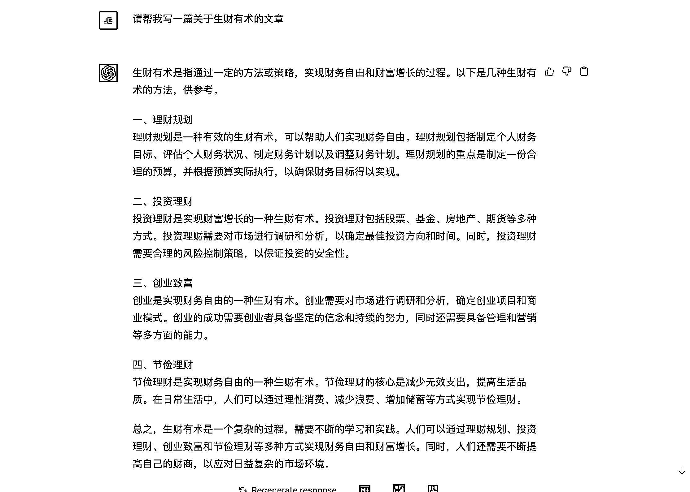
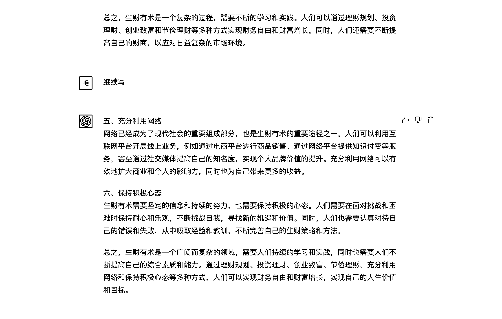
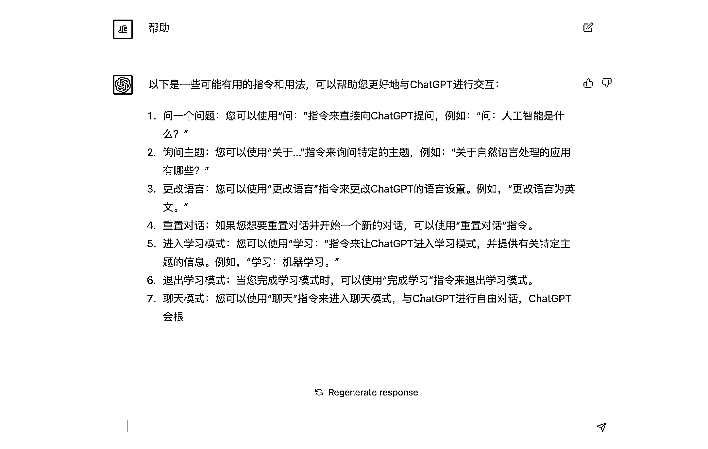

# 3.3.6 如何使用 ChatGPT 的指令

当你发现 ChatGPT 回答的内容不如你的预期时，你可以通过一些指令来纠正和拓展他的答案，使得最终答案更趋向于你的理想答案。

其中最常见的指令就是：继续，继续指令可以让 ChatGPT 在原有答案的基础上继续发散内容，也可以让中断的回答继续下去（不过这个场景目前存在 bug，可能会出现上下文对不上的情况）。

为了避免这种 Bug 的出现，要对这个指令进行改良，正确的指令应该是：继续+动作，例如：继续写，继续翻译，继续提炼等。

除了继续以外，还有几个是比较常见的指令：

•Clarify，澄清、阐明，使得内容更好理解

•Exemplify，举例说明

•Expand，扩写，在原有基础上提供更多内容

•Rewrite，重写内容

•Shorten，精简内容

这些指令可以在 3 种模式下适用，熟练使用后可以大幅提高 ChatGPT 生产的内容满意度。

除了这些通用的常用指令，还搜集了一些关于文案创作、AI 绘画相关的指令，大家可以跳转到「7.1.1.3 ChatGPT 中和文本创作相关的指令」和「7.2.3 ChatGPT 中和 AI 绘画创作相关的指令」进行了解。

当然了，ChatGPT 相关的指令有非常之多，如果你想要了解更多和 ChatGPT 相关的指令，可以了解完部分指令后，输入：帮助，获取更多 ChatGPT 的指令。

