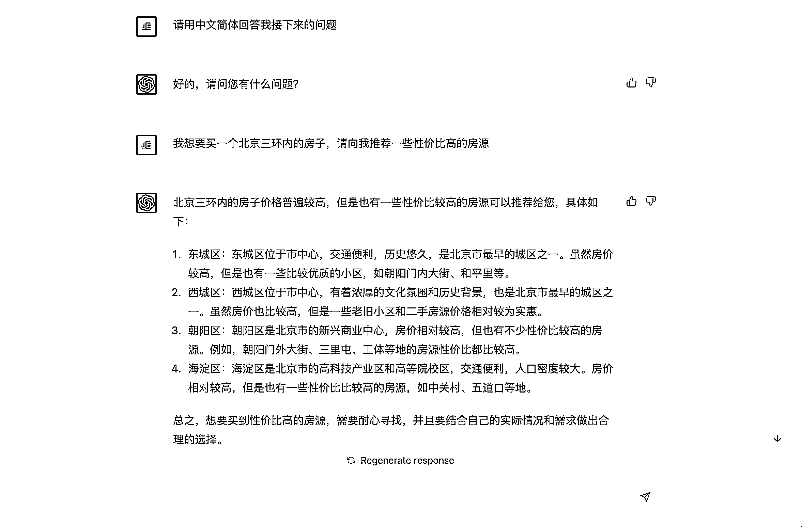
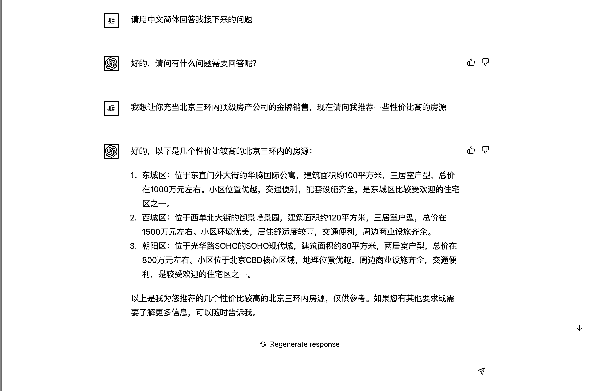

# 4.1 为 ChatGPT 设定身份 @台风 @森林

可能有人会困惑，既然 ChatGPT 是一个 AI 智能聊天机器人，直接聊天框里给他提问题、提需求不就好了？为什么还会需要设定身份让他来玩“角色扮演”呢？

这是因为，ChatGPT 是一个通用 AI，如果你直接提问垂直领域的问题，或让他进行专业创作，得到的回答通常会显得空泛、生硬，是难以直接拿来使用的。

ChatGPT 像是一个拥有着非常高智商的低情商小朋友，它的智商发挥多少完全取决于你和它的对话方式和对话内容。

值得庆幸的是，ChatGPT 提供了类似“角色扮演”的玩法，只要你为他指定一个身份，它就可以向你给出非常专业的回答。

比如，你为他设定一个房产销售的身份，让他给你推荐一个在北京三环以内经济又适用的房子。

左图是没有导入身份的 ChatGPT 回答，你可以看到在没有任何身份导入之前，他的回答非常宽泛，虽然也是在回答你的问题，但是起到真正有效果的答案几乎没有，也就是“正确的废话”。

右图是导入了“北京三环内顶级房产公司的金牌销售”身份，这个时候他的回答就出现了变化，给出了诸如：

“东城区：位于东直门外大街的华腾国际公寓，建筑面积约 100 平方米，三居室户型，总价在 1000 万元左右。小区位置优越，交通便利，配套设施齐全，是东城区比较受欢迎的住宅区之一。”

经过了身份导入的 ChatGPT，他回答的答案里包含了大量有用的信息，包含具体的小区名、户型、房子大小，甚至是价格，相较于前者的回答，已经是一个非常优秀的答案了。

角色设定指令（Prompt 提示词），是 ChatGPT 官方支持的能力，起到“调度”行业专家模型的作用，可以显著提高答案质量。

角色指令使用方法也很简单，新建一个会话，首条消息先发送角色设定指令，那么后续的对话，ChatGPT 将都会以预设的身份进行回答。

掌握召唤专家角色的魔法咒语，是业内公认的 ChatGPT 必备技能。

一条优秀的指令，就应该能做到让 ChatGPT 令行禁止，并且是长期有效的，这也是所有 ChatGPT 魔法师的追求。