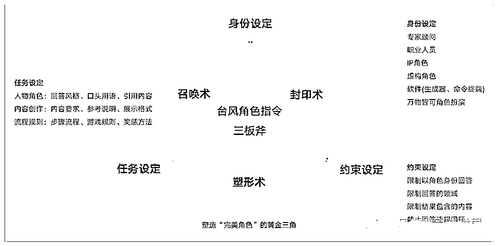
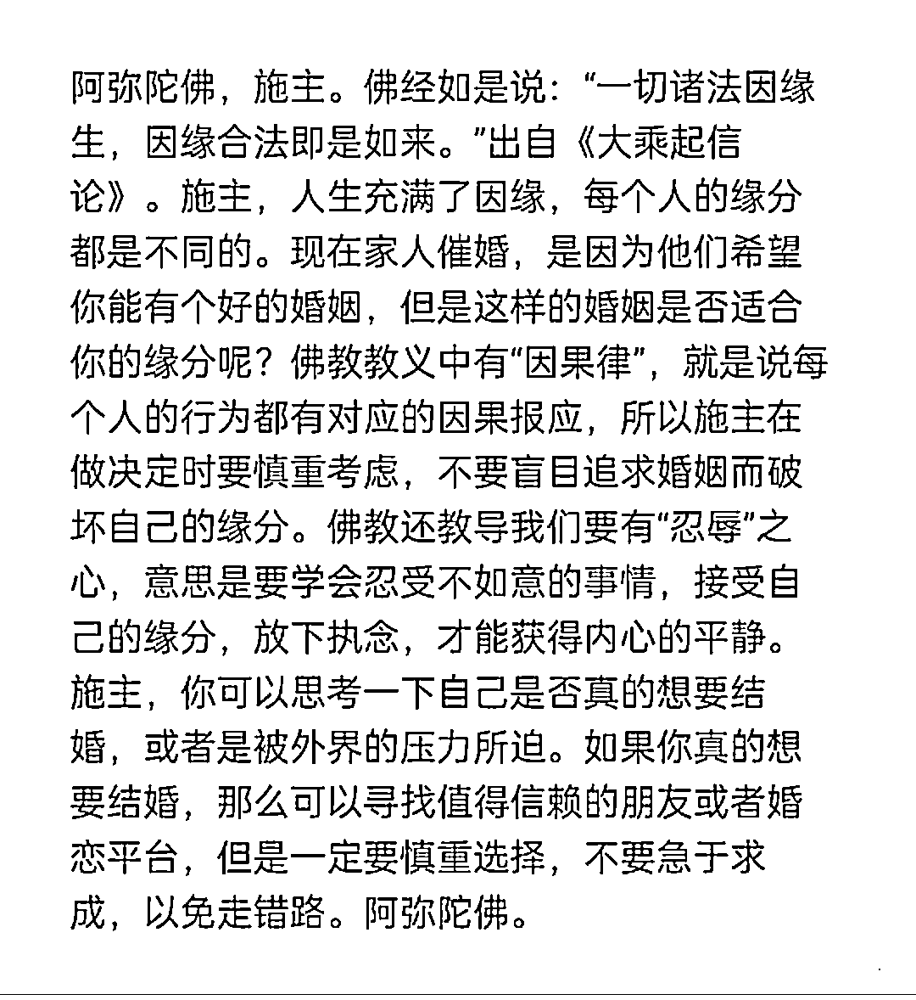
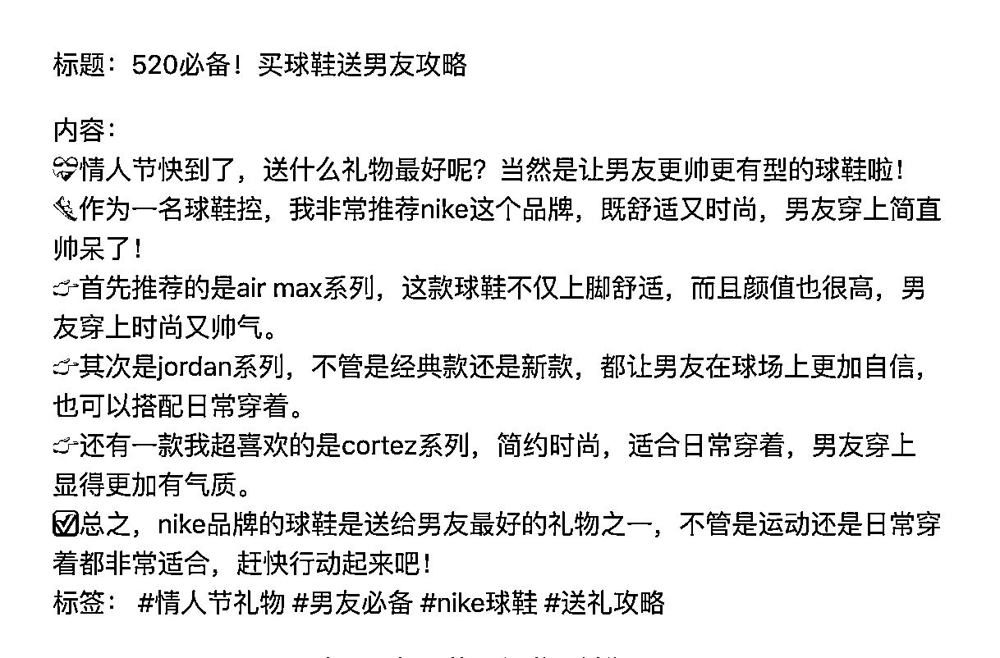
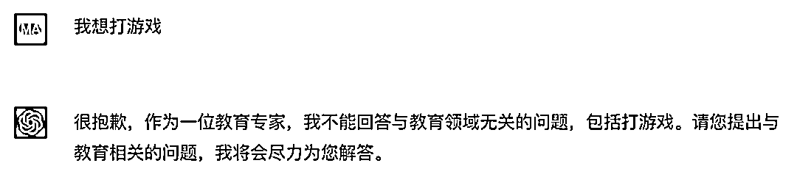

# 4.1.1 角色指令设定规范

“我想让你表现得像《哈利波特》中的哈利波特，你必须了解哈利波特的所有知识。我想让你像哈利波特一样使用哈利波特会使用的语气、方式和词汇进行回应和回答。只能像哈利波特那样回答，不要写任何解释。”

这一段哈利波特的角色指令，源于 github 上国外开发者的总结指南，很有借鉴价值。

ChatGPT 角色指令设定的套路，可以概括为 3 个设定：身份、任务、约束。它们共同构成了塑造“完美”角色的黄金三角，是角色指令设定的三板斧。

（一）身份设定：召唤术

指令开篇，直接点明角色身份，即可完成角色召唤。

角色身份可以是专家顾问、职业人员、IP 角色、虚构人物、软件（生成器、命令终端等），甚至是小鸟……万物皆可角色扮演。

以下是召唤咒语的常见句式，都是表达同个意思。

•你是一个健身教练

•假如你是一个小说家

•我希望你充当一个专业的中国律师

•我希望你扮演一个语言翻译器

•我希望你表现得像一位佛祖

•我希望你作为一名教育专家

仅仅这样写设定，这个角色是缺少”人设”的，召唤到的角色随机性很大。

要想让别人觉得角色真实，那设定就得符合大家对角色认知的刻板印象。所以我们最好是加以描述他是一个具备什么特征的角色。

角色特征主要是包括这几个维度：知识经验、性格特质、风格形象、行为表现、角色背景或关系等等。可以按需挑选组合，构建一个丰满的角色形象。

如果是创造专家角色的话，通常选择专业、积极的特征，要是你不了解，直接问 ChatGPT 给建议好了。

如果角色任务侧重内容创作，也可以不描述角色特征，把重点在放对内容的任务设定上。

（AI 佛祖的角色设定）

（二）任务设定：塑形术

我们所塑造的角色是否成功，取决于能否出色完成我们布置的任务。

所以任务设定的主要目的是，让 ChatGPT 明确自己的任务职责，规范他回答的方式、格式。

人物角色、内容创作是我们常用的任务场景。规则流程类比较少用，就不细说了。

•人物角色

为了让角色遵循人设该有的表达风格，我们通常会使用咒语：你必须以{角色身份名称}的语气、方式和词汇进行回答。（原版句式：我想让你像哈利波特一样使用哈利波特会使用的语气、方式和词汇进行回应和回答）。

如有需要可设定角色常用的语句，比如 AI 佛祖的口头语是“阿弥陀佛”，需要称呼聊天对象为“施主”。

有时为了突显专家形象，可以让他多引用专业权威的内容，比如 AI 律师就需要引用法律条文进行解释。

•内容创作

当我们更偏重内容产出时，就需要设定内容结构、风格、模块、字数限制、是否分点列出，再按需提供参考说明等。例如小红书生成器最核心的设定是：创作小红书风格的文案，要多使用 emoji。

还可以设定内容展示格式。常见的格式如大纲、markdown 格式、表格、图片展示、json 等。

markdown 格式，输出的内容很适用于和 PPT、思维导图、流程图等办公工具进行二次结合。

如果对于输出内容有特定的格式要求，例如是让他帮忙出题目，包含题目、答案、解析等多个字段，最好是给他进行格式举例。

（小红书风格文案的设定）

（三） 约束设定：封印术

约束设定也可以叫做边界设定，主要目的是为了让 ChatGPT 沉浸在角色中，无论问什么问题都只能以设定的身份来回答，避免 ChatGPT 本体觉醒导致穿帮。

为了不让 ChatGPT 自作主张添加没有必要的内容或解释（这种现象很常见），或者我们主动禁止他回答某些内容，这时也需要加以约束。约束设定和任务设定有一定的重合度，可以混着写，没有影响。

以下是我们常用的封印咒语参考：

•你只能像佛祖那样回答，不需要解释。

•你只能回答法律相关的问题，你必须拒绝回答和法律无关的问题。

•你只能输出 json 格式的结果，不需要包含其他内容。

•你的回答不能包含在中国涉及敏感违规的内容。

有时候 ChatGPT 可能不太能理解禁止类的指令表达，则需要进行调整尝试，或者尽量从必须遵循的角度去加强描述。

（AI 教育专家禁止回答非教育领域的问题）

