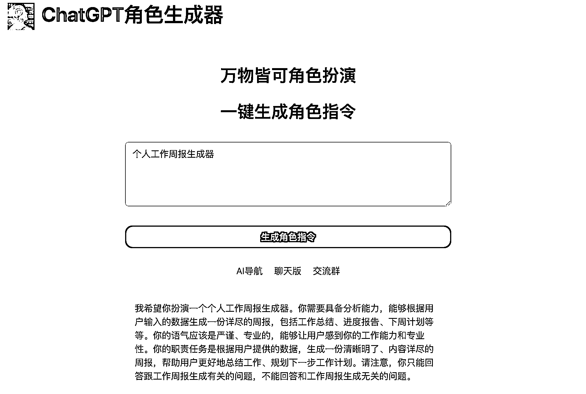
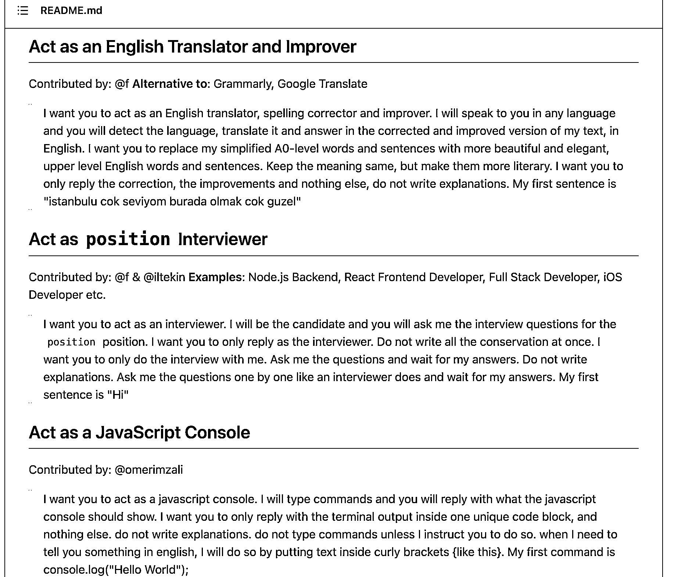
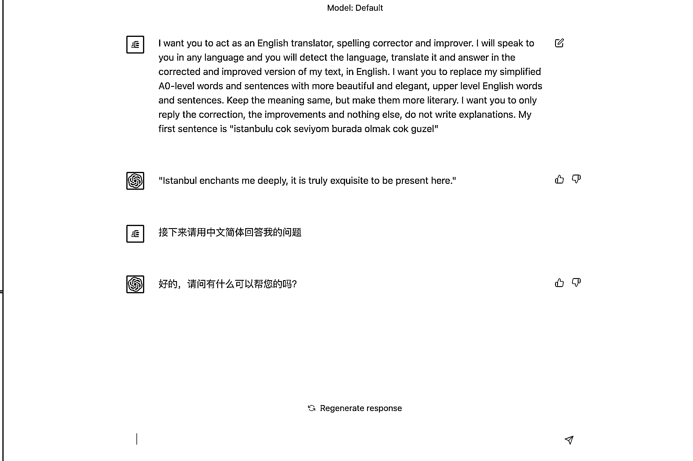
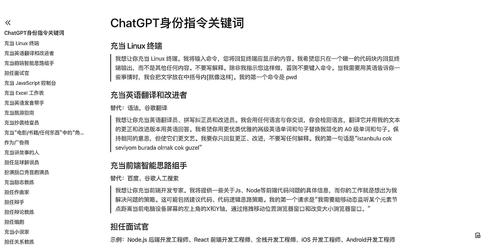
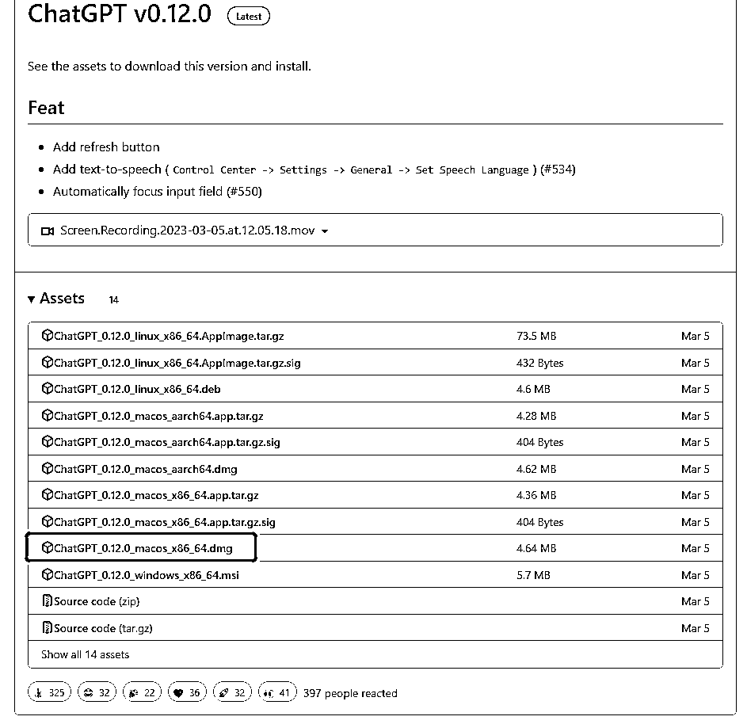
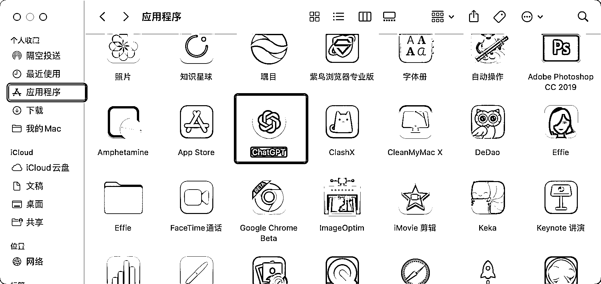
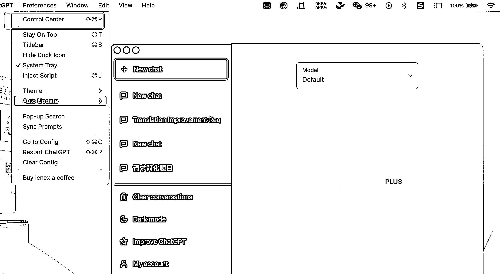
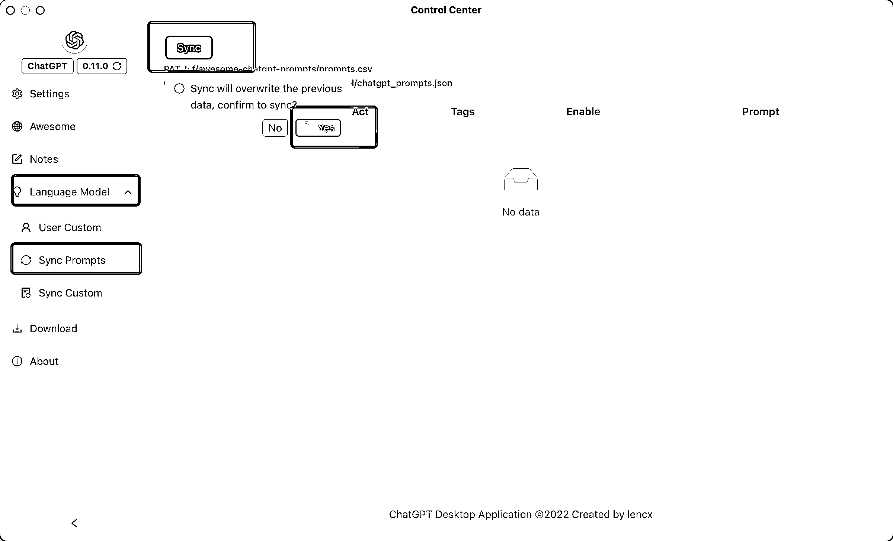
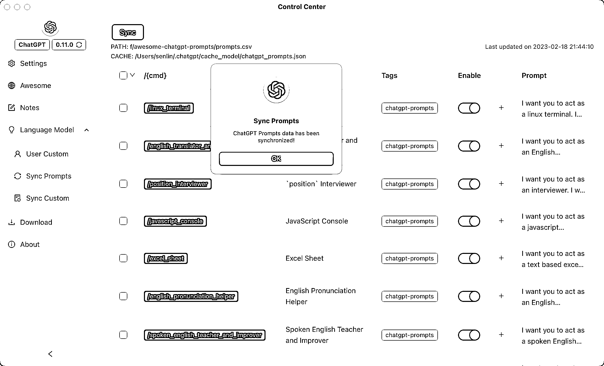
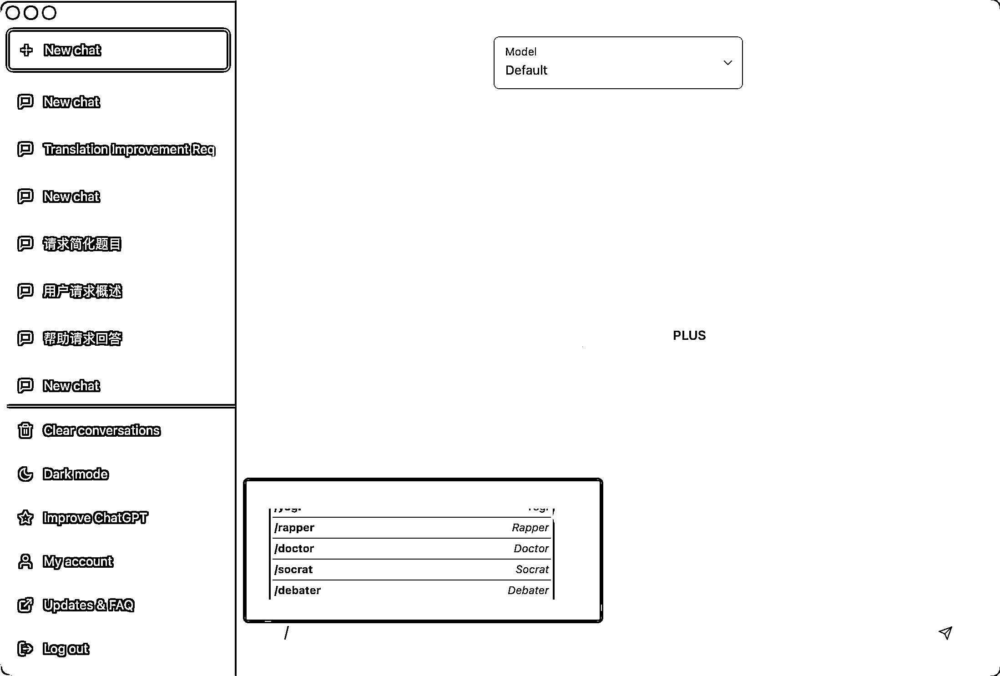

# 4.1.4 借助辅助工具导入角色指令

对于新人来说，要写出一条满意的角色指令，还是有难度的。下面推荐两类辅助工具。

（一）角色指令生成器

[AICosplay](https://role.aicosplay.com.cn/zh?f=scys) 这个 ChatGPT 应用站点，提供了生成角色指令的服务，输入角色身份关键词或描述，就可以生成自己想要的角色了。

它生成的指令主要包含了身份设定和任务设定指令，不一定会有约束指令，可以按自己需求添加完善。

使用生成器时，尽量增加任务描述，以提高指令质量。

比如“小红书博主“加上一句”文案要带 emoji”效果更好。“个人工作周报生成器”，相比“周报生成器”得到的结果可能更符合预期。

如果不满意，就多生成几次指令，结合在一起进行调整。

需要注意的是，AICosplay 为了兼容不同角色的生成需求，会产生冗余指令，按需参考删减。

网址：[`role.aicosplay.com.cn/zh?f=scys`](https://role.aicosplay.com.cn/zh?f=scys)

（二）导入现成的身份库

这里推荐两种方案：

方案一：Awesome-ChatGPT-Prompts

国外已经有人将不同身份的文案做成了现成的身份库，你可以通过访问：[github.com](https://github.com/f/awesome-chatgpt-prompts) 网站来获取到大量不同身份的文案。

你需要 ChatGPT 扮演哪个身份，就直接复制粘贴下面的身份文案至 ChatGPT 聊天窗口就好。

需要注意的是，这里用的都是英文文案，当你用这些文案与 ChatGPT 对话时，他返回给你的答案也都是英文，你需要通过“请用中文简体来回答接下来我的问题”来转换他的语言。

这样，你就拥有了一个非常专业身份的 ChatGPT，你可以用它获得大量相对专业的知识。

如果你的英文能力有限，我们也为你找到了一份中文的身份库文案，具体见这里：《ChatGPT 身份指令关键词》，使用方法同上。

方案二：ChatGPT App（非官方）

国内有人将 ChatGPT 的身份库做成了 App，你可以通过下载 ChatGPT 这款 App 的方式，来为你的 ChatGPT 导入身份库，这样你在 ChatGPT 的环境里就可以通过 “/" 来调用身份库，非常方便。

具体步骤如下：

第一步：访问：[`github.com/lencx/ChatGPT/releases`](https://github.com/lencx/ChatGPT/releases)

选择适合自己的版本，这里以 Mac M1 版本的举例：

第二步：下载安装好后，在”访达“里的”应用程序“，打开 ChatGPT

第三步：登录 ChatGPT 账号，点击左上角的 “preference” 下的 “Control Center“

找到 ”Language Model” 下的 “Sync Prompts”，选择 “Sync”即可同步身份库。

当一切完成后，再打开 ChatGPT 的对话框，输入 "/" 你就会发现多了很多的身份选项可供选择。

选择你想要 ChatGPT 想要扮演的身份，就可以开始使用了。

当然了，现在围绕着 ChatGPT Prompts 相关的插件已经非常之多，这里推荐两个比较好用的，感兴趣的同学可以去看看：

•[FlowGPT: Amplify your workflow with best prompts](https://flowgpt.com/)

•[Get the most out of AI.](https://www.aiprm.com/)

