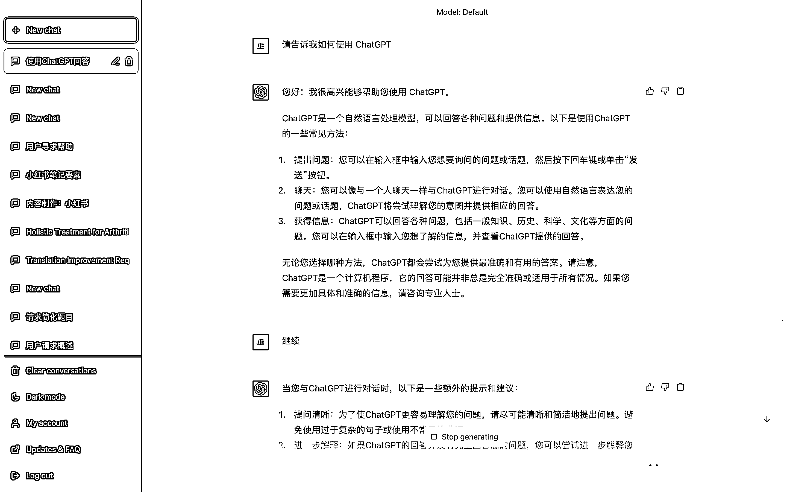
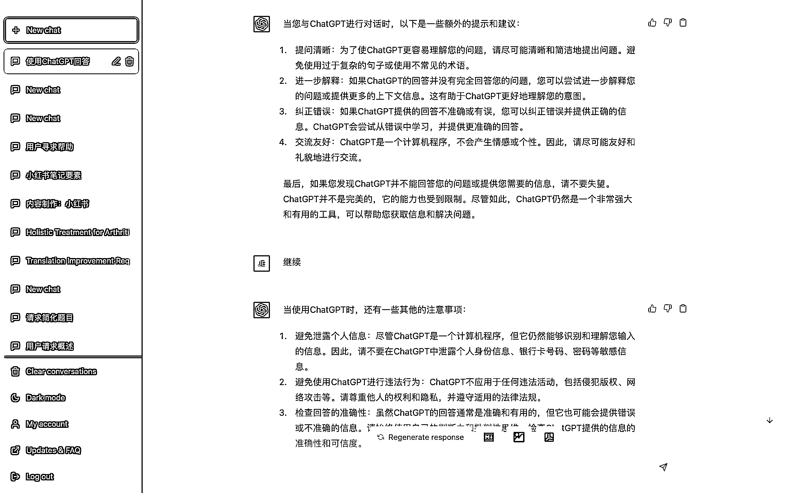

# 4.2 为 ChatGPT 提供引导

上文有提到，ChatGPT 的答案好坏取决于你问他的方式和内容，如果你能很好的引导他的内容，那么就会得出完全不一样的答案。

同时在 ChatGPT 的特性里有提到，它具备理解上下文的能力。也就是说如果你想要得到一个非常好用的 ChatBot，可以通过不断的“喂数据”，为 ChatGPT 建立起一些基础数据库，这样他就能根据你的喂的内容联合它已有的数据库，给出非常精准的答案。

比如你想要得到一个 “赛博风” 的风格，你可以先给他提供一些关于 “赛博风” 的定义，不断地引导 ChatGPT 学习模仿这个 “赛博风” 风格，并最终引导 ChatGPT 写出无限趋近于 “赛博风” 风格的内容。

在 第七章节，将用具体的文章创作案例，来向你展示它的这个能力。

在这个过程中，重点需要用到 3.3.6 小节 的 ChatGPT 的 「继续」指令。

「继续」指令，可以使得 ChatGPT 在已有答案的基础上进行发散。但次数一般有限，测试下来一般在 4 次左右，ChatGPT 就会无法发散，开始出现意思一样的回答。

