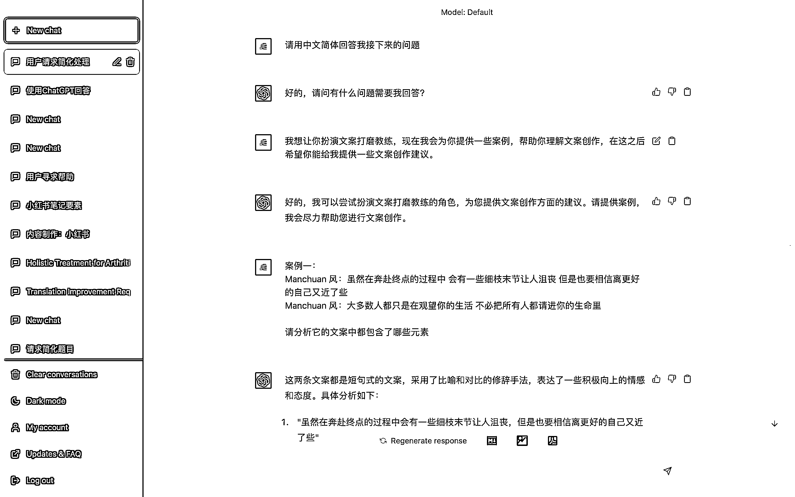
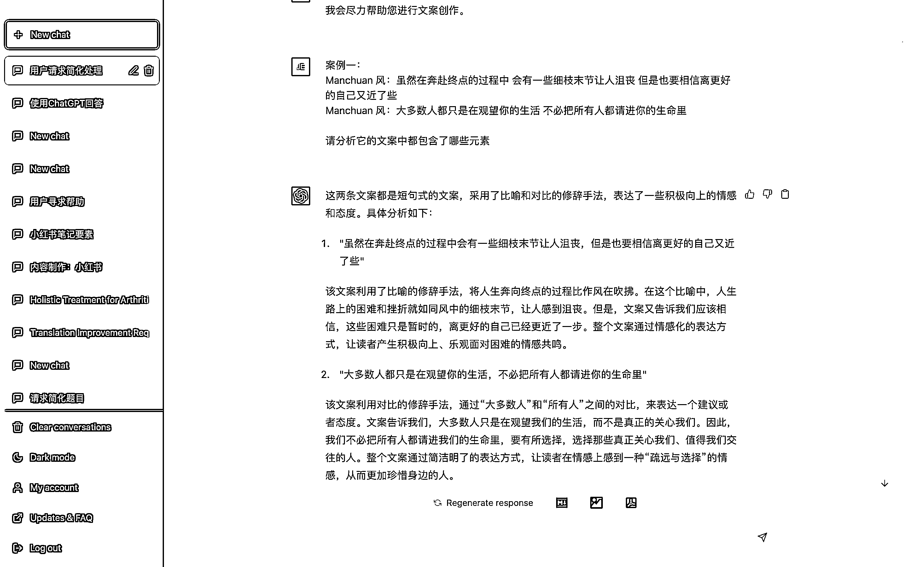
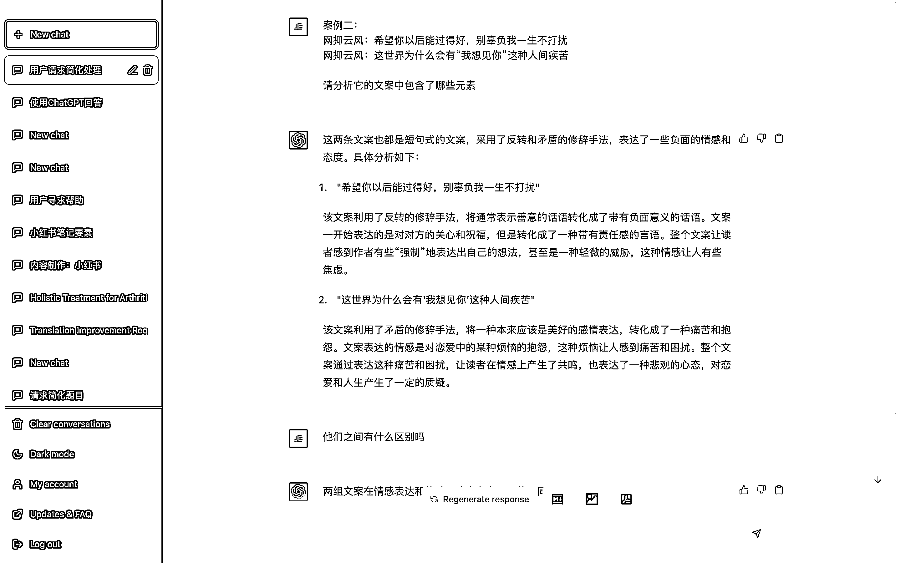
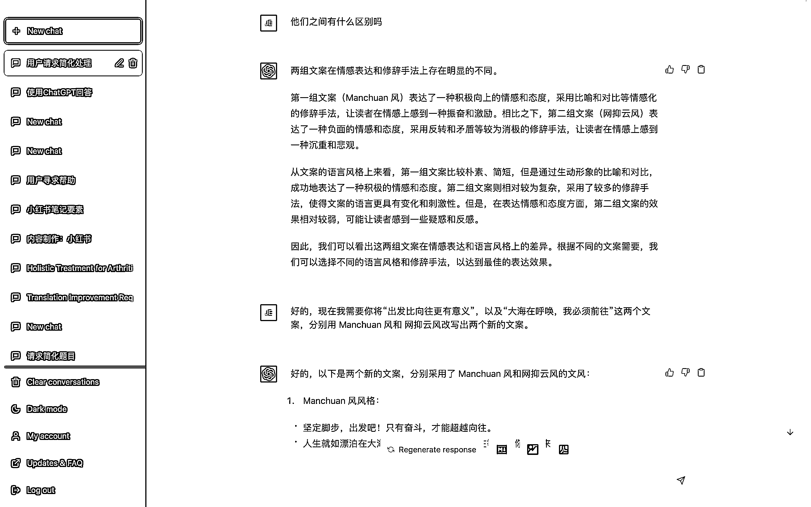
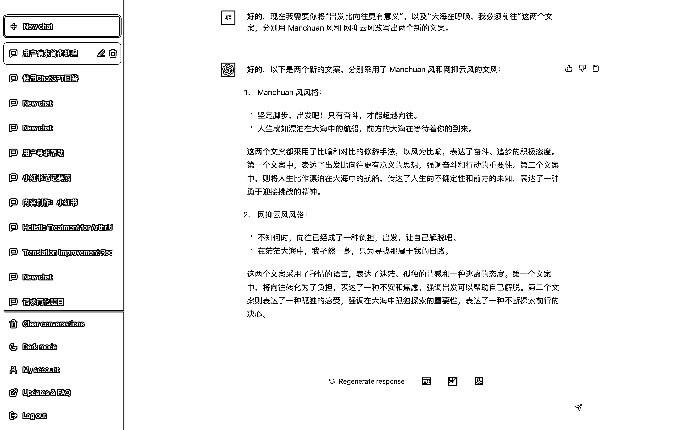

# 4.3.1 第一种：前置对话（推荐）

用大量的前置对话，来帮助 ChatGPT 理解一些文本定义。

这样 ChatGPT 就会根据你前面提供的大量对话，来分析上下文的意思，并根据上下文内容，理解你提的问题，给出准确的答案。

需要注意的是，由于 ChatGPT 可以根据上下文的内容来理解你提的问题，所以尽量不要一个 Chat 内进行多主题的提问，一个 Chat 对应一个主题。

