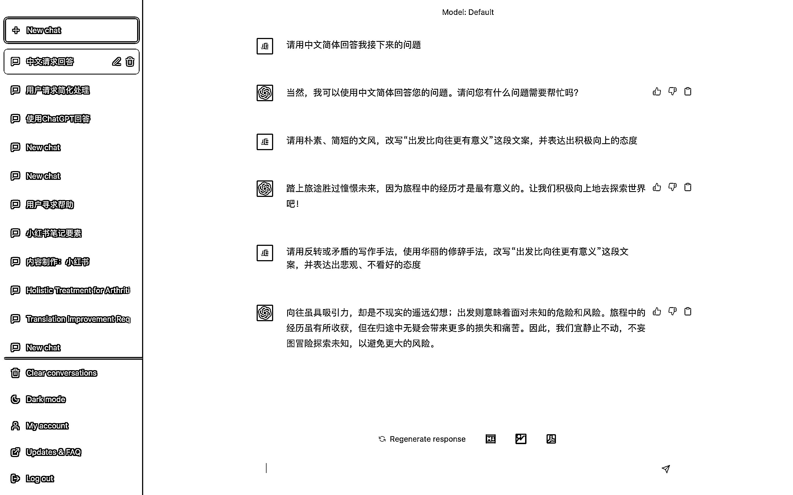

# 4.3.2 第二种：使用具体的形容词

用非常具体、简单的形容词，来描述你的问题。

可以很明显看到，使用大量的形容词来直接向 ChatGPT 提问，得到的效果是不如第一种方法：前置对话的。

原因也很简单，ChatGPT 的上下文联想能力可以帮助他更好的理解你提供的问题，进而给出更精准的答案，另外就是中文的意思非常多，导致的结果就是 ChatGPT 理解起来，准确性也会差一点。所以一般推荐大家用第一种方法，先让 ChatGPT 理解一些特定文案的意思，再让他输出你想要的答案。

