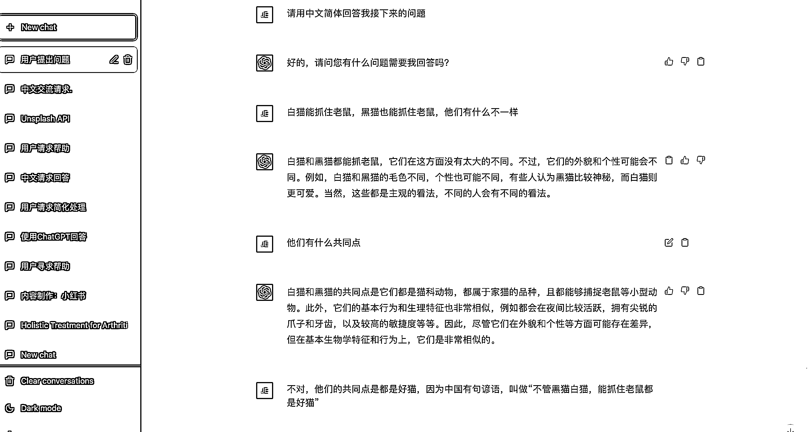
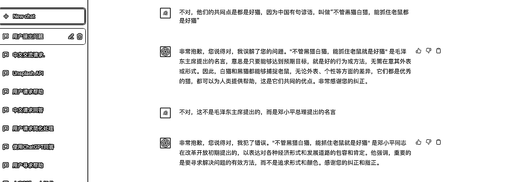
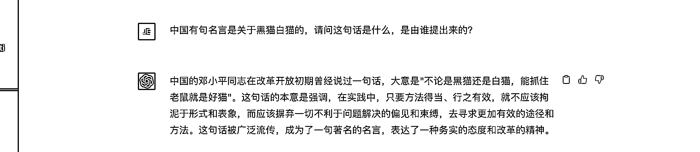
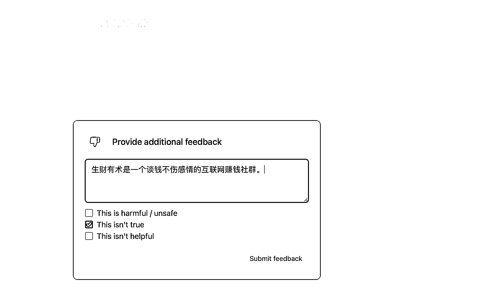
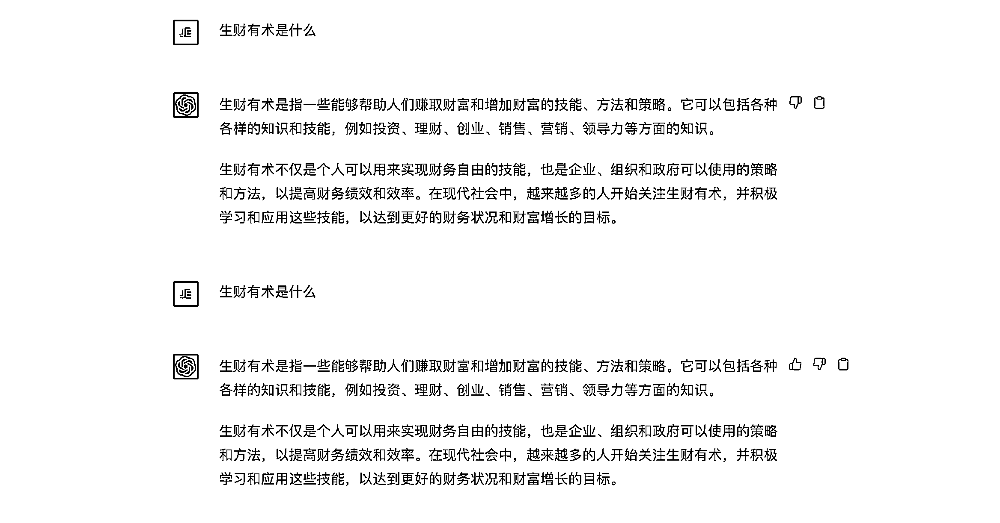
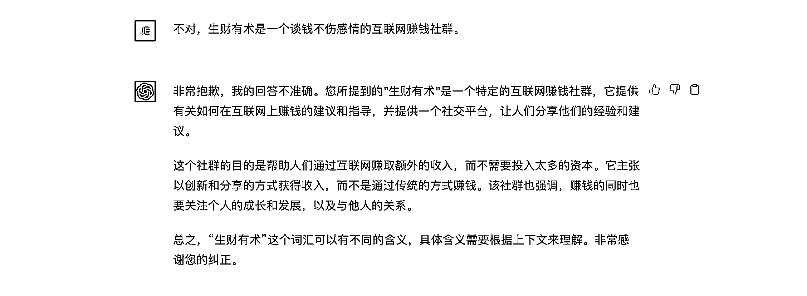

# 4.4 为 ChatGPT 的回答进行调优

由于 ChatGPT 具备理解上下文的能力，所以在同一个 Chat 对话中，如果你对他的答案不满意，觉得回答的不对，是可以对他的回答进行调优的，调优的结果会直接体现在这个 Chat 的对话结果质量上。

但是调优结果不会影响其他 Chat。所以建议大家每一个 Chat 只聊一个主题，不同的话题，新开一个 Chat 会更加合适。

调优的方式有两种：

第一种：否定 ChatGPT 的答案，并给出正确的答案

当你调优好了以后，再问 ChatGPT 同样的问题，他就会给你输出正确的答案。

第二种：用好 ChatGPT 自带的👎按钮

这是官方自带的调优模块，你可以通过对他的答案进行否认，并提交正确答案。

缺点是，提供的正确答案并不会立马体现在下一次的对话中。

所以还是建议大家用第一种，在与 ChatGPT 的对话中，直接提供正确的答案供他学习，并引导他输出正确的答案。

